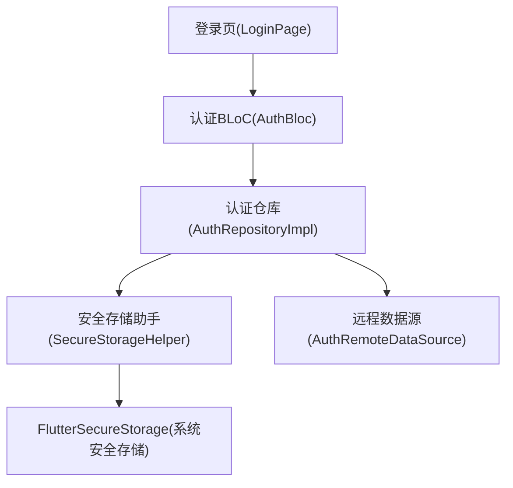
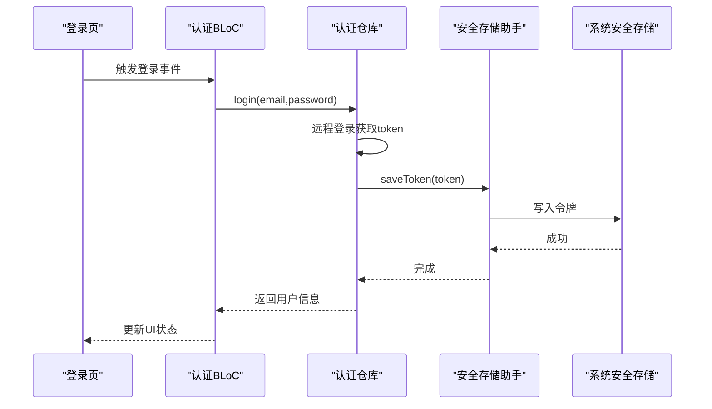
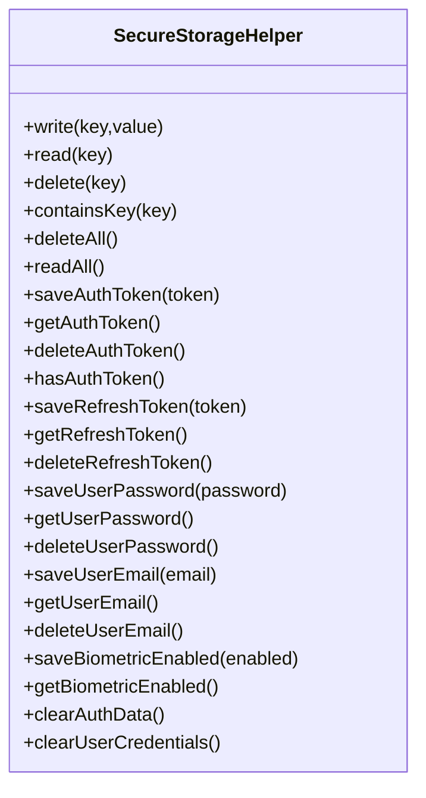
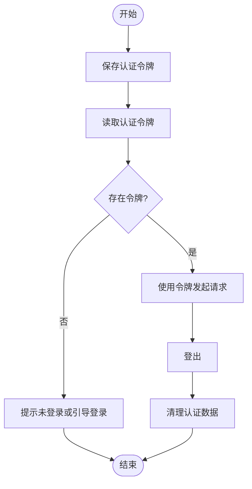
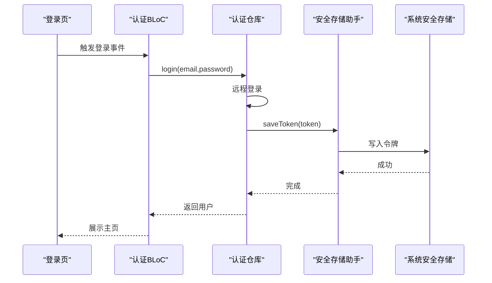
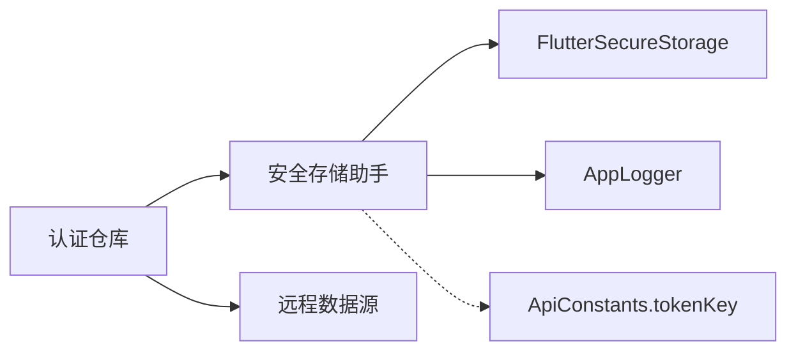

# 安全存储实现

<cite>
**本文引用的文件**
- [secure_storage_helper.dart](file://flutter_app/lib/core/storage/secure_storage_helper.dart)
- [secure_storage.dart](file://flutter_app/lib/data/storage/secure_storage.dart)
- [api_constants.dart](file://flutter_app/lib/config/api_constants.dart)
- [auth_repository_impl.dart](file://flutter_app/lib/data/repositories/auth_repository_impl.dart)
- [auth_bloc.dart](file://flutter_app/lib/presentation/auth/bloc/auth_bloc.dart)
- [auth_event.dart](file://flutter_app/lib/presentation/auth/bloc/auth_event.dart)
- [auth_state.dart](file://flutter_app/lib/presentation/auth/bloc/auth_state.dart)
- [login_page.dart](file://flutter_app/lib/presentation/auth/pages/login_page.dart)
</cite>

## 目录
1. [简介](#简介)
2. [项目结构](#项目结构)
3. [核心组件](#核心组件)
4. [架构总览](#架构总览)
5. [详细组件分析](#详细组件分析)
6. [依赖关系分析](#依赖关系分析)
7. [性能考量](#性能考量)
8. [故障排查指南](#故障排查指南)
9. [结论](#结论)

## 简介
本文件围绕SecureStorageHelper类展开，系统性阐述其如何基于flutter_secure_storage在设备安全存储区（iOS的Keychain、Android的Keystore）中保护敏感数据，包括认证令牌、用户凭据与生物识别状态等。文档重点说明：
- 静态键常量的业务含义与用途
- 通用方法（write、read、delete、containsKey、deleteAll、readAll）的异常处理与日志策略
- 业务方法（保存/读取/删除令牌、清理凭据与认证数据、生物识别状态管理）的封装与调用
- 在认证流程中的实际调用方式与安全优势
- 用户登出时的安全清理流程

## 项目结构
SecureStorageHelper位于核心层，作为安全存储抽象，向上为仓库层提供统一接口；同时存在一个更基础的SecureStorage类（非单例），用于直接访问flutter_secure_storage的读写能力。认证流程通过BLoC触发，最终由仓库层调用SecureStorageHelper完成令牌持久化与清理。

图表来源
- [login_page.dart](file://flutter_app/lib/presentation/auth/pages/login_page.dart#L1-L136)
- [auth_bloc.dart](file://flutter_app/lib/presentation/auth/bloc/auth_bloc.dart#L1-L82)
- [auth_repository_impl.dart](file://flutter_app/lib/data/repositories/auth_repository_impl.dart#L1-L114)
- [secure_storage_helper.dart](file://flutter_app/lib/core/storage/secure_storage_helper.dart#L1-L194)

章节来源
- [secure_storage_helper.dart](file://flutter_app/lib/core/storage/secure_storage_helper.dart#L1-L194)
- [secure_storage.dart](file://flutter_app/lib/data/storage/secure_storage.dart#L1-L46)
- [auth_repository_impl.dart](file://flutter_app/lib/data/repositories/auth_repository_impl.dart#L1-L114)

## 核心组件
- SecureStorageHelper：封装FlutterSecureStorage，提供统一的敏感数据存取与清理接口，包含静态键常量与业务方法。
- SecureStorage：轻量级单例封装，直接暴露读写与清理能力，便于在需要时快速访问。
- 认证仓库(AuthRepositoryImpl)：在登录、注册、登出、获取当前用户等场景中调用SecureStorageHelper进行令牌持久化与清理。
- BLoC与页面：负责触发认证事件，驱动仓库执行具体操作。

章节来源
- [secure_storage_helper.dart](file://flutter_app/lib/core/storage/secure_storage_helper.dart#L1-L194)
- [secure_storage.dart](file://flutter_app/lib/data/storage/secure_storage.dart#L1-L46)
- [auth_repository_impl.dart](file://flutter_app/lib/data/repositories/auth_repository_impl.dart#L1-L114)

## 架构总览
下图展示认证流程中各组件之间的交互，以及SecureStorageHelper在其中的关键作用。

图表来源
- [login_page.dart](file://flutter_app/lib/presentation/auth/pages/login_page.dart#L1-L136)
- [auth_bloc.dart](file://flutter_app/lib/presentation/auth/bloc/auth_bloc.dart#L1-L82)
- [auth_repository_impl.dart](file://flutter_app/lib/data/repositories/auth_repository_impl.dart#L1-L114)
- [secure_storage_helper.dart](file://flutter_app/lib/core/storage/secure_storage_helper.dart#L1-L194)

## 详细组件分析

### SecureStorageHelper类设计与职责
- 单例注入：通过依赖注入标记为延迟单例，避免重复实例化。
- 封装FlutterSecureStorage：对外暴露统一的异步API，内部对异常进行捕获与日志记录。
- 静态键常量：集中定义敏感数据键名，便于维护与一致性。
- 业务方法：针对认证令牌、用户凭据、生物识别状态提供语义化的读写与清理方法。

图表来源
- [secure_storage_helper.dart](file://flutter_app/lib/core/storage/secure_storage_helper.dart#L1-L194)

章节来源
- [secure_storage_helper.dart](file://flutter_app/lib/core/storage/secure_storage_helper.dart#L1-L194)

### 静态键常量与业务含义
- 认证令牌：用于后续请求的身份验证，通常短期有效。
- 刷新令牌：用于换取新的认证令牌，有效期较长但需严格保护。
- 用户密码：用于“记住密码”功能，仅在用户明确授权时存储。
- 用户邮箱：用于“记住用户名”功能，便于自动填充。
- 生物识别启用状态：记录是否允许使用生物识别解锁或自动登录。

章节来源
- [secure_storage_helper.dart](file://flutter_app/lib/core/storage/secure_storage_helper.dart#L15-L31)

### 通用方法的异常处理与日志策略
- 写入(write)：成功时记录调试日志；异常时记录错误并重新抛出，保证上层可感知失败。
- 读取(read)：成功时记录调试日志；异常时记录错误并返回空值，避免崩溃。
- 删除(delete)：成功时记录调试日志；异常时记录错误并重新抛出。
- 键存在(containsKey)：异常时记录错误并返回不存在。
- 清空(deleteAll)：成功时记录警告日志（提示清空全部）；异常时记录错误并重新抛出。
- 全量读取(readAll)：异常时记录错误并返回空映射。

章节来源
- [secure_storage_helper.dart](file://flutter_app/lib/core/storage/secure_storage_helper.dart#L34-L100)

### 业务相关方法：认证令牌与清理流程
- 保存/读取/删除认证令牌：封装底层写入、读取与删除操作，简化调用方逻辑。
- 检查令牌存在：基于containsKey判断令牌是否已保存。
- 清理认证数据：删除认证令牌与刷新令牌，确保会话彻底失效。
- 清理用户凭据：删除用户密码与邮箱，并联动清理认证数据。

图表来源
- [secure_storage_helper.dart](file://flutter_app/lib/core/storage/secure_storage_helper.dart#L104-L122)
- [auth_repository_impl.dart](file://flutter_app/lib/data/repositories/auth_repository_impl.dart#L94-L102)

章节来源
- [secure_storage_helper.dart](file://flutter_app/lib/core/storage/secure_storage_helper.dart#L104-L122)
- [auth_repository_impl.dart](file://flutter_app/lib/data/repositories/auth_repository_impl.dart#L94-L102)

### 用户凭据与生物识别状态
- 用户密码与邮箱：提供保存、读取与删除方法，支持“记住密码/记住用户名”体验。
- 生物识别启用状态：以字符串形式存储布尔值，读取时转换为布尔类型，便于UI开关同步。

章节来源
- [secure_storage_helper.dart](file://flutter_app/lib/core/storage/secure_storage_helper.dart#L139-L178)

### 认证流程中的实际调用方式
- 登录：仓库从远程数据源获取token后，调用SecureStorageHelper保存令牌，随后返回用户实体。
- 获取当前用户：若认证异常则删除无效令牌，避免后续请求继续使用。
- 登出：删除令牌，返回成功结果。
- 是否已登录：读取令牌是否存在且非空。

图表来源
- [auth_bloc.dart](file://flutter_app/lib/presentation/auth/bloc/auth_bloc.dart#L36-L52)
- [auth_repository_impl.dart](file://flutter_app/lib/data/repositories/auth_repository_impl.dart#L20-L36)
- [secure_storage_helper.dart](file://flutter_app/lib/core/storage/secure_storage_helper.dart#L1-L194)

章节来源
- [auth_bloc.dart](file://flutter_app/lib/presentation/auth/bloc/auth_bloc.dart#L1-L82)
- [auth_event.dart](file://flutter_app/lib/presentation/auth/bloc/auth_event.dart#L1-L50)
- [auth_state.dart](file://flutter_app/lib/presentation/auth/bloc/auth_state.dart#L1-L46)
- [auth_repository_impl.dart](file://flutter_app/lib/data/repositories/auth_repository_impl.dart#L1-L114)
- [login_page.dart](file://flutter_app/lib/presentation/auth/pages/login_page.dart#L1-L136)

## 依赖关系分析
- 依赖注入：SecureStorageHelper被注入到仓库层，确保单一职责与可测试性。
- 数据键常量：ApiConstants提供tokenKey与userKey，SecureStorageHelper与SecureStorage共享一致的键名，避免跨模块不一致。
- 日志：统一通过AppLogger记录调试、警告与错误，便于问题定位。

图表来源
- [auth_repository_impl.dart](file://flutter_app/lib/data/repositories/auth_repository_impl.dart#L1-L114)
- [secure_storage_helper.dart](file://flutter_app/lib/core/storage/secure_storage_helper.dart#L1-L194)
- [api_constants.dart](file://flutter_app/lib/config/api_constants.dart#L33-L36)

章节来源
- [auth_repository_impl.dart](file://flutter_app/lib/data/repositories/auth_repository_impl.dart#L1-L114)
- [secure_storage_helper.dart](file://flutter_app/lib/core/storage/secure_storage_helper.dart#L1-L194)
- [api_constants.dart](file://flutter_app/lib/config/api_constants.dart#L33-L36)

## 性能考量
- 异步I/O：所有存储操作均为异步，避免阻塞主线程。
- 最小化异常开销：读取失败返回空值而非抛错，减少UI层异常处理成本。
- 单例复用：通过单例减少FlutterSecureStorage实例化次数，降低资源消耗。
- 批量清理：clearAuthData与clearUserCredentials按需组合调用，避免冗余操作。

[本节为一般性建议，无需引用具体文件]

## 故障排查指南
- 写入失败：检查系统安全存储可用性与权限，确认异常日志输出。
- 读取为空：确认键名是否正确、是否已被清理或过期。
- 删除失败：确认目标键是否存在，必要时先检查containsKey。
- 登录后仍提示未登录：检查令牌是否成功保存，或是否被意外删除。
- 登出后仍可访问：确认是否调用了clearAuthData/clearUserCredentials，或是否缓存了旧令牌。

章节来源
- [secure_storage_helper.dart](file://flutter_app/lib/core/storage/secure_storage_helper.dart#L34-L100)
- [auth_repository_impl.dart](file://flutter_app/lib/data/repositories/auth_repository_impl.dart#L94-L112)

## 结论
SecureStorageHelper通过封装flutter_secure_storage，将敏感数据的存取标准化、安全化与可维护化。其静态键常量明确了业务语义，通用方法提供了稳健的异常处理与日志策略，业务方法则将认证令牌、用户凭据与生物识别状态的管理集中在一处。配合认证仓库与BLoC的协作，实现了从登录到登出的完整安全闭环，有效降低了敏感信息泄露的风险。