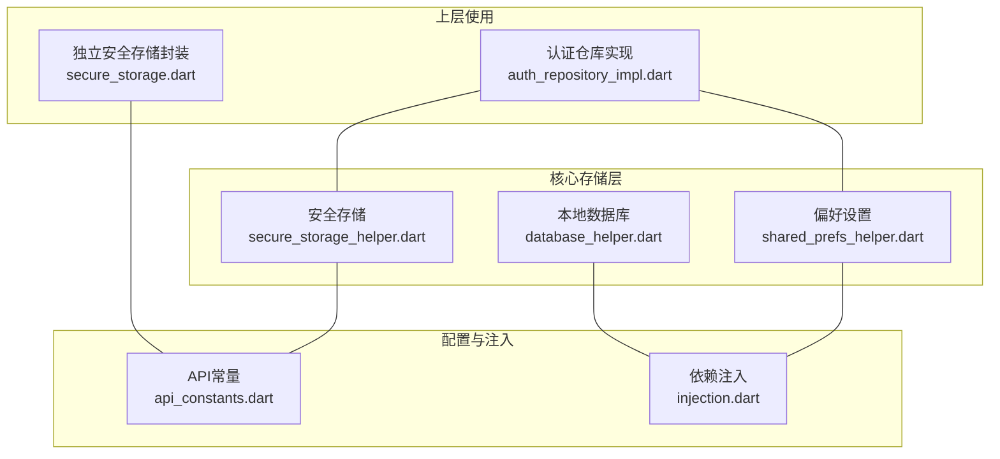
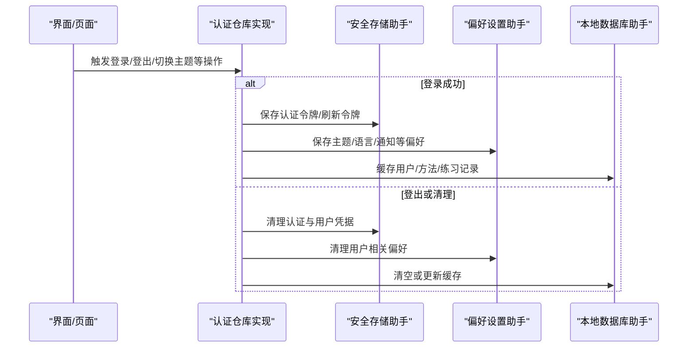
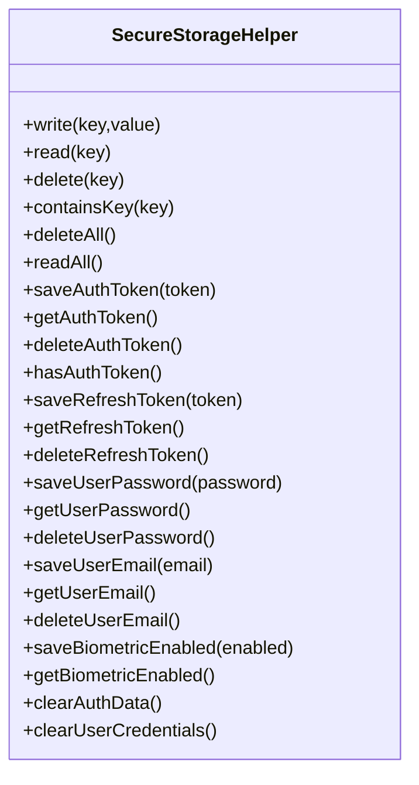
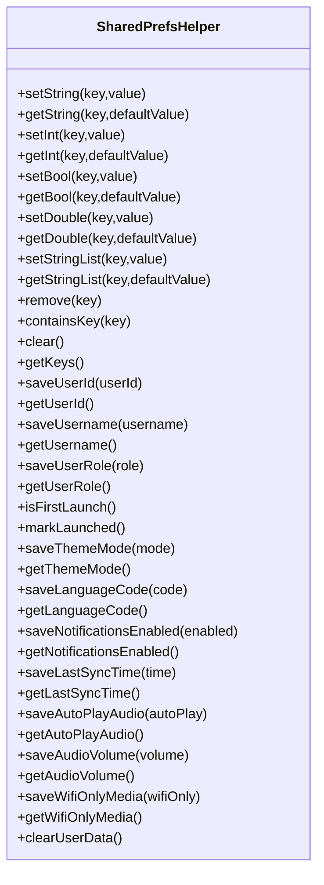
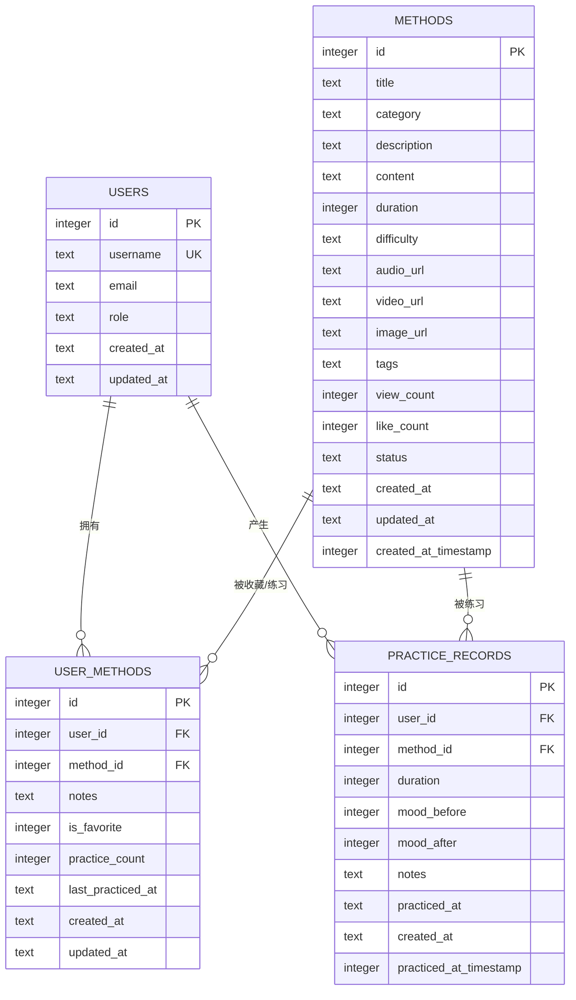
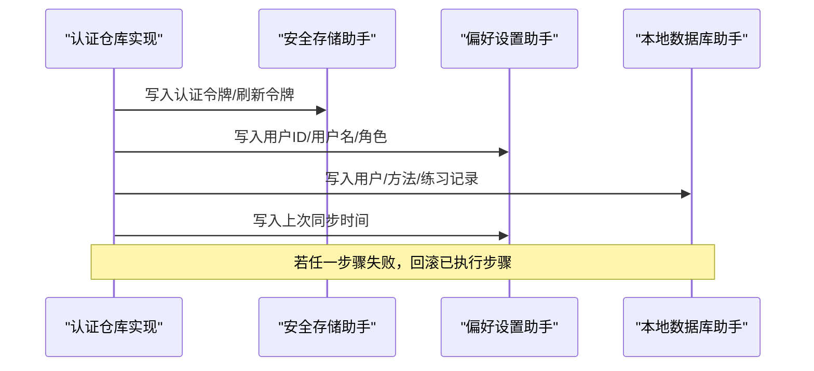
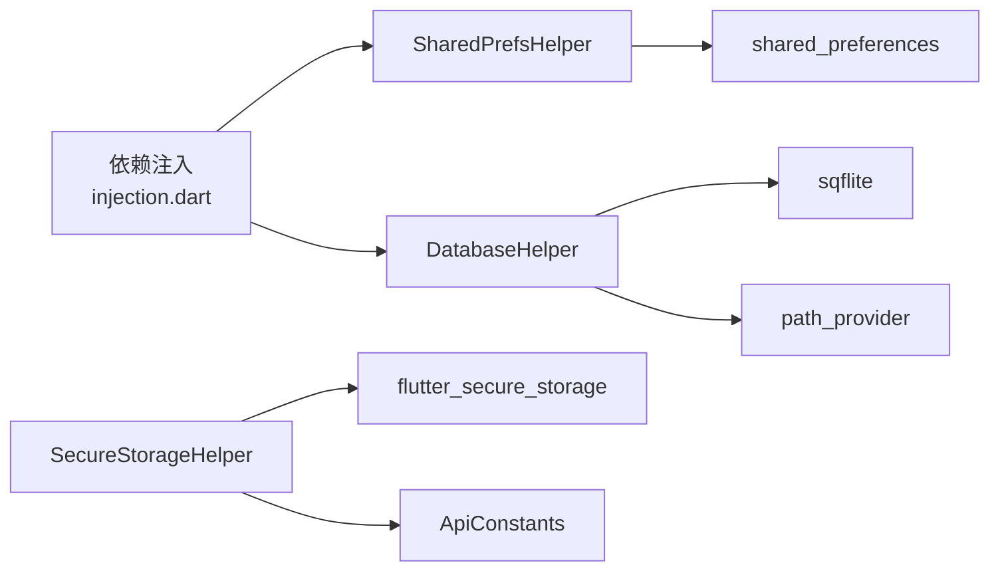

# 本地存储系统

<cite>
**本文引用的文件**
- [secure_storage_helper.dart](file://flutter_app/lib/core/storage/secure_storage_helper.dart)
- [shared_prefs_helper.dart](file://flutter_app/lib/core/storage/shared_prefs_helper.dart)
- [database_helper.dart](file://flutter_app/lib/core/storage/database_helper.dart)
- [secure_storage.dart](file://flutter_app/lib/data/storage/secure_storage.dart)
- [api_constants.dart](file://flutter_app/lib/config/api_constants.dart)
- [injection.dart](file://flutter_app/lib/core/di/injection.dart)
- [auth_repository_impl.dart](file://flutter_app/lib/data/repositories/auth_repository_impl.dart)
- [pubspec.yaml](file://flutter_app/pubspec.yaml)
</cite>

## 目录
1. [简介](#简介)
2. [项目结构](#项目结构)
3. [核心组件](#核心组件)
4. [架构总览](#架构总览)
5. [详细组件分析](#详细组件分析)
6. [依赖关系分析](#依赖关系分析)
7. [性能考量](#性能考量)
8. [故障排查指南](#故障排查指南)
9. [结论](#结论)
10. [附录](#附录)

## 简介
本文件系统性阐述 nian 移动端本地存储体系的分层设计与安全实践，围绕以下三个核心组件展开：
- 安全存储层：通过 flutter_secure_storage 实现敏感信息（如认证令牌、用户ID）的加密存储与管理。
- 偏好设置层：通过 shared_preferences 实现轻量非敏感配置（主题、语言、通知开关等）的键值存储。
- 数据库层：通过 sqflite 实现结构化数据（用户、方法、练习记录）的本地缓存与索引优化。

文档同时对比安全存储与 SharedPreferences 的安全优势，解析数据库层的连接池、事务支持与版本迁移机制，并给出跨存储方案的数据同步示例与安全加固建议。

## 项目结构
本地存储相关代码位于 flutter_app/lib/core/storage，配合依赖注入与配置常量共同构成完整的存储体系。

图表来源
- [secure_storage_helper.dart](file://flutter_app/lib/core/storage/secure_storage_helper.dart#L1-L194)
- [shared_prefs_helper.dart](file://flutter_app/lib/core/storage/shared_prefs_helper.dart#L1-L306)
- [database_helper.dart](file://flutter_app/lib/core/storage/database_helper.dart#L1-L205)
- [api_constants.dart](file://flutter_app/lib/config/api_constants.dart#L1-L73)
- [injection.dart](file://flutter_app/lib/core/di/injection.dart#L1-L61)
- [auth_repository_impl.dart](file://flutter_app/lib/data/repositories/auth_repository_impl.dart#L1-L18)
- [secure_storage.dart](file://flutter_app/lib/data/storage/secure_storage.dart#L1-L46)

章节来源
- [secure_storage_helper.dart](file://flutter_app/lib/core/storage/secure_storage_helper.dart#L1-L194)
- [shared_prefs_helper.dart](file://flutter_app/lib/core/storage/shared_prefs_helper.dart#L1-L306)
- [database_helper.dart](file://flutter_app/lib/core/storage/database_helper.dart#L1-L205)
- [api_constants.dart](file://flutter_app/lib/config/api_constants.dart#L1-L73)
- [injection.dart](file://flutter_app/lib/core/di/injection.dart#L1-L61)
- [auth_repository_impl.dart](file://flutter_app/lib/data/repositories/auth_repository_impl.dart#L1-L18)
- [secure_storage.dart](file://flutter_app/lib/data/storage/secure_storage.dart#L1-L46)

## 核心组件
- 安全存储助手（SecureStorageHelper）
  - 基于 flutter_secure_storage，提供敏感数据的写入、读取、删除、存在性检查、清空与批量读取。
  - 提供业务方法：保存/读取/删除认证令牌、刷新令牌；保存/读取/删除用户密码与邮箱；保存/读取生物识别启用状态；统一清理认证与用户凭据。
- 偏好设置助手（SharedPrefsHelper）
  - 基于 shared_preferences，提供类型安全的字符串、整数、布尔、浮点、字符串列表存储与读取。
  - 提供业务方法：保存/读取用户ID、用户名、角色；主题模式、语言代码、通知开关；上次同步时间、音频自动播放、音量、仅WiFi加载媒体；清除用户数据。
- 本地数据库助手（DatabaseHelper）
  - 基于 sqflite，负责数据库初始化、外键约束启用、建表与索引、版本升级钩子、清空表、关闭数据库、数据库大小查询。
  - 表结构覆盖用户、方法、个人方法、练习记录，包含必要的索引以提升查询性能。

章节来源
- [secure_storage_helper.dart](file://flutter_app/lib/core/storage/secure_storage_helper.dart#L1-L194)
- [shared_prefs_helper.dart](file://flutter_app/lib/core/storage/shared_prefs_helper.dart#L1-L306)
- [database_helper.dart](file://flutter_app/lib/core/storage/database_helper.dart#L1-L205)

## 架构总览
本地存储体系采用“分层职责”原则：
- 安全存储层：仅存放敏感数据（令牌、密码、邮箱、生物识别状态），确保数据在设备侧被加密保护。
- 偏好设置层：存放轻量非敏感配置（主题、语言、通知、音频设置、同步时间等），便于快速读写与跨页面共享。
- 数据库层：存放结构化数据（用户、方法、练习记录）与索引，支撑离线浏览、历史记录与统计分析。

图表来源
- [auth_repository_impl.dart](file://flutter_app/lib/data/repositories/auth_repository_impl.dart#L1-L18)
- [secure_storage_helper.dart](file://flutter_app/lib/core/storage/secure_storage_helper.dart#L1-L194)
- [shared_prefs_helper.dart](file://flutter_app/lib/core/storage/shared_prefs_helper.dart#L1-L306)
- [database_helper.dart](file://flutter_app/lib/core/storage/database_helper.dart#L1-L205)

## 详细组件分析

### 安全存储助手（SecureStorageHelper）
- 设计要点
  - 使用 flutter_secure_storage 进行加密存储，避免明文落盘。
  - 提供统一的键常量与业务方法，降低调用方耦合度。
  - 包含错误日志与异常重抛，便于定位问题。
- 关键能力
  - 通用读写：write/read/delete/containsKey/deleteAll/readAll。
  - 认证令牌：saveAuthToken/getAuthToken/deleteAuthToken/hasAuthToken。
  - 刷新令牌：saveRefreshToken/getRefreshToken/deleteRefreshToken。
  - 用户凭据：保存/读取/删除用户密码与邮箱。
  - 生物识别：保存/读取生物识别启用状态。
  - 清理：clearAuthData/clearUserCredentials。
- 安全优势
  - 与 SharedPreferences 不同，flutter_secure_storage 将敏感数据加密后存储，降低被窃取的风险。
  - 支持一次性删除（deleteAll）与按键删除（delete），便于会话清理与注销流程。

图表来源
- [secure_storage_helper.dart](file://flutter_app/lib/core/storage/secure_storage_helper.dart#L1-L194)

章节来源
- [secure_storage_helper.dart](file://flutter_app/lib/core/storage/secure_storage_helper.dart#L1-L194)

### 偏好设置助手（SharedPrefsHelper）
- 设计要点
  - 提供类型安全的 setX/getX 接口，减少类型转换与解析错误。
  - 统一的键常量与业务方法，便于集中维护。
  - 日志记录与失败返回值，便于调试与降级处理。
- 关键能力
  - 通用读写：setString/getString、setInt/getInt、setBool/getBool、setDouble/getDouble、setStringList/getStringList、remove/containsKey/clear/getKeys。
  - 用户信息：saveUserId/getUserId/saveUsername/getUsername/saveUserRole/getUserRole。
  - 应用偏好：主题模式、语言代码、通知开关、上次同步时间、音频自动播放、音量、仅WiFi加载媒体。
  - 清理：clearUserData。
- 适用场景
  - 轻量非敏感配置，如主题、语言、通知、音频设置、同步时间等。
  - 与安全存储互补：敏感放安全存储，非敏感放偏好设置。

图表来源
- [shared_prefs_helper.dart](file://flutter_app/lib/core/storage/shared_prefs_helper.dart#L1-L306)

章节来源
- [shared_prefs_helper.dart](file://flutter_app/lib/core/storage/shared_prefs_helper.dart#L1-L306)

### 本地数据库助手（DatabaseHelper）
- 设计要点
  - 单例式数据库实例管理，延迟初始化，避免重复打开。
  - 外键约束启用（PRAGMA foreign_keys = ON），保证参照完整性。
  - 建表与索引：用户、方法、个人方法、练习记录四张表，包含常用查询索引。
  - 版本升级钩子（onUpgrade），预留扩展空间。
  - 提供清空表、关闭数据库、数据库大小查询接口。
- 表结构与索引
  - users：主键 id，唯一 username，email、role、created_at、updated_at。
  - methods：主键 id，title、category、description、content、duration、difficulty、audio_url、video_url、image_url、tags、view_count、like_count、status、created_at、updated_at、created_at_timestamp。
  - user_methods：主键 id，user_id、method_id、notes、is_favorite、practice_count、last_practiced_at、created_at、updated_at，外键关联 users 与 methods。
  - practice_records：主键 id，user_id、method_id、duration、mood_before、mood_after、notes、practiced_at、created_at、practiced_at_timestamp，外键关联 users 与 methods。
  - 索引：methods 的 category/status/created_at_timestamp；user_methods 的 user_id/method_id；practice_records 的 user_id/method_id/practiced_at_timestamp。
- 事务与连接池
  - sqflite 默认提供连接池与并发访问控制，DatabaseHelper 通过单例数据库实例复用连接，减少资源开销。
  - 建议在批量写入时使用事务（beginTransaction/commit）以提升性能与一致性，当前实现未显式封装事务，可在上层调用处按需使用。

图表来源
- [database_helper.dart](file://flutter_app/lib/core/storage/database_helper.dart#L1-L205)

章节来源
- [database_helper.dart](file://flutter_app/lib/core/storage/database_helper.dart#L1-L205)

### 安全存储与 SharedPreferences 的安全对比
- flutter_secure_storage
  - 敏感数据加密存储，适合令牌、密码、邮箱、生物识别状态等。
  - 提供 deleteAll 一键清理，便于登出与注销流程。
- shared_preferences
  - 明文存储，适合主题、语言、通知、音频等非敏感配置。
  - 读写简单高效，但不具备加密能力。

章节来源
- [secure_storage_helper.dart](file://flutter_app/lib/core/storage/secure_storage_helper.dart#L1-L194)
- [shared_prefs_helper.dart](file://flutter_app/lib/core/storage/shared_prefs_helper.dart#L1-L306)

### 跨存储方案的数据同步示例
- 场景：用户登录后，从服务端获取令牌与用户信息，需要同步到安全存储与偏好设置，并缓存用户与方法数据到本地数据库。
- 步骤
  1) 从服务端获取认证令牌与用户信息。
  2) 将令牌写入安全存储（SecureStorageHelper）。
  3) 将用户ID、用户名、角色等写入偏好设置（SharedPrefsHelper）。
  4) 将用户与方法数据写入本地数据库（DatabaseHelper）。
  5) 记录上次同步时间（SharedPrefsHelper）。
- 异常处理
  - 若任一步骤失败，回滚已执行步骤（例如删除已写入的安全存储数据、删除偏好设置、回滚数据库变更）。
  - 记录错误日志，提示用户重试或检查网络。

图表来源
- [auth_repository_impl.dart](file://flutter_app/lib/data/repositories/auth_repository_impl.dart#L1-L18)
- [secure_storage_helper.dart](file://flutter_app/lib/core/storage/secure_storage_helper.dart#L1-L194)
- [shared_prefs_helper.dart](file://flutter_app/lib/core/storage/shared_prefs_helper.dart#L1-L306)
- [database_helper.dart](file://flutter_app/lib/core/storage/database_helper.dart#L1-L205)

## 依赖关系分析
- 依赖注入
  - 通过 Injectable 与 GetIt 注册 SharedPrefsHelper（懒加载单例），并在应用启动时初始化依赖。
- 外部依赖
  - flutter_secure_storage、shared_preferences、sqflite、path_provider。
- 常量与键
  - ApiConstants 中定义了 tokenKey、userKey 等键名，供安全存储封装使用。

图表来源
- [injection.dart](file://flutter_app/lib/core/di/injection.dart#L1-L61)
- [secure_storage_helper.dart](file://flutter_app/lib/core/storage/secure_storage_helper.dart#L1-L194)
- [shared_prefs_helper.dart](file://flutter_app/lib/core/storage/shared_prefs_helper.dart#L1-L306)
- [database_helper.dart](file://flutter_app/lib/core/storage/database_helper.dart#L1-L205)
- [api_constants.dart](file://flutter_app/lib/config/api_constants.dart#L1-L73)
- [pubspec.yaml](file://flutter_app/pubspec.yaml#L1-L111)

章节来源
- [injection.dart](file://flutter_app/lib/core/di/injection.dart#L1-L61)
- [pubspec.yaml](file://flutter_app/pubspec.yaml#L1-L111)
- [api_constants.dart](file://flutter_app/lib/config/api_constants.dart#L1-L73)

## 性能考量
- 偏好设置
  - 读写为异步操作，建议批量写入时合并多次调用，减少磁盘写入次数。
  - 对于频繁读取的配置（如主题模式、语言），可考虑在内存中缓存最近值。
- 安全存储
  - 写入与读取为异步，建议在后台线程进行，避免阻塞主线程。
  - 批量清理（deleteAll）与逐键删除（delete）应根据场景选择，避免不必要的 IO。
- 本地数据库
  - 已建立多处索引，建议在高频查询字段上保持索引，避免全表扫描。
  - 批量插入建议使用事务，减少 WAL/事务日志开销。
  - 数据库大小查询当前返回占位值，实际实现可结合 File API 获取真实大小。

[本节为通用性能建议，不直接分析具体文件]

## 故障排查指南
- 安全存储
  - 写入/读取/删除失败：检查 flutter_secure_storage 初始化与权限配置；查看日志输出定位异常。
  - 清空失败：确认异常捕获与日志记录，必要时重试或引导用户重启应用。
- 偏好设置
  - 类型转换失败：确认 setX/getX 的键与类型一致；对可能为空的值提供默认值。
  - 清空失败：检查返回值与日志，确认磁盘写入权限。
- 本地数据库
  - 初始化失败：检查数据库路径与权限；确认 PRAGMA 设置与建表语句无语法错误。
  - 升级失败：完善 onUpgrade 分支逻辑，确保向后兼容与数据迁移。
  - 查询缓慢：检查是否命中索引；对复杂查询进行 EXPLAIN QUERY PLAN 分析。

章节来源
- [secure_storage_helper.dart](file://flutter_app/lib/core/storage/secure_storage_helper.dart#L1-L194)
- [shared_prefs_helper.dart](file://flutter_app/lib/core/storage/shared_prefs_helper.dart#L1-L306)
- [database_helper.dart](file://flutter_app/lib/core/storage/database_helper.dart#L1-L205)

## 结论
nian 的本地存储体系通过分层设计实现了“敏感数据加密、非敏感配置易用、结构化数据高效”的目标。SecureStorageHelper 与 SharedPrefsHelper 形成互补，DatabaseHelper 则为结构化数据提供高性能缓存。结合依赖注入与日志记录，整体架构具备良好的可维护性与安全性。建议在后续迭代中补充数据库事务封装与更完善的版本迁移策略，并持续强化安全边界（如最小权限、密钥轮换等）。

[本节为总结性内容，不直接分析具体文件]

## 附录
- 安全加固建议
  - 最小权限：仅授予必要的存储权限，避免过度授权。
  - 加密与密钥管理：对自定义加密场景，使用系统提供的密钥链（Android Keystore、iOS Keychain）。
  - 输入校验与容错：对用户输入与外部数据进行严格校验，防止注入与越界。
  - 审计与监控：记录关键操作日志，定期审计敏感数据访问与修改行为。
- 版本迁移最佳实践
  - 在 onUpgrade 中按版本号逐步迁移，保留回滚路径。
  - 对新增列使用 DEFAULT 值或迁移脚本填充，避免空值导致的查询异常。
  - 对索引变更进行性能评估，必要时重建索引。

[本节为通用指导，不直接分析具体文件]