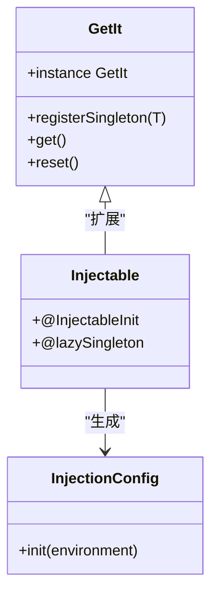
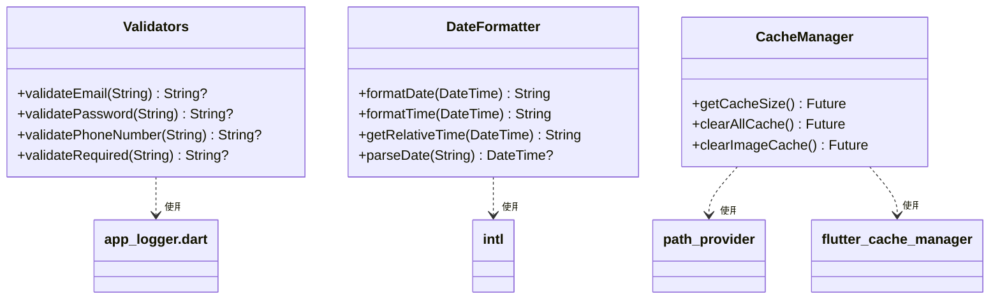
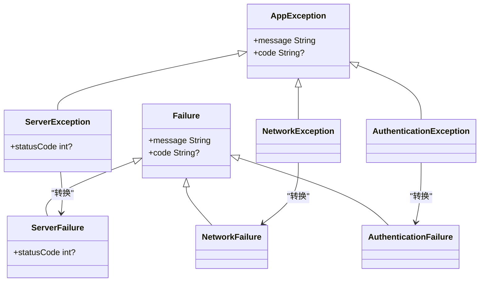
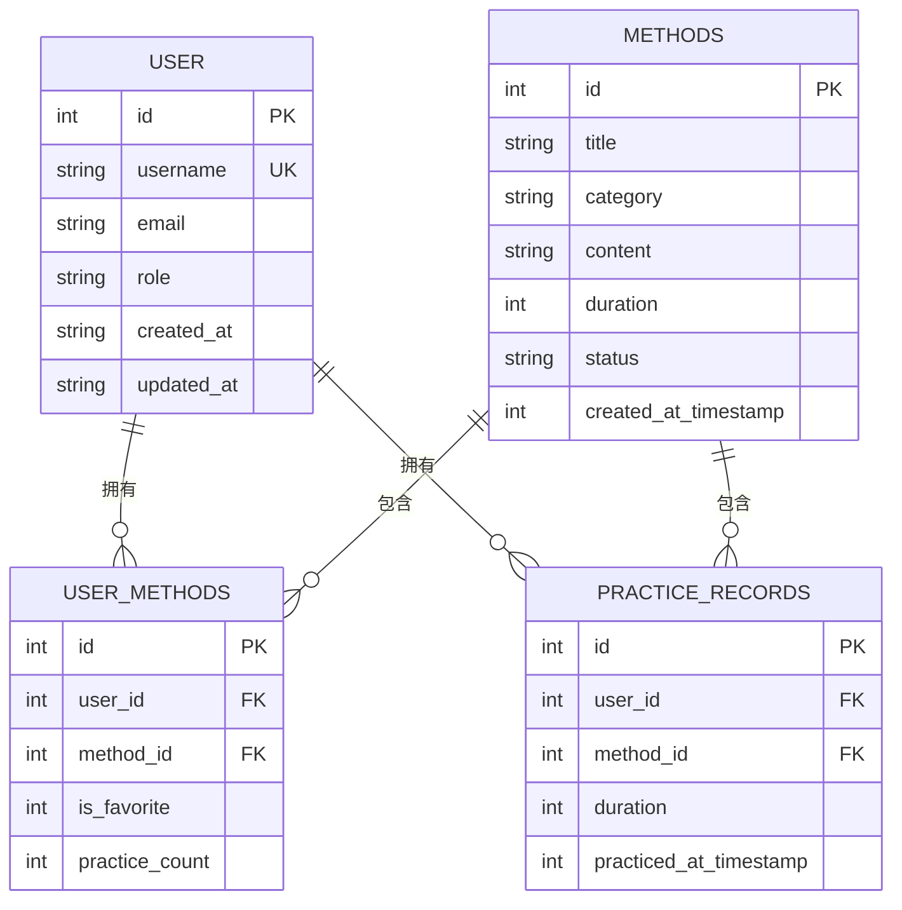
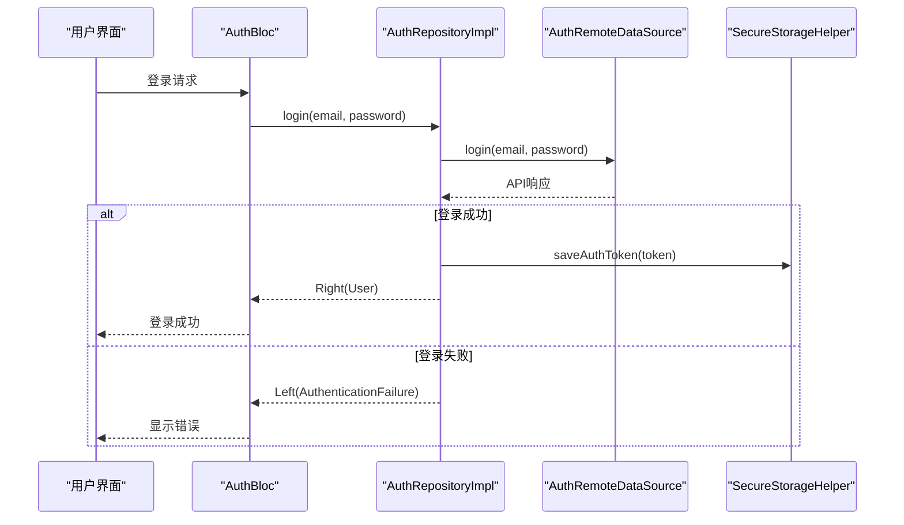

# 核心基础设施

<cite>
**本文档引用的文件**  
- [injection.dart](file://flutter_app/lib/core/di/injection.dart)
- [exceptions.dart](file://flutter_app/lib/core/error/exceptions.dart)
- [failures.dart](file://flutter_app/lib/core/error/failures.dart)
- [secure_storage_helper.dart](file://flutter_app/lib/core/storage/secure_storage_helper.dart)
- [database_helper.dart](file://flutter_app/lib/core/storage/database_helper.dart)
- [validators.dart](file://flutter_app/lib/core/utils/validators.dart)
- [date_formatter.dart](file://flutter_app/lib/core/utils/date_formatter.dart)
- [cache_manager.dart](file://flutter_app/lib/core/utils/cache_manager.dart)
- [shared_prefs_helper.dart](file://flutter_app/lib/core/storage/shared_prefs_helper.dart)
- [app_logger.dart](file://flutter_app/lib/core/utils/app_logger.dart)
- [auth_remote_data_source.dart](file://flutter_app/lib/data/datasources/remote/auth_remote_data_source.dart)
- [auth_repository_impl.dart](file://flutter_app/lib/data/repositories/auth_repository_impl.dart)
</cite>

## 目录
1. [引言](#引言)
2. [依赖注入系统](#依赖注入系统)
3. [工具类封装](#工具类封装)
4. [错误处理机制](#错误处理机制)
5. [安全存储与本地数据库](#安全存储与本地数据库)
6. [核心模块集成示例](#核心模块集成示例)
7. [总结](#总结)

## 引言
nian移动端应用的核心基础设施模块为整个应用提供了稳定、可维护和可测试的基础架构。该基础设施层通过依赖注入、统一的错误处理、安全的数据存储和实用的工具类，实现了模块间的松耦合，提升了代码的可读性和可维护性。本文档将详细解析这些核心组件的设计原理与作用机制。

## 依赖注入系统
nian应用采用GetIt与Injectable组合实现依赖注入（DI）系统，通过服务定位器模式管理应用中所有跨层服务的生命周期与依赖关系。`injection.dart`文件定义了全局的`getIt`实例，并通过`configureDependencies`方法在应用启动时初始化所有依赖项。该系统支持不同环境（生产、开发、测试）的配置，确保了应用在不同场景下的灵活性。

依赖注入系统通过`@lazySingleton`注解实现延迟单例模式，确保服务在首次使用时才被创建，从而优化应用启动性能。该设计使得各模块无需关心依赖的具体实现，只需声明所需服务，由DI容器自动解析和注入，有效降低了模块间的耦合度，提高了代码的可测试性。

**图表来源**  
- [injection.dart](file://flutter_app/lib/core/di/injection.dart#L1-L61)

**本节来源**  
- [injection.dart](file://flutter_app/lib/core/di/injection.dart#L1-L61)

## 工具类封装
核心基础设施中的工具类模块（utils）提供了多个实用功能的封装，包括输入验证、日期格式化和缓存管理，这些工具类通过静态方法提供服务，便于在应用各处调用。

### 验证器
`validators.dart`文件中的`Validators`类提供了邮箱、密码、手机号等多种输入验证功能。每个验证方法返回`String?`类型，当验证通过时返回`null`，否则返回错误消息。这种设计与Flutter的表单验证机制无缝集成，确保了用户输入的有效性。

### 日期格式化
`date_formatter.dart`类封装了日期时间的格式化与解析功能，支持多种格式（如ISO 8601、中文格式等）。该类还提供了相对时间显示功能，如“刚刚”、“N分钟前”等，增强了用户体验。通过`intl`包的支持，实现了国际化日期格式的处理。

### 缓存管理
`cache_manager.dart`类提供了应用级缓存管理功能，能够获取缓存大小、清除图片缓存或全部缓存。该工具类整合了`flutter_cache_manager`和系统目录管理，为应用提供了统一的缓存操作接口，便于性能优化和存储管理。

**图表来源**  
- [validators.dart](file://flutter_app/lib/core/utils/validators.dart#L1-L165)
- [date_formatter.dart](file://flutter_app/lib/core/utils/date_formatter.dart#L1-L300)
- [cache_manager.dart](file://flutter_app/lib/core/utils/cache_manager.dart#L1-L226)

**本节来源**  
- [validators.dart](file://flutter_app/lib/core/utils/validators.dart#L1-L165)
- [date_formatter.dart](file://flutter_app/lib/core/utils/date_formatter.dart#L1-L300)
- [cache_manager.dart](file://flutter_app/lib/core/utils/cache_manager.dart#L1-L226)

## 错误处理机制
nian应用的错误处理机制分为两个层次：平台异常（exceptions）和业务失败（failures），通过`Either<Failure, Data>`模式传递结果，实现了错误处理的类型安全和可预测性。

### 异常与失败的区分
`exceptions.dart`文件定义了应用中可能抛出的各种异常，如`ServerException`、`NetworkException`、`AuthenticationException`等，这些异常通常在数据层捕获并转换为对应的失败类型。`failures.dart`文件则定义了业务层的失败状态，如`ServerFailure`、`NetworkFailure`等，这些失败类型通过`Either`类型在业务逻辑中传递，避免了异常的层层抛出。

### Either模式的应用
在Repository实现中，每个方法返回`Future<Either<Failure, Data>>`类型，成功时返回`Right(data)`，失败时返回`Left(failure)`。这种模式使得调用方必须显式处理成功和失败两种情况，提高了代码的健壮性。同时，`FailureMessages`类提供了标准化的失败消息，确保了用户界面显示的一致性。

**图表来源**  
- [exceptions.dart](file://flutter_app/lib/core/error/exceptions.dart#L1-L110)
- [failures.dart](file://flutter_app/lib/core/error/failures.dart#L1-L157)

**本节来源**  
- [exceptions.dart](file://flutter_app/lib/core/error/exceptions.dart#L1-L110)
- [failures.dart](file://flutter_app/lib/core/error/failures.dart#L1-L157)

## 安全存储与本地数据库
核心基础设施提供了两种数据持久化方案：安全存储用于敏感信息，本地数据库用于结构化数据缓存。

### 安全存储
`secure_storage_helper.dart`类封装了`flutter_secure_storage`插件，用于存储用户凭证等敏感数据。该类通过常量定义了存储键（如`keyAuthToken`、`keyRefreshToken`），并提供了类型安全的读写方法。`SecureStorageHelper`被注册为`@lazySingleton`，确保了应用内对安全存储的统一访问。

### 本地数据库
`database_helper.dart`类管理SQLite数据库的创建、升级和查询。该类定义了应用所需的所有表结构（如users、methods、practice_records），并在`_onCreate`方法中创建索引以优化查询性能。通过`get database`异步属性，确保了数据库实例的单例访问，避免了并发问题。

**图表来源**  
- [secure_storage_helper.dart](file://flutter_app/lib/core/storage/secure_storage_helper.dart#L1-L194)
- [database_helper.dart](file://flutter_app/lib/core/storage/database_helper.dart#L1-L205)

**本节来源**  
- [secure_storage_helper.dart](file://flutter_app/lib/core/storage/secure_storage_helper.dart#L1-L194)
- [database_helper.dart](file://flutter_app/lib/core/storage/database_helper.dart#L1-L205)

## 核心模块集成示例
以下以认证功能为例，说明核心基础设施模块的集成方式。在`AuthRepositoryImpl`中，通过依赖注入获取`AuthRemoteDataSource`和`SecureStorageHelper`实例。登录成功后，将Token保存到安全存储，并返回用户信息。若发生异常，则转换为对应的`Failure`类型，通过`Either`模式返回。

新服务的注册需在`injection.config.dart`中添加相应注解，并在`configureDependencies`调用时由Injectable自动生成注册代码。这种约定优于配置的方式，减少了手动注册的错误，提高了开发效率。

**图表来源**  
- [auth_repository_impl.dart](file://flutter_app/lib/data/repositories/auth_repository_impl.dart#L1-L114)
- [auth_remote_data_source.dart](file://flutter_app/lib/data/datasources/remote/auth_remote_data_source.dart#L1-L77)
- [secure_storage_helper.dart](file://flutter_app/lib/core/storage/secure_storage_helper.dart#L1-L194)

**本节来源**  
- [auth_repository_impl.dart](file://flutter_app/lib/data/repositories/auth_repository_impl.dart#L1-L114)
- [auth_remote_data_source.dart](file://flutter_app/lib/data/datasources/remote/auth_remote_data_source.dart#L1-L77)

## 总结
nian移动端的核心基础设施模块通过依赖注入、统一的错误处理、安全的数据存储和实用的工具类，构建了一个稳定、可维护和可测试的应用架构。这些基础设施不仅提高了开发效率，还确保了应用在不同场景下的可靠性和用户体验。通过遵循这些设计原则，团队能够快速迭代功能，同时保持代码质量。