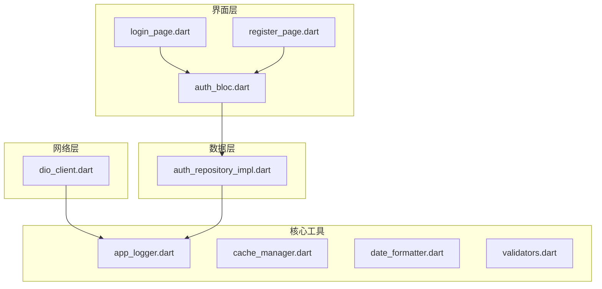
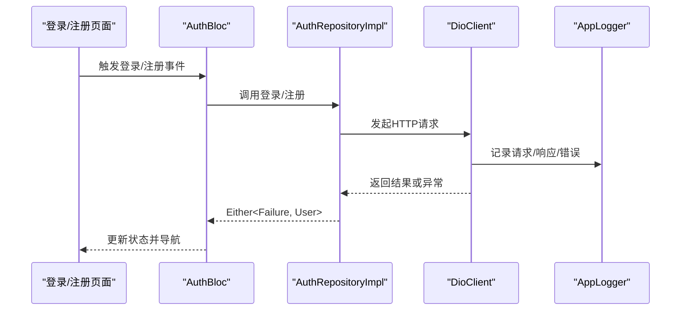
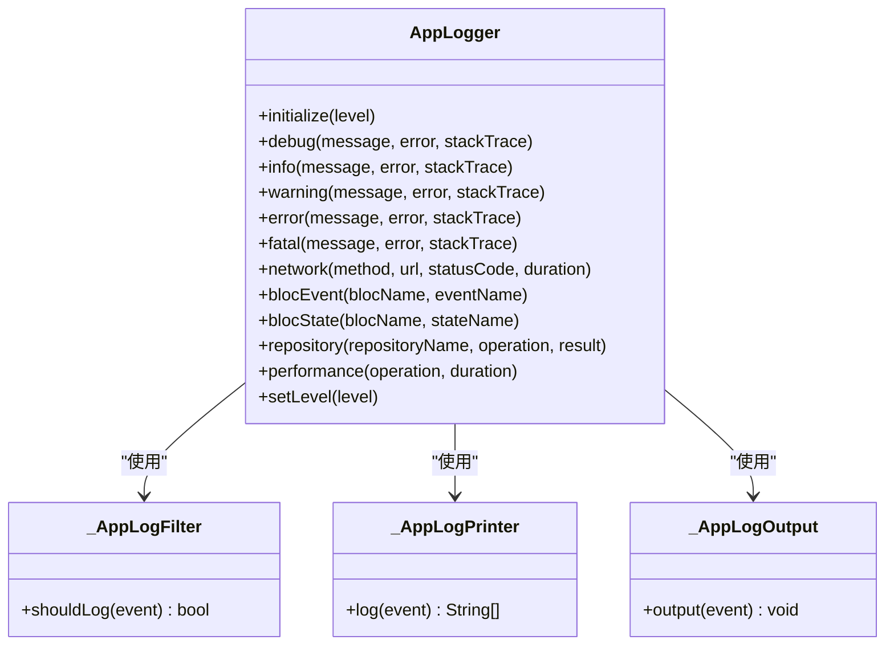
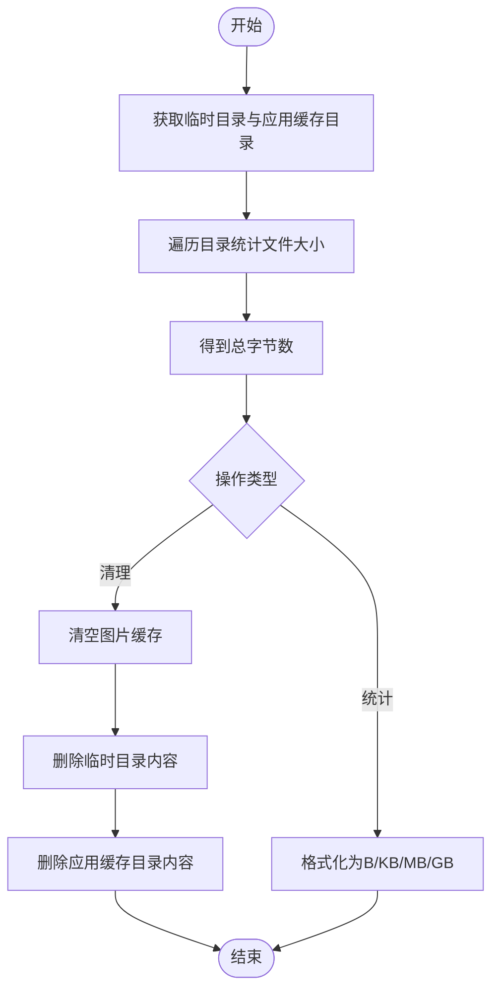
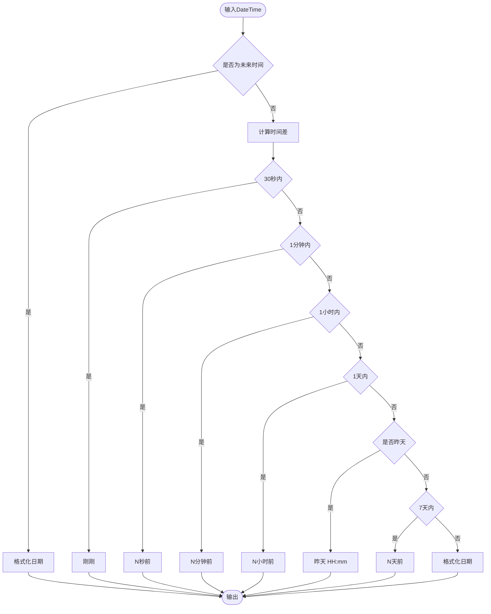
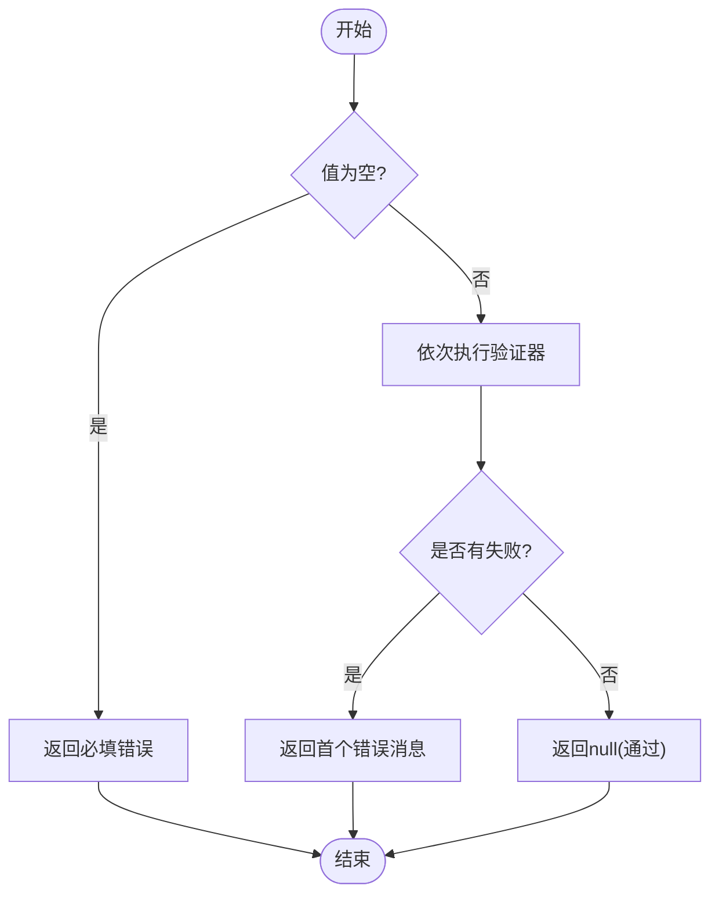
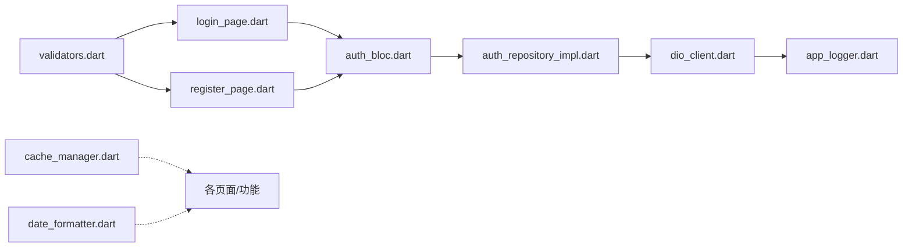

# 核心工具集

<cite>
**本文引用的文件**
- [app_logger.dart](file://flutter_app/lib/core/utils/app_logger.dart)
- [cache_manager.dart](file://flutter_app/lib/core/utils/cache_manager.dart)
- [date_formatter.dart](file://flutter_app/lib/core/utils/date_formatter.dart)
- [validators.dart](file://flutter_app/lib/core/utils/validators.dart)
- [dio_client.dart](file://flutter_app/lib/core/network/dio_client.dart)
- [auth_repository_impl.dart](file://flutter_app/lib/data/repositories/auth_repository_impl.dart)
- [login_page.dart](file://flutter_app/lib/presentation/auth/pages/login_page.dart)
- [register_page.dart](file://flutter_app/lib/presentation/auth/pages/register_page.dart)
- [auth_bloc.dart](file://flutter_app/lib/presentation/auth/bloc/auth_bloc.dart)
</cite>

## 目录
1. [引言](#引言)
2. [项目结构](#项目结构)
3. [核心组件](#核心组件)
4. [架构总览](#架构总览)
5. [详细组件分析](#详细组件分析)
6. [依赖关系分析](#依赖关系分析)
7. [性能考量](#性能考量)
8. [故障排查指南](#故障排查指南)
9. [结论](#结论)
10. [附录](#附录)

## 引言
本文件面向nian移动端的“核心工具集”，系统梳理以下四个工具类的设计与实现要点：
- app_logger.dart：封装日志输出，支持分级（debug/info/warning/error/fatal）、网络/性能/BLoC/仓库等专项日志，以及生产环境过滤。
- cache_manager.dart：提供内存与文件缓存的统一管理，支持缓存大小统计、清理与格式化展示。
- date_formatter.dart：统一日期时间格式化与相对时间显示，保证UI一致性。
- validators.dart：提供表单验证函数族（邮箱、密码、确认密码、必填、手机号、数字范围、长度、URL等），支持组合验证。

同时，本文强调这些工具类的无状态性、可复用性与对代码整洁度的贡献，并给出新增工具函数的添加规范。

## 项目结构
核心工具位于flutter_app/lib/core/utils目录，分别承担日志、缓存、日期与验证职责；网络层通过DioClient集成日志工具，认证与仓储层在关键路径调用日志工具进行可观测性记录；UI层在登录/注册页面通过表单控件与BLoC触发业务流程。

图表来源
- [app_logger.dart](file://flutter_app/lib/core/utils/app_logger.dart#L1-L187)
- [cache_manager.dart](file://flutter_app/lib/core/utils/cache_manager.dart#L1-L113)
- [date_formatter.dart](file://flutter_app/lib/core/utils/date_formatter.dart#L1-L300)
- [validators.dart](file://flutter_app/lib/core/utils/validators.dart#L1-L165)
- [dio_client.dart](file://flutter_app/lib/core/network/dio_client.dart#L1-L262)
- [auth_repository_impl.dart](file://flutter_app/lib/data/repositories/auth_repository_impl.dart#L1-L114)
- [login_page.dart](file://flutter_app/lib/presentation/auth/pages/login_page.dart#L1-L136)
- [register_page.dart](file://flutter_app/lib/presentation/auth/pages/register_page.dart#L1-L133)
- [auth_bloc.dart](file://flutter_app/lib/presentation/auth/bloc/auth_bloc.dart#L1-L52)

章节来源
- [app_logger.dart](file://flutter_app/lib/core/utils/app_logger.dart#L1-L187)
- [cache_manager.dart](file://flutter_app/lib/core/utils/cache_manager.dart#L1-L113)
- [date_formatter.dart](file://flutter_app/lib/core/utils/date_formatter.dart#L1-L300)
- [validators.dart](file://flutter_app/lib/core/utils/validators.dart#L1-L165)
- [dio_client.dart](file://flutter_app/lib/core/network/dio_client.dart#L1-L262)
- [auth_repository_impl.dart](file://flutter_app/lib/data/repositories/auth_repository_impl.dart#L1-L114)
- [login_page.dart](file://flutter_app/lib/presentation/auth/pages/login_page.dart#L1-L136)
- [register_page.dart](file://flutter_app/lib/presentation/auth/pages/register_page.dart#L1-L133)
- [auth_bloc.dart](file://flutter_app/lib/presentation/auth/bloc/auth_bloc.dart#L1-L52)

## 核心组件
- AppLogger：统一日志入口，按运行模式自动设置日志级别，提供网络、BLoC、仓库、性能等专项日志方法，并自定义过滤器、打印器与输出器。
- CacheManager：提供缓存大小统计、全量清理、图片缓存清理与格式化展示，内部使用DefaultCacheManager与系统临时/应用缓存目录。
- DateFormatter：提供日期/时间/日期时间格式化、相对时间与详细相对时间、日期判断（今天/昨天/本周/本月/今年）、解析字符串为DateTime、天数差、月首/月末、星期中文名、时间段格式化等。
- Validators：提供邮箱、密码强度、确认密码、必填、手机号、数字范围、长度、URL等常用验证，支持组合验证器。

章节来源
- [app_logger.dart](file://flutter_app/lib/core/utils/app_logger.dart#L1-L187)
- [cache_manager.dart](file://flutter_app/lib/core/utils/cache_manager.dart#L1-L113)
- [date_formatter.dart](file://flutter_app/lib/core/utils/date_formatter.dart#L1-L300)
- [validators.dart](file://flutter_app/lib/core/utils/validators.dart#L1-L165)

## 架构总览
日志贯穿网络层与数据层：网络层通过Dio拦截器记录请求/响应与错误；数据层在异常分支与关键路径调用日志工具；UI层通过BLoC触发业务，仓储层返回Either结果，便于统一记录与上报。

图表来源
- [auth_bloc.dart](file://flutter_app/lib/presentation/auth/bloc/auth_bloc.dart#L1-L52)
- [auth_repository_impl.dart](file://flutter_app/lib/data/repositories/auth_repository_impl.dart#L1-L114)
- [dio_client.dart](file://flutter_app/lib/core/network/dio_client.dart#L100-L155)
- [app_logger.dart](file://flutter_app/lib/core/utils/app_logger.dart#L107-L174)

## 详细组件分析

### AppLogger：日志分级与生产过滤
- 分级接口：debug/info/warning/error/fatal，均支持可选错误与堆栈跟踪。
- 专项日志：
  - 网络日志：记录HTTP方法、URL、状态码与耗时。
  - BLoC事件/状态：记录事件与状态变更。
  - 仓库日志：记录仓库操作与结果。
  - 性能日志：记录操作耗时并标注慢/正常。
- 运行模式与过滤：
  - Debug模式默认DEBUG级别，Release模式默认WARNING级别。
  - 可通过setLevel动态调整级别，重新构建Logger以生效。
- 打印与输出：
  - 自定义过滤器：仅输出不低于当前级别的日志。
  - 自定义打印器：带级别表情、级别名称、时间戳、错误与受限堆栈跟踪（仅Debug模式且error/fatal）。
  - 输出器：Debug模式打印到控制台，Release模式预留远程收集扩展点。

图表来源
- [app_logger.dart](file://flutter_app/lib/core/utils/app_logger.dart#L1-L187)
- [app_logger.dart](file://flutter_app/lib/core/utils/app_logger.dart#L189-L294)

章节来源
- [app_logger.dart](file://flutter_app/lib/core/utils/app_logger.dart#L1-L187)
- [app_logger.dart](file://flutter_app/lib/core/utils/app_logger.dart#L189-L294)

### CacheManager：内存与文件缓存策略
- 功能概览：
  - 统计缓存大小：遍历临时目录与应用缓存目录，累加文件大小。
  - 清理缓存：清空网络图片缓存、删除临时目录与应用缓存目录内容。
  - 图片缓存清理：委托DefaultCacheManager清空网络图片缓存。
  - 格式化展示：将字节数转换为B/KB/MB/GB。
- 安全性与健壮性：
  - 对目录遍历与删除过程捕获异常并忽略权限错误，避免影响主流程。
- 适用场景：
  - 减少网络请求（结合图片缓存）与提升冷启动体验（清理过期缓存）。

图表来源
- [cache_manager.dart](file://flutter_app/lib/core/utils/cache_manager.dart#L1-L113)

章节来源
- [cache_manager.dart](file://flutter_app/lib/core/utils/cache_manager.dart#L1-L113)

### DateFormatter：统一日期时间格式化
- 格式化能力：
  - 日期/时间/日期时间格式化（默认与中文格式）。
  - 相对时间：刚刚/秒/分钟/小时/昨天/天前/日期。
  - 详细相对时间：1小时内相对时间，当天/昨天/今年/往年不同格式。
  - 日期判断：今天/昨天/本周/本月/今年。
  - 字符串解析：支持ISO与常见格式自动识别。
  - 时间段格式化：秒→分钟/小时/天。
  - 月首/月末：获取指定日期所在月份的首尾日。
  - 星期中文名：将1-7映射为“星期X”。
- 复杂度与健壮性：
  - 格式化与解析均采用try/catch兜底，避免异常传播。
  - 相对时间逻辑覆盖未来时间、负差值与边界条件。

图表来源
- [date_formatter.dart](file://flutter_app/lib/core/utils/date_formatter.dart#L66-L160)

章节来源
- [date_formatter.dart](file://flutter_app/lib/core/utils/date_formatter.dart#L1-L300)

### Validators：表单验证函数族
- 验证能力：
  - 邮箱格式、密码强度（可配置最小长度）、确认密码一致性、必填项、手机号（中国大陆）、数字范围、字符串长度、URL。
  - 组合验证：按顺序执行多个验证器，返回首个失败的错误消息。
- 应用位置：
  - 登录/注册页面使用表单控件的validator属性进行即时校验。
  - BLoC接收合法输入后发起登录/注册请求，降低无效请求与错误传播。
- 设计原则：
  - 返回null表示通过，非null为错误消息，便于UI直接展示。
  - 组合验证器支持灵活组合，便于复用。

图表来源
- [validators.dart](file://flutter_app/lib/core/utils/validators.dart#L1-L165)
- [login_page.dart](file://flutter_app/lib/presentation/auth/pages/login_page.dart#L80-L110)
- [register_page.dart](file://flutter_app/lib/presentation/auth/pages/register_page.dart#L71-L100)

章节来源
- [validators.dart](file://flutter_app/lib/core/utils/validators.dart#L1-L165)
- [login_page.dart](file://flutter_app/lib/presentation/auth/pages/login_page.dart#L80-L110)
- [register_page.dart](file://flutter_app/lib/presentation/auth/pages/register_page.dart#L71-L100)

## 依赖关系分析
- AppLogger被网络层（Dio拦截器）与数据层（仓储层异常分支）广泛使用，形成统一可观测性入口。
- CacheManager独立于业务逻辑，作为通用缓存工具，适合在需要清理/统计缓存的页面或功能中调用。
- DateFormatter与Validators在UI层直接使用，保证界面交互的一致性与正确性。
- 网络层通过DioClient集成AppLogger，形成“请求→日志→响应/错误”的闭环。

图表来源
- [validators.dart](file://flutter_app/lib/core/utils/validators.dart#L1-L165)
- [login_page.dart](file://flutter_app/lib/presentation/auth/pages/login_page.dart#L1-L136)
- [register_page.dart](file://flutter_app/lib/presentation/auth/pages/register_page.dart#L1-L133)
- [auth_bloc.dart](file://flutter_app/lib/presentation/auth/bloc/auth_bloc.dart#L1-L52)
- [auth_repository_impl.dart](file://flutter_app/lib/data/repositories/auth_repository_impl.dart#L1-L114)
- [dio_client.dart](file://flutter_app/lib/core/network/dio_client.dart#L1-L262)
- [app_logger.dart](file://flutter_app/lib/core/utils/app_logger.dart#L1-L187)
- [cache_manager.dart](file://flutter_app/lib/core/utils/cache_manager.dart#L1-L113)
- [date_formatter.dart](file://flutter_app/lib/core/utils/date_formatter.dart#L1-L300)

章节来源
- [validators.dart](file://flutter_app/lib/core/utils/validators.dart#L1-L165)
- [login_page.dart](file://flutter_app/lib/presentation/auth/pages/login_page.dart#L1-L136)
- [register_page.dart](file://flutter_app/lib/presentation/auth/pages/register_page.dart#L1-L133)
- [auth_bloc.dart](file://flutter_app/lib/presentation/auth/bloc/auth_bloc.dart#L1-L52)
- [auth_repository_impl.dart](file://flutter_app/lib/data/repositories/auth_repository_impl.dart#L1-L114)
- [dio_client.dart](file://flutter_app/lib/core/network/dio_client.dart#L1-L262)
- [app_logger.dart](file://flutter_app/lib/core/utils/app_logger.dart#L1-L187)
- [cache_manager.dart](file://flutter_app/lib/core/utils/cache_manager.dart#L1-L113)
- [date_formatter.dart](file://flutter_app/lib/core/utils/date_formatter.dart#L1-L300)

## 性能考量
- AppLogger：
  - 生产环境默认WARNING级别，减少冗余日志输出，降低I/O与渲染开销。
  - 性能日志将耗时阈值设为1秒，便于快速识别慢操作。
- CacheManager：
  - 清理缓存时采用递归删除与权限忽略策略，避免阻塞主线程；建议在后台任务或用户主动触发时执行。
- DateFormatter：
  - 相对时间计算为常数时间复杂度，字符串解析在多格式尝试时注意避免过多格式匹配导致的额外开销。
- Validators：
  - 正则与字符串长度检查均为轻量操作，组合验证器按顺序短路，整体开销极低。

## 故障排查指南
- 日志级别不当导致信息缺失：
  - 检查AppLogger初始化与setLevel调用，确保在Debug模式下使用DEBUG级别，Release模式使用WARNING级别。
- 网络请求无日志：
  - 确认DioClient拦截器已启用，且AppLogger已初始化；检查网络日志方法调用点。
- 缓存清理无效：
  - 确认调用了clearAllCache或clearImageCache；检查目录权限与异常捕获逻辑。
- 日期解析失败：
  - 检查输入字符串格式是否在支持列表中；必要时显式指定格式。
- 表单验证不生效：
  - 确认表单控件validator返回值为null或错误消息；检查组合验证器顺序与逻辑。

章节来源
- [app_logger.dart](file://flutter_app/lib/core/utils/app_logger.dart#L1-L187)
- [dio_client.dart](file://flutter_app/lib/core/network/dio_client.dart#L100-L155)
- [cache_manager.dart](file://flutter_app/lib/core/utils/cache_manager.dart#L36-L113)
- [date_formatter.dart](file://flutter_app/lib/core/utils/date_formatter.dart#L201-L233)
- [validators.dart](file://flutter_app/lib/core/utils/validators.dart#L149-L165)

## 结论
上述四个工具类以“无状态、纯函数/静态方法”为核心设计原则，实现了高内聚、低耦合的通用能力抽象：
- AppLogger统一了日志输出与过滤，贯穿网络与数据层，显著提升了可观测性与可维护性。
- CacheManager提供了跨内存与文件的缓存管理能力，有助于优化网络与存储开销。
- DateFormatter与Validators保障了UI交互的一致性与正确性，降低了重复代码与边界错误。
建议在新增工具函数时遵循本文“添加规范”，以保持代码整洁与团队协作效率。

## 附录

### 新增工具函数的添加规范
- 命名与职责：
  - 工具类命名清晰，方法职责单一，避免副作用。
- 参数与返回：
  - 明确参数类型与默认值；返回值尽量为明确的布尔/字符串/null，便于UI与业务层消费。
- 异常处理：
  - 对可能失败的操作使用try/catch兜底，返回可解释的错误信息或默认值。
- 可测试性：
  - 尽量保持纯函数特性，便于单元测试；必要时提供最小依赖注入点。
- 文档与示例：
  - 为每个公共方法补充简要注释与使用场景说明；在工具类顶部提供使用示例与注意事项。
- 性能与健壮性：
  - 避免在热路径做昂贵操作；对IO与正则表达式进行合理限制与缓存。
- 与现有工具的协作：
  - 优先复用AppLogger进行日志记录，使用DateFormatter与Validators统一格式与校验，避免重复实现。