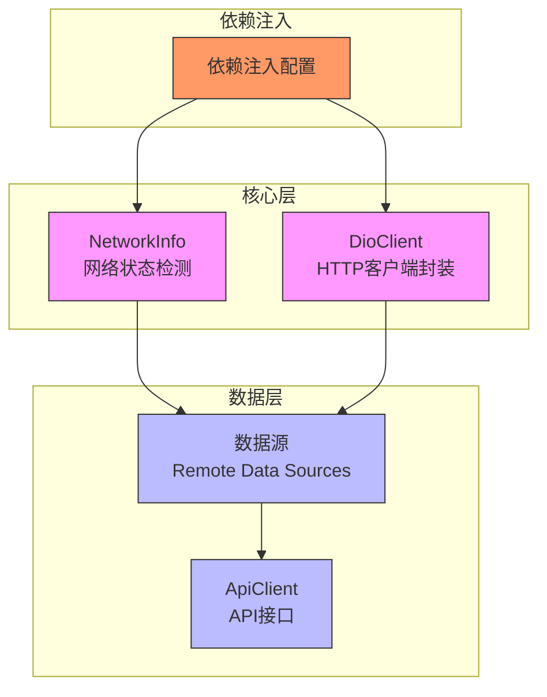
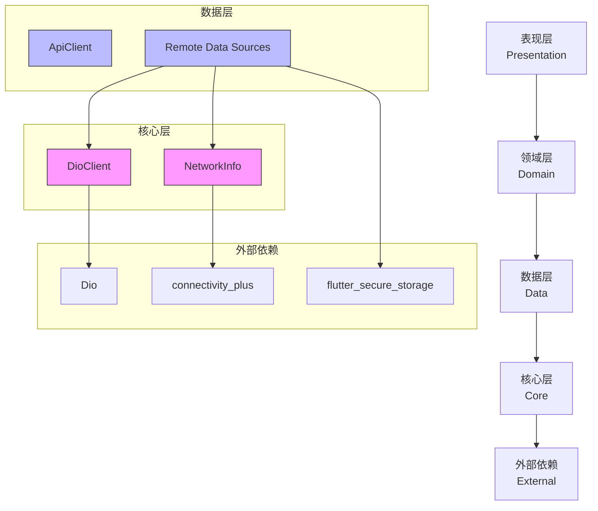
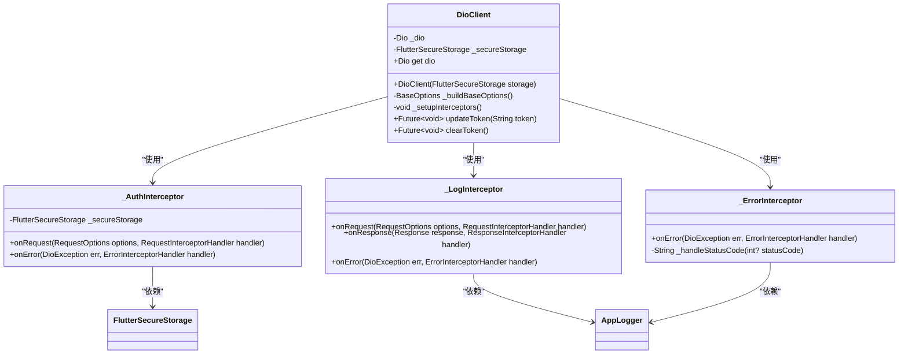
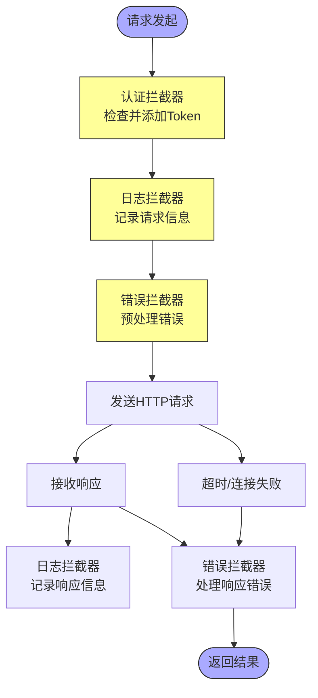
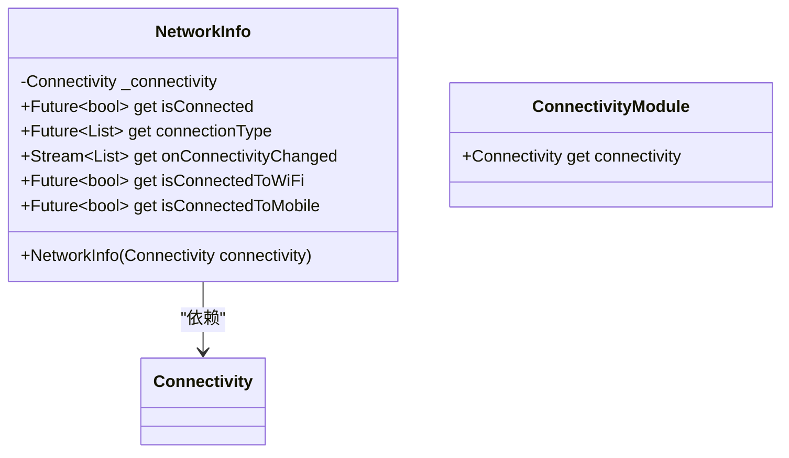
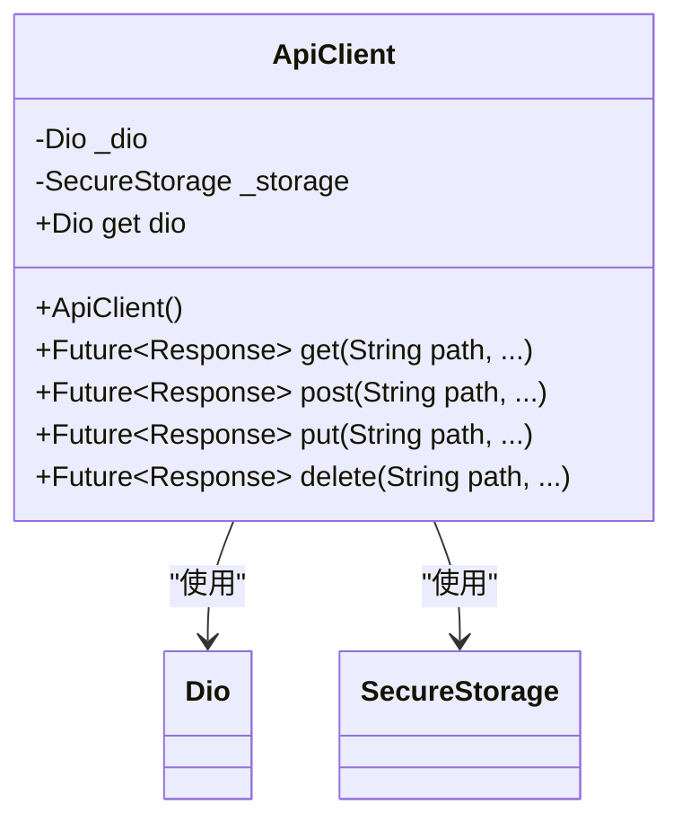
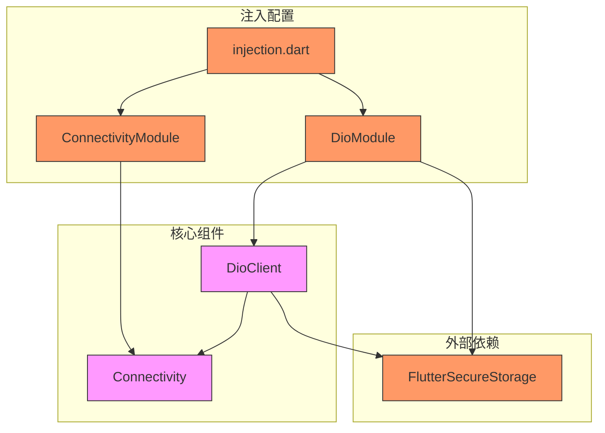

# 网络基础设施

<cite>
**本文档引用文件**  
- [dio_client.dart](file://flutter_app/lib/core/network/dio_client.dart)
- [network_info.dart](file://flutter_app/lib/core/network/network_info.dart)
- [api_client.dart](file://flutter_app/lib/data/api/api_client.dart)
- [injection.dart](file://flutter_app/lib/core/di/injection.dart)
- [api_constants.dart](file://flutter_app/lib/config/api_constants.dart)
- [app_logger.dart](file://flutter_app/lib/core/utils/app_logger.dart)
- [secure_storage.dart](file://flutter_app/lib/data/storage/secure_storage.dart)
- [auth_remote_data_source.dart](file://flutter_app/lib/data/datasources/remote/auth_remote_data_source.dart)
- [main.dart](file://flutter_app/lib/main.dart)
</cite>

## 目录
1. [引言](#引言)
2. [项目结构](#项目结构)
3. [核心组件](#核心组件)
4. [架构概览](#架构概览)
5. [详细组件分析](#详细组件分析)
6. [依赖分析](#依赖分析)
7. [性能考虑](#性能考虑)
8. [故障排除指南](#故障排除指南)
9. [结论](#结论)

## 引言
本文档全面介绍nian移动端网络通信核心组件的设计与集成。重点阐述基于Dio库封装的统一HTTP客户端、网络状态检测机制、依赖注入配置以及各组件间的协作关系，旨在提升应用的网络可靠性、用户体验和资源效率。

## 项目结构
nian应用的网络基础设施位于`flutter_app/lib/core/network/`目录下，采用分层架构设计，将网络通信、状态检测、依赖注入等核心功能进行模块化封装。



**图示来源**  
- [dio_client.dart](file://flutter_app/lib/core/network/dio_client.dart)
- [network_info.dart](file://flutter_app/lib/core/network/network_info.dart)
- [api_client.dart](file://flutter_app/lib/data/api/api_client.dart)

**本节来源**  
- [flutter_app/lib/core/network/](file://flutter_app/lib/core/network/)
- [flutter_app/lib/data/api/](file://flutter_app/lib/data/api/)

## 核心组件
nian应用的网络通信核心由`DioClient`和`NetworkInfo`两个类构成。`DioClient`基于Dio库封装了统一的HTTP客户端，提供拦截器、超时设置和错误处理；`NetworkInfo`通过`connectivity_plus`插件检测设备网络状态，防止在离线状态下发起无效请求。

**本节来源**  
- [dio_client.dart](file://flutter_app/lib/core/network/dio_client.dart#L8-L60)
- [network_info.dart](file://flutter_app/lib/core/network/network_info.dart#L8-L48)

## 架构概览
nian应用采用分层架构，网络层位于核心层，为数据层提供可靠的网络通信能力。通过依赖注入实现组件解耦，确保系统的可测试性和可维护性。



**图示来源**  
- [dio_client.dart](file://flutter_app/lib/core/network/dio_client.dart)
- [network_info.dart](file://flutter_app/lib/core/network/network_info.dart)
- [api_client.dart](file://flutter_app/lib/data/api/api_client.dart)
- [auth_remote_data_source.dart](file://flutter_app/lib/data/datasources/remote/auth_remote_data_source.dart)

## 详细组件分析
### DioClient分析
`DioClient`类封装了Dio库，提供统一的HTTP客户端配置和拦截器管理。

#### 类图


**图示来源**  
- [dio_client.dart](file://flutter_app/lib/core/network/dio_client.dart#L12-L247)

#### 拦截器处理流程


**图示来源**  
- [dio_client.dart](file://flutter_app/lib/core/network/dio_client.dart#L42-L247)

**本节来源**  
- [dio_client.dart](file://flutter_app/lib/core/network/dio_client.dart#L12-L262)

### NetworkInfo分析
`NetworkInfo`类通过`connectivity_plus`插件检测设备网络状态，为应用提供网络连接信息。

#### 类图


**图示来源**  
- [network_info.dart](file://flutter_app/lib/core/network/network_info.dart#L8-L55)

#### 网络状态检测流程
```mermaid
flowchart TD
A[调用isConnected] --> B[checkConnectivity()]
B --> C{连接类型}
C --> |WiFi| D[返回true]
C --> |移动网络| E[返回true]
C --> |以太网| F[返回true]
C --> |其他| G[返回false]
D --> H[允许网络请求]
E --> H
F --> H
G --> I[阻止网络请求]
style H fill:#9f9,stroke:#333
style I fill:#f99,stroke:#333
```

**图示来源**  
- [network_info.dart](file://flutter_app/lib/core/network/network_info.dart#L17-L24)

**本节来源**  
- [network_info.dart](file://flutter_app/lib/core/network/network_info.dart#L8-L55)

### ApiClient分析
`ApiClient`类提供高层API接口，封装了常用的HTTP方法。

#### 类图


**图示来源**  
- [api_client.dart](file://flutter_app/lib/data/api/api_client.dart#L5-L206)

**本节来源**  
- [api_client.dart](file://flutter_app/lib/data/api/api_client.dart#L5-L206)

## 依赖分析
nian应用通过`injectable`和`get_it`实现依赖注入，确保组件间的松耦合。



**图示来源**  
- [injection.dart](file://flutter_app/lib/core/di/injection.dart)
- [dio_client.dart](file://flutter_app/lib/core/network/dio_client.dart#L249-L261)
- [network_info.dart](file://flutter_app/lib/core/network/network_info.dart#L50-L55)

**本节来源**  
- [injection.dart](file://flutter_app/lib/core/di/injection.dart#L1-L61)
- [main.dart](file://flutter_app/lib/main.dart#L30-L31)

## 性能考虑
nian应用的网络层设计充分考虑了性能和用户体验：

1. **连接复用**：Dio客户端默认启用连接池，减少TCP连接开销
2. **超时控制**：设置合理的连接、接收和发送超时（15秒），避免请求长时间挂起
3. **日志分级**：通过`AppLogger`实现日志级别控制，生产环境仅记录警告及以上日志
4. **状态预检**：通过`NetworkInfo`在发起请求前检测网络状态，避免无效请求
5. **内存管理**：使用单例模式（`@lazySingleton`）确保核心组件的唯一实例

**本节来源**  
- [dio_client.dart](file://flutter_app/lib/core/network/dio_client.dart#L28-L30)
- [app_logger.dart](file://flutter_app/lib/core/utils/app_logger.dart#L11-L17)
- [network_info.dart](file://flutter_app/lib/core/network/network_info.dart#L17-L24)

## 故障排除指南
### 常见网络问题及解决方案
| 问题现象 | 可能原因 | 解决方案 |
|---------|--------|---------|
| 请求超时 | 网络连接慢或服务器响应慢 | 检查网络状态，优化服务器性能 |
| 401未授权 | Token过期或无效 | 重新登录获取新Token |
| 404资源不存在 | API端点错误 | 检查API常量配置 |
| 500服务器错误 | 后端服务异常 | 检查服务器日志 |
| 网络连接失败 | 设备无网络连接 | 提示用户检查网络设置 |

### 自定义拦截器扩展
可通过添加新的拦截器实现功能扩展：

```dart
// 示例：添加请求追踪ID拦截器
class TraceIdInterceptor extends Interceptor {
  @override
  void onRequest(RequestOptions options, RequestInterceptorHandler handler) {
    // 生成唯一追踪ID
    final traceId = 'trace-${DateTime.now().millisecondsSinceEpoch}';
    options.headers['X-Trace-ID'] = traceId;
    AppLogger.debug('添加追踪ID: $traceId');
    handler.next(options);
  }
}
```

**本节来源**  
- [dio_client.dart](file://flutter_app/lib/core/network/dio_client.dart#L160-L247)
- [auth_remote_data_source.dart](file://flutter_app/lib/data/datasources/remote/auth_remote_data_source.dart#L56-L75)

## 结论
nian应用的网络基础设施设计体现了现代移动端应用的最佳实践。通过`DioClient`的封装，实现了HTTP客户端的统一配置和管理；利用`NetworkInfo`进行网络状态检测，有效提升了用户体验；依赖注入机制确保了组件间的松耦合和可测试性。整体设计不仅提高了代码的可维护性，也为应用的稳定运行提供了坚实保障。