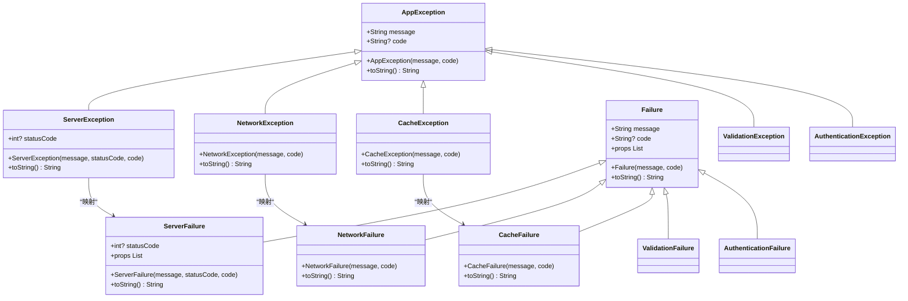
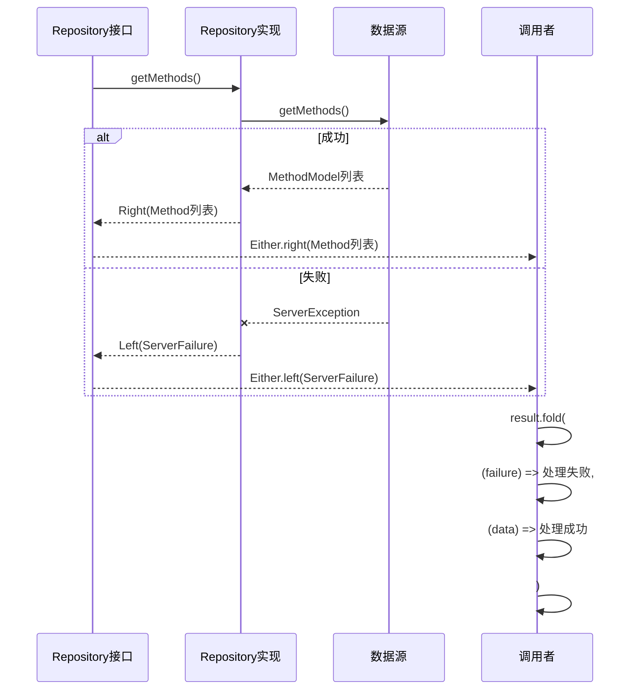
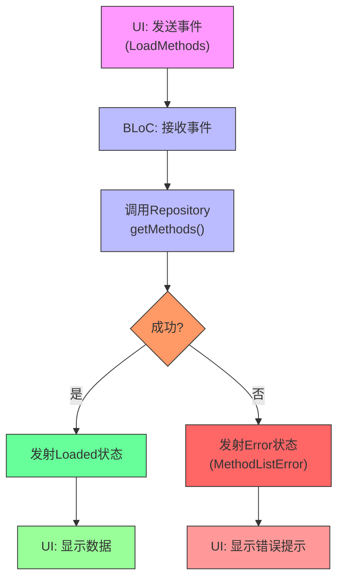

# 错误处理机制

<cite>
**本文档引用文件**  
- [exceptions.dart](file://flutter_app/lib/core/error/exceptions.dart)
- [failures.dart](file://flutter_app/lib/core/error/failures.dart)
- [method_repository_impl.dart](file://flutter_app/lib/data/repositories/method_repository_impl.dart)
- [method_repository.dart](file://flutter_app/lib/domain/repositories/method_repository.dart)
- [method_remote_data_source.dart](file://flutter_app/lib/data/datasources/remote/method_remote_data_source.dart)
- [method_list_bloc.dart](file://flutter_app/lib/presentation/methods/bloc/method_list_bloc.dart)
- [auth_bloc.dart](file://flutter_app/lib/presentation/auth/bloc/auth_bloc.dart)
- [database_helper.dart](file://flutter_app/lib/core/storage/database_helper.dart)
</cite>

## 目录
1. [分层错误处理架构概述](#分层错误处理架构概述)
2. [平台级异常与业务失败的映射关系](#平台级异常与业务失败的映射关系)
3. [Either<L, R>类型在Repository接口中的应用](#eitherlr类型在repository接口中的应用)
4. [数据层到领域层的错误转换实现](#数据层到领域层的错误转换实现)
5. [错误处理设计的优势分析](#错误处理设计的优势分析)
6. [Failure在BLoC状态管理中的传递机制](#failure在bloc状态管理中的传递机制)
7. [总结](#总结)

## 分层错误处理架构概述

nian移动端采用分层错误处理架构，将错误处理划分为三个主要层次：数据层、领域层和表现层。这种分层设计实现了关注点分离，使各层能够专注于其核心职责，同时确保错误信息能够在各层之间正确传递和转换。

在数据层，系统使用`AppException`作为所有自定义异常的基类，定义了多种平台级异常，如`ServerException`、`NetworkException`、`CacheException`等，这些异常直接反映底层技术问题。领域层则使用`Failure`类体系来表示业务失败，如`ServerFailure`、`NetworkFailure`、`AuthenticationFailure`等，这些失败类型与具体的业务场景相关。表现层通过BLoC模式接收`Failure`对象，并将其转换为用户可理解的错误提示。

这种架构确保了底层技术细节不会泄露到上层，同时保持了错误信息的语义完整性，使开发者能够更容易地理解和处理各种错误情况。

**Section sources**
- [exceptions.dart](file://flutter_app/lib/core/error/exceptions.dart#L1-L110)
- [failures.dart](file://flutter_app/lib/core/error/failures.dart#L1-L157)

## 平台级异常与业务失败的映射关系

nian移动端的错误处理架构中，`exceptions.dart`中定义的平台级异常与`failures.dart`中的业务失败类型形成了清晰的映射关系。这种映射实现了从技术异常到业务失败的语义转换，使错误处理更加符合领域驱动设计的原则。

平台级异常主要封装底层网络或存储故障：
- `ServerException`：封装API请求返回的HTTP错误
- `NetworkException`：封装网络连接失败的情况
- `CacheException`：封装本地缓存操作失败
- `ValidationException`：封装输入验证失败
- `AuthenticationException`：封装认证失败或Token过期

这些异常被映射到对应的业务失败类型：
- `ServerException` → `ServerFailure`
- `NetworkException` → `NetworkFailure`
- `CacheException` → `CacheFailure`
- `ValidationException` → `ValidationFailure`
- `AuthenticationException` → `AuthenticationFailure`

这种映射关系通过Repository实现类中的异常处理逻辑完成，确保了领域层只与业务失败类型交互，而不直接暴露底层技术异常。



**Diagram sources**
- [exceptions.dart](file://flutter_app/lib/core/error/exceptions.dart#L1-L110)
- [failures.dart](file://flutter_app/lib/core/error/failures.dart#L1-L157)

**Section sources**
- [exceptions.dart](file://flutter_app/lib/core/error/exceptions.dart#L1-L110)
- [failures.dart](file://flutter_app/lib/core/error/failures.dart#L1-L157)

## Either<L, R>类型在Repository接口中的应用

nian移动端的Repository接口广泛使用Dart的`Either<L, R>`类型作为返回值，实现了成功结果与失败路径的类型安全分支处理。`Either`类型是函数式编程中的一个概念，表示一个值要么是左类型（L），要么是右类型（R），在本项目中，约定左类型为`Failure`（失败），右类型为实际数据（成功）。

在`MethodRepository`接口中，所有方法都返回`Future<Either<Failure, T>>`类型：
- `getMethods()` 返回 `Future<Either<Failure, List<Method>>>`
- `getMethodDetail()` 返回 `Future<Either<Failure, Method>>`
- `searchMethods()` 返回 `Future<Either<Failure, List<Method>>>`

这种设计带来了多个优势：
1. **类型安全**：编译器可以确保调用者必须处理成功和失败两种情况
2. **明确的契约**：接口明确告知调用者可能的失败情况
3. **避免异常抛出**：使用返回值而非异常来表示失败，使错误处理更加显式
4. **函数式风格**：支持`fold`等函数式操作，简化错误处理逻辑

通过`Either`类型，Repository接口提供了一种优雅的方式来处理异步操作的结果，使调用者能够以声明式的方式处理成功和失败路径。



**Diagram sources**
- [method_repository.dart](file://flutter_app/lib/domain/repositories/method_repository.dart#L1-L41)
- [method_repository_impl.dart](file://flutter_app/lib/data/repositories/method_repository_impl.dart#L1-L74)

**Section sources**
- [method_repository.dart](file://flutter_app/lib/domain/repositories/method_repository.dart#L1-L41)
- [method_repository_impl.dart](file://flutter_app/lib/data/repositories/method_repository_impl.dart#L1-L74)

## 数据层到领域层的错误转换实现

在nian移动端中，`MethodRepositoryImpl`类实现了从数据层异常到领域层失败的转换逻辑，其核心是`mapExceptionToFailure`的等效实现。虽然没有单独的映射方法，但异常处理逻辑直接内联在Repository实现的方法中。

以`getMethods`方法为例，其实现逻辑如下：
1. 调用远程数据源的`getMethods`方法
2. 使用try-catch捕获可能抛出的异常
3. 根据异常类型转换为对应的失败类型
4. 使用`Either.left()`包装失败，`Either.right()`包装成功结果

具体转换逻辑：
- `NetworkException` → `NetworkFailure`
- `ServerException` → `ServerFailure`
- 其他未预期异常 → `UnknownFailure`

这种转换确保了领域层不会直接暴露底层技术异常，而是使用业务语义的失败类型。同时，关键的错误信息（如HTTP状态码、错误消息）被保留在失败对象中，供上层使用。

```dart
try {
  final methods = await remoteDataSource.getMethods();
  return Right(methods);
} on NetworkException catch (e) {
  return Left(NetworkFailure(e.message));
} on ServerException catch (e) {
  return Left(ServerFailure(e.message, statusCode: e.statusCode));
} catch (e) {
  return Left(UnknownFailure('获取方法列表失败: ${e.toString()}'));
}
```

这种实现方式简洁明了，避免了额外的映射函数开销，同时保持了错误处理的清晰性和可维护性。

**Section sources**
- [method_repository_impl.dart](file://flutter_app/lib/data/repositories/method_repository_impl.dart#L1-L74)
- [method_remote_data_source.dart](file://flutter_app/lib/data/datasources/remote/method_remote_data_source.dart#L1-L83)

## 错误处理设计的优势分析

nian移动端的分层错误处理设计带来了多方面的优势，显著提升了代码质量、可维护性和用户体验。

**代码可读性提升**：
- 错误处理逻辑集中且一致，开发者可以快速理解错误处理流程
- 使用`Either`类型使成功和失败路径显式化，避免了深层嵌套的if-else判断
- 命名规范清晰，异常和失败类型具有明确的业务语义

**统一错误提示与日志记录**：
- 通过`FailureMessages`类集中管理错误消息，确保用户提示的一致性
- 所有错误都经过统一的转换流程，便于添加全局日志记录
- 关键错误信息（如HTTP状态码）被保留，便于问题诊断

**支持未来扩展**：
- 开放-封闭原则：新增失败类型只需添加新的`Failure`子类，不影响现有代码
- 易于添加新的异常映射关系
- 支持国际化，错误消息可以轻松替换为多语言版本

**类型安全与编译时检查**：
- `Either`类型确保调用者必须处理失败情况
- 编译器可以检测未处理的错误路径
- 减少了运行时异常的可能性

这种设计不仅提高了代码的健壮性，还为未来的功能扩展和维护提供了良好的基础。

**Section sources**
- [failures.dart](file://flutter_app/lib/core/error/failures.dart#L1-L157)
- [exceptions.dart](file://flutter_app/lib/core/error/exceptions.dart#L1-L110)

## Failure在BLoC状态管理中的传递机制

在nian移动端中，`Failure`对象通过BLoC模式从Repository层传递到UI层，触发相应的用户反馈。这一过程体现了响应式编程的思想，实现了状态与UI的分离。

以`MethodListBloc`为例，其处理流程如下：
1. BLoC接收UI层的事件（如`LoadMethods`）
2. 调用Repository方法获取数据
3. 使用`fold`方法处理`Either`结果
4. 根据结果发射不同的状态

当出现失败时，BLoC会发射包含错误消息的状态（如`MethodListError`），UI层监听到该状态后显示相应的错误提示。这种机制确保了错误处理的响应性和一致性。

在认证流程中，`AuthBloc`同样使用类似机制：
- 登录失败时发射`AuthError`状态
- 包含具体的错误消息（如"用户名或密码错误"）
- UI层根据状态显示错误提示

这种设计的优势：
- 状态驱动UI更新，避免了直接的UI操作
- 错误处理逻辑集中在BLoC中，便于维护
- 支持复杂的错误处理流程（如重试、降级）



**Diagram sources**
- [method_list_bloc.dart](file://flutter_app/lib/presentation/methods/bloc/method_list_bloc.dart#L1-L133)
- [auth_bloc.dart](file://flutter_app/lib/presentation/auth/bloc/auth_bloc.dart#L1-L82)

**Section sources**
- [method_list_bloc.dart](file://flutter_app/lib/presentation/methods/bloc/method_list_bloc.dart#L1-L133)
- [auth_bloc.dart](file://flutter_app/lib/presentation/auth/bloc/auth_bloc.dart#L1-L82)

## 总结

nian移动端的分层错误处理架构通过精心设计的异常和失败类型体系，实现了从数据层到表现层的完整错误处理流程。该架构的核心优势在于：

1. **清晰的分层**：将技术异常与业务失败分离，确保各层职责明确
2. **类型安全**：使用`Either<L, R>`类型确保错误处理的完备性
3. **语义转换**：通过异常到失败的映射，提升错误信息的业务语义
4. **响应式传递**：利用BLoC模式将失败信息传递到UI层，实现状态驱动的错误反馈

这种设计不仅提高了代码的可读性和可维护性，还为统一错误提示、日志记录和未来扩展提供了坚实的基础。通过集中管理错误消息和处理逻辑，系统能够为用户提供一致且友好的错误体验，同时为开发者提供清晰的错误诊断信息。

**Section sources**
- [exceptions.dart](file://flutter_app/lib/core/error/exceptions.dart#L1-L110)
- [failures.dart](file://flutter_app/lib/core/error/failures.dart#L1-L157)
- [method_repository_impl.dart](file://flutter_app/lib/data/repositories/method_repository_impl.dart#L1-L74)