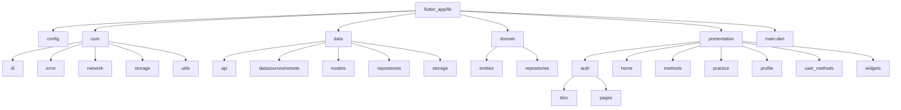
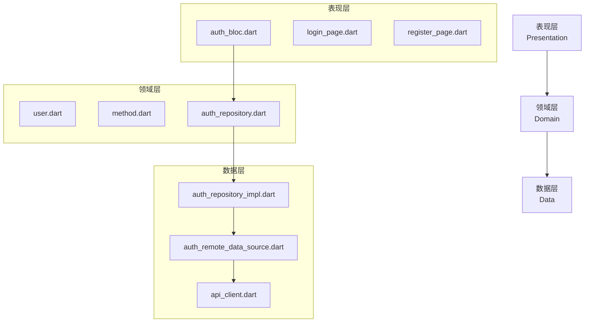
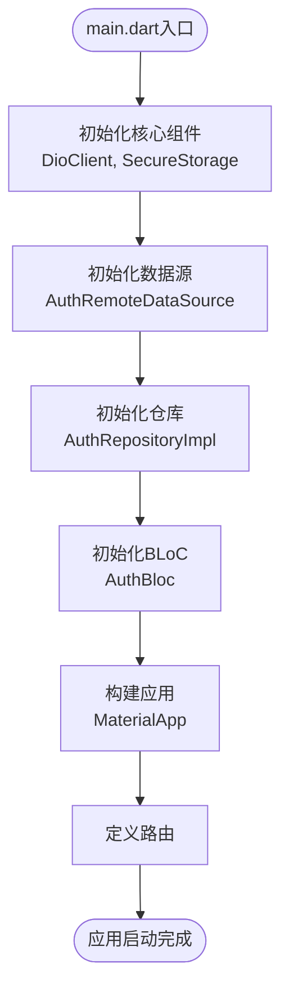
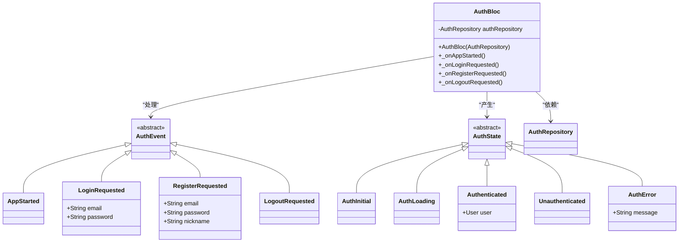
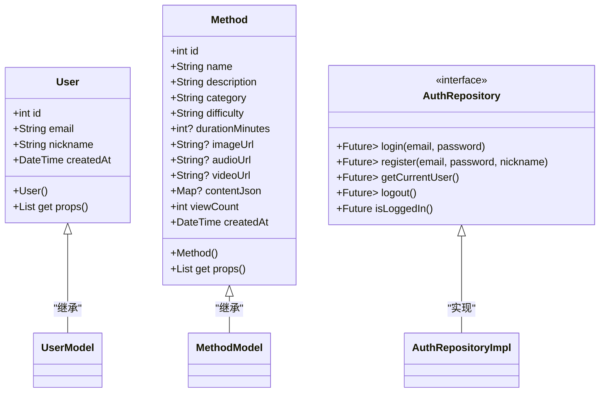
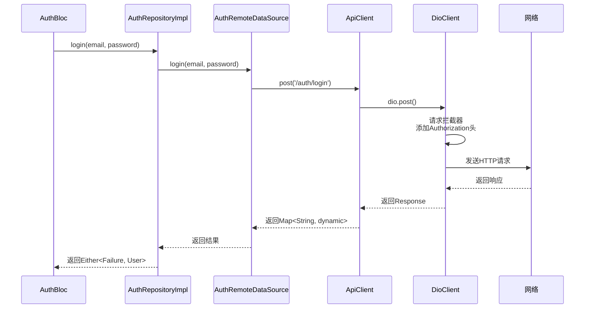
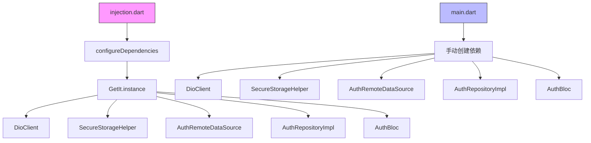
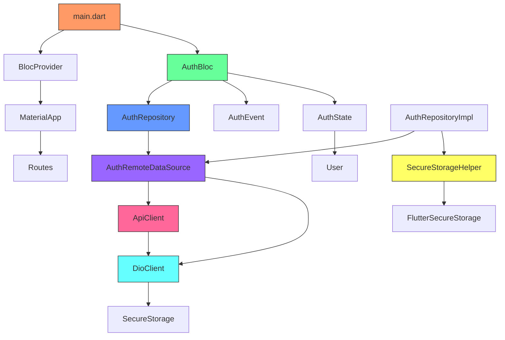

# 移动端架构

<cite>
**本文档引用文件**   
- [main.dart](file://flutter_app/lib/main.dart)
- [injection.dart](file://flutter_app/lib/core/di/injection.dart)
- [auth_bloc.dart](file://flutter_app/lib/presentation/auth/bloc/auth_bloc.dart)
- [auth_event.dart](file://flutter_app/lib/presentation/auth/bloc/auth_event.dart)
- [auth_state.dart](file://flutter_app/lib/presentation/auth/bloc/auth_state.dart)
- [user.dart](file://flutter_app/lib/domain/entities/user.dart)
- [auth_repository.dart](file://flutter_app/lib/domain/repositories/auth_repository.dart)
- [auth_repository_impl.dart](file://flutter_app/lib/data/repositories/auth_repository_impl.dart)
- [auth_remote_data_source.dart](file://flutter_app/lib/data/datasources/remote/auth_remote_data_source.dart)
- [api_client.dart](file://flutter_app/lib/data/api/api_client.dart)
- [dio_client.dart](file://flutter_app/lib/core/network/dio_client.dart)
- [secure_storage_helper.dart](file://flutter_app/lib/core/storage/secure_storage_helper.dart)
- [routes.dart](file://flutter_app/lib/config/routes.dart)
</cite>

## 目录
1. [简介](#简介)
2. [项目结构](#项目结构)
3. [核心组件](#核心组件)
4. [Clean Architecture分层架构](#clean-architecture分层架构)
5. [应用入口与依赖组织](#应用入口与依赖组织)
6. [表现层：BLoC状态管理](#表现层bloc状态管理)
7. [领域层：实体与仓库接口](#领域层实体与仓库接口)
8. [数据层：远程数据源与API客户端](#数据层远程数据源与api客户端)
9. [依赖注入跨层解耦机制](#依赖注入跨层解耦机制)
10. [模块间依赖关系图](#模块间依赖关系图)

## 简介
本文档全面解析nian移动端应用采用的Clean Architecture分层架构。文档详细阐述了应用从入口初始化到各层组件协作的完整流程，重点分析了依赖注入、BLoC状态管理、领域驱动设计和网络请求封装等关键技术实现，为开发者提供深入的架构理解和技术参考。

## 项目结构
nian移动端项目采用标准的Flutter项目结构，遵循Clean Architecture分层原则。项目核心位于`flutter_app/lib`目录下，分为`core`（核心基础设施）、`data`（数据层）、`domain`（领域层）和`presentation`（表现层）四个主要模块。这种分层结构确保了代码的高内聚、低耦合，便于维护和扩展。

**Diagram sources**
- [main.dart](file://flutter_app/lib/main.dart#L1-L105)
- [injection.dart](file://flutter_app/lib/core/di/injection.dart#L1-L61)

**Section sources**
- [main.dart](file://flutter_app/lib/main.dart#L1-L105)
- [project_structure](file://project_structure)

## 核心组件
本项目的核心组件包括应用入口`main.dart`、依赖注入系统`injection.dart`、认证BLoC状态管理器`auth_bloc.dart`以及贯穿各层的实体、仓库和数据源实现。这些组件协同工作，构成了应用的基础骨架和核心业务逻辑。

**Section sources**
- [main.dart](file://flutter_app/lib/main.dart#L1-L105)
- [injection.dart](file://flutter_app/lib/core/di/injection.dart#L1-L61)
- [auth_bloc.dart](file://flutter_app/lib/presentation/auth/bloc/auth_bloc.dart#L1-L82)

## Clean Architecture分层架构
nian移动端严格遵循Clean Architecture设计原则，将应用划分为三个主要层次：表现层（Presentation）、领域层（Domain）和数据层（Data）。这种分层架构确保了业务逻辑的独立性，使得上层对下层有依赖，而下层完全不知道上层的存在，从而实现了高度的解耦和可测试性。

**Diagram sources**
- [auth_bloc.dart](file://flutter_app/lib/presentation/auth/bloc/auth_bloc.dart#L1-L82)
- [auth_repository.dart](file://flutter_app/lib/domain/repositories/auth_repository.dart#L1-L46)
- [auth_repository_impl.dart](file://flutter_app/lib/data/repositories/auth_repository_impl.dart#L1-L114)

## 应用入口与依赖组织
`main.dart`作为应用的唯一入口，负责初始化所有核心依赖并构建应用的根组件树。它通过手动依赖注入的方式，自下而上地创建了从网络客户端、数据源到仓库的完整依赖链，并将最终的`AuthRepository`注入到`AuthBloc`中，实现了依赖的显式传递和控制反转。

**Diagram sources**
- [main.dart](file://flutter_app/lib/main.dart#L20-L105)

**Section sources**
- [main.dart](file://flutter_app/lib/main.dart#L20-L105)
- [routes.dart](file://flutter_app/lib/config/routes.dart#L1-L242)

## 表现层BLoC状态管理
表现层采用BLoC（Business Logic Component）模式进行UI状态管理。以`auth_bloc.dart`为例，它通过事件（Event）驱动的方式响应用户操作，内部维护一个不可变的状态（State），当事件触发时，BLoC会执行相应的业务逻辑，并根据结果发出新的状态，从而驱动UI更新。

**Diagram sources**
- [auth_bloc.dart](file://flutter_app/lib/presentation/auth/bloc/auth_bloc.dart#L7-L82)
- [auth_event.dart](file://flutter_app/lib/presentation/auth/bloc/auth_event.dart#L1-L50)
- [auth_state.dart](file://flutter_app/lib/presentation/auth/bloc/auth_state.dart#L1-L46)

**Section sources**
- [auth_bloc.dart](file://flutter_app/lib/presentation/auth/bloc/auth_bloc.dart#L7-L82)
- [auth_event.dart](file://flutter_app/lib/presentation/auth/bloc/auth_event.dart#L1-L50)
- [auth_state.dart](file://flutter_app/lib/presentation/auth/bloc/auth_state.dart#L1-L46)

## 领域层实体与仓库接口
领域层是应用的核心，包含了业务逻辑和规则。`entities`目录下的`user.dart`和`method.dart`等文件定义了应用的核心数据模型，这些实体是纯数据类，不包含任何框架依赖。`repositories`目录下的接口（如`auth_repository.dart`）定义了业务所需的数据访问契约，确保了领域层的独立性和可测试性。

**Diagram sources**
- [user.dart](file://flutter_app/lib/domain/entities/user.dart#L1-L32)
- [method.dart](file://flutter_app/lib/domain/entities/method.dart#L1-L77)
- [auth_repository.dart](file://flutter_app/lib/domain/repositories/auth_repository.dart#L1-L46)

**Section sources**
- [user.dart](file://flutter_app/lib/domain/entities/user.dart#L1-L32)
- [method.dart](file://flutter_app/lib/domain/entities/method.dart#L1-L77)
- [auth_repository.dart](file://flutter_app/lib/domain/repositories/auth_repository.dart#L1-L46)

## 数据层远程数据源与API客户端
数据层负责与外部数据源（如API、数据库）交互。`remote`目录下的`auth_remote_data_source.dart`封装了与后端认证服务的具体HTTP通信逻辑。`api_client.dart`提供了统一的API请求封装，而`dio_client.dart`则基于Dio库构建了带有拦截器的网络客户端，实现了请求日志、错误处理和自动认证令牌注入。

**Diagram sources**
- [auth_repository_impl.dart](file://flutter_app/lib/data/repositories/auth_repository_impl.dart#L1-L114)
- [auth_remote_data_source.dart](file://flutter_app/lib/data/datasources/remote/auth_remote_data_source.dart#L1-L77)
- [api_client.dart](file://flutter_app/lib/data/api/api_client.dart#L1-L207)
- [dio_client.dart](file://flutter_app/lib/core/network/dio_client.dart#L1-L262)

**Section sources**
- [auth_repository_impl.dart](file://flutter_app/lib/data/repositories/auth_repository_impl.dart#L1-L114)
- [auth_remote_data_source.dart](file://flutter_app/lib/data/datasources/remote/auth_remote_data_source.dart#L1-L77)
- [api_client.dart](file://flutter_app/lib/data/api/api_client.dart#L1-L207)

## 依赖注入跨层解耦机制
项目通过依赖注入（DI）实现了各层之间的松耦合。虽然主要采用手动DI，但在`core/di/injection.dart`中也集成了`get_it`和`injectable`库，为未来更复杂的依赖管理提供了扩展能力。DI的核心思想是将依赖的创建和使用分离，由上层组件负责创建依赖并注入到下层，从而避免了硬编码的依赖关系。

**Diagram sources**
- [injection.dart](file://flutter_app/lib/core/di/injection.dart#L1-L61)
- [main.dart](file://flutter_app/lib/main.dart#L30-L40)

**Section sources**
- [injection.dart](file://flutter_app/lib/core/di/injection.dart#L1-L61)
- [main.dart](file://flutter_app/lib/main.dart#L30-L40)
- [dio_client.dart](file://flutter_app/lib/core/network/dio_client.dart#L1-L262)
- [secure_storage_helper.dart](file://flutter_app/lib/core/storage/secure_storage_helper.dart#L1-L194)

## 模块间依赖关系图
以下图表展示了nian移动端应用中关键模块之间的完整依赖关系，清晰地呈现了从应用入口到数据层的依赖流向，体现了Clean Architecture的核心原则。

**Diagram sources**
- [main.dart](file://flutter_app/lib/main.dart#L20-L105)
- [auth_bloc.dart](file://flutter_app/lib/presentation/auth/bloc/auth_bloc.dart#L7-L82)
- [auth_repository_impl.dart](file://flutter_app/lib/data/repositories/auth_repository_impl.dart#L1-L114)
- [auth_remote_data_source.dart](file://flutter_app/lib/data/datasources/remote/auth_remote_data_source.dart#L1-L77)
- [api_client.dart](file://flutter_app/lib/data/api/api_client.dart#L1-L207)
- [dio_client.dart](file://flutter_app/lib/core/network/dio_client.dart#L1-L262)
- [secure_storage_helper.dart](file://flutter_app/lib/core/storage/secure_storage_helper.dart#L1-L194)

**Section sources**
- [main.dart](file://flutter_app/lib/main.dart#L20-L105)
- [auth_bloc.dart](file://flutter_app/lib/presentation/auth/bloc/auth_bloc.dart#L7-L82)
- [auth_repository_impl.dart](file://flutter_app/lib/data/repositories/auth_repository_impl.dart#L1-L114)
- [auth_remote_data_source.dart](file://flutter_app/lib/data/datasources/remote/auth_remote_data_source.dart#L1-L77)
- [api_client.dart](file://flutter_app/lib/data/api/api_client.dart#L1-L207)
- [dio_client.dart](file://flutter_app/lib/core/network/dio_client.dart#L1-L262)
- [secure_storage_helper.dart](file://flutter_app/lib/core/storage/secure_storage_helper.dart#L1-L194)