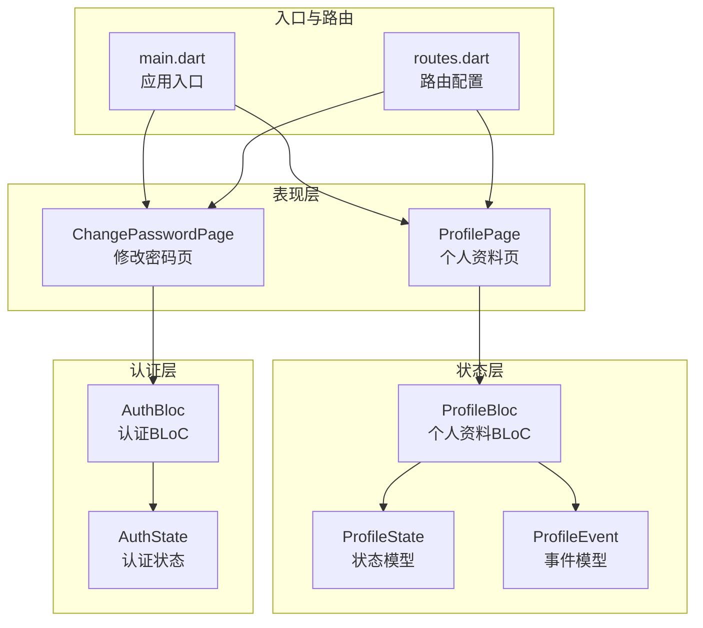
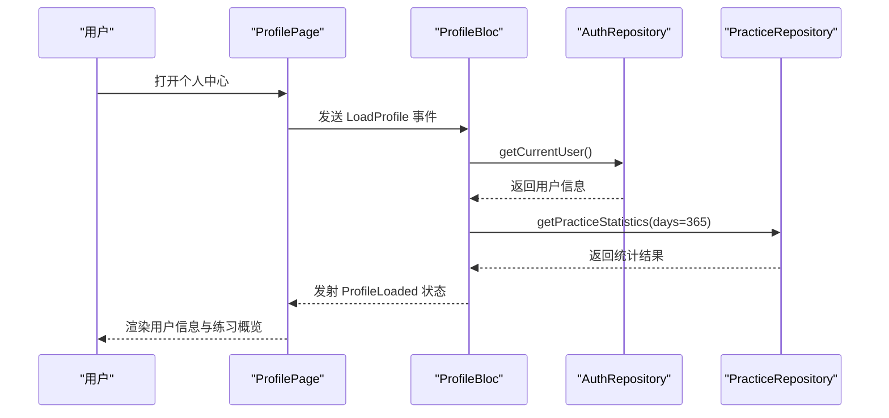
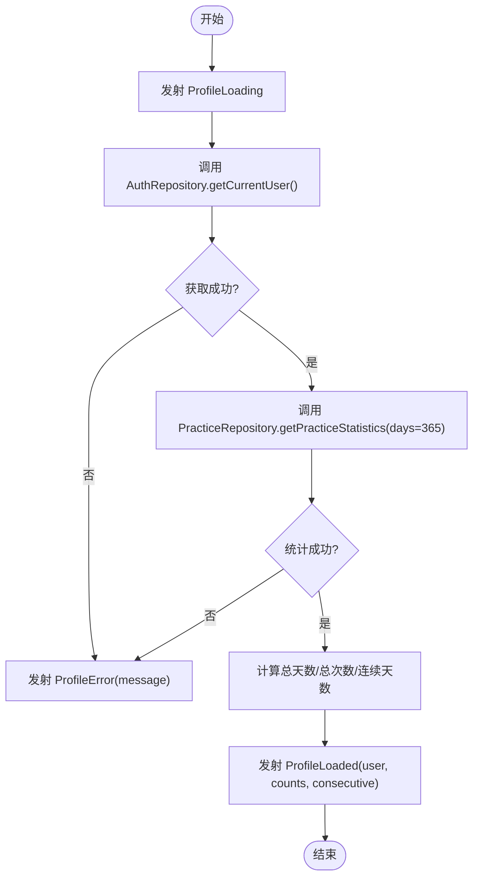
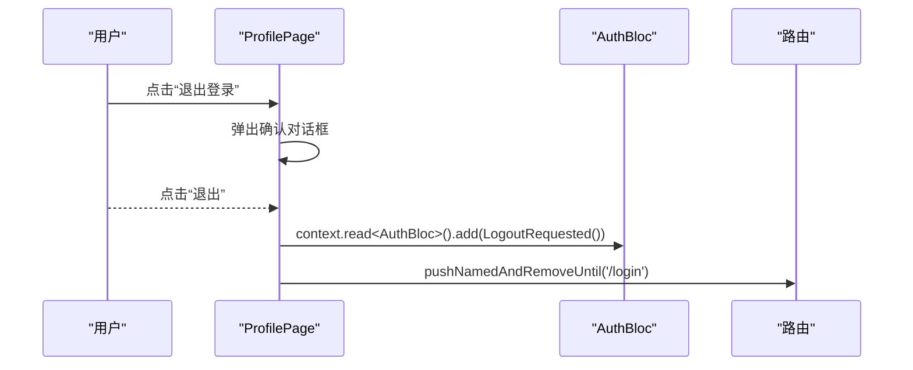
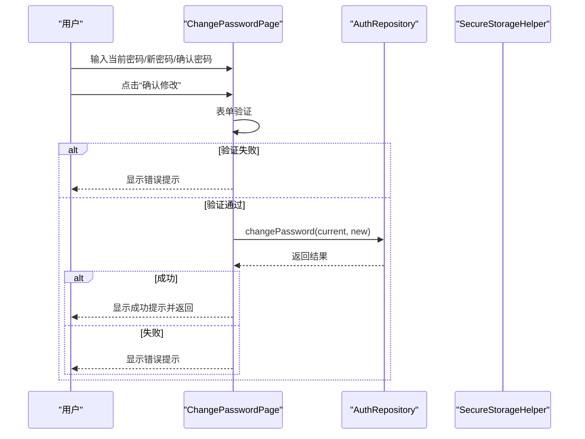
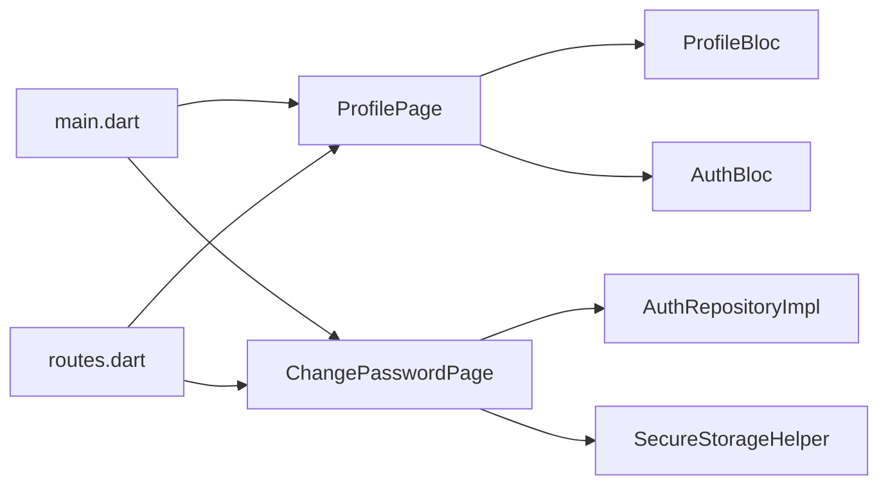

# 个人中心表现层

<cite>
**本文引用的文件**
- [profile_bloc.dart](file://flutter_app/lib/presentation/profile/bloc/profile_bloc.dart)
- [profile_state.dart](file://flutter_app/lib/presentation/profile/bloc/profile_state.dart)
- [profile_event.dart](file://flutter_app/lib/presentation/profile/bloc/profile_event.dart)
- [profile_page.dart](file://flutter_app/lib/presentation/profile/pages/profile_page.dart)
- [change_password_page.dart](file://flutter_app/lib/presentation/profile/pages/change_password_page.dart)
- [auth_bloc.dart](file://flutter_app/lib/presentation/auth/bloc/auth_bloc.dart)
- [auth_state.dart](file://flutter_app/lib/presentation/auth/bloc/auth_state.dart)
- [main.dart](file://flutter_app/lib/main.dart)
- [routes.dart](file://flutter_app/lib/config/routes.dart)
</cite>

## 目录
1. [简介](#简介)
2. [项目结构](#项目结构)
3. [核心组件](#核心组件)
4. [架构总览](#架构总览)
5. [详细组件分析](#详细组件分析)
6. [依赖关系分析](#依赖关系分析)
7. [性能考量](#性能考量)
8. [故障排查指南](#故障排查指南)
9. [结论](#结论)
10. [附录](#附录)

## 简介
本文件聚焦“个人中心”在表现层的实现，围绕以下目标展开：
- 解释 profile_bloc 如何加载与管理用户个人信息状态，并响应更新操作
- 分析 profile_page.dart 的布局结构、信息展示方式与编辑入口设计
- 深入解析 change_password_page.dart 中旧密码验证、新密码强度校验与提交流程
- 结合代码示例路径，展示表单验证逻辑、密码加密传输、成功提示与页面返回等交互行为
- 提供用户体验优化建议，如输入焦点管理、错误提示位置、敏感操作确认弹窗等设计模式

## 项目结构
个人中心相关代码位于 Flutter App 的 presentation 层，采用 BLoC 模式组织状态与交互：
- 表现层页面：profile_page.dart、change_password_page.dart
- 状态管理：profile_bloc.dart 及其事件/状态定义
- 认证联动：auth_bloc.dart 与 auth_state.dart
- 入口与路由：main.dart、routes.dart

图表来源
- [profile_page.dart](file://flutter_app/lib/presentation/profile/pages/profile_page.dart#L1-L137)
- [change_password_page.dart](file://flutter_app/lib/presentation/profile/pages/change_password_page.dart#L1-L120)
- [profile_bloc.dart](file://flutter_app/lib/presentation/profile/bloc/profile_bloc.dart#L1-L64)
- [profile_state.dart](file://flutter_app/lib/presentation/profile/bloc/profile_state.dart#L1-L74)
- [profile_event.dart](file://flutter_app/lib/presentation/profile/bloc/profile_event.dart#L1-L45)
- [auth_bloc.dart](file://flutter_app/lib/presentation/auth/bloc/auth_bloc.dart#L1-L82)
- [auth_state.dart](file://flutter_app/lib/presentation/auth/bloc/auth_state.dart#L1-L46)
- [main.dart](file://flutter_app/lib/main.dart#L1-L105)
- [routes.dart](file://flutter_app/lib/config/routes.dart#L1-L156)

章节来源
- [profile_page.dart](file://flutter_app/lib/presentation/profile/pages/profile_page.dart#L1-L137)
- [change_password_page.dart](file://flutter_app/lib/presentation/profile/pages/change_password_page.dart#L1-L120)
- [profile_bloc.dart](file://flutter_app/lib/presentation/profile/bloc/profile_bloc.dart#L1-L64)
- [profile_state.dart](file://flutter_app/lib/presentation/profile/bloc/profile_state.dart#L1-L74)
- [profile_event.dart](file://flutter_app/lib/presentation/profile/bloc/profile_event.dart#L1-L45)
- [auth_bloc.dart](file://flutter_app/lib/presentation/auth/bloc/auth_bloc.dart#L1-L82)
- [auth_state.dart](file://flutter_app/lib/presentation/auth/bloc/auth_state.dart#L1-L46)
- [main.dart](file://flutter_app/lib/main.dart#L1-L105)
- [routes.dart](file://flutter_app/lib/config/routes.dart#L1-L156)

## 核心组件
- ProfileBloc：负责加载用户资料、更新昵称、切换主题、导出数据、退出登录等事件处理与状态发射
- ProfileState/ProfileEvent：定义个人中心的状态机与事件集合
- ProfilePage：构建用户信息卡片、练习概览、设置分组与编辑入口；包含多个对话框与确认弹窗
- ChangePasswordPage：表单驱动的密码修改界面，包含旧密码验证、新密码强度校验与提交流程
- AuthBloc/AuthState：为退出登录等敏感操作提供认证状态联动

章节来源
- [profile_bloc.dart](file://flutter_app/lib/presentation/profile/bloc/profile_bloc.dart#L1-L166)
- [profile_state.dart](file://flutter_app/lib/presentation/profile/bloc/profile_state.dart#L1-L74)
- [profile_event.dart](file://flutter_app/lib/presentation/profile/bloc/profile_event.dart#L1-L45)
- [profile_page.dart](file://flutter_app/lib/presentation/profile/pages/profile_page.dart#L1-L137)
- [change_password_page.dart](file://flutter_app/lib/presentation/profile/pages/change_password_page.dart#L1-L226)
- [auth_bloc.dart](file://flutter_app/lib/presentation/auth/bloc/auth_bloc.dart#L1-L82)
- [auth_state.dart](file://flutter_app/lib/presentation/auth/bloc/auth_state.dart#L1-L46)

## 架构总览
个人中心表现层采用 BLoC 驱动的状态管理模式：
- 页面通过 BlocProvider 或 context.read 访问 ProfileBloc/AuthBloc
- 事件通过 BlocListener/BlocConsumer 监听状态变化，触发 UI 更新与交互反馈
- 路由层负责页面导航与参数传递，确保用户在不同页面间顺畅流转

图表来源
- [profile_page.dart](file://flutter_app/lib/presentation/profile/pages/profile_page.dart#L1-L137)
- [profile_bloc.dart](file://flutter_app/lib/presentation/profile/bloc/profile_bloc.dart#L28-L64)
- [profile_state.dart](file://flutter_app/lib/presentation/profile/bloc/profile_state.dart#L22-L43)

## 详细组件分析

### ProfileBloc：状态加载与更新
- 加载流程
  - 发射 ProfileLoading
  - 调用 AuthRepository.getCurrentUser 获取用户信息
  - 调用 PracticeRepository.getPracticeStatistics 获取全年统计
  - 计算总天数、总次数与连续天数，发射 ProfileLoaded
- 更新昵称
  - 校验当前状态是否为 ProfileLoaded
  - 发射 ProfileLoading
  - 调用 AuthRepository.updateProfile(nickname)
  - 成功后发射 ProfileUpdated，并立即以当前统计值重新发射 ProfileLoaded
- 切换主题
  - 将主题模式写入本地存储（SharedPreferences）
- 导出数据
  - 获取用户信息与最近365天练习记录
  - 组装导出数据并写入应用文档目录 JSON 文件
  - 发射 DataExported(filePath)
- 退出登录
  - 调用 AuthRepository.logout
  - 发射 ProfileInitial

图表来源
- [profile_bloc.dart](file://flutter_app/lib/presentation/profile/bloc/profile_bloc.dart#L28-L64)

章节来源
- [profile_bloc.dart](file://flutter_app/lib/presentation/profile/bloc/profile_bloc.dart#L28-L166)
- [profile_state.dart](file://flutter_app/lib/presentation/profile/bloc/profile_state.dart#L18-L73)
- [profile_event.dart](file://flutter_app/lib/presentation/profile/bloc/profile_event.dart#L11-L45)

### ProfilePage：布局结构与交互入口
- 布局结构
  - 顶部用户信息卡片：展示头像占位、昵称、注册时间等
  - 练习概览卡片：展示总天数、总次数、连续天数
  - 设置分组：个人信息（修改昵称、修改密码）、应用设置（主题、通知）、数据管理（导出数据、清除缓存）、关于（版本、隐私政策、用户协议）
- 交互入口
  - 修改昵称：打开对话框，输入后显示成功提示
  - 修改密码：跳转到 /change-password 路由
  - 主题设置：弹出主题选择对话框，切换后显示成功提示
  - 通知设置：弹出对话框，包含开关项
  - 导出数据：弹出确认对话框，点击导出后显示成功提示
  - 清除缓存：弹出确认对话框，点击后显示成功提示
  - 退出登录：弹出确认对话框，点击后触发 AuthBloc 的 LogoutRequested 并跳转到登录页

图表来源
- [profile_page.dart](file://flutter_app/lib/presentation/profile/pages/profile_page.dart#L688-L720)
- [auth_bloc.dart](file://flutter_app/lib/presentation/auth/bloc/auth_bloc.dart#L73-L82)
- [routes.dart](file://flutter_app/lib/config/routes.dart#L129-L156)

章节来源
- [profile_page.dart](file://flutter_app/lib/presentation/profile/pages/profile_page.dart#L1-L137)
- [profile_page.dart](file://flutter_app/lib/presentation/profile/pages/profile_page.dart#L139-L720)
- [auth_bloc.dart](file://flutter_app/lib/presentation/auth/bloc/auth_bloc.dart#L73-L82)
- [routes.dart](file://flutter_app/lib/config/routes.dart#L129-L156)

### ChangePasswordPage：密码修改流程
- 表单字段与验证
  - 当前密码：必填校验
  - 新密码：必填、长度≥6、不得与当前密码相同
  - 确认新密码：必填、与新密码一致
  - 新密码强度指示器：基于长度、数字、大小写字母、特殊字符计分
- 提交流程
  - 校验表单
  - 初始化 DioClient、AuthRemoteDataSource、SecureStorageHelper、AuthRepositoryImpl
  - 调用 AuthRepository.changePassword(currentPassword, newPassword)
  - 成功：显示绿色提示并返回上一页
  - 失败：显示红色提示（包含错误消息）

图表来源
- [change_password_page.dart](file://flutter_app/lib/presentation/profile/pages/change_password_page.dart#L283-L350)
- [change_password_page.dart](file://flutter_app/lib/presentation/profile/pages/change_password_page.dart#L357-L701)

章节来源
- [change_password_page.dart](file://flutter_app/lib/presentation/profile/pages/change_password_page.dart#L1-L226)
- [change_password_page.dart](file://flutter_app/lib/presentation/profile/pages/change_password_page.dart#L227-L701)

### 用户资料展示与编辑入口设计
- 用户信息卡片：使用渐变背景与圆角卡片，展示昵称与注册时间
- 练习概览：使用卡片阴影与居中排版，展示总天数、总次数、连续天数
- 设置分组：使用分组标题与容器卡片，统一风格
- 编辑入口：通过 InkWell + Icon 右箭头，直观引导用户点击进入对应功能

章节来源
- [profile_page.dart](file://flutter_app/lib/presentation/profile/pages/profile_page.dart#L139-L236)
- [profile_page.dart](file://flutter_app/lib/presentation/profile/pages/profile_page.dart#L263-L341)

## 依赖关系分析
- ProfilePage 依赖 ProfileBloc 进行状态管理，依赖 AuthBloc 触发退出登录
- ChangePasswordPage 依赖 AuthRepository 完成密码修改，依赖 SecureStorageHelper 进行安全存储
- main.dart 与 routes.dart 负责页面路由与导航，确保 /change-password 能被正确识别与渲染

图表来源
- [profile_page.dart](file://flutter_app/lib/presentation/profile/pages/profile_page.dart#L1-L137)
- [change_password_page.dart](file://flutter_app/lib/presentation/profile/pages/change_password_page.dart#L1-L120)
- [main.dart](file://flutter_app/lib/main.dart#L1-L105)
- [routes.dart](file://flutter_app/lib/config/routes.dart#L1-L156)

章节来源
- [profile_page.dart](file://flutter_app/lib/presentation/profile/pages/profile_page.dart#L1-L137)
- [change_password_page.dart](file://flutter_app/lib/presentation/profile/pages/change_password_page.dart#L1-L120)
- [main.dart](file://flutter_app/lib/main.dart#L1-L105)
- [routes.dart](file://flutter_app/lib/config/routes.dart#L1-L156)

## 性能考量
- 状态发射粒度：ProfileBloc 在加载与更新时按步骤发射 Loading/Error/Loaded 等状态，避免一次性复杂计算导致卡顿
- 导出数据：仅在用户主动触发时进行 IO 操作，且将数据写入应用文档目录，减少对主进程的影响
- UI 交互：对话框与底部弹窗使用可滚动区域，避免阻塞主线程
- 表单验证：前端即时校验，减少无效网络请求

[本节为通用指导，无需列出具体文件来源]

## 故障排查指南
- 退出登录无反应
  - 检查 ProfilePage 是否正确触发 AuthBloc 的 LogoutRequested
  - 检查路由重定向逻辑是否将用户跳转到登录页
- 修改密码失败
  - 查看 ChangePasswordPage 的错误提示 SnackBar 是否显示
  - 确认表单验证是否通过（当前密码、新密码长度、一致性）
- 个人资料未刷新
  - 确认 ProfileBloc 在更新昵称后是否发射 ProfileUpdated 并重新加载 ProfileLoaded
  - 检查 PracticeRepository.getPracticeStatistics 是否返回有效数据

章节来源
- [profile_page.dart](file://flutter_app/lib/presentation/profile/pages/profile_page.dart#L688-L720)
- [change_password_page.dart](file://flutter_app/lib/presentation/profile/pages/change_password_page.dart#L311-L350)
- [profile_bloc.dart](file://flutter_app/lib/presentation/profile/bloc/profile_bloc.dart#L66-L94)

## 结论
个人中心表现层通过 BLoC 模式清晰地分离了状态与视图，实现了用户资料加载、昵称更新、主题切换、数据导出与退出登录等核心能力。ProfilePage 与 ChangePasswordPage 分别承担信息展示与密码修改的交互职责，配合路由与认证状态，提供了完整的用户体验闭环。后续可在表单焦点管理、错误提示位置与敏感操作二次确认等方面进一步优化。

[本节为总结性内容，无需列出具体文件来源]

## 附录
- 代码示例路径参考
  - 加载个人资料：[profile_bloc.dart](file://flutter_app/lib/presentation/profile/bloc/profile_bloc.dart#L28-L64)
  - 更新昵称：[profile_bloc.dart](file://flutter_app/lib/presentation/profile/bloc/profile_bloc.dart#L66-L94)
  - 切换主题：[profile_bloc.dart](file://flutter_app/lib/presentation/profile/bloc/profile_bloc.dart#L96-L104)
  - 导出数据：[profile_bloc.dart](file://flutter_app/lib/presentation/profile/bloc/profile_bloc.dart#L106-L146)
  - 退出登录：[profile_bloc.dart](file://flutter_app/lib/presentation/profile/bloc/profile_bloc.dart#L157-L166)
  - 用户信息卡片：[profile_page.dart](file://flutter_app/lib/presentation/profile/pages/profile_page.dart#L139-L196)
  - 练习概览：[profile_page.dart](file://flutter_app/lib/presentation/profile/pages/profile_page.dart#L198-L236)
  - 修改密码入口：[profile_page.dart](file://flutter_app/lib/presentation/profile/pages/profile_page.dart#L34-L47)
  - 修改密码表单与验证：[change_password_page.dart](file://flutter_app/lib/presentation/profile/pages/change_password_page.dart#L70-L196)
  - 修改密码强度指示器：[change_password_page.dart](file://flutter_app/lib/presentation/profile/pages/change_password_page.dart#L228-L281)
  - 修改密码提交流程：[change_password_page.dart](file://flutter_app/lib/presentation/profile/pages/change_password_page.dart#L283-L350)
  - 退出登录对话框与跳转：[profile_page.dart](file://flutter_app/lib/presentation/profile/pages/profile_page.dart#L688-L720)
  - 认证状态联动：[auth_bloc.dart](file://flutter_app/lib/presentation/auth/bloc/auth_bloc.dart#L73-L82)