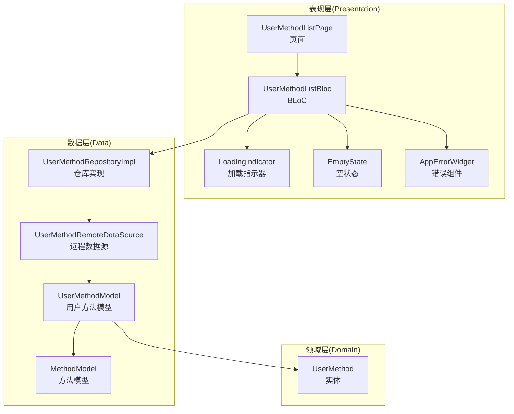
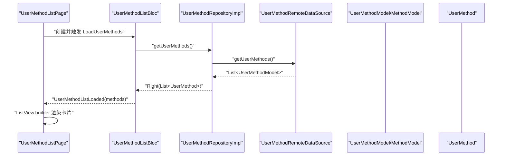
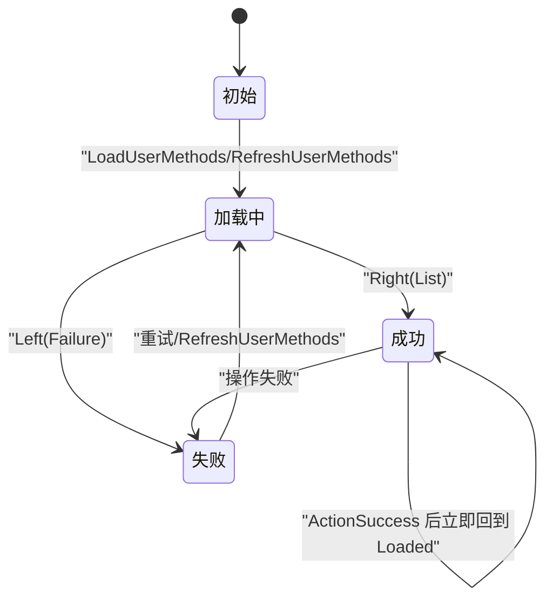
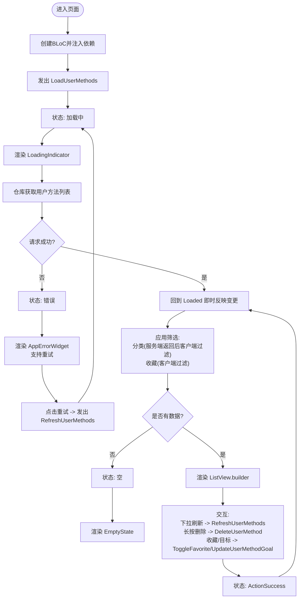
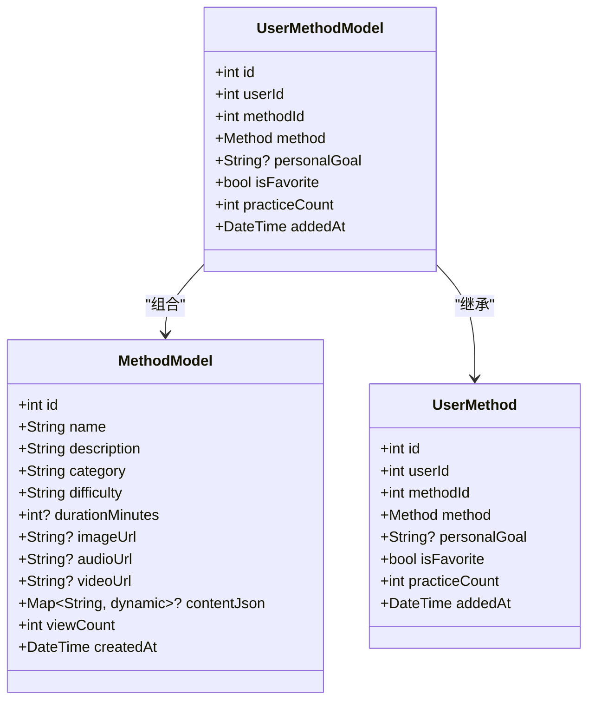
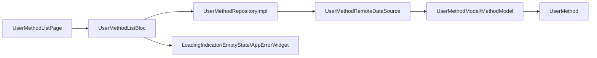

# 用户方法列表表现层

<cite>
**本文引用的文件**
- [user_method_list_bloc.dart](file://flutter_app/lib/presentation/user_methods/bloc/user_method_list_bloc.dart)
- [user_method_list_event.dart](file://flutter_app/lib/presentation/user_methods/bloc/user_method_list_event.dart)
- [user_method_list_state.dart](file://flutter_app/lib/presentation/user_methods/bloc/user_method_list_state.dart)
- [user_method_list_page.dart](file://flutter_app/lib/presentation/user_methods/pages/user_method_list_page.dart)
- [user_method_remote_data_source.dart](file://flutter_app/lib/data/datasources/remote/user_method_remote_data_source.dart)
- [user_method_repository_impl.dart](file://flutter_app/lib/data/repositories/user_method_repository_impl.dart)
- [user_method_model.dart](file://flutter_app/lib/data/models/user_method_model.dart)
- [method_model.dart](file://flutter_app/lib/data/models/method_model.dart)
- [user_method.dart](file://flutter_app/lib/domain/entities/user_method.dart)
- [method_card.dart](file://flutter_app/lib/presentation/widgets/method_card.dart)
- [loading_indicator.dart](file://flutter_app/lib/presentation/widgets/loading_indicator.dart)
- [empty_state.dart](file://flutter_app/lib/presentation/widgets/empty_state.dart)
- [error_widget.dart](file://flutter_app/lib/presentation/widgets/error_widget.dart)
</cite>

## 目录
1. [简介](#简介)
2. [项目结构](#项目结构)
3. [核心组件](#核心组件)
4. [架构总览](#架构总览)
5. [详细组件分析](#详细组件分析)
6. [依赖关系分析](#依赖关系分析)
7. [性能与体验优化](#性能与体验优化)
8. [故障排查指南](#故障排查指南)
9. [结论](#结论)

## 简介
本节聚焦“用户方法列表”在表现层的实现机制，围绕以下目标展开：
- 解析 user_method_list_bloc 如何获取用户收藏或常用的心理调节方法数据，并管理加载、刷新与错误状态。
- 分析 user_method_list_page.dart 的界面布局、方法卡片渲染逻辑，以及下拉刷新、上拉加载更多等交互实现。
- 结合代码示例说明该页面如何与其他模块（如方法模块）共享 UI 组件与数据模型，确保视觉与交互一致性。
- 提供性能与体验优化建议，如列表缓存策略、骨架屏使用、无数据状态提示等。

## 项目结构
用户方法列表功能位于 Flutter 应用的展示层（presentation），采用 BLoC 模式组织状态管理，数据流自上而下通过 Repository -> Remote DataSource -> Model -> Entity，最终由页面消费状态进行渲染。

图表来源
- [user_method_list_page.dart](file://flutter_app/lib/presentation/user_methods/pages/user_method_list_page.dart#L1-L136)
- [user_method_list_bloc.dart](file://flutter_app/lib/presentation/user_methods/bloc/user_method_list_bloc.dart#L1-L192)
- [user_method_repository_impl.dart](file://flutter_app/lib/data/repositories/user_method_repository_impl.dart#L1-L84)
- [user_method_remote_data_source.dart](file://flutter_app/lib/data/datasources/remote/user_method_remote_data_source.dart#L1-L86)
- [user_method_model.dart](file://flutter_app/lib/data/models/user_method_model.dart#L1-L89)
- [method_model.dart](file://flutter_app/lib/data/models/method_model.dart#L1-L54)
- [user_method.dart](file://flutter_app/lib/domain/entities/user_method.dart#L1-L59)

章节来源
- [user_method_list_page.dart](file://flutter_app/lib/presentation/user_methods/pages/user_method_list_page.dart#L1-L136)
- [user_method_list_bloc.dart](file://flutter_app/lib/presentation/user_methods/bloc/user_method_list_bloc.dart#L1-L192)

## 核心组件
- 页面组件：UserMethodListPage 作为入口，负责初始化 BLoC 与依赖注入，并触发首次加载。
- BLoC：UserMethodListBloc 处理加载、刷新、筛选、收藏切换、目标更新、删除等事件，维护 Loading/Error/Loaded/ActionSuccess 状态。
- 数据模型：UserMethodModel/MethodModel 将后端 JSON 映射为领域实体 UserMethod/Method。
- 仓库与数据源：UserMethodRepositoryImpl 通过 UserMethodRemoteDataSource 调用后端接口，返回 Either<Failure, T>。
- UI 组件：LoadingIndicator、EmptyState、AppErrorWidget 提供一致的加载、空状态与错误反馈；方法卡片复用方法模块的 MethodCard 组件。

章节来源
- [user_method_list_page.dart](file://flutter_app/lib/presentation/user_methods/pages/user_method_list_page.dart#L1-L136)
- [user_method_list_bloc.dart](file://flutter_app/lib/presentation/user_methods/bloc/user_method_list_bloc.dart#L1-L192)
- [user_method_repository_impl.dart](file://flutter_app/lib/data/repositories/user_method_repository_impl.dart#L1-L84)
- [user_method_remote_data_source.dart](file://flutter_app/lib/data/datasources/remote/user_method_remote_data_source.dart#L1-L86)
- [user_method_model.dart](file://flutter_app/lib/data/models/user_method_model.dart#L1-L89)
- [method_model.dart](file://flutter_app/lib/data/models/method_model.dart#L1-L54)
- [user_method.dart](file://flutter_app/lib/domain/entities/user_method.dart#L1-L59)
- [loading_indicator.dart](file://flutter_app/lib/presentation/widgets/loading_indicator.dart#L1-L196)
- [empty_state.dart](file://flutter_app/lib/presentation/widgets/empty_state.dart#L1-L171)
- [error_widget.dart](file://flutter_app/lib/presentation/widgets/error_widget.dart#L1-L170)

## 架构总览
用户方法列表的端到端流程如下：
- 页面初始化时创建 BLoC 并注入依赖，随后发出 LoadUserMethods 事件。
- BLoC 调用仓库 getUserMethods()，仓库通过远程数据源发起网络请求。
- 远程数据源将响应转换为 UserMethodModel 列表，再映射为领域实体 UserMethod。
- BLoC 基于结果发射 UserMethodListLoaded 或 UserMethodListError 状态。
- 页面根据状态渲染 LoadingIndicator、AppErrorWidget 或 EmptyState，并以 ListView.builder 渲染方法卡片。

图表来源
- [user_method_list_page.dart](file://flutter_app/lib/presentation/user_methods/pages/user_method_list_page.dart#L18-L33)
- [user_method_list_bloc.dart](file://flutter_app/lib/presentation/user_methods/bloc/user_method_list_bloc.dart#L21-L34)
- [user_method_repository_impl.dart](file://flutter_app/lib/data/repositories/user_method_repository_impl.dart#L14-L26)
- [user_method_remote_data_source.dart](file://flutter_app/lib/data/datasources/remote/user_method_remote_data_source.dart#L12-L21)
- [user_method_model.dart](file://flutter_app/lib/data/models/user_method_model.dart#L18-L43)
- [method_model.dart](file://flutter_app/lib/data/models/method_model.dart#L20-L37)
- [user_method.dart](file://flutter_app/lib/domain/entities/user_method.dart#L1-L59)

## 详细组件分析

### BLoC 状态机与事件处理
- 状态类型：
  - UserMethodListInitial：初始态
  - UserMethodListLoading：加载中
  - UserMethodListLoaded：加载完成，包含方法列表、当前分类、是否达到最大值标记
  - UserMethodListError：错误态，携带错误消息
  - UserMethodActionSuccess：操作成功态，携带提示消息与最新方法列表
- 事件类型：
  - LoadUserMethods：首次加载
  - RefreshUserMethods：下拉刷新
  - FilterUserMethodsByCategory：按分类筛选（服务端返回全量后客户端过滤）
  - ToggleFavorite：切换收藏
  - UpdateUserMethodGoal：更新个人目标
  - DeleteUserMethod：删除方法
- 关键行为：
  - 加载/刷新：调用仓库 getUserMethods()，成功则发射 Loaded，失败则发射 Error。
  - 分类筛选：先加载全量，再在内存中按 Method.category 过滤。
  - 收藏/目标更新/删除：调用仓库 updateUserMethod()/deleteUserMethod()，成功后局部更新列表并发射 ActionSuccess，随后立即回到 Loaded 以即时反映变更。
  - 错误处理：统一通过 dartz 的 Either 返回 Failure，BLoC 在 UI 层以 AppErrorWidget 展示并支持重试。

图表来源
- [user_method_list_state.dart](file://flutter_app/lib/presentation/user_methods/bloc/user_method_list_state.dart#L1-L145)
- [user_method_list_event.dart](file://flutter_app/lib/presentation/user_methods/bloc/user_method_list_event.dart#L1-L127)
- [user_method_list_bloc.dart](file://flutter_app/lib/presentation/user_methods/bloc/user_method_list_bloc.dart#L21-L192)

章节来源
- [user_method_list_state.dart](file://flutter_app/lib/presentation/user_methods/bloc/user_method_list_state.dart#L1-L145)
- [user_method_list_event.dart](file://flutter_app/lib/presentation/user_methods/bloc/user_method_list_event.dart#L1-L127)
- [user_method_list_bloc.dart](file://flutter_app/lib/presentation/user_methods/bloc/user_method_list_bloc.dart#L1-L192)

### 页面布局与交互实现
- 布局结构：
  - AppBar 标题“我的方法”
  - 顶部筛选标签栏（全部、收藏、焦虑缓解、睡眠改善、情绪管理）
  - 中部主体为 BlocConsumer，根据状态渲染 LoadingIndicator、AppErrorWidget、EmptyState 或 ListView
  - 底部浮动按钮跳转至“方法发现”（首页第一个 Tab）
- 下拉刷新：
  - 使用 RefreshIndicator 包裹 ListView，触发 RefreshUserMethods 事件
- 上拉加载更多：
  - 当前实现未见分页加载逻辑，UserMethodListLoaded 中 hasReachedMax 默认为 false，未在 UI 中使用
- 方法卡片渲染：
  - 每个卡片包含：标题、收藏按钮、个人目标徽章、练习次数与添加时间统计、编辑目标与开始练习按钮
  - 长按显示删除确认对话框
  - 点击卡片跳转到方法详情页
- 筛选逻辑：
  - “收藏”在客户端实现，通过 _showFavoritesOnly 控制，对当前 methods 再次过滤
  - 其他分类通过 FilterUserMethodsByCategory 发送到 BLoC，BLoC 再次加载全量后过滤

图表来源
- [user_method_list_page.dart](file://flutter_app/lib/presentation/user_methods/pages/user_method_list_page.dart#L18-L136)
- [user_method_list_page.dart](file://flutter_app/lib/presentation/user_methods/pages/user_method_list_page.dart#L138-L432)
- [user_method_list_bloc.dart](file://flutter_app/lib/presentation/user_methods/bloc/user_method_list_bloc.dart#L21-L192)

章节来源
- [user_method_list_page.dart](file://flutter_app/lib/presentation/user_methods/pages/user_method_list_page.dart#L1-L432)

### 数据模型与实体映射
- UserMethodModel/MethodModel：
  - 提供 fromJson()/toJson()，将后端 JSON 映射为领域实体
  - UserMethodModel 引入 MethodModel，形成“用户方法 -> 方法”的关联
- UserMethod 实体：
  - 包含 id、userId、methodId、method、personalGoal、isFavorite、practiceCount、addedAt 等字段
  - 使用 Equatable，便于 BLoC 状态比较与局部更新

图表来源
- [user_method.dart](file://flutter_app/lib/domain/entities/user_method.dart#L1-L59)
- [method_model.dart](file://flutter_app/lib/data/models/method_model.dart#L1-L54)
- [user_method_model.dart](file://flutter_app/lib/data/models/user_method_model.dart#L1-L89)

章节来源
- [user_method_model.dart](file://flutter_app/lib/data/models/user_method_model.dart#L1-L89)
- [method_model.dart](file://flutter_app/lib/data/models/method_model.dart#L1-L54)
- [user_method.dart](file://flutter_app/lib/domain/entities/user_method.dart#L1-L59)

### 与方法模块的 UI 组件共享
- 方法卡片复用方法模块的 MethodCard 组件，保证风格一致
- UserMethodListPage 自身实现了个人方法卡片的布局与交互，包括收藏、目标、统计、操作按钮等

章节来源
- [method_card.dart](file://flutter_app/lib/presentation/widgets/method_card.dart#L1-L120)
- [user_method_list_page.dart](file://flutter_app/lib/presentation/user_methods/pages/user_method_list_page.dart#L195-L324)

## 依赖关系分析
- 页面依赖 BLoC，BLoC 依赖仓库，仓库依赖远程数据源，数据源依赖 DioClient。
- 模型层依赖领域实体，形成清晰的数据流转链路。
- UI 组件（LoadingIndicator、EmptyState、AppErrorWidget）被多处状态分支复用，提升一致性与可维护性。

图表来源
- [user_method_list_page.dart](file://flutter_app/lib/presentation/user_methods/pages/user_method_list_page.dart#L1-L136)
- [user_method_list_bloc.dart](file://flutter_app/lib/presentation/user_methods/bloc/user_method_list_bloc.dart#L1-L192)
- [user_method_repository_impl.dart](file://flutter_app/lib/data/repositories/user_method_repository_impl.dart#L1-L84)
- [user_method_remote_data_source.dart](file://flutter_app/lib/data/datasources/remote/user_method_remote_data_source.dart#L1-L86)
- [user_method_model.dart](file://flutter_app/lib/data/models/user_method_model.dart#L1-L89)
- [user_method.dart](file://flutter_app/lib/domain/entities/user_method.dart#L1-L59)
- [loading_indicator.dart](file://flutter_app/lib/presentation/widgets/loading_indicator.dart#L1-L196)
- [empty_state.dart](file://flutter_app/lib/presentation/widgets/empty_state.dart#L1-L171)
- [error_widget.dart](file://flutter_app/lib/presentation/widgets/error_widget.dart#L1-L170)

章节来源
- [user_method_list_page.dart](file://flutter_app/lib/presentation/user_methods/pages/user_method_list_page.dart#L1-L136)
- [user_method_list_bloc.dart](file://flutter_app/lib/presentation/user_methods/bloc/user_method_list_bloc.dart#L1-L192)
- [user_method_repository_impl.dart](file://flutter_app/lib/data/repositories/user_method_repository_impl.dart#L1-L84)
- [user_method_remote_data_source.dart](file://flutter_app/lib/data/datasources/remote/user_method_remote_data_source.dart#L1-L86)

## 性能与体验优化
- 列表缓存策略
  - 建议在仓库层引入本地缓存（如 SharedPrefs 或数据库），在首次加载后缓存用户方法列表，后续直接返回缓存并在后台刷新，减少网络请求与闪烁。
  - 对于分类筛选，可在缓存中保留全量数据，避免重复请求。
- 骨架屏与占位符
  - 在加载阶段使用 ShimmerPlaceholder 或 SkeletonPlaceholder，降低感知等待时间，提升流畅度。
  - 可在列表项中为封面图、标题、描述等关键元素添加骨架屏，增强加载体验。
- 无数据状态提示
  - EmptyState 已提供通用空状态组件，建议针对“收藏夹为空”、“无方法”等场景使用 NoFavoritesState/NoMethodsState，引导用户去发现方法。
- 交互一致性
  - 所有操作成功后使用 SnackBar 或 ActionSuccess 状态即时反馈，保持一致的交互节奏。
- 上拉加载更多
  - 当前未实现分页加载，建议在仓库层支持分页参数，UI 中监听 ListView 的滚动边界，到达底部时发出 LoadMore 事件，结合 UserMethodListLoaded.hasReachedMax 控制是否还有更多数据。
- 错误处理
  - AppErrorWidget 提供重试能力，建议在网络错误与服务器错误时区分提示文案与图标，提升可读性与可操作性。

[本节为通用优化建议，不直接分析具体文件，故无章节来源]

## 故障排查指南
- 网络异常
  - 现象：出现 NetworkException，UI 展示 NetworkErrorWidget 或 AppErrorWidget
  - 排查：检查 DioClient 配置、网络连通性、代理设置
- 服务器异常
  - 现象：ServerException，UI 展示 ServerErrorWidget
  - 排查：查看后端返回的状态码与 message，定位接口问题
- 未授权
  - 现象：UnauthorizedErrorWidget
  - 排查：检查登录状态与 Token 有效性，必要时引导重新登录
- 列表空白
  - 现象：EmptyState
  - 排查：确认用户是否已添加方法；若筛选条件导致为空，调整筛选或重置为“全部”

章节来源
- [user_method_remote_data_source.dart](file://flutter_app/lib/data/datasources/remote/user_method_remote_data_source.dart#L71-L86)
- [user_method_repository_impl.dart](file://flutter_app/lib/data/repositories/user_method_repository_impl.dart#L14-L26)
- [error_widget.dart](file://flutter_app/lib/presentation/widgets/error_widget.dart#L66-L123)
- [empty_state.dart](file://flutter_app/lib/presentation/widgets/empty_state.dart#L1-L171)

## 结论
用户方法列表在表现层通过 BLoC 管理状态，结合统一的 UI 组件与清晰的数据模型映射，实现了加载、筛选、收藏、目标编辑与删除等完整交互闭环。当前实现具备良好的扩展性与一致性，建议在仓库层引入缓存与分页机制，并完善骨架屏与空状态提示，进一步提升性能与用户体验。