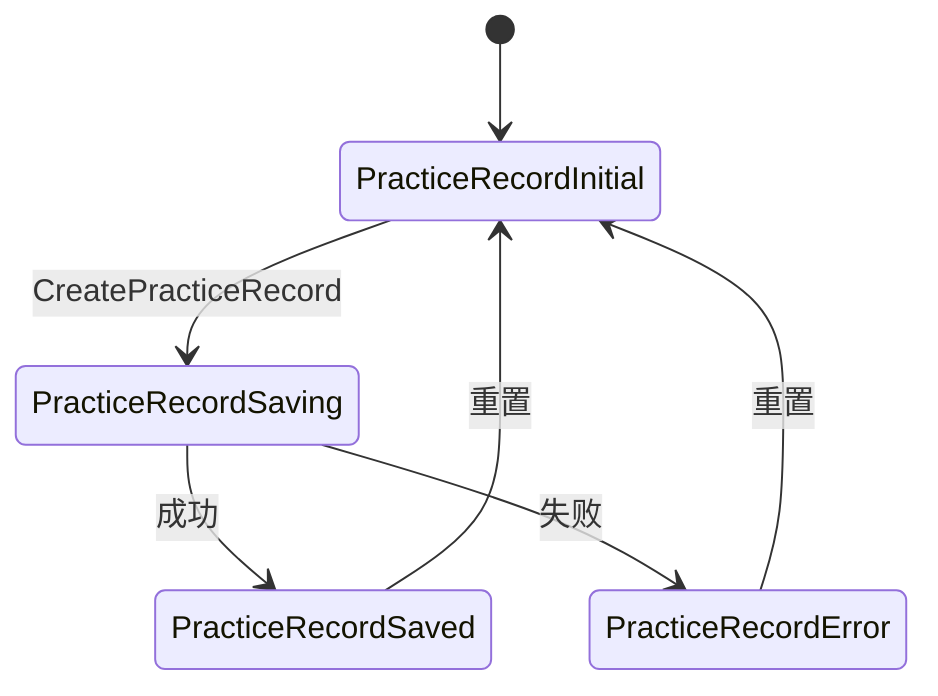
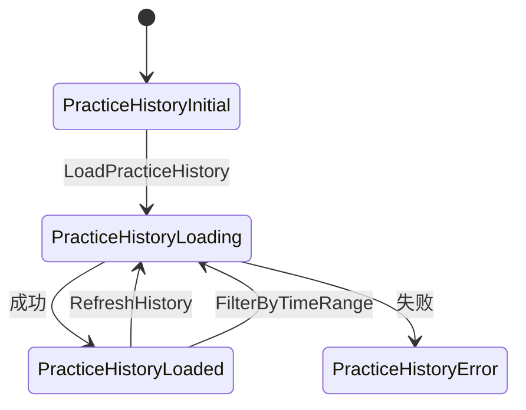
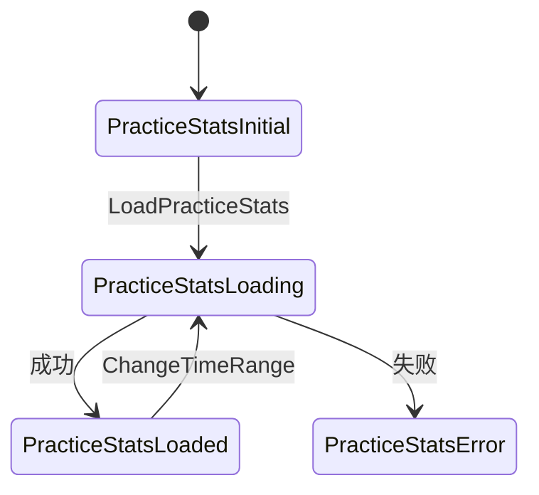
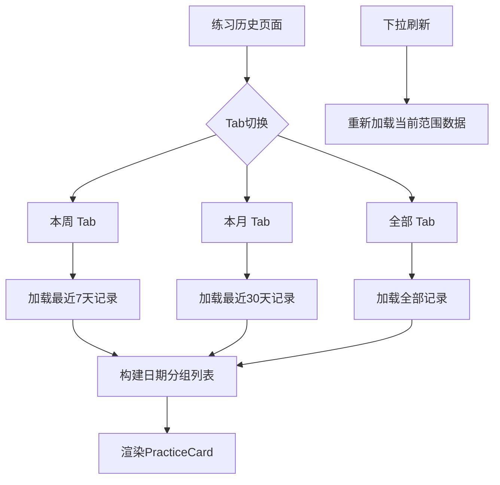

# 练习模块表现层

<cite>
**本文档引用的文件**  
- [practice_record_bloc.dart](file://flutter_app/lib/presentation/practice/bloc/practice_record_bloc.dart)
- [practice_history_bloc.dart](file://flutter_app/lib/presentation/practice/bloc/practice_history_bloc.dart)
- [practice_stats_bloc.dart](file://flutter_app/lib/presentation/practice/bloc/practice_stats_bloc.dart)
- [practice_record_create_page.dart](file://flutter_app/lib/presentation/practice/pages/practice_record_create_page.dart)
- [practice_history_page.dart](file://flutter_app/lib/presentation/practice/pages/practice_history_page.dart)
- [practice_stats_page.dart](file://flutter_app/lib/presentation/practice/pages/practice_stats_page.dart)
- [practice_record_event.dart](file://flutter_app/lib/presentation/practice/bloc/practice_record_event.dart)
- [practice_record_state.dart](file://flutter_app/lib/presentation/practice/bloc/practice_record_state.dart)
- [practice_history_event.dart](file://flutter_app/lib/presentation/practice/bloc/practice_history_event.dart)
- [practice_history_state.dart](file://flutter_app/lib/presentation/practice/bloc/practice_history_state.dart)
- [practice_stats_event.dart](file://flutter_app/lib/presentation/practice/bloc/practice_stats_event.dart)
- [practice_stats_state.dart](file://flutter_app/lib/presentation/practice/bloc/practice_stats_state.dart)
- [practice_record.dart](file://flutter_app/lib/domain/entities/practice_record.dart)
- [practice_stats.dart](file://flutter_app/lib/domain/entities/practice_stats.dart)
- [date_formatter.dart](file://flutter_app/lib/core/utils/date_formatter.dart)
- [practice_card.dart](file://flutter_app/lib/presentation/widgets/practice_card.dart)
</cite>

## 目录
1. [介绍](#介绍)
2. [核心组件](#核心组件)
3. [状态管理机制](#状态管理机制)
4. [练习记录创建页面](#练习记录创建页面)
5. [练习历史页面](#练习历史页面)
6. [练习统计页面](#练习统计页面)
7. [关键技术点](#关键技术点)
8. [常见问题排查指南](#常见问题排查指南)
9. [结论](#结论)

## 介绍
本项目中的练习模块表现层实现了练习记录创建、历史查看和统计分析三大核心功能。系统采用BLoC（Business Logic Component）架构模式，通过`practice_record_bloc`、`practice_history_bloc`和`practice_stats_bloc`三个独立的状态管理组件分别处理不同场景下的业务逻辑与UI状态流转。各功能页面通过响应式编程方式监听BLoC状态变化，实现高效、可预测的用户界面更新。

## 核心组件

练习模块表现层由三大核心BLoC组件构成：`practice_record_bloc`负责管理单次练习记录的创建流程；`practice_history_bloc`用于加载并展示用户过往练习数据；`practice_stats_bloc`则专注于聚合练习数据并驱动统计图表渲染。这些组件均遵循单一职责原则，通过清晰的事件-状态机制与UI层解耦，确保了代码的可维护性和可测试性。

**本节引用文件**
- [practice_record_bloc.dart](file://flutter_app/lib/presentation/practice/bloc/practice_record_bloc.dart)
- [practice_history_bloc.dart](file://flutter_app/lib/presentation/practice/bloc/practice_history_bloc.dart)
- [practice_stats_bloc.dart](file://flutter_app/lib/presentation/practice/bloc/practice_stats_bloc.dart)

## 状态管理机制

### 练习记录BLoC状态流转
`practice_record_bloc`通过`PracticeRecordEvent`事件触发状态变更，其状态机包含初始状态（`PracticeRecordInitial`）、保存中（`PracticeRecordSaving`）、保存成功（`PracticeRecordSaved`）和保存失败（`PracticeRecordError`）四种状态。当用户提交练习记录时，BLoC会发出`CreatePracticeRecord`事件，触发异步保存操作，并根据结果更新为相应状态，UI层据此显示加载指示器、成功提示或错误信息。



**图示来源**
- [practice_record_bloc.dart](file://flutter_app/lib/presentation/practice/bloc/practice_record_bloc.dart)
- [practice_record_event.dart](file://flutter_app/lib/presentation/practice/bloc/practice_record_event.dart)
- [practice_record_state.dart](file://flutter_app/lib/presentation/practice/bloc/practice_record_state.dart)

### 练习历史BLoC状态管理
`practice_history_bloc`管理练习历史数据的加载状态，包含初始（`PracticeHistoryInitial`）、加载中（`PracticeHistoryLoading`）、加载成功（`PracticeHistoryLoaded`）和加载失败（`PracticeHistoryError`）四种状态。该BLoC支持按时间范围筛选和刷新操作，能够在不同Tab切换时动态加载对应时间段的练习记录，并实时计算统计指标如总次数和本周练习数。



**图示来源**
- [practice_history_bloc.dart](file://flutter_app/lib/presentation/practice/bloc/practice_history_bloc.dart)
- [practice_history_event.dart](file://flutter_app/lib/presentation/practice/bloc/practice_history_event.dart)
- [practice_history_state.dart](file://flutter_app/lib/presentation/practice/bloc/practice_history_state.dart)

### 练习统计BLoC数据驱动
`practice_stats_bloc`负责统计功能的状态管理，其状态包括初始（`PracticeStatsInitial`）、加载中（`PracticeStatsLoading`）、加载成功（`PracticeStatsLoaded`）和加载失败（`PracticeStatsError`）。该BLoC能够根据用户选择的时间范围（7天、30天、90天等）请求相应的聚合数据，并将`PracticeStats`实体传递给UI层用于渲染统计图表和关键指标卡片。



**图示来源**
- [practice_stats_bloc.dart](file://flutter_app/lib/presentation/practice/bloc/practice_stats_bloc.dart)
- [practice_stats_event.dart](file://flutter_app/lib/presentation/practice/bloc/practice_stats_event.dart)
- [practice_stats_state.dart](file://flutter_app/lib/presentation/practice/bloc/practice_stats_state.dart)

## 练习记录创建页面

`practice_record_create_page.dart`实现了练习记录的创建界面，采用`BlocProvider`注入`PracticeRecordBloc`实例。页面包含方法选择下拉框、练习时长滑块、心理状态评分滑动条和备注输入框等交互元素。用户操作通过`setState`更新本地表单状态，提交时验证表单并分发`CreatePracticeRecord`事件。`BlocConsumer`监听状态变化，在成功创建后显示SnackBar提示并返回上一页。

页面通过`_PracticeRecordCreateView`内部类实现具体UI构建，使用`Form`组件管理表单验证逻辑。计时器控制通过`Slider`组件实现，情绪选择交互则通过两个独立的滑动条分别采集练习前后的情绪评分，滑块值实时显示在标签中，提供良好的用户体验。

**本节引用文件**
- [practice_record_create_page.dart](file://flutter_app/lib/presentation/practice/pages/practice_record_create_page.dart)
- [practice_record_bloc.dart](file://flutter_app/lib/presentation/practice/bloc/practice_record_bloc.dart)

## 练习历史页面

`practice_history_page.dart`采用`TabBar`+`TabBarView`组合实现多标签页导航，包含“本周”、“本月”和“全部”三个时间维度的练习记录展示。页面顶部设有统计卡片，显示总练习次数、本周练习次数和连续练习天数等关键指标。列表按日期分组显示，使用`RefreshIndicator`支持下拉刷新功能。

页面通过`_tabController`监听Tab切换事件，根据当前索引向`PracticeHistoryBloc`分发不同时间范围的加载请求。列表项使用`PracticeCard`组件渲染，包含练习方法、时长、心情评分和备注等信息。浮动操作按钮（FAB）链接至统计页面，实现功能间的无缝跳转。



**本节引用文件**
- [practice_history_page.dart](file://flutter_app/lib/presentation/practice/pages/practice_history_page.dart)
- [practice_history_bloc.dart](file://flutter_app/lib/presentation/practice/bloc/practice_history_bloc.dart)
- [practice_card.dart](file://flutter_app/lib/presentation/widgets/practice_card.dart)

## 练习统计页面

`practice_stats_page.dart`通过`ChoiceChip`组件实现时间范围选择器，用户可切换7天、30天、90天或全部时间范围查看统计结果。页面核心由`BlocBuilder`驱动，根据`PracticeStatsBloc`的状态展示加载指示器、错误提示或统计内容。

统计内容包括关键指标卡片（总练习次数、总时长）、心情改善度卡片和练习建议说明。指标卡片使用图标、大号数字和单位组合呈现，突出显示关键数据。心情改善度以趋势图标和绿色正数显示，直观反映练习效果。页面虽未集成复杂图表库，但已预留数据接口，可通过`PracticeStats`实体中的`averageMoodImprovement`等字段轻松扩展折线图或柱状图。

```mermaid
flowchart TD
A[练习统计页面] --> B[时间范围选择]
B --> C{选择7天}
B --> D{选择30天}
B --> E{选择90天}
B --> F{选择全部}
C --> G[分发LoadPracticeStats(days:7)]
D --> H[分发LoadPracticeStats(days:30)]
E --> I[分发LoadPracticeStats(days:90)]
F --> J[分发LoadPracticeStats(days:365)]
G --> K[接收PracticeStatsLoaded状态]
H --> K
I --> K
J --> K
K --> L[渲染统计卡片]
```

**本节引用文件**
- [practice_stats_page.dart](file://flutter_app/lib/presentation/practice/pages/practice_stats_page.dart)
- [practice_stats_bloc.dart](file://flutter_app/lib/presentation/practice/bloc/practice_stats_bloc.dart)

## 关键技术点

### 复杂状态同步机制
系统采用BLoC模式实现跨组件状态同步。通过`BlocProvider`在页面层级提供BLoC实例，多个子组件可通过`context.read<Bloc>()`或`BlocBuilder`共享同一状态源。事件分发与状态更新完全异步，确保UI流畅性。`Equatable`库用于优化状态比较，避免不必要的UI重建。

### 时间格式化处理
`date_formatter.dart`工具类提供了全面的日期时间处理功能。`getRelativeTime`方法实现智能相对时间显示（如“刚刚”、“5分钟前”、“昨天”），`formatDate`和`formatTime`支持多种格式模板。`isToday`、`isYesterday`等辅助方法用于列表日期分组判断，确保时间信息展示的准确性和友好性。

### 图表库集成准备
尽管当前统计页面未集成图表库，但`PracticeStats`实体已定义`averageMoodImprovement`、`currentStreak`等聚合字段，为后续集成`charts_flutter`或`syncfusion_flutter_charts`等图表库奠定基础。`PracticeStatsLoaded`状态携带完整统计对象，可直接用于驱动折线图（心情改善趋势）、柱状图（练习频次）等可视化组件。

**本节引用文件**
- [date_formatter.dart](file://flutter_app/lib/core/utils/date_formatter.dart)
- [practice_stats.dart](file://flutter_app/lib/domain/entities/practice_stats.dart)
- [practice_stats_bloc.dart](file://flutter_app/lib/presentation/practice/bloc/practice_stats_bloc.dart)

## 常见问题排查指南

### 数据未及时更新
若练习记录提交后历史页面未刷新，请检查`BlocProvider`作用域是否正确，确保`PracticeHistoryBloc`实例在需要刷新的组件树范围内。确认事件分发后是否正确调用`emit`更新状态，并验证API响应是否成功返回数据。

### 统计偏差问题
统计结果不准确可能源于时间范围计算错误。请检查`practice_history_bloc.dart`中`_onFilterByTimeRange`方法的时间边界处理逻辑，确保`DateTime.now().subtract(Duration(days: X))`计算正确。验证后端返回的练习记录时间戳时区一致性。

### 页面卡顿现象
列表滚动卡顿通常由过度重建引起。确保`PracticeCard`等列表项组件正确使用`const`构造函数，并在`ListView.builder`中合理利用缓存机制。检查`BlocBuilder`的`buildWhen`条件，避免不必要的重建。对于大数据集，考虑实现分页加载。

**本节引用文件**
- [practice_history_bloc.dart](file://flutter_app/lib/presentation/practice/bloc/practice_history_bloc.dart)
- [practice_history_page.dart](file://flutter_app/lib/presentation/practice/pages/practice_history_page.dart)
- [practice_card.dart](file://flutter_app/lib/presentation/widgets/practice_card.dart)

## 结论
练习模块表现层通过BLoC架构实现了清晰的状态管理与UI分离，三大功能模块各司其职又协同工作。`practice_record_bloc`精准控制单次练习的状态流转，`practice_history_bloc`高效管理历史数据的加载与展示，`practice_stats_bloc`为数据可视化提供坚实基础。结合合理的UI组件设计和工具类支持，系统具备良好的可维护性和扩展性，为用户提供了流畅的练习记录体验。