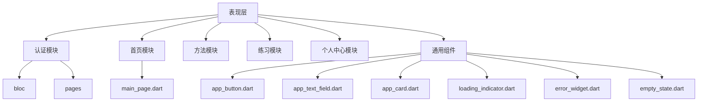
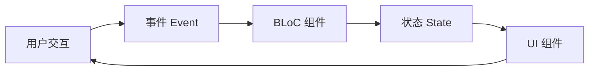
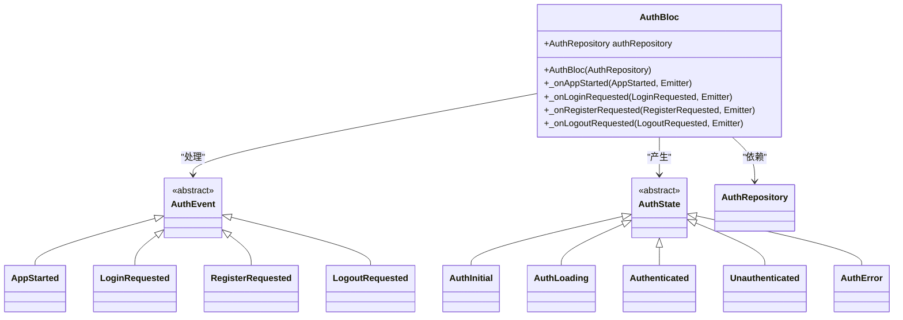
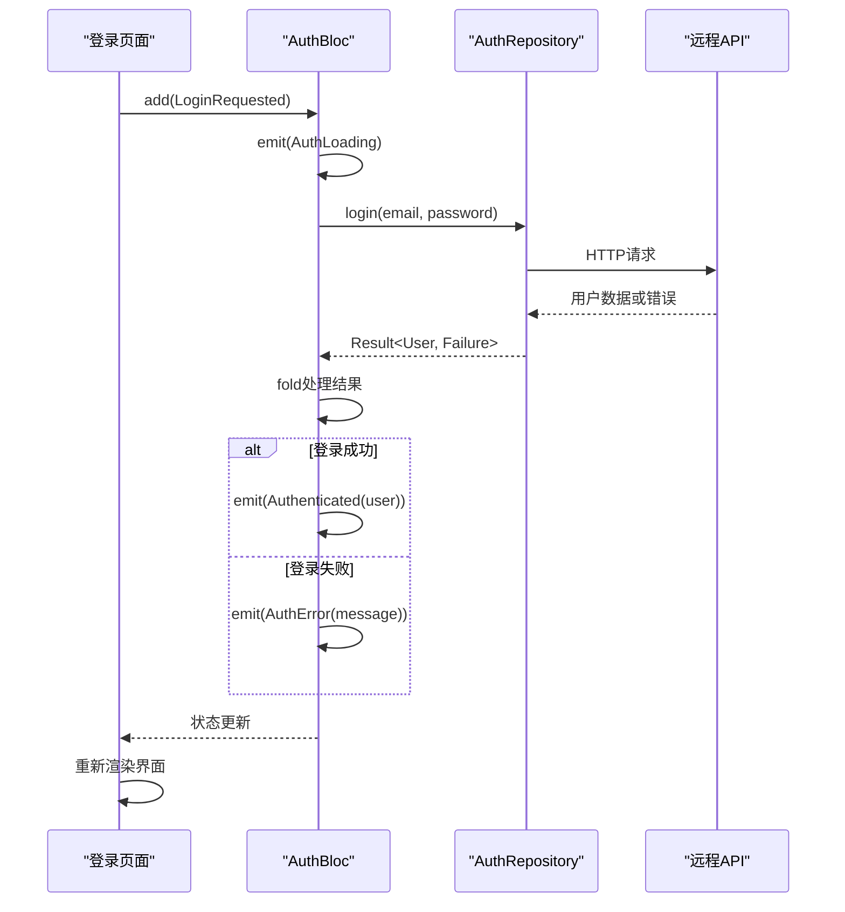
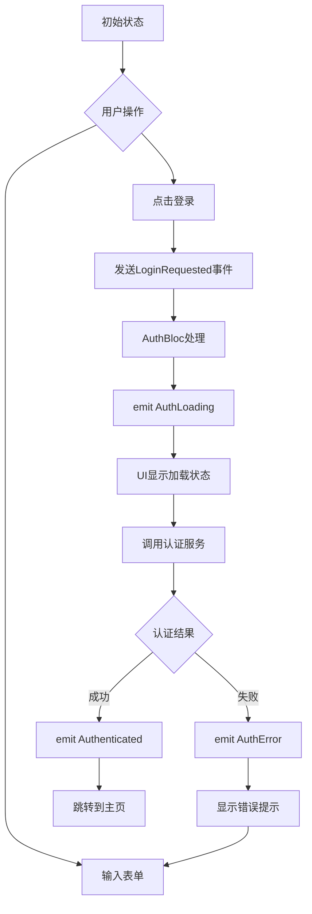
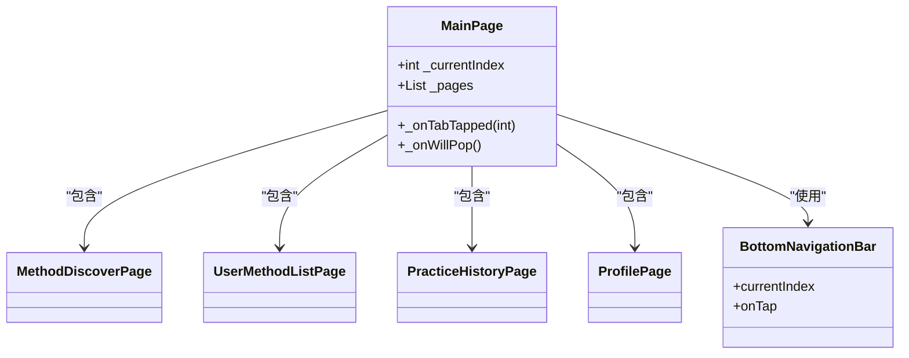
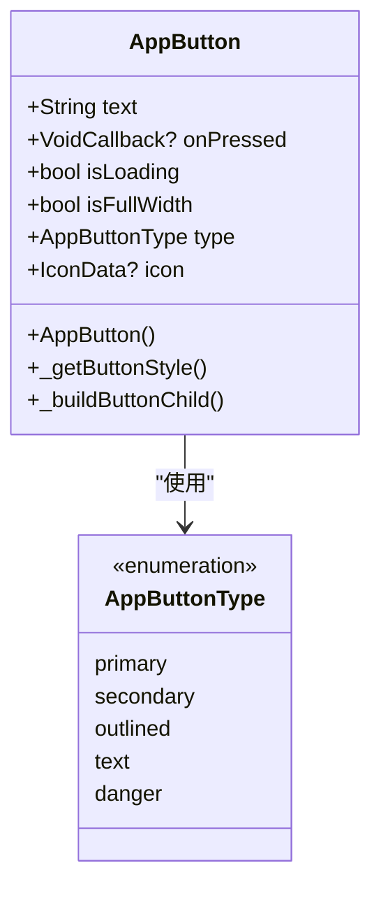
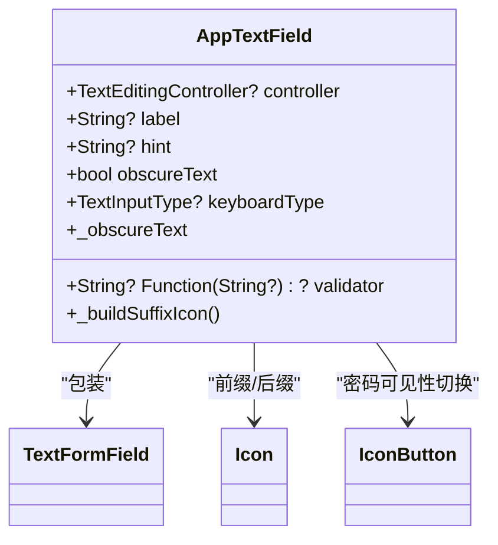
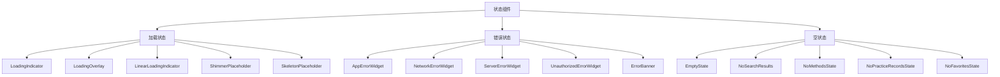
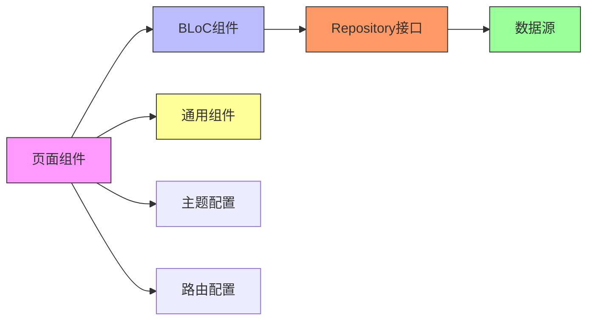

# 表现层架构

<cite>
**本文档引用文件**  
- [auth_bloc.dart](file://flutter_app/lib/presentation/auth/bloc/auth_bloc.dart)
- [auth_event.dart](file://flutter_app/lib/presentation/auth/bloc/auth_event.dart)
- [auth_state.dart](file://flutter_app/lib/presentation/auth/bloc/auth_state.dart)
- [login_page.dart](file://flutter_app/lib/presentation/auth/pages/login_page.dart)
- [main_page.dart](file://flutter_app/lib/presentation/home/main_page.dart)
- [app_button.dart](file://flutter_app/lib/presentation/widgets/app_button.dart)
- [app_text_field.dart](file://flutter_app/lib/presentation/widgets/app_text_field.dart)
- [app_card.dart](file://flutter_app/lib/presentation/widgets/app_card.dart)
- [loading_indicator.dart](file://flutter_app/lib/presentation/widgets/loading_indicator.dart)
- [error_widget.dart](file://flutter_app/lib/presentation/widgets/error_widget.dart)
- [empty_state.dart](file://flutter_app/lib/presentation/widgets/empty_state.dart)
- [theme.dart](file://flutter_app/lib/config/theme.dart)
- [routes.dart](file://flutter_app/lib/config/routes.dart)
- [main.dart](file://flutter_app/lib/main.dart)
</cite>

## 目录
1. [简介](#简介)
2. [项目结构](#项目结构)
3. [核心组件](#核心组件)
4. [架构概览](#架构概览)
5. [详细组件分析](#详细组件分析)
6. [依赖分析](#依赖分析)
7. [性能考虑](#性能考虑)
8. [故障排除指南](#故障排除指南)
9. [结论](#结论)

## 简介
本文档深入解析nian移动端表现层的实现机制，重点阐述基于BLoC模式的状态管理架构。文档将详细说明认证模块中事件与状态的流转机制，分析各页面组件如何订阅BLoC状态并响应式渲染界面，描述通用UI组件的设计原则与复用策略，并结合实际代码示例展示页面与BLoC之间的依赖注入与生命周期管理。

## 项目结构
nian移动端应用采用分层架构设计，表现层位于`flutter_app/lib/presentation`目录下，按照功能模块组织代码。每个模块包含`bloc`状态管理组件和`pages`页面组件，同时提供可复用的通用UI组件。

**图示来源**
- [flutter_app/lib/presentation](file://flutter_app/lib/presentation)

**本节来源**
- [flutter_app/lib/presentation](file://flutter_app/lib/presentation)

## 核心组件
表现层的核心组件包括基于BLoC模式的状态管理器、页面组件和可复用的UI组件。BLoC组件负责管理应用状态和业务逻辑，页面组件负责UI展示和用户交互，而通用组件则提供一致的视觉体验和交互模式。

**本节来源**
- [auth_bloc.dart](file://flutter_app/lib/presentation/auth/bloc/auth_bloc.dart)
- [login_page.dart](file://flutter_app/lib/presentation/auth/pages/login_page.dart)
- [app_button.dart](file://flutter_app/lib/presentation/widgets/app_button.dart)

## 架构概览
nian应用采用BLoC（Business Logic Component）模式进行状态管理，实现了业务逻辑与UI展示的分离。整个架构遵循清晰的单向数据流：用户交互触发事件（Event），BLoC处理事件并转换状态（State），UI组件监听状态变化并重新渲染。

**图示来源**
- [auth_bloc.dart](file://flutter_app/lib/presentation/auth/bloc/auth_bloc.dart)
- [login_page.dart](file://flutter_app/lib/presentation/auth/pages/login_page.dart)

## 详细组件分析

### BLoC状态管理架构分析
BLoC模式是nian应用表现层的核心架构，通过事件驱动的方式管理应用状态。在认证模块中，`AuthBloc`负责处理所有与用户认证相关的业务逻辑。

#### 认证BLoC类图

**图示来源**
- [auth_bloc.dart](file://flutter_app/lib/presentation/auth/bloc/auth_bloc.dart)
- [auth_event.dart](file://flutter_app/lib/presentation/auth/bloc/auth_event.dart)
- [auth_state.dart](file://flutter_app/lib/presentation/auth/bloc/auth_state.dart)

#### 认证流程序列图

**图示来源**
- [auth_bloc.dart](file://flutter_app/lib/presentation/auth/bloc/auth_bloc.dart)
- [login_page.dart](file://flutter_app/lib/presentation/auth/pages/login_page.dart)

**本节来源**
- [auth_bloc.dart](file://flutter_app/lib/presentation/auth/bloc/auth_bloc.dart)
- [auth_event.dart](file://flutter_app/lib/presentation/auth/bloc/auth_event.dart)
- [auth_state.dart](file://flutter_app/lib/presentation/auth/bloc/auth_state.dart)

### 页面组件分析
页面组件负责UI展示和用户交互，通过`BlocConsumer`或`BlocBuilder`订阅BLoC状态并响应式更新界面。

#### 登录页面状态流转

**图示来源**
- [login_page.dart](file://flutter_app/lib/presentation/auth/pages/login_page.dart)
- [auth_bloc.dart](file://flutter_app/lib/presentation/auth/bloc/auth_bloc.dart)

#### 主页面结构

**图示来源**
- [main_page.dart](file://flutter_app/lib/presentation/home/main_page.dart)

**本节来源**
- [login_page.dart](file://flutter_app/lib/presentation/auth/pages/login_page.dart)
- [main_page.dart](file://flutter_app/lib/presentation/home/main_page.dart)

### 通用UI组件设计分析
通用UI组件的设计遵循一致性、可复用性和可配置性的原则，确保应用整体视觉风格统一。

#### 按钮组件设计

**图示来源**
- [app_button.dart](file://flutter_app/lib/presentation/widgets/app_button.dart)

#### 表单输入组件设计

**图示来源**
- [app_text_field.dart](file://flutter_app/lib/presentation/widgets/app_text_field.dart)

#### 状态展示组件体系

**图示来源**
- [loading_indicator.dart](file://flutter_app/lib/presentation/widgets/loading_indicator.dart)
- [error_widget.dart](file://flutter_app/lib/presentation/widgets/error_widget.dart)
- [empty_state.dart](file://flutter_app/lib/presentation/widgets/empty_state.dart)

**本节来源**
- [app_button.dart](file://flutter_app/lib/presentation/widgets/app_button.dart)
- [app_text_field.dart](file://flutter_app/lib/presentation/widgets/app_text_field.dart)
- [app_card.dart](file://flutter_app/lib/presentation/widgets/app_card.dart)
- [loading_indicator.dart](file://flutter_app/lib/presentation/widgets/loading_indicator.dart)
- [error_widget.dart](file://flutter_app/lib/presentation/widgets/error_widget.dart)
- [empty_state.dart](file://flutter_app/lib/presentation/widgets/empty_state.dart)

## 依赖分析
表现层组件之间存在清晰的依赖关系，遵循依赖倒置原则，高层模块不依赖于低层模块，两者都依赖于抽象。

**图示来源**
- [main.dart](file://flutter_app/lib/main.dart)
- [routes.dart](file://flutter_app/lib/config/routes.dart)
- [theme.dart](file://flutter_app/lib/config/theme.dart)

**本节来源**
- [main.dart](file://flutter_app/lib/main.dart)
- [routes.dart](file://flutter_app/lib/config/routes.dart)
- [theme.dart](file://flutter_app/lib/config/theme.dart)

## 性能考虑
表现层架构在性能方面进行了多项优化：
- 使用`IndexedStack`而非`Navigator`进行底部导航切换，避免页面重建
- 通用组件采用`const`构造函数和`shouldRepaint`优化，减少不必要的重绘
- `BlocConsumer`的`listenWhen`和`buildWhen`参数用于控制监听和构建条件，避免过度重建
- 图片资源按需加载，使用适当的缓存策略

## 故障排除指南
### 常见UI问题解决方案

#### 加载状态处理
使用`LoadingOverlay`组件包裹内容，在`isLoading`为true时显示全屏遮罩，确保用户知道操作正在进行。

#### 错误处理
采用分层错误处理策略：
- 网络错误：显示`NetworkErrorWidget`，提供重试按钮
- 服务器错误：显示`ServerErrorWidget`，建议稍后重试
- 未授权错误：显示`UnauthorizedErrorWidget`，引导用户重新登录
- 业务逻辑错误：在表单中显示具体错误信息

#### 空状态展示
根据不同场景使用专门的空状态组件：
- `NoMethodsState`：当用户没有方法时
- `NoPracticeRecordsState`：当没有练习记录时
- `NoFavoritesState`：当收藏夹为空时
- `NoSearchResults`：当搜索无结果时

#### 响应式布局实现
通过`MediaQuery`获取屏幕尺寸信息，结合`LayoutBuilder`实现响应式布局。在小屏幕上使用紧凑布局，在大屏幕上利用额外空间提供更丰富的信息展示。

#### 主题适配
基于`MaterialApp`的`theme`和`darkTheme`属性实现主题适配，通过`ThemeMode.system`跟随系统设置。主题配置集中定义在`theme.dart`文件中，确保全局样式一致性。

**本节来源**
- [loading_indicator.dart](file://flutter_app/lib/presentation/widgets/loading_indicator.dart)
- [error_widget.dart](file://flutter_app/lib/presentation/widgets/error_widget.dart)
- [empty_state.dart](file://flutter_app/lib/presentation/widgets/empty_state.dart)
- [theme.dart](file://flutter_app/lib/config/theme.dart)

## 结论
nian移动端表现层采用BLoC模式构建了清晰的状态管理架构，实现了业务逻辑与UI展示的完全分离。通过事件驱动的编程模型，确保了状态流转的可预测性和可测试性。通用UI组件的设计遵循一致性原则，提高了开发效率和用户体验。整个架构具有良好的可维护性和扩展性，为应用的持续发展奠定了坚实基础。