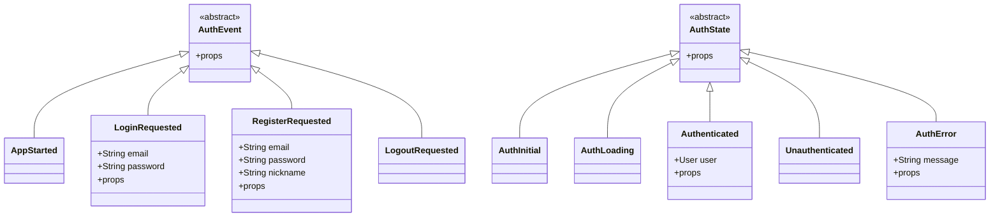

# 认证模块表现层

<cite>
**本文引用的文件**
- [flutter_app/lib/presentation/auth/bloc/auth_bloc.dart](file://flutter_app/lib/presentation/auth/bloc/auth_bloc.dart)
- [flutter_app/lib/presentation/auth/bloc/auth_event.dart](file://flutter_app/lib/presentation/auth/bloc/auth_event.dart)
- [flutter_app/lib/presentation/auth/bloc/auth_state.dart](file://flutter_app/lib/presentation/auth/bloc/auth_state.dart)
- [flutter_app/lib/presentation/auth/pages/login_page.dart](file://flutter_app/lib/presentation/auth/pages/login_page.dart)
- [flutter_app/lib/presentation/auth/pages/register_page.dart](file://flutter_app/lib/presentation/auth/pages/register_page.dart)
- [flutter_app/lib/presentation/auth/pages/splash_page.dart](file://flutter_app/lib/presentation/auth/pages/splash_page.dart)
- [flutter_app/lib/main.dart](file://flutter_app/lib/main.dart)
- [flutter_app/lib/config/routes.dart](file://flutter_app/lib/config/routes.dart)
- [flutter_app/lib/data/repositories/auth_repository_impl.dart](file://flutter_app/lib/data/repositories/auth_repository_impl.dart)
- [flutter_app/lib/domain/repositories/auth_repository.dart](file://flutter_app/lib/domain/repositories/auth_repository.dart)
- [flutter_app/lib/core/storage/secure_storage_helper.dart](file://flutter_app/lib/core/storage/secure_storage_helper.dart)
- [flutter_app/lib/presentation/widgets/app_button.dart](file://flutter_app/lib/presentation/widgets/app_button.dart)
- [flutter_app/lib/presentation/widgets/app_text_field.dart](file://flutter_app/lib/presentation/widgets/app_text_field.dart)
</cite>

## 目录
1. [简介](#简介)
2. [项目结构](#项目结构)
3. [核心组件](#核心组件)
4. [架构总览](#架构总览)
5. [详细组件分析](#详细组件分析)
6. [依赖关系分析](#依赖关系分析)
7. [性能考量](#性能考量)
8. [故障排查指南](#故障排查指南)
9. [结论](#结论)

## 简介
本文件聚焦于认证模块在表现层的实现机制，系统性解析以下内容：
- AuthBloc、AuthEvent、AuthState 的交互逻辑与状态流转
- 用户登录、注册、登出通过事件触发状态变更并驱动UI响应式更新的过程
- LoginPage、RegisterPage、SplashPage 的界面构建、状态监听与导航策略
- 表单验证、按钮禁用、加载指示、错误提示等细节实现
- 常见问题：JWT过期处理、自动登录流程、页面状态保持
- 与数据层（Repository、RemoteDataSource、SecureStorage）的集成方式

## 项目结构
认证模块位于 Flutter 应用的 presentation 层，采用 BLoC 模式组织：
- 表现层（presentation/auth）：包含 BLoC、页面与通用 UI 组件
- 数据层（data）：包含 Repository 实现与远程数据源
- 领域层（domain）：定义认证仓库接口
- 核心层（core）：包含网络客户端、安全存储等基础设施

图表来源
- [flutter_app/lib/presentation/auth/bloc/auth_bloc.dart](file://flutter_app/lib/presentation/auth/bloc/auth_bloc.dart#L1-L82)
- [flutter_app/lib/presentation/auth/pages/login_page.dart](file://flutter_app/lib/presentation/auth/pages/login_page.dart#L1-L136)
- [flutter_app/lib/presentation/auth/pages/register_page.dart](file://flutter_app/lib/presentation/auth/pages/register_page.dart#L1-L133)
- [flutter_app/lib/presentation/auth/pages/splash_page.dart](file://flutter_app/lib/presentation/auth/pages/splash_page.dart#L1-L48)
- [flutter_app/lib/data/repositories/auth_repository_impl.dart](file://flutter_app/lib/data/repositories/auth_repository_impl.dart#L1-L114)
- [flutter_app/lib/domain/repositories/auth_repository.dart](file://flutter_app/lib/domain/repositories/auth_repository.dart#L1-L46)
- [flutter_app/lib/core/storage/secure_storage_helper.dart](file://flutter_app/lib/core/storage/secure_storage_helper.dart#L1-L194)
- [flutter_app/lib/main.dart](file://flutter_app/lib/main.dart#L1-L105)
- [flutter_app/lib/config/routes.dart](file://flutter_app/lib/config/routes.dart#L1-L242)

章节来源
- [flutter_app/lib/main.dart](file://flutter_app/lib/main.dart#L1-L105)
- [flutter_app/lib/config/routes.dart](file://flutter_app/lib/config/routes.dart#L1-L242)

## 核心组件
- AuthBloc：负责处理认证相关的事件（启动、登录、注册、登出），并与 Repository 交互，产生对应的状态（初始、加载、已认证、未认证、错误）。
- AuthEvent：定义认证事件，包括 AppStarted、LoginRequested、RegisterRequested、LogoutRequested。
- AuthState：定义认证状态，包括 AuthInitial、AuthLoading、Authenticated、Unauthenticated、AuthError。

这些组件共同构成认证模块的“状态机”，通过事件驱动状态变化，从而驱动 UI 响应式更新。

章节来源
- [flutter_app/lib/presentation/auth/bloc/auth_bloc.dart](file://flutter_app/lib/presentation/auth/bloc/auth_bloc.dart#L1-L82)
- [flutter_app/lib/presentation/auth/bloc/auth_event.dart](file://flutter_app/lib/presentation/auth/bloc/auth_event.dart#L1-L50)
- [flutter_app/lib/presentation/auth/bloc/auth_state.dart](file://flutter_app/lib/presentation/auth/bloc/auth_state.dart#L1-L46)

## 架构总览
认证模块遵循“表现层-领域层-数据层”的分层架构：
- 表现层：页面使用 BlocConsumer/BlocListener 监听状态变化，触发导航、提示与 UI 更新。
- 领域层：定义认证仓库接口，约束登录、注册、登出、当前用户查询与登录态判断。
- 数据层：Repository 实现通过 RemoteDataSource 调用后端 API，使用 SecureStorageHelper 管理令牌与用户凭据。

图表来源
- [flutter_app/lib/presentation/auth/pages/login_page.dart](file://flutter_app/lib/presentation/auth/pages/login_page.dart#L1-L136)
- [flutter_app/lib/presentation/auth/bloc/auth_bloc.dart](file://flutter_app/lib/presentation/auth/bloc/auth_bloc.dart#L1-L82)
- [flutter_app/lib/data/repositories/auth_repository_impl.dart](file://flutter_app/lib/data/repositories/auth_repository_impl.dart#L1-L114)
- [flutter_app/lib/core/storage/secure_storage_helper.dart](file://flutter_app/lib/core/storage/secure_storage_helper.dart#L1-L194)

## 详细组件分析

### AuthBloc、AuthEvent、AuthState 类图

图表来源
- [flutter_app/lib/presentation/auth/bloc/auth_event.dart](file://flutter_app/lib/presentation/auth/bloc/auth_event.dart#L1-L50)
- [flutter_app/lib/presentation/auth/bloc/auth_state.dart](file://flutter_app/lib/presentation/auth/bloc/auth_state.dart#L1-L46)

章节来源
- [flutter_app/lib/presentation/auth/bloc/auth_event.dart](file://flutter_app/lib/presentation/auth/bloc/auth_event.dart#L1-L50)
- [flutter_app/lib/presentation/auth/bloc/auth_state.dart](file://flutter_app/lib/presentation/auth/bloc/auth_state.dart#L1-L46)

### 登录流程（LoginPage）
- 表单验证：使用 AppTextField 的 validator 实现邮箱格式与密码长度校验；Form.validate 在提交时触发。
- 触发事件：点击登录按钮时，若表单有效则向 AuthBloc 发送 LoginRequested 事件。
- 状态监听：使用 BlocConsumer 的 listener 监听 Authenticated 与 AuthError，分别执行导航与提示；builder 中根据 AuthLoading 控制按钮禁用与加载指示。
- 导航：登录成功后使用命名路由跳转至主页。

图表来源
- [flutter_app/lib/presentation/auth/pages/login_page.dart](file://flutter_app/lib/presentation/auth/pages/login_page.dart#L1-L136)
- [flutter_app/lib/presentation/auth/bloc/auth_bloc.dart](file://flutter_app/lib/presentation/auth/bloc/auth_bloc.dart#L1-L82)
- [flutter_app/lib/data/repositories/auth_repository_impl.dart](file://flutter_app/lib/data/repositories/auth_repository_impl.dart#L1-L114)

章节来源
- [flutter_app/lib/presentation/auth/pages/login_page.dart](file://flutter_app/lib/presentation/auth/pages/login_page.dart#L1-L136)
- [flutter_app/lib/presentation/widgets/app_text_field.dart](file://flutter_app/lib/presentation/widgets/app_text_field.dart#L1-L231)
- [flutter_app/lib/presentation/widgets/app_button.dart](file://flutter_app/lib/presentation/widgets/app_button.dart#L1-L200)

### 注册流程（RegisterPage）
- 表单验证：邮箱、昵称、密码均进行必填与长度校验。
- 触发事件：点击注册按钮时，若表单有效则发送 RegisterRequested 事件。
- 状态监听：与登录类似，监听 Authenticated 与 AuthError 并执行相应动作。
- 导航：注册成功后同样跳转至主页。

图表来源
- [flutter_app/lib/presentation/auth/pages/register_page.dart](file://flutter_app/lib/presentation/auth/pages/register_page.dart#L1-L133)
- [flutter_app/lib/presentation/auth/bloc/auth_bloc.dart](file://flutter_app/lib/presentation/auth/bloc/auth_bloc.dart#L1-L82)
- [flutter_app/lib/data/repositories/auth_repository_impl.dart](file://flutter_app/lib/data/repositories/auth_repository_impl.dart#L1-L114)

章节来源
- [flutter_app/lib/presentation/auth/pages/register_page.dart](file://flutter_app/lib/presentation/auth/pages/register_page.dart#L1-L133)
- [flutter_app/lib/presentation/widgets/app_text_field.dart](file://flutter_app/lib/presentation/widgets/app_text_field.dart#L1-L231)
- [flutter_app/lib/presentation/widgets/app_button.dart](file://flutter_app/lib/presentation/widgets/app_button.dart#L1-L200)

### 启动页与自动登录（SplashPage）
- 启动页使用 BlocListener 监听 AuthState，在 AppStarted 事件完成后根据 Authenticated 或 Unauthenticated 执行路由跳转。
- AppStarted 事件由 AuthBloc 在应用启动时发出，内部调用 Repository 的 isLoggedIn 与 getCurrentUser，以决定初始路由。

图表来源
- [flutter_app/lib/presentation/auth/pages/splash_page.dart](file://flutter_app/lib/presentation/auth/pages/splash_page.dart#L1-L48)
- [flutter_app/lib/presentation/auth/bloc/auth_bloc.dart](file://flutter_app/lib/presentation/auth/bloc/auth_bloc.dart#L1-L82)
- [flutter_app/lib/data/repositories/auth_repository_impl.dart](file://flutter_app/lib/data/repositories/auth_repository_impl.dart#L1-L114)

章节来源
- [flutter_app/lib/presentation/auth/pages/splash_page.dart](file://flutter_app/lib/presentation/auth/pages/splash_page.dart#L1-L48)
- [flutter_app/lib/presentation/auth/bloc/auth_bloc.dart](file://flutter_app/lib/presentation/auth/bloc/auth_bloc.dart#L1-L82)

### 登出流程（LogoutRequested）
- 页面通过发送 LogoutRequested 事件触发登出。
- AuthBloc 调用 Repository.logout，删除本地令牌并发出 Unauthenticated，页面监听后返回登录页。

章节来源
- [flutter_app/lib/presentation/auth/bloc/auth_bloc.dart](file://flutter_app/lib/presentation/auth/bloc/auth_bloc.dart#L1-L82)
- [flutter_app/lib/data/repositories/auth_repository_impl.dart](file://flutter_app/lib/data/repositories/auth_repository_impl.dart#L1-L114)
- [flutter_app/lib/core/storage/secure_storage_helper.dart](file://flutter_app/lib/core/storage/secure_storage_helper.dart#L1-L194)

### 表单验证与按钮禁用
- 表单验证：各页面使用 AppTextField 的 validator 对邮箱、密码、昵称进行必填与格式校验；Form.validate 在提交时触发。
- 按钮禁用：当状态为 AuthLoading 时，AppButton 的 onPressed 置空，同时显示加载指示，防止重复提交。
- 错误提示：当状态为 AuthError 时，使用 ScaffoldMessenger 显示错误消息。

章节来源
- [flutter_app/lib/presentation/auth/pages/login_page.dart](file://flutter_app/lib/presentation/auth/pages/login_page.dart#L1-L136)
- [flutter_app/lib/presentation/auth/pages/register_page.dart](file://flutter_app/lib/presentation/auth/pages/register_page.dart#L1-L133)
- [flutter_app/lib/presentation/widgets/app_button.dart](file://flutter_app/lib/presentation/widgets/app_button.dart#L1-L200)
- [flutter_app/lib/presentation/widgets/app_text_field.dart](file://flutter_app/lib/presentation/widgets/app_text_field.dart#L1-L231)

### 路由导航与页面状态保持
- 命名路由：main.dart 中定义了初始路由与页面映射，登录、注册、主页等通过命名路由管理。
- 页面状态保持：各页面在 dispose 中释放 TextEditingController，避免内存泄漏；BlocConsumer/BlocListener 仅在状态变化时重建必要部分。
- 可选路由守卫：routes.dart 提供了基于 SecureStorage 的重定向逻辑，可在认证前后自动跳转，减少手动导航代码。

章节来源
- [flutter_app/lib/main.dart](file://flutter_app/lib/main.dart#L1-L105)
- [flutter_app/lib/config/routes.dart](file://flutter_app/lib/config/routes.dart#L1-L242)

## 依赖关系分析
- 表现层依赖领域层接口与数据层实现，通过依赖注入在 main.dart 中组装。
- AuthBloc 依赖 AuthRepository 接口，具体实现为 AuthRepositoryImpl。
- AuthRepositoryImpl 依赖 AuthRemoteDataSource 与 SecureStorageHelper。
- 页面依赖通用组件（AppButton、AppTextField）提升复用性与一致性。

图表来源
- [flutter_app/lib/presentation/auth/pages/login_page.dart](file://flutter_app/lib/presentation/auth/pages/login_page.dart#L1-L136)
- [flutter_app/lib/presentation/auth/pages/register_page.dart](file://flutter_app/lib/presentation/auth/pages/register_page.dart#L1-L133)
- [flutter_app/lib/presentation/auth/pages/splash_page.dart](file://flutter_app/lib/presentation/auth/pages/splash_page.dart#L1-L48)
- [flutter_app/lib/presentation/auth/bloc/auth_bloc.dart](file://flutter_app/lib/presentation/auth/bloc/auth_bloc.dart#L1-L82)
- [flutter_app/lib/domain/repositories/auth_repository.dart](file://flutter_app/lib/domain/repositories/auth_repository.dart#L1-L46)
- [flutter_app/lib/data/repositories/auth_repository_impl.dart](file://flutter_app/lib/data/repositories/auth_repository_impl.dart#L1-L114)
- [flutter_app/lib/core/storage/secure_storage_helper.dart](file://flutter_app/lib/core/storage/secure_storage_helper.dart#L1-L194)

章节来源
- [flutter_app/lib/main.dart](file://flutter_app/lib/main.dart#L1-L105)
- [flutter_app/lib/domain/repositories/auth_repository.dart](file://flutter_app/lib/domain/repositories/auth_repository.dart#L1-L46)
- [flutter_app/lib/data/repositories/auth_repository_impl.dart](file://flutter_app/lib/data/repositories/auth_repository_impl.dart#L1-L114)

## 性能考量
- 状态监听粒度：使用 BlocConsumer 的 builder 仅渲染与 UI 相关的部分，listener 仅处理副作用（导航、提示），降低重建成本。
- 表单验证：在提交时一次性验证，避免频繁重建；输入框组件内置焦点与格式化，减少额外逻辑开销。
- 加载状态：AuthLoading 时禁用按钮与显示加载指示，避免重复请求与界面闪烁。
- 令牌管理：SecureStorage 使用异步读写，避免阻塞主线程；异常日志记录便于定位性能瓶颈。

## 故障排查指南
- JWT 过期处理
  - 当调用远程接口返回认证失败时，RepositoryImpl 会捕获异常并返回 Failure；随后调用 SecureStorageHelper 删除令牌，确保本地状态与服务端一致。
  - 页面监听到 AuthError 后显示提示；监听 Unauthenticated 后自动跳转登录页。
  章节来源
  - [flutter_app/lib/data/repositories/auth_repository_impl.dart](file://flutter_app/lib/data/repositories/auth_repository_impl.dart#L1-L114)
  - [flutter_app/lib/core/storage/secure_storage_helper.dart](file://flutter_app/lib/core/storage/secure_storage_helper.dart#L1-L194)
  - [flutter_app/lib/presentation/auth/bloc/auth_bloc.dart](file://flutter_app/lib/presentation/auth/bloc/auth_bloc.dart#L1-L82)

- 自动登录流程
  - AppStarted 事件触发后，RepositoryImpl 检查本地令牌是否存在；存在则尝试获取当前用户信息；失败则清理令牌并进入未认证状态。
  章节来源
  - [flutter_app/lib/presentation/auth/bloc/auth_bloc.dart](file://flutter_app/lib/presentation/auth/bloc/auth_bloc.dart#L1-L82)
  - [flutter_app/lib/data/repositories/auth_repository_impl.dart](file://flutter_app/lib/data/repositories/auth_repository_impl.dart#L1-L114)

- 页面状态保持
  - 各页面在 dispose 中释放 TextEditingController，避免内存泄漏；BlocConsumer/BlocListener 仅在状态变化时重建必要部分。
  章节来源
  - [flutter_app/lib/presentation/auth/pages/login_page.dart](file://flutter_app/lib/presentation/auth/pages/login_page.dart#L1-L136)
  - [flutter_app/lib/presentation/auth/pages/register_page.dart](file://flutter_app/lib/presentation/auth/pages/register_page.dart#L1-L133)

- 表单验证与错误提示
  - validator 返回 null 表示通过；否则返回错误文本；AppTextField 会显示错误边框与提示；BlocConsumer 的 listener 会在 AuthError 时弹出 SnackBar。
  章节来源
  - [flutter_app/lib/presentation/widgets/app_text_field.dart](file://flutter_app/lib/presentation/widgets/app_text_field.dart#L1-L231)
  - [flutter_app/lib/presentation/auth/pages/login_page.dart](file://flutter_app/lib/presentation/auth/pages/login_page.dart#L1-L136)
  - [flutter_app/lib/presentation/auth/pages/register_page.dart](file://flutter_app/lib/presentation/auth/pages/register_page.dart#L1-L133)

- 路由导航问题
  - 若使用命名路由，请确认 main.dart 中 routes 映射正确；若使用可选路由守卫，请确认 SecureStorageHelper 的 hasAuthToken 返回值符合预期。
  章节来源
  - [flutter_app/lib/main.dart](file://flutter_app/lib/main.dart#L1-L105)
  - [flutter_app/lib/config/routes.dart](file://flutter_app/lib/config/routes.dart#L1-L242)
  - [flutter_app/lib/core/storage/secure_storage_helper.dart](file://flutter_app/lib/core/storage/secure_storage_helper.dart#L1-L194)

## 结论
该认证模块通过清晰的 BLoC 分层与事件驱动机制，实现了登录、注册、登出与自动登录的完整闭环。表现层以 LoginPage、RegisterPage、SplashPage 为核心，配合通用组件与路由管理，提供了良好的用户体验与可维护性。数据层通过 Repository 与 SecureStorage 抽象，保证了令牌管理与错误处理的一致性。建议在后续迭代中进一步完善路由守卫与错误恢复策略，增强健壮性与可测试性。