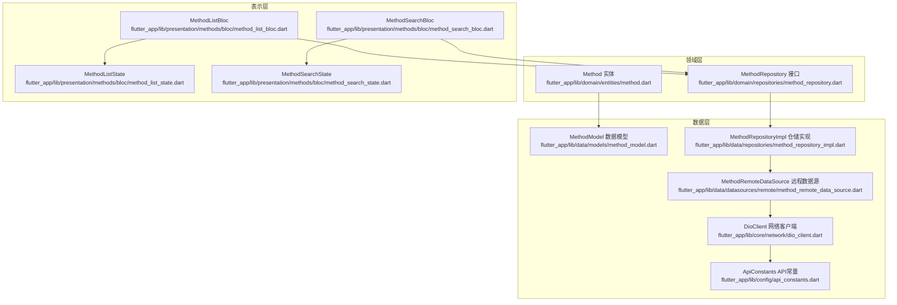
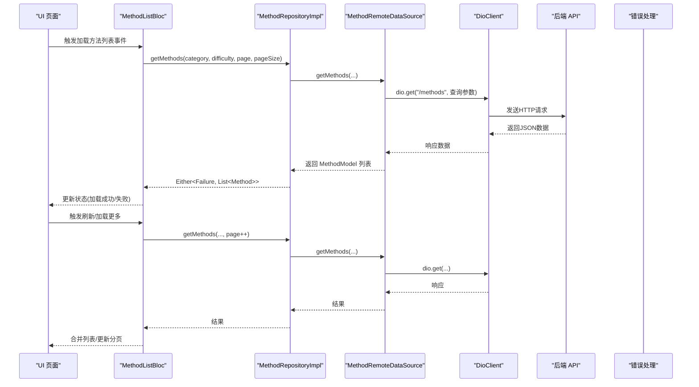
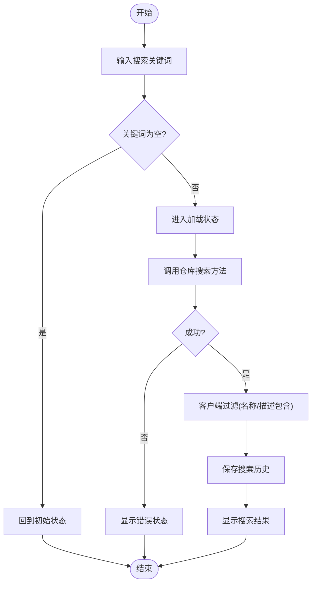
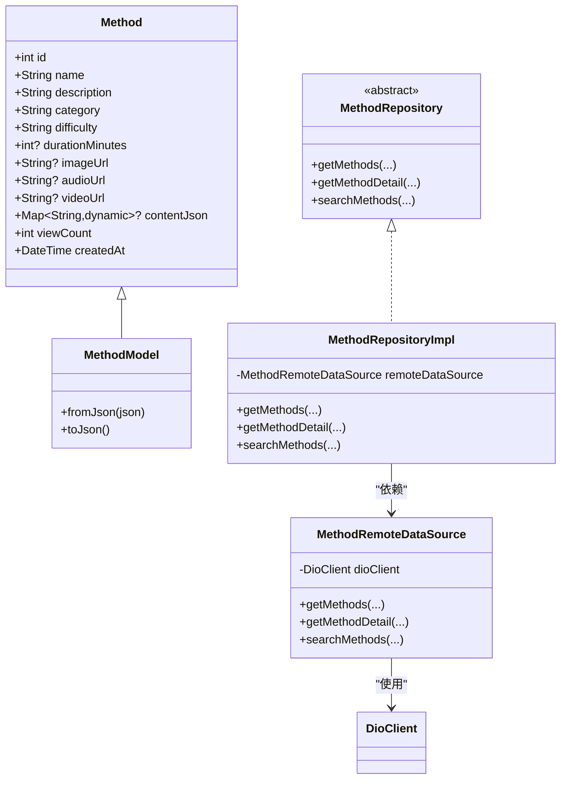

# 方法领域模型

<cite>
**本文引用的文件**
- [flutter_app/lib/domain/entities/method.dart](file://flutter_app/lib/domain/entities/method.dart)
- [flutter_app/lib/domain/repositories/method_repository.dart](file://flutter_app/lib/domain/repositories/method_repository.dart)
- [flutter_app/lib/data/models/method_model.dart](file://flutter_app/lib/data/models/method_model.dart)
- [flutter_app/lib/data/datasources/remote/method_remote_data_source.dart](file://flutter_app/lib/data/datasources/remote/method_remote_data_source.dart)
- [flutter_app/lib/data/repositories/method_repository_impl.dart](file://flutter_app/lib/data/repositories/method_repository_impl.dart)
- [flutter_app/lib/presentation/methods/bloc/method_list_bloc.dart](file://flutter_app/lib/presentation/methods/bloc/method_list_bloc.dart)
- [flutter_app/lib/presentation/methods/bloc/method_search_bloc.dart](file://flutter_app/lib/presentation/methods/bloc/method_search_bloc.dart)
- [flutter_app/lib/presentation/methods/bloc/method_list_state.dart](file://flutter_app/lib/presentation/methods/bloc/method_list_state.dart)
- [flutter_app/lib/presentation/methods/bloc/method_search_state.dart](file://flutter_app/lib/presentation/methods/bloc/method_search_state.dart)
- [flutter_app/lib/core/network/dio_client.dart](file://flutter_app/lib/core/network/dio_client.dart)
- [flutter_app/lib/data/api/api_client.dart](file://flutter_app/lib/data/api/api_client.dart)
- [flutter_app/lib/config/api_constants.dart](file://flutter_app/lib/config/api_constants.dart)
</cite>

## 目录
1. [引言](#引言)
2. [项目结构](#项目结构)
3. [核心组件](#核心组件)
4. [架构总览](#架构总览)
5. [详细组件分析](#详细组件分析)
6. [依赖分析](#依赖分析)
7. [性能考虑](#性能考虑)
8. [故障排查指南](#故障排查指南)
9. [结论](#结论)
10. [附录](#附录)

## 引言
本文件围绕“心理调节方法”的领域模型进行系统化设计与实现分析，重点覆盖以下方面：
- 领域实体 Method 的字段定义与业务语义
- 领域仓库接口 MethodRepository 的契约与职责边界
- 数据层模型 MethodModel 与领域实体的映射关系
- 远程数据源 MethodRemoteDataSource 的网络交互与异常处理
- 仓储实现 MethodRepositoryImpl 的错误归一化与契约落地
- BLoC 层在方法浏览、搜索与个性化推荐中的应用方式
- 实体与数据层模型之间的映射关系及多数据源扩展策略
- 接口实现时的常见错误与最佳实践

## 项目结构
本项目采用典型的分层架构（领域层、数据层、表示层），其中与“方法”领域模型直接相关的文件分布如下：
- 领域层：实体与仓库接口
- 数据层：数据模型、远程数据源、仓储实现
- 表示层：BLoC 状态机与页面交互

图表来源
- [flutter_app/lib/domain/entities/method.dart](file://flutter_app/lib/domain/entities/method.dart#L1-L77)
- [flutter_app/lib/domain/repositories/method_repository.dart](file://flutter_app/lib/domain/repositories/method_repository.dart#L1-L41)
- [flutter_app/lib/data/models/method_model.dart](file://flutter_app/lib/data/models/method_model.dart#L1-L54)
- [flutter_app/lib/data/datasources/remote/method_remote_data_source.dart](file://flutter_app/lib/data/datasources/remote/method_remote_data_source.dart#L1-L83)
- [flutter_app/lib/data/repositories/method_repository_impl.dart](file://flutter_app/lib/data/repositories/method_repository_impl.dart#L1-L74)
- [flutter_app/lib/core/network/dio_client.dart](file://flutter_app/lib/core/network/dio_client.dart#L1-L262)
- [flutter_app/lib/config/api_constants.dart](file://flutter_app/lib/config/api_constants.dart#L1-L73)
- [flutter_app/lib/presentation/methods/bloc/method_list_bloc.dart](file://flutter_app/lib/presentation/methods/bloc/method_list_bloc.dart#L1-L133)
- [flutter_app/lib/presentation/methods/bloc/method_search_bloc.dart](file://flutter_app/lib/presentation/methods/bloc/method_search_bloc.dart#L1-L119)
- [flutter_app/lib/presentation/methods/bloc/method_list_state.dart](file://flutter_app/lib/presentation/methods/bloc/method_list_state.dart#L1-L157)
- [flutter_app/lib/presentation/methods/bloc/method_search_state.dart](file://flutter_app/lib/presentation/methods/bloc/method_search_state.dart#L1-L119)

章节来源
- [flutter_app/lib/domain/entities/method.dart](file://flutter_app/lib/domain/entities/method.dart#L1-L77)
- [flutter_app/lib/domain/repositories/method_repository.dart](file://flutter_app/lib/domain/repositories/method_repository.dart#L1-L41)
- [flutter_app/lib/data/models/method_model.dart](file://flutter_app/lib/data/models/method_model.dart#L1-L54)
- [flutter_app/lib/data/datasources/remote/method_remote_data_source.dart](file://flutter_app/lib/data/datasources/remote/method_remote_data_source.dart#L1-L83)
- [flutter_app/lib/data/repositories/method_repository_impl.dart](file://flutter_app/lib/data/repositories/method_repository_impl.dart#L1-L74)
- [flutter_app/lib/core/network/dio_client.dart](file://flutter_app/lib/core/network/dio_client.dart#L1-L262)
- [flutter_app/lib/config/api_constants.dart](file://flutter_app/lib/config/api_constants.dart#L1-L73)
- [flutter_app/lib/presentation/methods/bloc/method_list_bloc.dart](file://flutter_app/lib/presentation/methods/bloc/method_list_bloc.dart#L1-L133)
- [flutter_app/lib/presentation/methods/bloc/method_search_bloc.dart](file://flutter_app/lib/presentation/methods/bloc/method_search_bloc.dart#L1-L119)
- [flutter_app/lib/presentation/methods/bloc/method_list_state.dart](file://flutter_app/lib/presentation/methods/bloc/method_list_state.dart#L1-L157)
- [flutter_app/lib/presentation/methods/bloc/method_search_state.dart](file://flutter_app/lib/presentation/methods/bloc/method_search_state.dart#L1-L119)

## 核心组件
- 领域实体 Method：承载方法的基本属性与不变性约束，作为跨层共享的数据载体。
- 领域仓库接口 MethodRepository：定义方法列表、详情、搜索等核心业务契约，屏蔽数据来源差异。
- 数据模型 MethodModel：对 JSON 结构的映射，负责序列化/反序列化。
- 远程数据源 MethodRemoteDataSource：封装 HTTP 请求与错误转换。
- 仓储实现 MethodRepositoryImpl：将远程数据源的结果转换为领域层的 Either 结果类型，并统一错误归一化。
- BLoC 层：MethodListBloc 与 MethodSearchBloc 分别驱动方法浏览与搜索流程的状态变化。
- 网络层：DioClient 提供统一的请求配置、拦截器与错误处理；ApiConstants 提供端点常量。

章节来源
- [flutter_app/lib/domain/entities/method.dart](file://flutter_app/lib/domain/entities/method.dart#L1-L77)
- [flutter_app/lib/domain/repositories/method_repository.dart](file://flutter_app/lib/domain/repositories/method_repository.dart#L1-L41)
- [flutter_app/lib/data/models/method_model.dart](file://flutter_app/lib/data/models/method_model.dart#L1-L54)
- [flutter_app/lib/data/datasources/remote/method_remote_data_source.dart](file://flutter_app/lib/data/datasources/remote/method_remote_data_source.dart#L1-L83)
- [flutter_app/lib/data/repositories/method_repository_impl.dart](file://flutter_app/lib/data/repositories/method_repository_impl.dart#L1-L74)
- [flutter_app/lib/presentation/methods/bloc/method_list_bloc.dart](file://flutter_app/lib/presentation/methods/bloc/method_list_bloc.dart#L1-L133)
- [flutter_app/lib/presentation/methods/bloc/method_search_bloc.dart](file://flutter_app/lib/presentation/methods/bloc/method_search_bloc.dart#L1-L119)
- [flutter_app/lib/core/network/dio_client.dart](file://flutter_app/lib/core/network/dio_client.dart#L1-L262)
- [flutter_app/lib/config/api_constants.dart](file://flutter_app/lib/config/api_constants.dart#L1-L73)

## 架构总览
下图展示了从 UI 到数据层的完整调用链路，包括方法浏览、搜索与错误处理路径。

图表来源
- [flutter_app/lib/presentation/methods/bloc/method_list_bloc.dart](file://flutter_app/lib/presentation/methods/bloc/method_list_bloc.dart#L1-L133)
- [flutter_app/lib/data/repositories/method_repository_impl.dart](file://flutter_app/lib/data/repositories/method_repository_impl.dart#L1-L74)
- [flutter_app/lib/data/datasources/remote/method_remote_data_source.dart](file://flutter_app/lib/data/datasources/remote/method_remote_data_source.dart#L1-L83)
- [flutter_app/lib/core/network/dio_client.dart](file://flutter_app/lib/core/network/dio_client.dart#L1-L262)
- [flutter_app/lib/config/api_constants.dart](file://flutter_app/lib/config/api_constants.dart#L1-L73)

## 详细组件分析

### Method 实体类字段与业务含义
Method 是领域层的核心实体，具备以下字段与业务语义：
- id：方法唯一标识，用于详情与关联操作
- name：方法名称，用于展示与搜索匹配
- description：方法描述，用于搜索匹配与摘要展示
- category：分类标签，用于筛选与聚合
- difficulty：难度等级，用于筛选与个性化推荐
- durationMinutes：建议时长（分钟），用于用户时间规划
- imageUrl/audioUrl/videoUrl：多媒体资源链接，用于封面与播放
- contentJson：方法内容（JSON），用于动态渲染与执行
- viewCount：浏览次数，用于热度排序与推荐
- createdAt：创建时间，用于排序与统计

这些字段共同构成“心理调节方法”的完整画像，既满足前端展示需求，也便于后端检索与推荐。

章节来源
- [flutter_app/lib/domain/entities/method.dart](file://flutter_app/lib/domain/entities/method.dart#L1-L77)

### MethodRepository 接口契约
MethodRepository 定义了方法领域的三大核心业务契约：
- getMethods：按分类与难度筛选，支持分页
- getMethodDetail：按 ID 获取详情
- searchMethods：按关键词搜索，支持分页

接口使用 Either<Failure, T> 表达成功与失败两种结果，避免异常穿透，提升可测试性与可维护性。

章节来源
- [flutter_app/lib/domain/repositories/method_repository.dart](file://flutter_app/lib/domain/repositories/method_repository.dart#L1-L41)

### MethodModel 与 Method 的映射关系
MethodModel 继承自 Method，提供 JSON 序列化/反序列化能力：
- fromJson：将后端返回的 Map<String, dynamic> 映射为 MethodModel
- toJson：将 MethodModel 序列化为 Map，便于持久化或调试

映射关系确保领域实体与数据传输对象解耦，同时保留领域实体的不变性与相等性比较。

章节来源
- [flutter_app/lib/data/models/method_model.dart](file://flutter_app/lib/data/models/method_model.dart#L1-L54)
- [flutter_app/lib/domain/entities/method.dart](file://flutter_app/lib/domain/entities/method.dart#L1-L77)

### MethodRemoteDataSource 远程数据源
MethodRemoteDataSource 通过 DioClient 发起 HTTP 请求，封装以下能力：
- getMethods：支持分类、难度、分页参数
- getMethodDetail：按 ID 获取详情
- searchMethods：关键词搜索，支持分页
- 统一错误转换：将 DioException 转换为业务异常类型

章节来源
- [flutter_app/lib/data/datasources/remote/method_remote_data_source.dart](file://flutter_app/lib/data/datasources/remote/method_remote_data_source.dart#L1-L83)
- [flutter_app/lib/core/network/dio_client.dart](file://flutter_app/lib/core/network/dio_client.dart#L1-L262)
- [flutter_app/lib/config/api_constants.dart](file://flutter_app/lib/config/api_constants.dart#L1-L73)

### MethodRepositoryImpl 仓储实现
MethodRepositoryImpl 将远程数据源的结果转换为领域层的 Either 结果，并进行错误归一化：
- 成功：返回 Right(List<Method>) 或 Right(Method)
- 失败：捕获 NetworkException/ServerException 并映射为 Failure 子类

该实现保证了领域层不感知具体数据源细节，便于未来扩展本地缓存、离线数据或多数据源策略。

章节来源
- [flutter_app/lib/data/repositories/method_repository_impl.dart](file://flutter_app/lib/data/repositories/method_repository_impl.dart#L1-L74)

### BLoC 在方法浏览与搜索中的应用
- MethodListBloc：负责加载、筛选、分页与刷新，将仓库返回的 Either 结果映射为 MethodListState，驱动 UI 更新。
- MethodSearchBloc：负责搜索输入、历史记录、客户端过滤与历史持久化，将仓库返回的 Either 结果映射为 MethodSearchState。

图表来源
- [flutter_app/lib/presentation/methods/bloc/method_search_bloc.dart](file://flutter_app/lib/presentation/methods/bloc/method_search_bloc.dart#L1-L119)
- [flutter_app/lib/presentation/methods/bloc/method_search_state.dart](file://flutter_app/lib/presentation/methods/bloc/method_search_state.dart#L1-L119)

章节来源
- [flutter_app/lib/presentation/methods/bloc/method_list_bloc.dart](file://flutter_app/lib/presentation/methods/bloc/method_list_bloc.dart#L1-L133)
- [flutter_app/lib/presentation/methods/bloc/method_list_state.dart](file://flutter_app/lib/presentation/methods/bloc/method_list_state.dart#L1-L157)
- [flutter_app/lib/presentation/methods/bloc/method_search_bloc.dart](file://flutter_app/lib/presentation/methods/bloc/method_search_bloc.dart#L1-L119)
- [flutter_app/lib/presentation/methods/bloc/method_search_state.dart](file://flutter_app/lib/presentation/methods/bloc/method_search_state.dart#L1-L119)

### 个性化推荐的集成点
- ApiConstants 中定义了推荐端点常量，可用于后续扩展推荐逻辑（例如在 MethodRepository 中新增 getRecommendedMethods 契约）。
- MethodSearchBloc 已演示“客户端过滤 + 历史记录”的组合模式，可借鉴此思路扩展“基于用户行为的推荐”。

章节来源
- [flutter_app/lib/config/api_constants.dart](file://flutter_app/lib/config/api_constants.dart#L1-L73)

## 依赖分析
- 领域层仅依赖数据模型与仓库接口，保持纯净的业务语义
- 数据层通过依赖注入提供 DioClient，避免硬编码网络细节
- 表示层通过 BLoC 解耦 UI 与数据流，状态机清晰表达业务流程

图表来源
- [flutter_app/lib/domain/entities/method.dart](file://flutter_app/lib/domain/entities/method.dart#L1-L77)
- [flutter_app/lib/data/models/method_model.dart](file://flutter_app/lib/data/models/method_model.dart#L1-L54)
- [flutter_app/lib/domain/repositories/method_repository.dart](file://flutter_app/lib/domain/repositories/method_repository.dart#L1-L41)
- [flutter_app/lib/data/repositories/method_repository_impl.dart](file://flutter_app/lib/data/repositories/method_repository_impl.dart#L1-L74)
- [flutter_app/lib/data/datasources/remote/method_remote_data_source.dart](file://flutter_app/lib/data/datasources/remote/method_remote_data_source.dart#L1-L83)
- [flutter_app/lib/core/network/dio_client.dart](file://flutter_app/lib/core/network/dio_client.dart#L1-L262)

## 性能考虑
- 分页与懒加载：MethodListBloc 支持分页与“加载更多”，减少一次性数据量，提升首屏性能。
- 客户端过滤：MethodSearchBloc 对搜索结果进行客户端过滤，降低网络请求频率，但需注意大数据集下的性能影响。
- 缓存策略：建议在 MethodRepositoryImpl 中引入内存缓存与本地持久化缓存，以减少重复请求与提升离线体验。
- 网络优化：DioClient 已内置拦截器与错误处理，可进一步启用压缩、连接池复用与超时重试策略。

## 故障排查指南
- 网络异常：DioClient 的 _ErrorInterceptor 将不同类型的 DioException 转换为友好提示，MethodRepositoryImpl 将其映射为 NetworkFailure。
- 服务器异常：MethodRemoteDataSource 将 HTTP 错误转换为 ServerException，再由仓储映射为 ServerFailure。
- 未授权：_AuthInterceptor 在 401 时清除令牌，避免无效请求继续发送。
- 搜索无结果：MethodSearchBloc 在关键词为空时回到初始状态；搜索历史可通过 ClearSearchHistory 清空。

章节来源
- [flutter_app/lib/core/network/dio_client.dart](file://flutter_app/lib/core/network/dio_client.dart#L1-L262)
- [flutter_app/lib/data/datasources/remote/method_remote_data_source.dart](file://flutter_app/lib/data/datasources/remote/method_remote_data_source.dart#L1-L83)
- [flutter_app/lib/data/repositories/method_repository_impl.dart](file://flutter_app/lib/data/repositories/method_repository_impl.dart#L1-L74)
- [flutter_app/lib/presentation/methods/bloc/method_search_bloc.dart](file://flutter_app/lib/presentation/methods/bloc/method_search_bloc.dart#L1-L119)

## 结论
本领域模型以 Method 实体为核心，通过 MethodRepository 抽象出方法浏览、详情与搜索的业务契约，并以 MethodModel 与 MethodRemoteDataSource 实现数据层映射与网络交互。BLoC 层将业务流程状态化，配合 DioClient 的统一网络与错误处理，形成清晰、可扩展且易维护的架构。未来可在仓库层引入推荐接口与缓存策略，进一步增强个性化体验与性能表现。

## 附录
- 多数据源扩展建议：
  - 在 MethodRepository 中新增 getRecommendedMethods 契约
  - 在 MethodRepositoryImpl 中增加本地缓存与离线策略
  - 通过依赖注入切换 MethodRemoteDataSource 与本地数据源
- 最佳实践：
  - 使用 Either<Failure, T> 统一错误表达
  - 保持领域实体不可变，使用工厂构造与复制方法
  - 客户端过滤仅用于小规模数据，大规模数据建议后端分页与过滤
  - 为关键端点添加日志与监控，便于问题定位