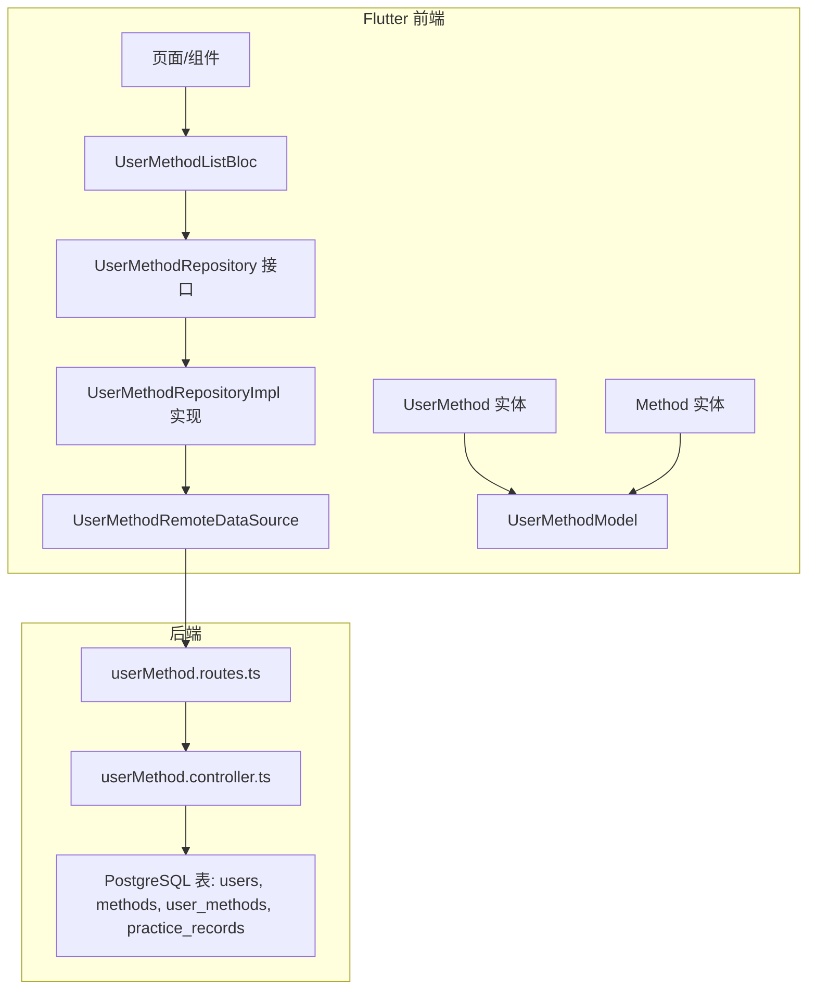
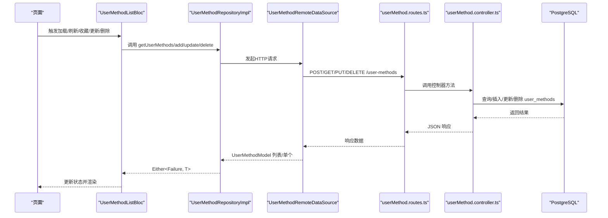
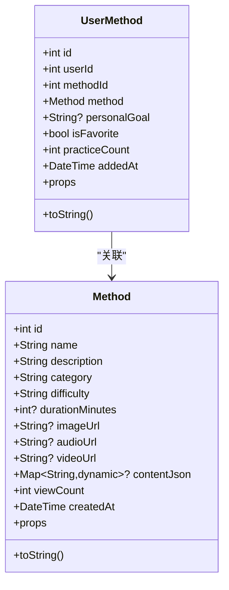
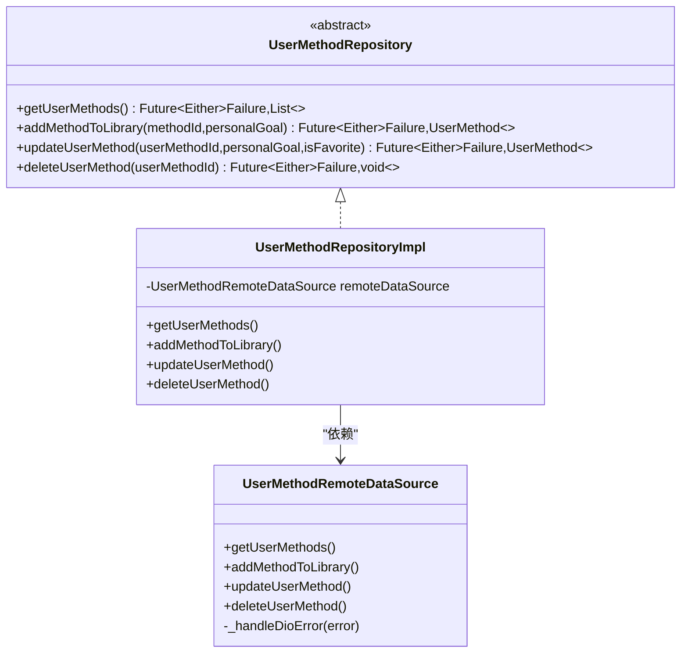
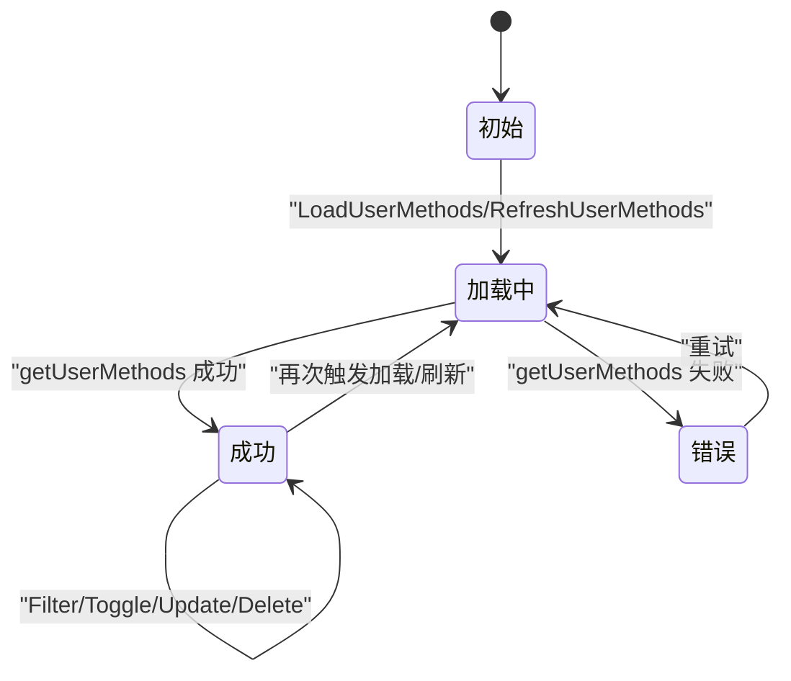
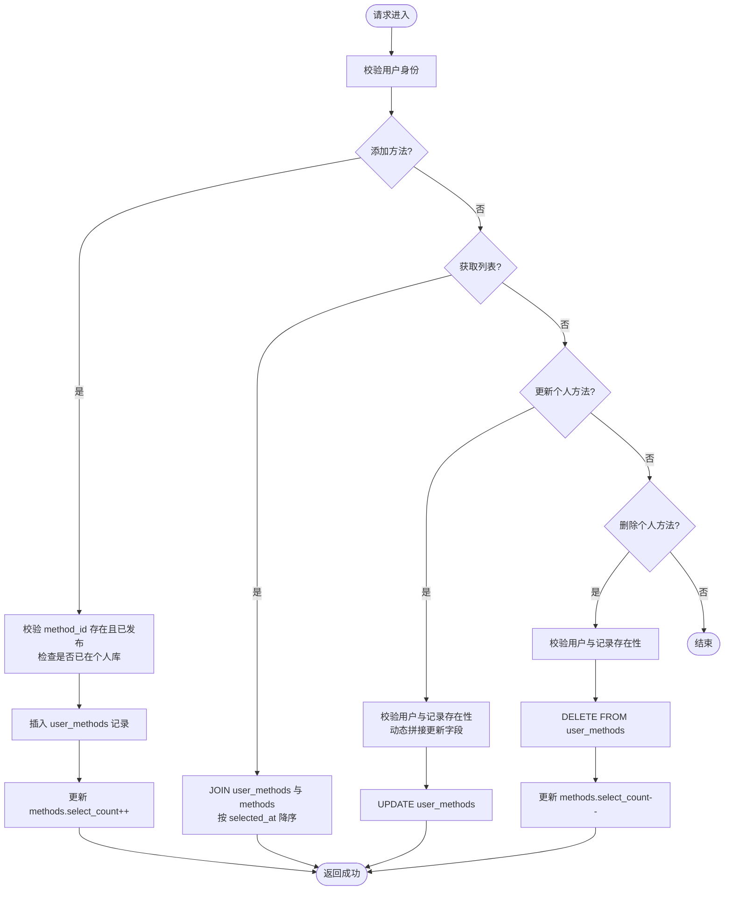
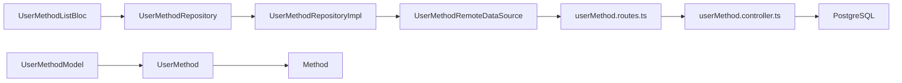

# 用户方法领域模型

<cite>
**本文引用的文件**
- [flutter_app/lib/domain/entities/user_method.dart](file://flutter_app/lib/domain/entities/user_method.dart)
- [flutter_app/lib/domain/entities/method.dart](file://flutter_app/lib/domain/entities/method.dart)
- [flutter_app/lib/data/models/user_method_model.dart](file://flutter_app/lib/data/models/user_method_model.dart)
- [flutter_app/lib/domain/repositories/user_method_repository.dart](file://flutter_app/lib/domain/repositories/user_method_repository.dart)
- [flutter_app/lib/data/repositories/user_method_repository_impl.dart](file://flutter_app/lib/data/repositories/user_method_repository_impl.dart)
- [flutter_app/lib/data/datasources/remote/user_method_remote_data_source.dart](file://flutter_app/lib/data/datasources/remote/user_method_remote_data_source.dart)
- [flutter_app/lib/presentation/user_methods/bloc/user_method_list_bloc.dart](file://flutter_app/lib/presentation/user_methods/bloc/user_method_list_bloc.dart)
- [flutter_app/lib/presentation/user_methods/bloc/user_method_list_state.dart](file://flutter_app/lib/presentation/user_methods/bloc/user_method_list_state.dart)
- [flutter_app/lib/presentation/user_methods/bloc/user_method_list_event.dart](file://flutter_app/lib/presentation/user_methods/bloc/user_method_list_event.dart)
- [backend/src/controllers/userMethod.controller.ts](file://backend/src/controllers/userMethod.controller.ts)
- [backend/src/routes/userMethod.routes.ts](file://backend/src/routes/userMethod.routes.ts)
- [database/init.sql](file://database/init.sql)
</cite>

## 目录
1. [简介](#简介)
2. [项目结构](#项目结构)
3. [核心组件](#核心组件)
4. [架构总览](#架构总览)
5. [详细组件分析](#详细组件分析)
6. [依赖关系分析](#依赖关系分析)
7. [性能考量](#性能考量)
8. [故障排查指南](#故障排查指南)
9. [结论](#结论)
10. [附录](#附录)

## 简介
本文件围绕“用户个性化方法收藏与管理”的领域模型进行深入解析，重点覆盖：
- Flutter 领域层实体 UserMethod 的结构设计与业务规则
- Repository 接口与实现如何支撑收藏、取消收藏、查询用户专属方法列表等操作
- 结合用户学习路径场景，阐述该模型如何支撑个性化推荐与学习进度跟踪
- 实体关系维护策略与离线状态下的数据一致性保障方案
- 接口测试的典型用例与调试技巧

## 项目结构
该功能横跨 Flutter 前端与 Node.js 后端：
- 前端采用 DDD 分层：Domain（实体）、Data（模型/仓库/数据源）、Presentation（BLoC）
- 后端采用 Express 控制器+路由+数据库访问
- 数据库包含用户、方法、用户方法关联表以及练习记录等

图表来源
- [flutter_app/lib/presentation/user_methods/bloc/user_method_list_bloc.dart](file://flutter_app/lib/presentation/user_methods/bloc/user_method_list_bloc.dart#L1-L192)
- [flutter_app/lib/data/repositories/user_method_repository_impl.dart](file://flutter_app/lib/data/repositories/user_method_repository_impl.dart#L1-L84)
- [flutter_app/lib/data/datasources/remote/user_method_remote_data_source.dart](file://flutter_app/lib/data/datasources/remote/user_method_remote_data_source.dart#L1-L86)
- [backend/src/routes/userMethod.routes.ts](file://backend/src/routes/userMethod.routes.ts#L1-L23)
- [backend/src/controllers/userMethod.controller.ts](file://backend/src/controllers/userMethod.controller.ts#L1-L162)
- [database/init.sql](file://database/init.sql#L1-L120)

章节来源
- [flutter_app/lib/presentation/user_methods/bloc/user_method_list_bloc.dart](file://flutter_app/lib/presentation/user_methods/bloc/user_method_list_bloc.dart#L1-L192)
- [flutter_app/lib/data/repositories/user_method_repository_impl.dart](file://flutter_app/lib/data/repositories/user_method_repository_impl.dart#L1-L84)
- [flutter_app/lib/data/datasources/remote/user_method_remote_data_source.dart](file://flutter_app/lib/data/datasources/remote/user_method_remote_data_source.dart#L1-L86)
- [backend/src/routes/userMethod.routes.ts](file://backend/src/routes/userMethod.routes.ts#L1-L23)
- [backend/src/controllers/userMethod.controller.ts](file://backend/src/controllers/userMethod.controller.ts#L1-L162)
- [database/init.sql](file://database/init.sql#L1-L120)

## 核心组件
- 领域实体 UserMethod：承载用户个人方法库中的记录，包含用户ID、方法ID、是否收藏、练习次数、个人目标、添加时间等字段，并通过 Equatable 对属性进行相等性比较。
- 方法实体 Method：描述系统中的心理自助方法，包含名称、分类、难度、建议时长、封面/音频/视频资源、浏览次数、创建时间等。
- 数据模型 UserMethodModel：用于序列化/反序列化，从 JSON 构造实体并输出 JSON。
- 仓库接口 UserMethodRepository：定义获取、添加、更新、删除用户方法的操作契约。
- 仓库实现 UserMethodRepositoryImpl：封装网络异常与服务端异常，统一返回 Failure 或成功结果。
- 远程数据源 UserMethodRemoteDataSource：封装 HTTP 请求，负责与后端交互并抛出标准化异常。
- BLoC UserMethodListBloc：处理加载、刷新、按分类筛选、切换收藏、更新目标、删除等事件，驱动状态流转。
- 后端控制器 userMethod.controller.ts：实现添加/获取/更新/删除用户方法的业务逻辑与校验。
- 数据库 schema：users、methods、user_methods、practice_records 等表，user_methods 作为用户与方法的关联表，包含收藏、练习统计等字段。

章节来源
- [flutter_app/lib/domain/entities/user_method.dart](file://flutter_app/lib/domain/entities/user_method.dart#L1-L59)
- [flutter_app/lib/domain/entities/method.dart](file://flutter_app/lib/domain/entities/method.dart#L1-L77)
- [flutter_app/lib/data/models/user_method_model.dart](file://flutter_app/lib/data/models/user_method_model.dart#L1-L89)
- [flutter_app/lib/domain/repositories/user_method_repository.dart](file://flutter_app/lib/domain/repositories/user_method_repository.dart#L1-L42)
- [flutter_app/lib/data/repositories/user_method_repository_impl.dart](file://flutter_app/lib/data/repositories/user_method_repository_impl.dart#L1-L84)
- [flutter_app/lib/data/datasources/remote/user_method_remote_data_source.dart](file://flutter_app/lib/data/datasources/remote/user_method_remote_data_source.dart#L1-L86)
- [flutter_app/lib/presentation/user_methods/bloc/user_method_list_bloc.dart](file://flutter_app/lib/presentation/user_methods/bloc/user_method_list_bloc.dart#L1-L192)
- [backend/src/controllers/userMethod.controller.ts](file://backend/src/controllers/userMethod.controller.ts#L1-L162)
- [database/init.sql](file://database/init.sql#L1-L120)

## 架构总览
从前端到后端的数据流如下：
- 前端通过 BLoC 发起事件，调用仓库接口
- 仓库实现委托远程数据源发起 HTTP 请求
- 远程数据源使用 DioClient 调用后端路由
- 后端控制器执行业务逻辑并访问数据库
- 数据库返回结果，后端控制器封装响应，前端解析为 UserMethodModel 并映射为 UserMethod 实体

图表来源
- [flutter_app/lib/presentation/user_methods/bloc/user_method_list_bloc.dart](file://flutter_app/lib/presentation/user_methods/bloc/user_method_list_bloc.dart#L1-L192)
- [flutter_app/lib/data/repositories/user_method_repository_impl.dart](file://flutter_app/lib/data/repositories/user_method_repository_impl.dart#L1-L84)
- [flutter_app/lib/data/datasources/remote/user_method_remote_data_source.dart](file://flutter_app/lib/data/datasources/remote/user_method_remote_data_source.dart#L1-L86)
- [backend/src/routes/userMethod.routes.ts](file://backend/src/routes/userMethod.routes.ts#L1-L23)
- [backend/src/controllers/userMethod.controller.ts](file://backend/src/controllers/userMethod.controller.ts#L1-L162)

## 详细组件分析

### UserMethod 实体类结构设计与业务规则
- 字段与含义
  - id：记录唯一标识
  - userId：所属用户ID
  - methodId：方法ID
  - method：关联的方法实体（包含名称、分类、难度、时长等）
  - personalGoal：个人目标（可空）
  - isFavorite：是否收藏
  - practiceCount：练习次数
  - addedAt：添加到个人库的时间
- 相等性与可打印性
  - 使用 Equatable，基于 props 列表进行对象相等性判断
  - toString 提供简洁的调试信息
- 业务规则
  - 收藏与非收藏由 isFavorite 字段表达
  - 练习次数用于追踪学习进度
  - personalGoal 支持个性化目标设定
  - addedAt 用于排序与展示

图表来源
- [flutter_app/lib/domain/entities/user_method.dart](file://flutter_app/lib/domain/entities/user_method.dart#L1-L59)
- [flutter_app/lib/domain/entities/method.dart](file://flutter_app/lib/domain/entities/method.dart#L1-L77)

章节来源
- [flutter_app/lib/domain/entities/user_method.dart](file://flutter_app/lib/domain/entities/user_method.dart#L1-L59)
- [flutter_app/lib/domain/entities/method.dart](file://flutter_app/lib/domain/entities/method.dart#L1-L77)

### UserMethodRepository 接口与实现
- 接口职责
  - getUserMethods：获取当前用户的个人方法列表
  - addMethodToLibrary：将指定方法加入个人库，支持设置 personalGoal
  - updateUserMethod：更新个人方法，支持更新 personalGoal 与 isFavorite
  - deleteUserMethod：从个人库移除方法
- 实现要点
  - 统一捕获网络异常与服务端异常，转换为 Failure
  - 成功路径返回 Either 右值，失败路径返回 Either 左值
- 与数据源的关系
  - 仓库实现依赖远程数据源，后者封装 HTTP 请求与错误转换

图表来源
- [flutter_app/lib/domain/repositories/user_method_repository.dart](file://flutter_app/lib/domain/repositories/user_method_repository.dart#L1-L42)
- [flutter_app/lib/data/repositories/user_method_repository_impl.dart](file://flutter_app/lib/data/repositories/user_method_repository_impl.dart#L1-L84)
- [flutter_app/lib/data/datasources/remote/user_method_remote_data_source.dart](file://flutter_app/lib/data/datasources/remote/user_method_remote_data_source.dart#L1-L86)

章节来源
- [flutter_app/lib/domain/repositories/user_method_repository.dart](file://flutter_app/lib/domain/repositories/user_method_repository.dart#L1-L42)
- [flutter_app/lib/data/repositories/user_method_repository_impl.dart](file://flutter_app/lib/data/repositories/user_method_repository_impl.dart#L1-L84)
- [flutter_app/lib/data/datasources/remote/user_method_remote_data_source.dart](file://flutter_app/lib/data/datasources/remote/user_method_remote_data_source.dart#L1-L86)

### 前端 BLoC 与状态机
- 事件类型
  - LoadUserMethods、RefreshUserMethods：加载/刷新个人方法列表
  - FilterUserMethodsByCategory：按分类筛选
  - ToggleFavorite：切换收藏
  - UpdateUserMethodGoal：更新个人目标
  - DeleteUserMethod：删除个人方法
- 状态类型
  - UserMethodListInitial、UserMethodListLoading、UserMethodListLoaded、UserMethodListError、UserMethodActionSuccess
- 处理流程
  - 加载/刷新：调用仓库获取列表，成功则进入 Loaded，失败进入 Error
  - 切换收藏/更新目标：先本地更新列表，再调用仓库更新，成功后回显成功消息并刷新列表
  - 删除：从本地列表移除，调用仓库删除，成功后提示并刷新

图表来源
- [flutter_app/lib/presentation/user_methods/bloc/user_method_list_state.dart](file://flutter_app/lib/presentation/user_methods/bloc/user_method_list_state.dart#L1-L145)
- [flutter_app/lib/presentation/user_methods/bloc/user_method_list_event.dart](file://flutter_app/lib/presentation/user_methods/bloc/user_method_list_event.dart#L1-L127)
- [flutter_app/lib/presentation/user_methods/bloc/user_method_list_bloc.dart](file://flutter_app/lib/presentation/user_methods/bloc/user_method_list_bloc.dart#L1-L192)

章节来源
- [flutter_app/lib/presentation/user_methods/bloc/user_method_list_state.dart](file://flutter_app/lib/presentation/user_methods/bloc/user_method_list_state.dart#L1-L145)
- [flutter_app/lib/presentation/user_methods/bloc/user_method_list_event.dart](file://flutter_app/lib/presentation/user_methods/bloc/user_method_list_event.dart#L1-L127)
- [flutter_app/lib/presentation/user_methods/bloc/user_method_list_bloc.dart](file://flutter_app/lib/presentation/user_methods/bloc/user_method_list_bloc.dart#L1-L192)

### 后端控制器与数据库交互
- 路由保护
  - 所有路由均需认证中间件
- 控制器方法
  - 添加方法到个人库：校验用户与方法存在性，检查重复，插入 user_methods，更新方法选择计数
  - 获取个人方法列表：按用户查询 user_methods 并关联 methods，按 selected_at 降序
  - 更新个人方法：动态拼接更新字段，校验用户与记录存在性
  - 删除个人方法：校验用户与记录存在性，删除并回退方法选择计数
- 数据库表
  - user_methods：存储用户与方法的关联，包含收藏、练习统计、连续天数、最后练习时间等字段
  - methods：方法元数据与发布状态
  - practice_records：练习记录，支持后续学习进度跟踪

图表来源
- [backend/src/controllers/userMethod.controller.ts](file://backend/src/controllers/userMethod.controller.ts#L1-L162)
- [backend/src/routes/userMethod.routes.ts](file://backend/src/routes/userMethod.routes.ts#L1-L23)
- [database/init.sql](file://database/init.sql#L1-L120)

章节来源
- [backend/src/controllers/userMethod.controller.ts](file://backend/src/controllers/userMethod.controller.ts#L1-L162)
- [backend/src/routes/userMethod.routes.ts](file://backend/src/routes/userMethod.routes.ts#L1-L23)
- [database/init.sql](file://database/init.sql#L1-L120)

## 依赖关系分析
- 前端依赖链
  - BLoC 依赖 UserMethodRepository 接口
  - UserMethodRepositoryImpl 依赖 UserMethodRemoteDataSource
  - UserMethodRemoteDataSource 依赖 DioClient
  - UserMethodModel/Entity 依赖 Method 实体
- 后端依赖链
  - userMethod.routes.ts 依赖 userMethod.controller.ts
  - userMethod.controller.ts 依赖数据库连接池与错误处理中间件
- 数据库依赖
  - user_methods 依赖 users 与 methods
  - practice_records 依赖 users 与 methods

图表来源
- [flutter_app/lib/presentation/user_methods/bloc/user_method_list_bloc.dart](file://flutter_app/lib/presentation/user_methods/bloc/user_method_list_bloc.dart#L1-L192)
- [flutter_app/lib/data/repositories/user_method_repository_impl.dart](file://flutter_app/lib/data/repositories/user_method_repository_impl.dart#L1-L84)
- [flutter_app/lib/data/datasources/remote/user_method_remote_data_source.dart](file://flutter_app/lib/data/datasources/remote/user_method_remote_data_source.dart#L1-L86)
- [backend/src/routes/userMethod.routes.ts](file://backend/src/routes/userMethod.routes.ts#L1-L23)
- [backend/src/controllers/userMethod.controller.ts](file://backend/src/controllers/userMethod.controller.ts#L1-L162)
- [database/init.sql](file://database/init.sql#L1-L120)

章节来源
- [flutter_app/lib/presentation/user_methods/bloc/user_method_list_bloc.dart](file://flutter_app/lib/presentation/user_methods/bloc/user_method_list_bloc.dart#L1-L192)
- [flutter_app/lib/data/repositories/user_method_repository_impl.dart](file://flutter_app/lib/data/repositories/user_method_repository_impl.dart#L1-L84)
- [flutter_app/lib/data/datasources/remote/user_method_remote_data_source.dart](file://flutter_app/lib/data/datasources/remote/user_method_remote_data_source.dart#L1-L86)
- [backend/src/routes/userMethod.routes.ts](file://backend/src/routes/userMethod.routes.ts#L1-L23)
- [backend/src/controllers/userMethod.controller.ts](file://backend/src/controllers/userMethod.controller.ts#L1-L162)
- [database/init.sql](file://database/init.sql#L1-L120)

## 性能考量
- 前端
  - BLoC 在切换收藏/更新目标时先本地更新列表，减少网络往返，提升交互流畅度
  - 列表按 selected_at 降序，有利于快速定位最近添加的方法
- 后端
  - user_methods 上建立了索引（user_id、method_id、selected_at），有助于查询与更新性能
  - 动态更新字段避免不必要的列写入
- 数据库
  - user_methods 中包含练习统计字段（如 total_duration_minutes、continuous_days、last_practice_at），便于直接查询学习进度，减少二次聚合

章节来源
- [flutter_app/lib/presentation/user_methods/bloc/user_method_list_bloc.dart](file://flutter_app/lib/presentation/user_methods/bloc/user_method_list_bloc.dart#L1-L192)
- [backend/src/controllers/userMethod.controller.ts](file://backend/src/controllers/userMethod.controller.ts#L1-L162)
- [database/init.sql](file://database/init.sql#L1-L120)

## 故障排查指南
- 常见错误类型与来源
  - 网络异常：Dio 异常转换为 NetworkException
  - 超时：连接/接收超时转换为 TimeoutException
  - 服务端异常：根据响应状态码与 message 转换为 ServerException
  - 未知异常：统一包装为 UnknownFailure
- 前端处理
  - BLoC 使用 Either<F, T>，左侧 Failure 用于 UI 显示错误消息
  - 成功后立即回显操作成功消息，再刷新列表，确保用户感知即时反馈
- 调试技巧
  - 打开 DioClient 日志，确认请求 URL、参数与响应体
  - 在 BLoC 中增加日志，记录事件触发与仓库返回
  - 检查后端控制器的校验逻辑与数据库约束（如唯一约束 user_id+method_id）

章节来源
- [flutter_app/lib/data/repositories/user_method_repository_impl.dart](file://flutter_app/lib/data/repositories/user_method_repository_impl.dart#L1-L84)
- [flutter_app/lib/data/datasources/remote/user_method_remote_data_source.dart](file://flutter_app/lib/data/datasources/remote/user_method_remote_data_source.dart#L1-L86)
- [flutter_app/lib/presentation/user_methods/bloc/user_method_list_bloc.dart](file://flutter_app/lib/presentation/user_methods/bloc/user_method_list_bloc.dart#L1-L192)
- [backend/src/controllers/userMethod.controller.ts](file://backend/src/controllers/userMethod.controller.ts#L1-L162)

## 结论
该领域模型通过清晰的分层与契约设计，实现了用户个性化方法收藏与管理的完整闭环：
- 领域实体 UserMethod 与 Method 明确了用户与方法的关系与属性
- Repository 抽象屏蔽了数据源差异，便于扩展与测试
- BLoC 以事件驱动状态机，保证 UI 与业务逻辑解耦
- 后端控制器与数据库 schema 支撑了收藏、更新、删除与学习进度统计
- 在离线场景下，前端可通过本地状态先行更新，配合错误处理与重试机制，提升用户体验

## 附录

### 个性化推荐与学习进度跟踪
- 个性化推荐
  - 基于用户收藏与练习历史，结合方法分类、难度与热度统计，可在前端进行二次筛选与排序
  - 可扩展：在 user_methods 中引入学习偏好权重字段，结合 methods 的 category/difficulty 进行打分
- 学习进度跟踪
  - user_methods 中的 total_duration_minutes、continuous_days、last_practice_at 可直接用于统计
  - practice_records 提供每日练习详情，可用于趋势分析与可视化

章节来源
- [database/init.sql](file://database/init.sql#L1-L120)
- [flutter_app/lib/domain/entities/user_method.dart](file://flutter_app/lib/domain/entities/user_method.dart#L1-L59)

### 接口测试典型用例
- 添加方法到个人库
  - 正常用例：携带 method_id，返回 201，数据包含 user_methods 记录
  - 重复添加：返回 409，提示已存在
  - 未认证：返回 401
  - 方法不存在：返回 404
- 获取个人方法列表
  - 返回 user_methods 与 methods 的关联数据，按 selected_at 降序
- 更新个人方法
  - 切换 is_favorite：返回更新后的记录
  - 更新 personalGoal：返回更新后的记录
  - 无更新字段：返回 400
  - 记录不存在：返回 404
- 删除个人方法
  - 成功删除：返回 200，并回退方法 select_count
  - 记录不存在：返回 404

章节来源
- [backend/src/controllers/userMethod.controller.ts](file://backend/src/controllers/userMethod.controller.ts#L1-L162)
- [backend/src/routes/userMethod.routes.ts](file://backend/src/routes/userMethod.routes.ts#L1-L23)