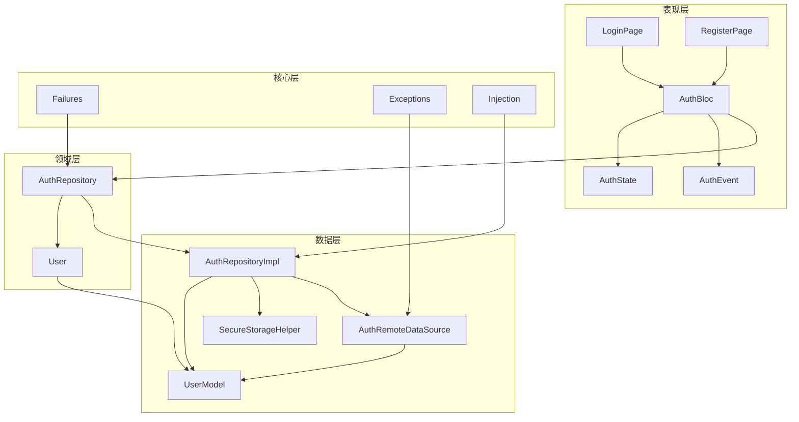
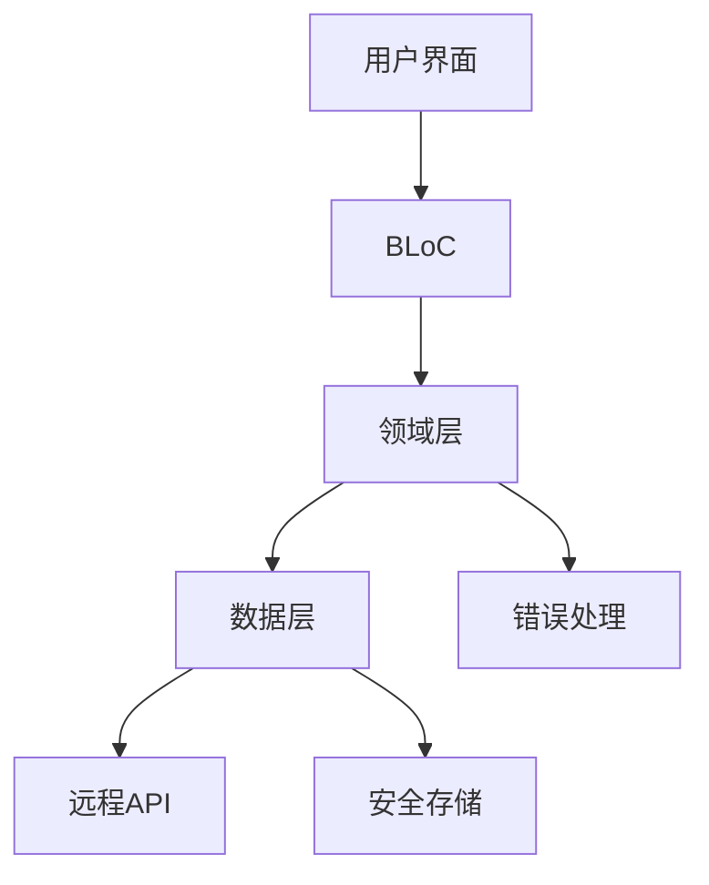
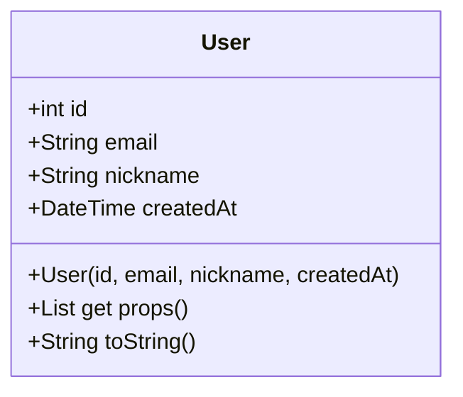
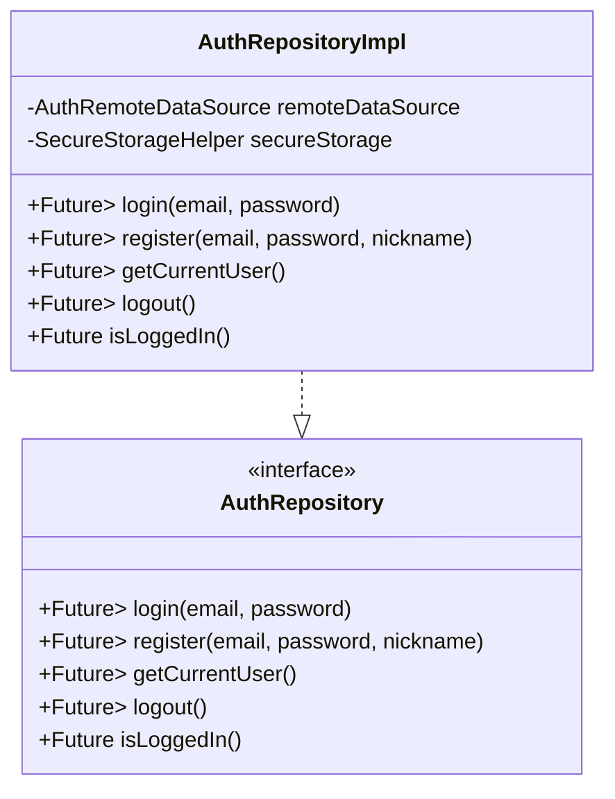
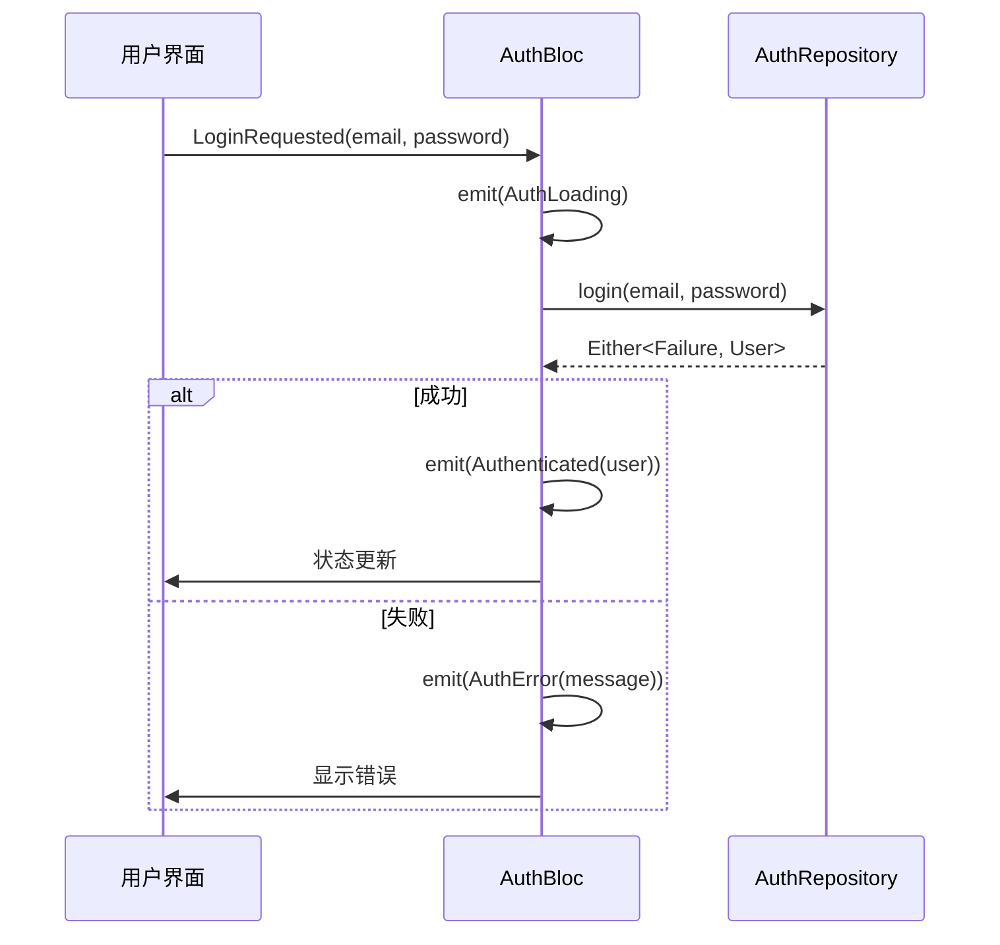
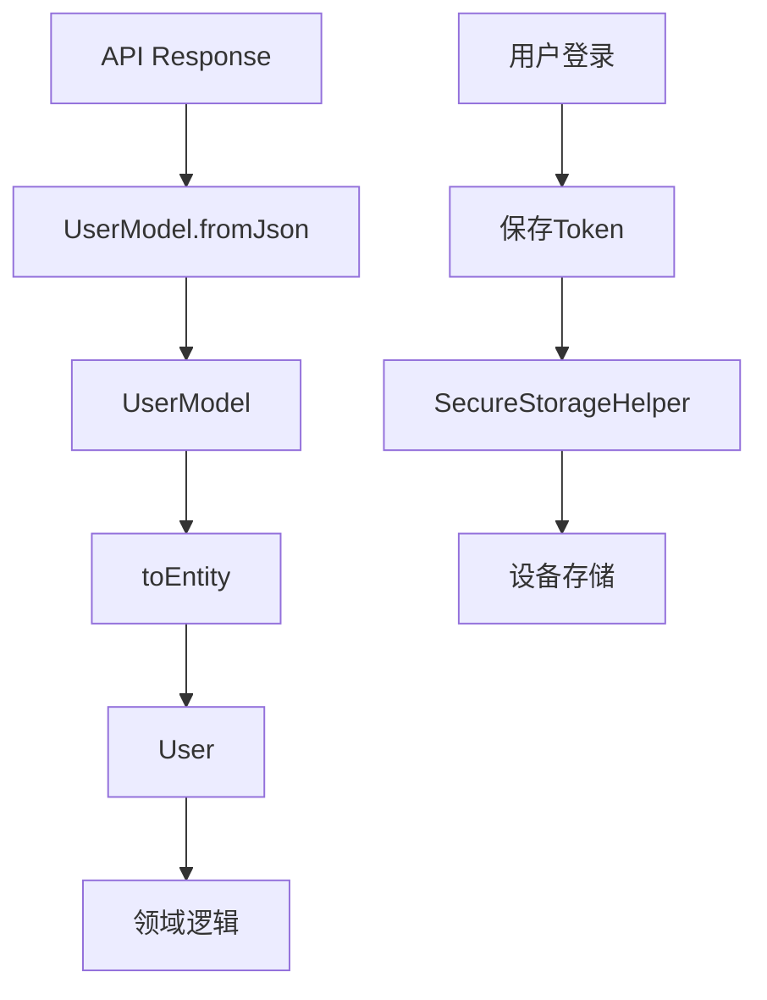
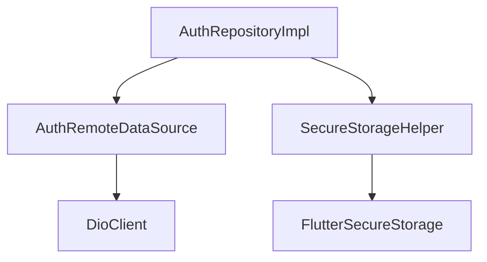

# 用户领域模型

<cite>
**本文档引用的文件**  
- [user.dart](file://flutter_app/lib/domain/entities/user.dart)
- [auth_repository.dart](file://flutter_app/lib/domain/repositories/auth_repository.dart)
- [auth_repository_impl.dart](file://flutter_app/lib/data/repositories/auth_repository_impl.dart)
- [auth_bloc.dart](file://flutter_app/lib/presentation/auth/bloc/auth_bloc.dart)
- [auth_event.dart](file://flutter_app/lib/presentation/auth/bloc/auth_event.dart)
- [auth_state.dart](file://flutter_app/lib/presentation/auth/bloc/auth_state.dart)
- [auth_remote_data_source.dart](file://flutter_app/lib/data/datasources/remote/auth_remote_data_source.dart)
- [user_model.dart](file://flutter_app/lib/data/models/user_model.dart)
- [secure_storage_helper.dart](file://flutter_app/lib/core/storage/secure_storage_helper.dart)
- [failures.dart](file://flutter_app/lib/core/error/failures.dart)
- [exceptions.dart](file://flutter_app/lib/core/error/exceptions.dart)
- [login_page.dart](file://flutter_app/lib/presentation/auth/pages/login_page.dart)
- [register_page.dart](file://flutter_app/lib/presentation/auth/pages/register_page.dart)
- [injection.dart](file://flutter_app/lib/core/di/injection.dart)
</cite>

## 目录
1. [简介](#简介)
2. [项目结构](#项目结构)
3. [核心组件](#核心组件)
4. [架构概览](#架构概览)
5. [详细组件分析](#详细组件分析)
6. [依赖分析](#依赖分析)
7. [性能考虑](#性能考虑)
8. [故障排除指南](#故障排除指南)
9. [结论](#结论)

## 简介
本文档深入解析用户领域模型的设计与实现，重点阐述 `user.dart` 中定义的 `User` 实体类如何封装用户核心属性（如ID、用户名、邮箱等）及其不可变性原则。说明该实体在认证流程中的作用，以及如何通过 `auth_repository.dart` 中的 `AuthRepository` 接口抽象用户登录、注册、信息获取等业务操作。结合代码示例展示领域层如何与数据层解耦，确保业务逻辑独立于具体实现。解释该模块在BLoC状态管理中的数据流转过程，并提供常见问题（如用户状态同步失败）的排查方法与性能优化建议。

## 项目结构
本项目采用标准的Flutter Clean Architecture分层结构，将代码划分为清晰的层次：`domain`（领域层）、`data`（数据层）、`presentation`（表现层）和`core`（核心工具层）。这种分层设计确保了高内聚、低耦合，便于维护和测试。

**图示来源**
- [user.dart](file://flutter_app/lib/domain/entities/user.dart)
- [auth_repository.dart](file://flutter_app/lib/domain/repositories/auth_repository.dart)
- [auth_repository_impl.dart](file://flutter_app/lib/data/repositories/auth_repository_impl.dart)
- [auth_remote_data_source.dart](file://flutter_app/lib/data/datasources/remote/auth_remote_data_source.dart)
- [user_model.dart](file://flutter_app/lib/data/models/user_model.dart)
- [secure_storage_helper.dart](file://flutter_app/lib/core/storage/secure_storage_helper.dart)
- [failures.dart](file://flutter_app/lib/core/error/failures.dart)
- [exceptions.dart](file://flutter_app/lib/core/error/exceptions.dart)
- [injection.dart](file://flutter_app/lib/core/di/injection.dart)
- [auth_bloc.dart](file://flutter_app/lib/presentation/auth/bloc/auth_bloc.dart)
- [auth_event.dart](file://flutter_app/lib/presentation/auth/bloc/auth_event.dart)
- [auth_state.dart](file://flutter_app/lib/presentation/auth/bloc/auth_state.dart)
- [login_page.dart](file://flutter_app/lib/presentation/auth/pages/login_page.dart)
- [register_page.dart](file://flutter_app/lib/presentation/auth/pages/register_page.dart)

**本节来源**
- [user.dart](file://flutter_app/lib/domain/entities/user.dart)
- [auth_repository.dart](file://flutter_app/lib/domain/repositories/auth_repository.dart)

## 核心组件
用户领域模型的核心在于 `User` 实体和 `AuthRepository` 接口。`User` 实体封装了用户的核心属性，遵循不可变性原则，确保数据一致性。`AuthRepository` 接口定义了认证相关的业务契约，将领域逻辑与具体实现分离。

**本节来源**
- [user.dart](file://flutter_app/lib/domain/entities/user.dart#L1-L32)
- [auth_repository.dart](file://flutter_app/lib/domain/repositories/auth_repository.dart#L1-L46)

## 架构概览
系统采用Clean Architecture模式，通过多层分离关注点。表现层通过BLoC模式管理状态，领域层定义业务实体和接口，数据层实现具体的数据访问逻辑，核心层提供通用工具和异常处理。

**图示来源**
- [auth_bloc.dart](file://flutter_app/lib/presentation/auth/bloc/auth_bloc.dart#L1-L82)
- [auth_repository.dart](file://flutter_app/lib/domain/repositories/auth_repository.dart#L1-L46)
- [auth_repository_impl.dart](file://flutter_app/lib/data/repositories/auth_repository_impl.dart#L1-L114)
- [auth_remote_data_source.dart](file://flutter_app/lib/data/datasources/remote/auth_remote_data_source.dart#L1-L77)
- [secure_storage_helper.dart](file://flutter_app/lib/core/storage/secure_storage_helper.dart#L1-L194)

## 详细组件分析
本节深入分析用户领域模型的关键组件，包括实体类、仓库接口、BLoC状态管理和数据源实现。

### 用户实体分析
`User` 实体类位于领域层，是用户信息的核心表示。它通过`final`关键字确保所有属性的不可变性，防止在应用运行时被意外修改。该类继承自`Equatable`，通过重写`props`方法实现值相等性比较，这对于状态管理至关重要。

**图示来源**
- [user.dart](file://flutter_app/lib/domain/entities/user.dart#L1-L32)

**本节来源**
- [user.dart](file://flutter_app/lib/domain/entities/user.dart#L1-L32)

### 认证仓库分析
`AuthRepository` 是一个抽象接口，定义了认证功能的业务契约。它使用`Either<Failure, User>`类型安全地处理成功和失败结果，避免了异常的滥用。具体实现由`AuthRepositoryImpl`提供，实现了登录、注册、获取用户信息和登出等方法。

**图示来源**
- [auth_repository.dart](file://flutter_app/lib/domain/repositories/auth_repository.dart#L1-L46)
- [auth_repository_impl.dart](file://flutter_app/lib/data/repositories/auth_repository_impl.dart#L1-L114)

**本节来源**
- [auth_repository.dart](file://flutter_app/lib/domain/repositories/auth_repository.dart#L1-L46)
- [auth_repository_impl.dart](file://flutter_app/lib/data/repositories/auth_repository_impl.dart#L1-L114)

### BLoC状态管理分析
BLoC（Business Logic Component）模式用于管理认证相关的状态流转。`AuthBloc` 监听 `AuthEvent` 并根据业务逻辑转换为 `AuthState`。这种响应式模式使得UI能够根据状态变化自动更新。

**图示来源**
- [auth_bloc.dart](file://flutter_app/lib/presentation/auth/bloc/auth_bloc.dart#L1-L82)
- [auth_event.dart](file://flutter_app/lib/presentation/auth/bloc/auth_event.dart#L1-L50)
- [auth_state.dart](file://flutter_app/lib/presentation/auth/bloc/auth_state.dart#L1-L46)
- [auth_repository.dart](file://flutter_app/lib/domain/repositories/auth_repository.dart#L1-L46)

**本节来源**
- [auth_bloc.dart](file://flutter_app/lib/presentation/auth/bloc/auth_bloc.dart#L1-L82)
- [auth_event.dart](file://flutter_app/lib/presentation/auth/bloc/auth_event.dart#L1-L50)
- [auth_state.dart](file://flutter_app/lib/presentation/auth/bloc/auth_state.dart#L1-L46)

### 数据源与模型分析
数据层通过`UserModel`实现JSON序列化，并与领域层的`User`实体进行转换。`AuthRemoteDataSource`负责与后端API通信，而`SecureStorageHelper`则安全地存储认证令牌。

**图示来源**
- [user_model.dart](file://flutter_app/lib/data/models/user_model.dart#L1-L44)
- [auth_remote_data_source.dart](file://flutter_app/lib/data/datasources/remote/auth_remote_data_source.dart#L1-L77)
- [secure_storage_helper.dart](file://flutter_app/lib/core/storage/secure_storage_helper.dart#L1-L194)

**本节来源**
- [user_model.dart](file://flutter_app/lib/data/models/user_model.dart#L1-L44)
- [auth_remote_data_source.dart](file://flutter_app/lib/data/datasources/remote/auth_remote_data_source.dart#L1-L77)
- [secure_storage_helper.dart](file://flutter_app/lib/core/storage/secure_storage_helper.dart#L1-L194)

## 依赖分析
系统通过依赖注入（DI）管理组件间的依赖关系。`AuthRepositoryImpl` 依赖于 `AuthRemoteDataSource` 和 `SecureStorageHelper`，这些依赖通过 `injection.dart` 配置自动注入，确保了松耦合和可测试性。

**图示来源**
- [auth_repository_impl.dart](file://flutter_app/lib/data/repositories/auth_repository_impl.dart#L1-L114)
- [injection.dart](file://flutter_app/lib/core/di/injection.dart#L1-L61)

**本节来源**
- [auth_repository_impl.dart](file://flutter_app/lib/data/repositories/auth_repository_impl.dart#L1-L114)
- [injection.dart](file://flutter_app/lib/core/di/injection.dart#L1-L61)

## 性能考虑
为优化性能，系统采用了多项策略：使用`Equatable`减少不必要的UI重建，通过安全存储缓存认证状态避免重复登录，以及在BLoC中合理管理加载状态提升用户体验。此外，网络请求使用Dio客户端并配置了超时机制，防止长时间等待。

## 故障排除指南
常见问题包括用户状态不同步和认证失败。排查时应首先检查`SecureStorageHelper`是否正确读写令牌，确认`AuthRepositoryImpl`的异常处理逻辑是否覆盖所有场景，并验证BLoC的状态转换是否符合预期。使用`AppLogger`记录关键步骤有助于定位问题。

**本节来源**
- [secure_storage_helper.dart](file://flutter_app/lib/core/storage/secure_storage_helper.dart#L1-L194)
- [auth_repository_impl.dart](file://flutter_app/lib/data/repositories/auth_repository_impl.dart#L1-L114)
- [auth_bloc.dart](file://flutter_app/lib/presentation/auth/bloc/auth_bloc.dart#L1-L82)
- [exceptions.dart](file://flutter_app/lib/core/error/exceptions.dart#L1-L110)
- [failures.dart](file://flutter_app/lib/core/error/failures.dart#L1-L157)

## 结论
用户领域模型通过清晰的分层架构和契约定义，实现了高内聚、低耦合的设计。`User`实体的不可变性保证了数据完整性，`AuthRepository`接口抽象了业务逻辑，BLoC模式有效管理了状态流转。该设计不仅提升了代码的可维护性和可测试性，也为未来的功能扩展奠定了坚实基础。