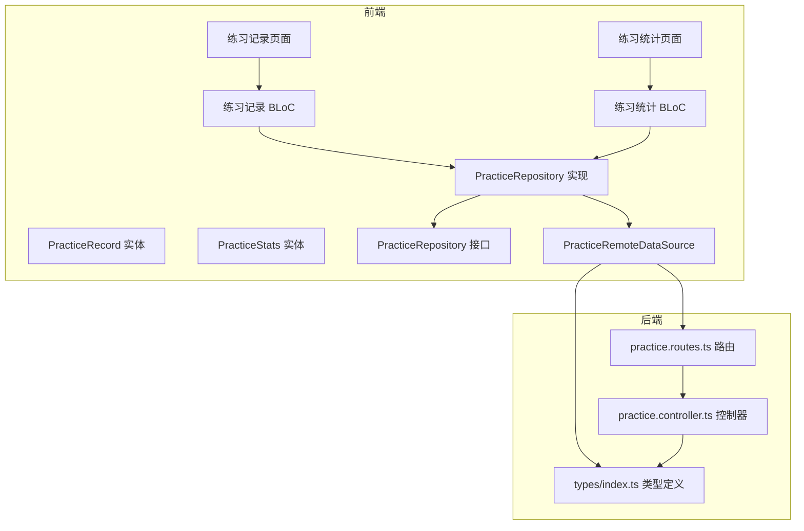
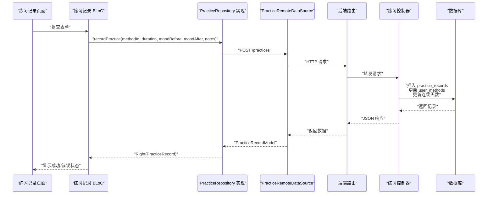
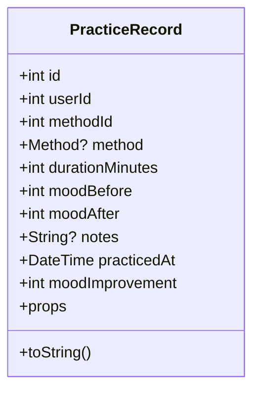
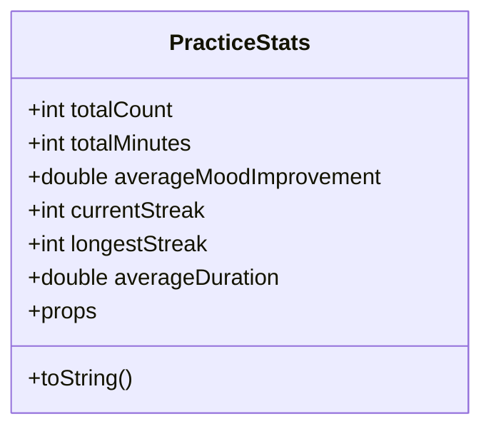
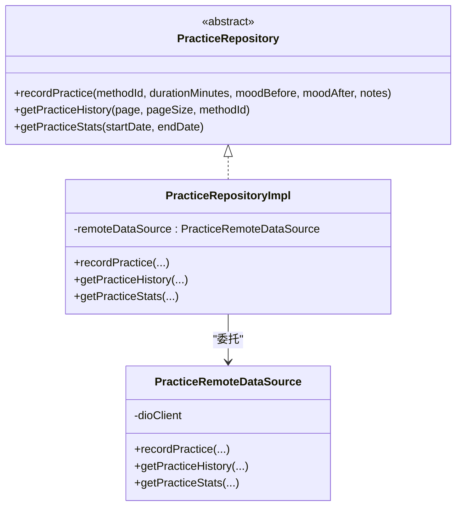
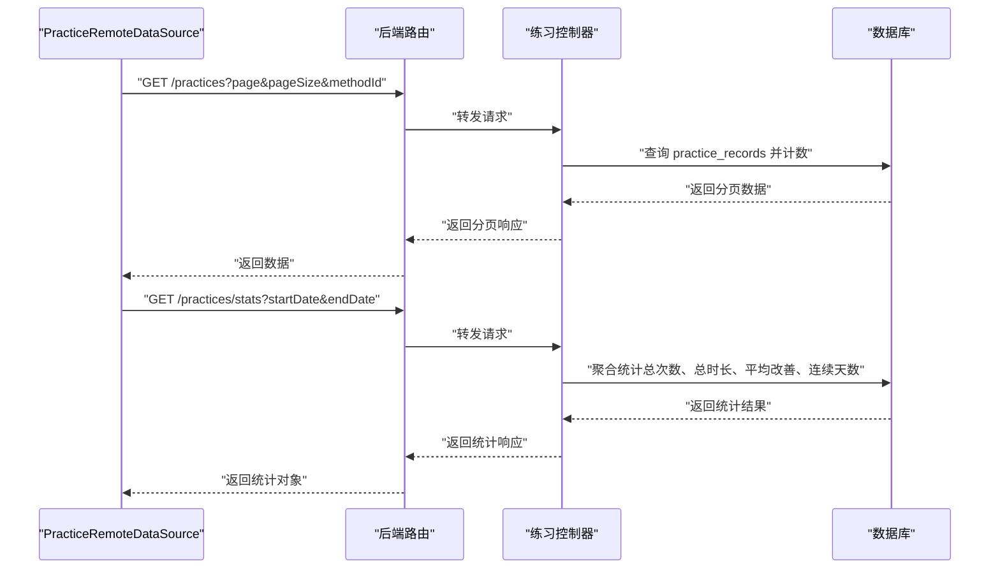
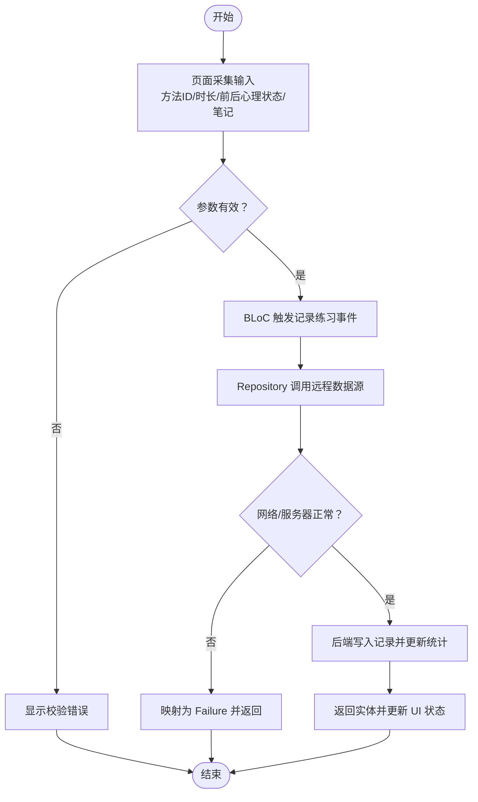
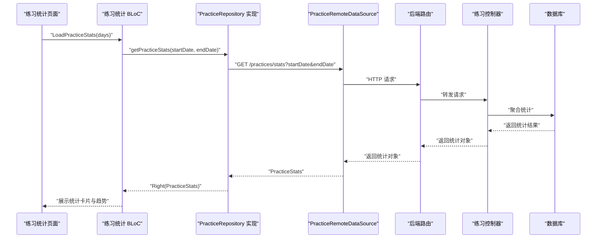
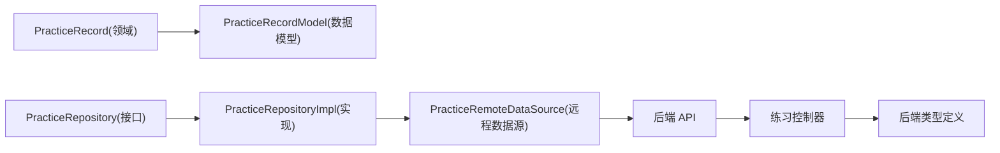

# 练习领域模型

<cite>
**本文引用的文件**
- [flutter_app/lib/domain/entities/practice_record.dart](file://flutter_app/lib/domain/entities/practice_record.dart)
- [flutter_app/lib/domain/entities/practice_stats.dart](file://flutter_app/lib/domain/entities/practice_stats.dart)
- [flutter_app/lib/domain/repositories/practice_repository.dart](file://flutter_app/lib/domain/repositories/practice_repository.dart)
- [flutter_app/lib/data/repositories/practice_repository_impl.dart](file://flutter_app/lib/data/repositories/practice_repository_impl.dart)
- [flutter_app/lib/data/datasources/remote/practice_remote_data_source.dart](file://flutter_app/lib/data/datasources/remote/practice_remote_data_source.dart)
- [flutter_app/lib/data/models/practice_record_model.dart](file://flutter_app/lib/data/models/practice_record_model.dart)
- [flutter_app/lib/core/error/exceptions.dart](file://flutter_app/lib/core/error/exceptions.dart)
- [flutter_app/lib/core/error/failures.dart](file://flutter_app/lib/core/error/failures.dart)
- [backend/src/controllers/practice.controller.ts](file://backend/src/controllers/practice.controller.ts)
- [backend/src/routes/practice.routes.ts](file://backend/src/routes/practice.routes.ts)
- [backend/src/types/index.ts](file://backend/src/types/index.ts)
- [flutter_app/lib/presentation/practice/bloc/practice_record_bloc.dart](file://flutter_app/lib/presentation/practice/bloc/practice_record_bloc.dart)
- [flutter_app/lib/presentation/practice/pages/practice_record_create_page.dart](file://flutter_app/lib/presentation/practice/pages/practice_record_create_page.dart)
- [flutter_app/lib/presentation/practice/bloc/practice_stats_bloc.dart](file://flutter_app/lib/presentation/practice/bloc/practice_stats_bloc.dart)
- [flutter_app/lib/presentation/practice/pages/practice_stats_page.dart](file://flutter_app/lib/presentation/practice/pages/practice_stats_page.dart)
- [flutter_app/lib/config/api_constants.dart](file://flutter_app/lib/config/api_constants.dart)
</cite>

## 目录
1. [简介](#简介)
2. [项目结构](#项目结构)
3. [核心组件](#核心组件)
4. [架构总览](#架构总览)
5. [详细组件分析](#详细组件分析)
6. [依赖关系分析](#依赖关系分析)
7. [性能考量](#性能考量)
8. [故障排查指南](#故障排查指南)
9. [结论](#结论)
10. [附录](#附录)

## 简介
本文件系统性解析“练习记录与统计”领域的模型设计，围绕以下目标展开：
- 深入说明 PracticeRecord 实体如何封装单次练习的核心数据（如方法ID、练习时长、情绪变化等）
- 阐述 PracticeStats 实体如何聚合用户练习行为的统计信息
- 解释 PracticeRepository 接口定义的创建记录、查询历史、获取统计等业务方法
- 结合练习流程说明领域模型在数据采集、持久化与分析中的作用
- 分析该模块与用户、方法领域的关联关系
- 提供处理高频率练习记录写入的优化策略与异常处理机制

## 项目结构
练习领域模型位于 Flutter 前端与 Express 后端之间，采用清晰的分层与职责分离：
- 前端领域层：定义 PracticeRecord、PracticeStats 实体与 PracticeRepository 接口
- 前端数据层：实现 PracticeRepository 接口，调用远程数据源（PracticeRemoteDataSource）
- 前端展示层：通过 BLoC 管理状态，页面负责采集用户输入并触发业务事件
- 后端控制层：实现练习记录创建、历史查询、统计分析的业务逻辑
- 类型定义：前后端共享的 PracticeRecord 类型接口

**图表来源**
- [flutter_app/lib/domain/entities/practice_record.dart](file://flutter_app/lib/domain/entities/practice_record.dart#L1-L67)
- [flutter_app/lib/domain/entities/practice_stats.dart](file://flutter_app/lib/domain/entities/practice_stats.dart#L1-L47)
- [flutter_app/lib/domain/repositories/practice_repository.dart](file://flutter_app/lib/domain/repositories/practice_repository.dart#L1-L48)
- [flutter_app/lib/data/repositories/practice_repository_impl.dart](file://flutter_app/lib/data/repositories/practice_repository_impl.dart#L1-L83)
- [flutter_app/lib/data/datasources/remote/practice_remote_data_source.dart](file://flutter_app/lib/data/datasources/remote/practice_remote_data_source.dart#L1-L101)
- [flutter_app/lib/presentation/practice/pages/practice_record_create_page.dart](file://flutter_app/lib/presentation/practice/pages/practice_record_create_page.dart#L53-L380)
- [flutter_app/lib/presentation/practice/pages/practice_stats_page.dart](file://flutter_app/lib/presentation/practice/pages/practice_stats_page.dart#L39-L327)
- [flutter_app/lib/presentation/practice/bloc/practice_record_bloc.dart](file://flutter_app/lib/presentation/practice/bloc/practice_record_bloc.dart#L6-L35)
- [flutter_app/lib/presentation/practice/bloc/practice_stats_bloc.dart](file://flutter_app/lib/presentation/practice/bloc/practice_stats_bloc.dart#L6-L54)
- [backend/src/controllers/practice.controller.ts](file://backend/src/controllers/practice.controller.ts#L1-L261)
- [backend/src/routes/practice.routes.ts](file://backend/src/routes/practice.routes.ts#L1-L20)
- [backend/src/types/index.ts](file://backend/src/types/index.ts#L50-L126)

**章节来源**
- [flutter_app/lib/domain/entities/practice_record.dart](file://flutter_app/lib/domain/entities/practice_record.dart#L1-L67)
- [flutter_app/lib/domain/entities/practice_stats.dart](file://flutter_app/lib/domain/entities/practice_stats.dart#L1-L47)
- [flutter_app/lib/domain/repositories/practice_repository.dart](file://flutter_app/lib/domain/repositories/practice_repository.dart#L1-L48)
- [flutter_app/lib/data/repositories/practice_repository_impl.dart](file://flutter_app/lib/data/repositories/practice_repository_impl.dart#L1-L83)
- [flutter_app/lib/data/datasources/remote/practice_remote_data_source.dart](file://flutter_app/lib/data/datasources/remote/practice_remote_data_source.dart#L1-L101)
- [backend/src/controllers/practice.controller.ts](file://backend/src/controllers/practice.controller.ts#L1-L261)
- [backend/src/routes/practice.routes.ts](file://backend/src/routes/practice.routes.ts#L1-L20)
- [backend/src/types/index.ts](file://backend/src/types/index.ts#L50-L126)

## 核心组件
- PracticeRecord 实体：封装单次练习的关键字段，包括用户ID、方法ID、练习时长、练习前后心理状态、笔记、练习时间等；提供派生属性“心理状态改善程度”
- PracticeStats 实体：封装统计维度，包括总次数、总时长、平均心理状态改善、当前连续天数、最长连续天数；提供派生属性“平均每次练习时长”
- PracticeRepository 接口：定义记录练习、获取历史、获取统计三个核心业务方法，统一返回 Either<Failure, Data> 错误安全模式
- PracticeRepository 实现：面向接口编程，委托远程数据源完成网络请求，并将异常转换为 Failure
- PracticeRemoteDataSource：封装 HTTP 请求，负责序列化/反序列化，将 Dio 异常映射为应用异常
- 前端 BLoC 与页面：负责采集用户输入、触发业务事件、展示状态与错误

**章节来源**
- [flutter_app/lib/domain/entities/practice_record.dart](file://flutter_app/lib/domain/entities/practice_record.dart#L1-L67)
- [flutter_app/lib/domain/entities/practice_stats.dart](file://flutter_app/lib/domain/entities/practice_stats.dart#L1-L47)
- [flutter_app/lib/domain/repositories/practice_repository.dart](file://flutter_app/lib/domain/repositories/practice_repository.dart#L1-L48)
- [flutter_app/lib/data/repositories/practice_repository_impl.dart](file://flutter_app/lib/data/repositories/practice_repository_impl.dart#L1-L83)
- [flutter_app/lib/data/datasources/remote/practice_remote_data_source.dart](file://flutter_app/lib/data/datasources/remote/practice_remote_data_source.dart#L1-L101)
- [flutter_app/lib/presentation/practice/bloc/practice_record_bloc.dart](file://flutter_app/lib/presentation/practice/bloc/practice_record_bloc.dart#L6-L35)
- [flutter_app/lib/presentation/practice/pages/practice_record_create_page.dart](file://flutter_app/lib/presentation/practice/pages/practice_record_create_page.dart#L53-L380)
- [flutter_app/lib/presentation/practice/bloc/practice_stats_bloc.dart](file://flutter_app/lib/presentation/practice/bloc/practice_stats_bloc.dart#L6-L54)
- [flutter_app/lib/presentation/practice/pages/practice_stats_page.dart](file://flutter_app/lib/presentation/practice/pages/practice_stats_page.dart#L39-L327)

## 架构总览
从“练习记录创建”到“统计展示”的完整链路如下：
- 页面采集用户输入（方法ID、时长、前后心理状态、笔记）
- BLoC 触发记录练习事件
- Repository 将参数传递给远程数据源
- 远程数据源发起 HTTP 请求，后端控制器校验参数并写入数据库
- 后端同时更新用户方法统计与连续天数
- 前端接收返回实体并更新 UI 状态

**图表来源**
- [flutter_app/lib/presentation/practice/pages/practice_record_create_page.dart](file://flutter_app/lib/presentation/practice/pages/practice_record_create_page.dart#L53-L380)
- [flutter_app/lib/presentation/practice/bloc/practice_record_bloc.dart](file://flutter_app/lib/presentation/practice/bloc/practice_record_bloc.dart#L6-L35)
- [flutter_app/lib/data/repositories/practice_repository_impl.dart](file://flutter_app/lib/data/repositories/practice_repository_impl.dart#L1-L83)
- [flutter_app/lib/data/datasources/remote/practice_remote_data_source.dart](file://flutter_app/lib/data/datasources/remote/practice_remote_data_source.dart#L1-L101)
- [backend/src/routes/practice.routes.ts](file://backend/src/routes/practice.routes.ts#L1-L20)
- [backend/src/controllers/practice.controller.ts](file://backend/src/controllers/practice.controller.ts#L1-L261)

## 详细组件分析

### PracticeRecord 实体
- 字段设计覆盖练习全过程关键信息：用户ID、方法ID、练习时长（分钟）、练习前后心理状态（1-10）、笔记、练习时间
- 派生属性“心理状态改善程度”便于统计与 UI 展示
- 与 Method 可选关联，支持在历史列表中直接展示方法信息
- 作为领域实体，遵循不可变性与相等性比较（基于 props）

**图表来源**
- [flutter_app/lib/domain/entities/practice_record.dart](file://flutter_app/lib/domain/entities/practice_record.dart#L1-L67)

**章节来源**
- [flutter_app/lib/domain/entities/practice_record.dart](file://flutter_app/lib/domain/entities/practice_record.dart#L1-L67)

### PracticeStats 实体
- 聚合维度：总次数、总时长、平均心理状态改善、当前连续天数、最长连续天数
- 派生属性“平均每次练习时长”，避免重复计算
- 作为只读统计载体，便于 UI 卡片化展示

**图表来源**
- [flutter_app/lib/domain/entities/practice_stats.dart](file://flutter_app/lib/domain/entities/practice_stats.dart#L1-L47)

**章节来源**
- [flutter_app/lib/domain/entities/practice_stats.dart](file://flutter_app/lib/domain/entities/practice_stats.dart#L1-L47)

### PracticeRepository 接口与实现
- 接口定义三类业务方法：记录练习、获取历史、获取统计，统一返回 Either<Failure, Data>
- 实现类将异常转换为 Failure：网络异常映射为 NetworkFailure，服务器异常映射为 ServerFailure，其他映射为 UnknownFailure
- 远程数据源负责 HTTP 请求与 JSON 序列化/反序列化

**图表来源**
- [flutter_app/lib/domain/repositories/practice_repository.dart](file://flutter_app/lib/domain/repositories/practice_repository.dart#L1-L48)
- [flutter_app/lib/data/repositories/practice_repository_impl.dart](file://flutter_app/lib/data/repositories/practice_repository_impl.dart#L1-L83)
- [flutter_app/lib/data/datasources/remote/practice_remote_data_source.dart](file://flutter_app/lib/data/datasources/remote/practice_remote_data_source.dart#L1-L101)

**章节来源**
- [flutter_app/lib/domain/repositories/practice_repository.dart](file://flutter_app/lib/domain/repositories/practice_repository.dart#L1-L48)
- [flutter_app/lib/data/repositories/practice_repository_impl.dart](file://flutter_app/lib/data/repositories/practice_repository_impl.dart#L1-L83)
- [flutter_app/lib/data/datasources/remote/practice_remote_data_source.dart](file://flutter_app/lib/data/datasources/remote/practice_remote_data_source.dart#L1-L101)

### 远程数据源与后端集成
- 远程数据源通过 DioClient 发起请求，将请求参数按约定字段发送至后端
- 后端控制器对请求进行鉴权与参数校验，写入 practice_records 表，并同步更新 user_methods 的累计次数、总时长与连续天数
- 统计接口返回前端所需的聚合指标

**图表来源**
- [flutter_app/lib/data/datasources/remote/practice_remote_data_source.dart](file://flutter_app/lib/data/datasources/remote/practice_remote_data_source.dart#L1-L101)
- [backend/src/controllers/practice.controller.ts](file://backend/src/controllers/practice.controller.ts#L101-L261)
- [backend/src/routes/practice.routes.ts](file://backend/src/routes/practice.routes.ts#L1-L20)

**章节来源**
- [flutter_app/lib/data/datasources/remote/practice_remote_data_source.dart](file://flutter_app/lib/data/datasources/remote/practice_remote_data_source.dart#L1-L101)
- [backend/src/controllers/practice.controller.ts](file://backend/src/controllers/practice.controller.ts#L101-L261)
- [backend/src/routes/practice.routes.ts](file://backend/src/routes/practice.routes.ts#L1-L20)

### 练习流程与数据采集
- 页面采集：方法选择、时长滑块、前后心理状态评分、可选笔记
- BLoC 事件：将用户输入封装为事件，调用 Repository
- Repository 返回 Either，BLoC 转换为 UI 状态，页面展示成功或错误提示

**图表来源**
- [flutter_app/lib/presentation/practice/pages/practice_record_create_page.dart](file://flutter_app/lib/presentation/practice/pages/practice_record_create_page.dart#L53-L380)
- [flutter_app/lib/presentation/practice/bloc/practice_record_bloc.dart](file://flutter_app/lib/presentation/practice/bloc/practice_record_bloc.dart#L6-L35)
- [flutter_app/lib/data/repositories/practice_repository_impl.dart](file://flutter_app/lib/data/repositories/practice_repository_impl.dart#L1-L83)
- [backend/src/controllers/practice.controller.ts](file://backend/src/controllers/practice.controller.ts#L1-L98)

**章节来源**
- [flutter_app/lib/presentation/practice/pages/practice_record_create_page.dart](file://flutter_app/lib/presentation/practice/pages/practice_record_create_page.dart#L53-L380)
- [flutter_app/lib/presentation/practice/bloc/practice_record_bloc.dart](file://flutter_app/lib/presentation/practice/bloc/practice_record_bloc.dart#L6-L35)
- [flutter_app/lib/data/repositories/practice_repository_impl.dart](file://flutter_app/lib/data/repositories/practice_repository_impl.dart#L1-L83)
- [backend/src/controllers/practice.controller.ts](file://backend/src/controllers/practice.controller.ts#L1-L98)

### 统计页面与数据聚合
- 页面通过 BLoC 加载统计，支持时间范围切换
- Repository 获取统计接口，返回 PracticeStats 实体
- UI 展示关键指标卡片与趋势说明

**图表来源**
- [flutter_app/lib/presentation/practice/pages/practice_stats_page.dart](file://flutter_app/lib/presentation/practice/pages/practice_stats_page.dart#L39-L327)
- [flutter_app/lib/presentation/practice/bloc/practice_stats_bloc.dart](file://flutter_app/lib/presentation/practice/bloc/practice_stats_bloc.dart#L6-L54)
- [flutter_app/lib/data/repositories/practice_repository_impl.dart](file://flutter_app/lib/data/repositories/practice_repository_impl.dart#L63-L81)
- [flutter_app/lib/data/datasources/remote/practice_remote_data_source.dart](file://flutter_app/lib/data/datasources/remote/practice_remote_data_source.dart#L60-L101)
- [backend/src/controllers/practice.controller.ts](file://backend/src/controllers/practice.controller.ts#L174-L261)

**章节来源**
- [flutter_app/lib/presentation/practice/pages/practice_stats_page.dart](file://flutter_app/lib/presentation/practice/pages/practice_stats_page.dart#L39-L327)
- [flutter_app/lib/presentation/practice/bloc/practice_stats_bloc.dart](file://flutter_app/lib/presentation/practice/bloc/practice_stats_bloc.dart#L6-L54)
- [flutter_app/lib/data/repositories/practice_repository_impl.dart](file://flutter_app/lib/data/repositories/practice_repository_impl.dart#L63-L81)
- [flutter_app/lib/data/datasources/remote/practice_remote_data_source.dart](file://flutter_app/lib/data/datasources/remote/practice_remote_data_source.dart#L60-L101)
- [backend/src/controllers/practice.controller.ts](file://backend/src/controllers/practice.controller.ts#L174-L261)

## 依赖关系分析
- 前端领域层与数据层解耦：Repository 接口隔离了数据源细节
- 数据模型映射：PracticeRecordModel 从 JSON 构造实体，保持领域实体不变性
- 异常与失败：前端统一使用 Failure 类型，后端异常映射为应用异常，再转换为 Failure
- 后端类型：后端 PracticeRecord 接口与前端实体字段一致，便于跨端协作

**图表来源**
- [flutter_app/lib/domain/entities/practice_record.dart](file://flutter_app/lib/domain/entities/practice_record.dart#L1-L67)
- [flutter_app/lib/data/models/practice_record_model.dart](file://flutter_app/lib/data/models/practice_record_model.dart#L1-L93)
- [flutter_app/lib/domain/repositories/practice_repository.dart](file://flutter_app/lib/domain/repositories/practice_repository.dart#L1-L48)
- [flutter_app/lib/data/repositories/practice_repository_impl.dart](file://flutter_app/lib/data/repositories/practice_repository_impl.dart#L1-L83)
- [flutter_app/lib/data/datasources/remote/practice_remote_data_source.dart](file://flutter_app/lib/data/datasources/remote/practice_remote_data_source.dart#L1-L101)
- [backend/src/controllers/practice.controller.ts](file://backend/src/controllers/practice.controller.ts#L1-L261)
- [backend/src/types/index.ts](file://backend/src/types/index.ts#L50-L126)

**章节来源**
- [flutter_app/lib/data/models/practice_record_model.dart](file://flutter_app/lib/data/models/practice_record_model.dart#L1-L93)
- [backend/src/types/index.ts](file://backend/src/types/index.ts#L50-L126)

## 性能考量
- 高频写入优化建议
  - 批量写入：前端在短时间内多次提交时，可合并为批量请求（需后端支持）
  - 本地缓存：在网络不稳定时，先写入本地缓存，待网络恢复后异步回传
  - 去抖与节流：对滑块与输入控件的频繁变更进行去抖，减少无效请求
  - 分页与懒加载：历史查询使用分页，避免一次性加载大量数据
  - 前端缓存：对统计结果进行短期缓存，降低重复请求
- 后端优化建议
  - 数据库索引：确保 user_id + practice_date、user_id + method_id 的复合索引生效
  - 事务一致性：记录练习时使用事务，保证多表一致性
  - 统计聚合：统计接口使用数据库聚合函数，避免全量扫描

[本节为通用指导，不直接分析具体文件]

## 故障排查指南
- 常见异常与映射
  - 网络异常：映射为 NetworkFailure，前端显示网络错误提示
  - 服务器异常：映射为 ServerFailure，携带状态码，前端可区分 4xx/5xx
  - 未知异常：捕获后映射为 UnknownFailure，统一兜底
- 前端错误处理
  - Repository 实现中对异常进行分类并转换为 Failure
  - 页面监听 BLoC 状态，出现错误时弹出提示并允许重试
- 后端错误处理
  - 控制器对鉴权失败、参数缺失、评分范围非法等情况抛出 AppError
  - 统一返回 JSON 响应，前端通过 Dio 异常映射为应用异常

**章节来源**
- [flutter_app/lib/data/repositories/practice_repository_impl.dart](file://flutter_app/lib/data/repositories/practice_repository_impl.dart#L1-L83)
- [flutter_app/lib/core/error/exceptions.dart](file://flutter_app/lib/core/error/exceptions.dart#L1-L110)
- [flutter_app/lib/core/error/failures.dart](file://flutter_app/lib/core/error/failures.dart#L1-L157)
- [flutter_app/lib/presentation/practice/pages/practice_record_create_page.dart](file://flutter_app/lib/presentation/practice/pages/practice_record_create_page.dart#L53-L380)
- [backend/src/controllers/practice.controller.ts](file://backend/src/controllers/practice.controller.ts#L1-L98)

## 结论
本领域模型通过清晰的实体定义、接口抽象与错误安全模式，实现了从“采集—持久化—分析”的闭环。PracticeRecord 与 PracticeStats 分别承担“单次记录”与“聚合统计”的职责，Repository 抽象屏蔽了数据源差异，BLoC 与页面负责用户交互与状态管理。后端控制器在写入练习记录的同时维护用户方法统计与连续天数，形成完整的练习生态。针对高频写入与异常场景，建议引入批处理、本地缓存与去抖策略，并完善后端索引与事务保障。

[本节为总结性内容，不直接分析具体文件]

## 附录
- API 端点与超时配置
  - 练习相关端点：创建练习、获取练习、获取统计
  - 超时设置：连接与接收超时均为 15 秒
- 类型一致性
  - 前端 PracticeRecord 与后端 PracticeRecord 接口字段保持一致，便于跨端协作

**章节来源**
- [flutter_app/lib/config/api_constants.dart](file://flutter_app/lib/config/api_constants.dart#L23-L31)
- [flutter_app/lib/config/api_constants.dart](file://flutter_app/lib/config/api_constants.dart#L60-L62)
- [backend/src/types/index.ts](file://backend/src/types/index.ts#L50-L126)