# 领域层设计

<cite>
**本文档引用的文件**
- [user.dart](file://flutter_app/lib/domain/entities/user.dart)
- [method.dart](file://flutter_app/lib/domain/entities/method.dart)
- [practice_record.dart](file://flutter_app/lib/domain/entities/practice_record.dart)
- [user_method.dart](file://flutter_app/lib/domain/entities/user_method.dart)
- [auth_repository.dart](file://flutter_app/lib/domain/repositories/auth_repository.dart)
- [method_repository.dart](file://flutter_app/lib/domain/repositories/method_repository.dart)
- [practice_repository.dart](file://flutter_app/lib/domain/repositories/practice_repository.dart)
- [user_method_repository.dart](file://flutter_app/lib/domain/repositories/user_method_repository.dart)
- [auth_repository_impl.dart](file://flutter_app/lib/data/repositories/auth_repository_impl.dart)
- [method_repository_impl.dart](file://flutter_app/lib/data/repositories/method_repository_impl.dart)
- [user_model.dart](file://flutter_app/lib/data/models/user_model.dart)
- [method_model.dart](file://flutter_app/lib/data/models/method_model.dart)
- [auth_bloc.dart](file://flutter_app/lib/presentation/auth/bloc/auth_bloc.dart)
- [method_list_bloc.dart](file://flutter_app/lib/presentation/methods/bloc/method_list_bloc.dart)
- [practice_record_bloc.dart](file://flutter_app/lib/presentation/practice/bloc/practice_record_bloc.dart)
</cite>

## 目录
1. [引言](#引言)
2. [领域实体设计](#领域实体设计)
3. [仓库接口设计](#仓库接口设计)
4. [领域层与数据层的分离](#领域层与数据层的分离)
5. [领域层与表现层的交互](#领域层与表现层的交互)
6. [业务逻辑的独立性与可测试性](#业务逻辑的独立性与可测试性)
7. [领域驱动设计实践](#领域驱动设计实践)
8. [最佳实践与指导原则](#最佳实践与指导原则)

## 引言
nian移动端应用采用领域驱动设计（DDD）和分层架构，将业务逻辑集中在领域层。领域层作为应用的核心，定义了业务对象的不可变模型和业务规则，确保了业务逻辑的独立性和可测试性。本文档详细阐述了领域层的核心设计原则与实现规范，包括实体类、仓库接口的设计，以及领域层与数据层、表现层的交互边界。

## 领域实体设计

领域实体是业务对象的核心表示，定义了业务对象的不可变模型和核心属性。在nian应用中，领域实体位于`flutter_app/lib/domain/entities/`目录下，包括`user.dart`、`method.dart`、`practice_record.dart`和`user_method.dart`等文件。

所有领域实体都继承自`Equatable`类，通过重写`props`方法实现值对象的相等性比较，确保了实体的不可变性和一致性。实体的属性均为`final`类型，保证了状态的不可变性，避免了意外的状态修改。

### 用户实体（User）
`User`实体表示系统中的用户，包含用户ID、邮箱、昵称和注册时间等核心属性。该实体作为认证流程的核心业务对象，贯穿于登录、注册和用户信息获取等场景。

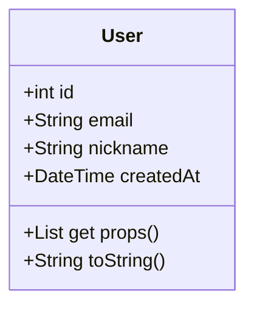

**Diagram sources**
- [user.dart](file://flutter_app/lib/domain/entities/user.dart#L6-L31)

### 心理方法实体（Method）
`Method`实体表示系统中的心理自助方法，包含方法ID、名称、描述、分类、难度、建议时长、媒体资源URL、内容JSON、浏览次数和创建时间等属性。该实体是方法管理功能的核心，支持方法的浏览、搜索和详情查看。

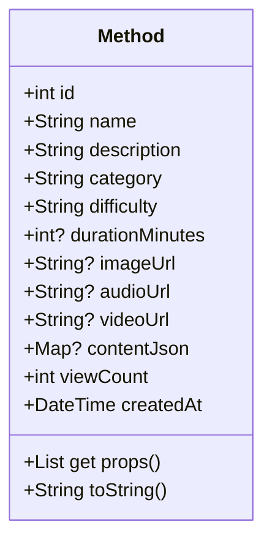

**Diagram sources**
- [method.dart](file://flutter_app/lib/domain/entities/method.dart#L6-L76)

### 练习记录实体（PracticeRecord）
`PracticeRecord`实体表示用户的练习记录，包含记录ID、用户ID、方法ID、关联的方法信息、练习时长、练习前后心理状态、练习笔记和练习时间等属性。该实体还定义了`moodImprovement`计算属性，用于计算心理状态的改善程度。

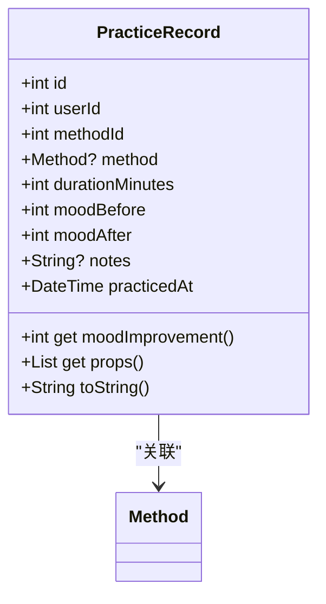

**Diagram sources**
- [practice_record.dart](file://flutter_app/lib/domain/entities/practice_record.dart#L7-L66)

### 用户方法实体（UserMethod）
`UserMethod`实体表示用户添加到个人库的方法，包含记录ID、用户ID、方法ID、关联的方法信息、个人目标、是否收藏、练习次数和添加时间等属性。该实体支持用户个性化方法库的管理。

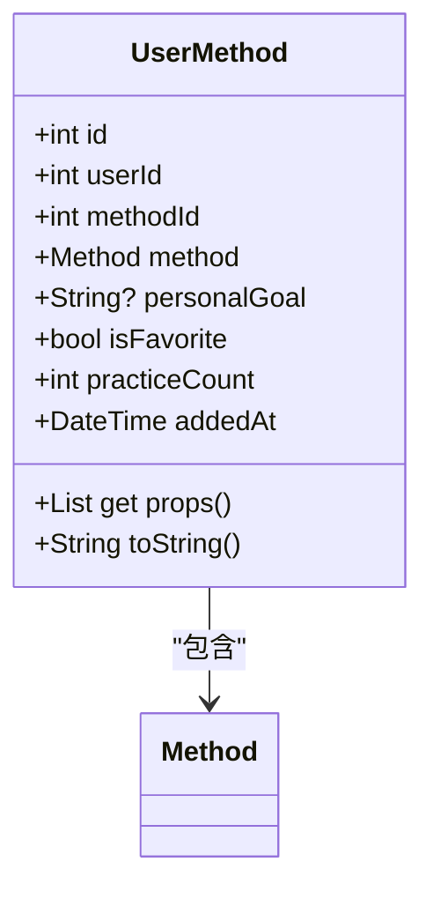

**Diagram sources**
- [user_method.dart](file://flutter_app/lib/domain/entities/user_method.dart#L7-L58)

**Section sources**
- [user.dart](file://flutter_app/lib/domain/entities/user.dart#L1-L32)
- [method.dart](file://flutter_app/lib/domain/entities/method.dart#L1-L77)
- [practice_record.dart](file://flutter_app/lib/domain/entities/practice_record.dart#L1-L67)
- [user_method.dart](file://flutter_app/lib/domain/entities/user_method.dart#L1-L59)

## 仓库接口设计

仓库接口（Repository Interface）是领域层的核心抽象，定义了数据访问的统一业务契约，屏蔽了数据源的具体实现细节。在nian应用中，仓库接口位于`flutter_app/lib/domain/repositories/`目录下，包括`auth_repository.dart`、`method_repository.dart`、`practice_repository.dart`和`user_method_repository.dart`等文件。

仓库接口采用抽象类（`abstract class`）定义，确保了接口的契约性。所有方法返回`Future<Either<Failure, T>>`类型，其中`Failure`表示可能的失败情况，`T`表示成功时的业务对象。这种设计模式实现了错误处理的显式化和类型安全。

### 认证仓库接口（AuthRepository）
`AuthRepository`接口定义了认证相关的业务契约，包括登录、注册、获取当前用户、登出和检查登录状态等操作。该接口是认证功能的核心抽象，确保了认证逻辑的统一性和可测试性。

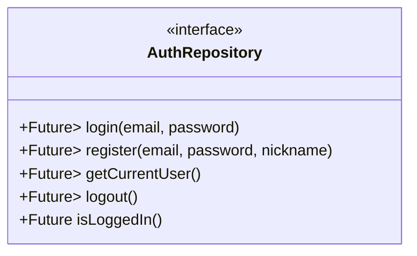

**Diagram sources**
- [auth_repository.dart](file://flutter_app/lib/domain/repositories/auth_repository.dart#L8-L45)

### 方法仓库接口（MethodRepository）
`MethodRepository`接口定义了方法管理相关的业务契约，包括获取方法列表、获取方法详情和搜索方法等操作。该接口支持分页、分类和难度筛选等功能。

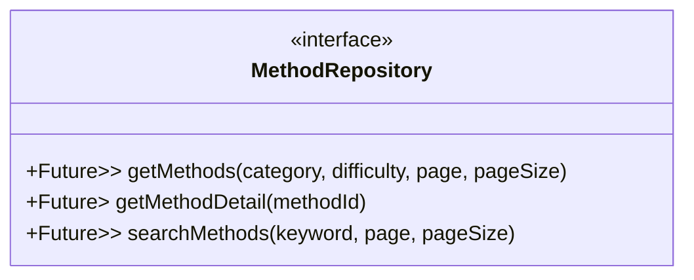

**Diagram sources**
- [method_repository.dart](file://flutter_app/lib/domain/repositories/method_repository.dart#L8-L40)

### 练习仓库接口（PracticeRepository）
`PracticeRepository`接口定义了练习记录相关的业务契约，包括记录练习、获取练习历史和获取练习统计等操作。该接口支持按方法ID筛选和日期范围统计等功能。

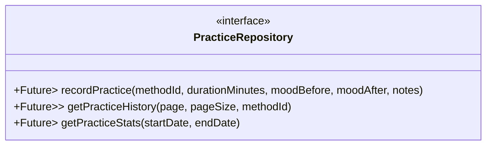

**Diagram sources**
- [practice_repository.dart](file://flutter_app/lib/domain/repositories/practice_repository.dart#L9-L47)

### 用户方法仓库接口（UserMethodRepository）
`UserMethodRepository`接口定义了用户方法库相关的业务契约，包括获取用户方法列表、添加方法到个人库、更新用户方法和从个人库移除方法等操作。

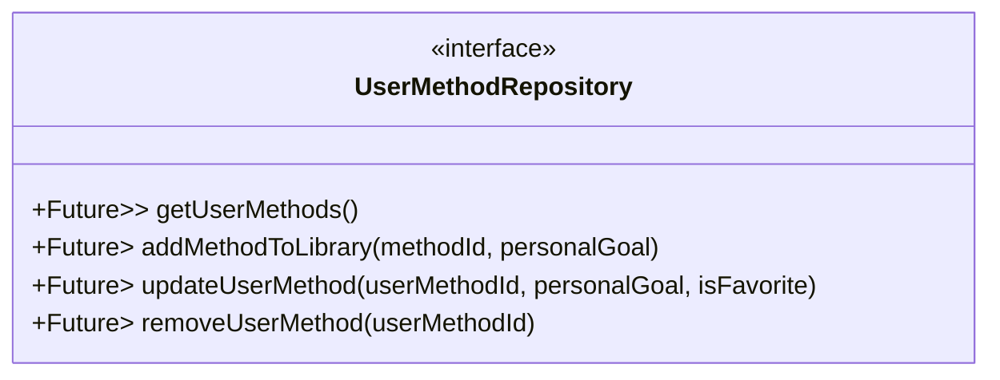

**Diagram sources**
- [user_method_repository.dart](file://flutter_app/lib/domain/repositories/user_method_repository.dart#L8-L41)

**Section sources**
- [auth_repository.dart](file://flutter_app/lib/domain/repositories/auth_repository.dart#L1-L46)
- [method_repository.dart](file://flutter_app/lib/domain/repositories/method_repository.dart#L1-L41)
- [practice_repository.dart](file://flutter_app/lib/domain/repositories/practice_repository.dart#L1-L48)
- [user_method_repository.dart](file://flutter_app/lib/domain/repositories/user_method_repository.dart#L1-L42)

## 领域层与数据层的分离

nian应用严格遵循分层架构原则，实现了领域层与数据层的完全分离。这种分离确保了业务逻辑的独立性，避免了对具体数据源实现的耦合。

### 数据模型与领域实体的映射
数据层使用数据模型（Data Model）进行JSON序列化和反序列化，而领域层使用领域实体（Domain Entity）表示业务对象。数据模型与领域实体之间通过`toEntity()`方法进行转换。

以`UserModel`为例，它继承自`User`实体，并提供了`fromJson`和`toJson`工厂方法用于JSON转换，以及`toEntity`方法用于转换为领域实体。

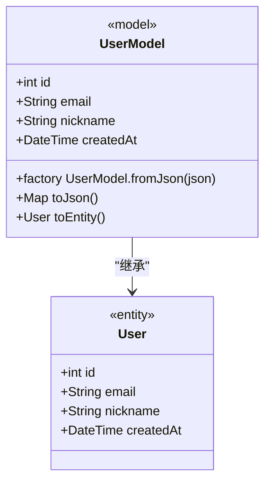

**Diagram sources**
- [user_model.dart](file://flutter_app/lib/data/models/user_model.dart#L6-L43)

### 仓库实现与依赖注入
仓库接口的具体实现位于`flutter_app/lib/data/repositories/`目录下，如`auth_repository_impl.dart`和`method_repository_impl.dart`。这些实现类依赖于远程数据源（Remote Data Source）和安全存储（Secure Storage），并通过构造函数注入依赖。

`AuthRepositoryImpl`的实现展示了如何组合多个数据源来完成复杂的业务逻辑，如登录操作需要调用远程API获取用户信息和Token，并将Token保存到安全存储中。

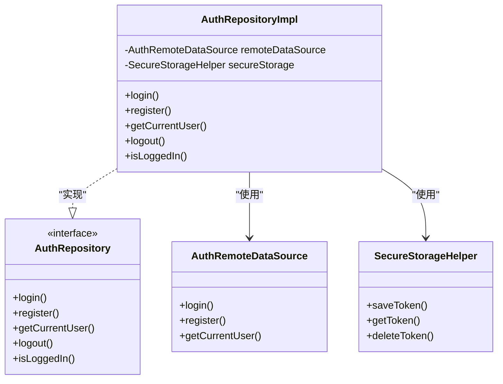

**Diagram sources**
- [auth_repository_impl.dart](file://flutter_app/lib/data/repositories/auth_repository_impl.dart#L11-L113)
- [auth_repository.dart](file://flutter_app/lib/domain/repositories/auth_repository.dart#L8-L45)

**Section sources**
- [user_model.dart](file://flutter_app/lib/data/models/user_model.dart#L1-L44)
- [method_model.dart](file://flutter_app/lib/data/models/method_model.dart#L1-L54)
- [auth_repository_impl.dart](file://flutter_app/lib/data/repositories/auth_repository_impl.dart#L1-L114)
- [method_repository_impl.dart](file://flutter_app/lib/data/repositories/method_repository_impl.dart#L1-L74)

## 领域层与表现层的交互

领域层通过BLoC（Business Logic Component）模式与表现层进行交互。BLoC作为中间层，负责协调领域层和UI层，处理用户事件并更新UI状态。

### 认证流程的领域层交互
在认证流程中，`AuthBloc`通过`AuthRepository`接口与领域层交互。当用户触发登录事件时，`AuthBloc`调用`authRepository.login()`方法，根据返回结果更新UI状态。

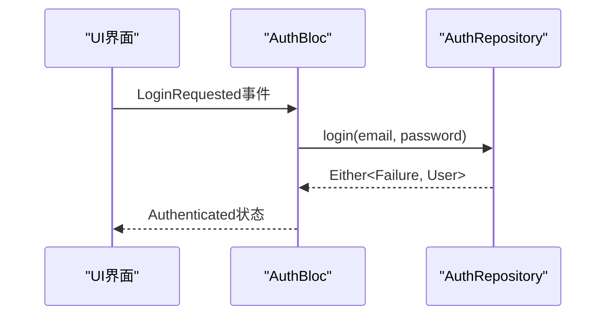

**Diagram sources**
- [auth_bloc.dart](file://flutter_app/lib/presentation/auth/bloc/auth_bloc.dart#L7-L81)

### 方法管理流程的领域层交互
在方法管理流程中，`MethodListBloc`通过`MethodRepository`接口获取方法列表。BLoC处理加载、筛选、分页和刷新等事件，确保了UI状态的正确管理。

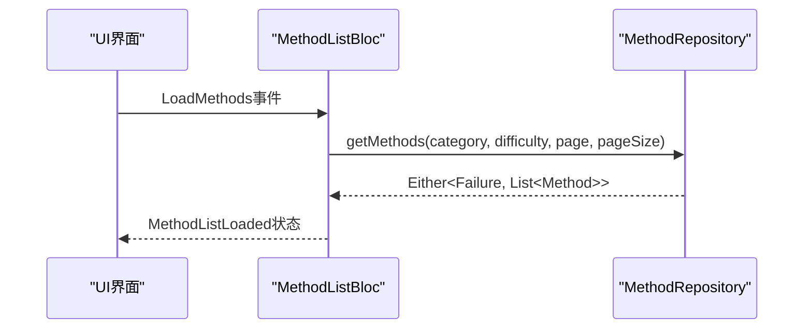

**Diagram sources**
- [method_list_bloc.dart](file://flutter_app/lib/presentation/methods/bloc/method_list_bloc.dart#L7-L132)

### 练习记录流程的领域层交互
在练习记录流程中，`PracticeRecordBloc`通过`PracticeRepository`接口记录用户的练习。BLoC处理创建练习记录的事件，并根据结果更新UI状态。

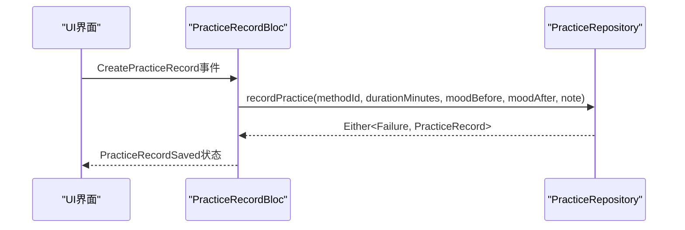

**Diagram sources**
- [practice_record_bloc.dart](file://flutter_app/lib/presentation/practice/bloc/practice_record_bloc.dart#L7-L36)

**Section sources**
- [auth_bloc.dart](file://flutter_app/lib/presentation/auth/bloc/auth_bloc.dart#L1-L82)
- [method_list_bloc.dart](file://flutter_app/lib/presentation/methods/bloc/method_list_bloc.dart#L1-L133)
- [practice_record_bloc.dart](file://flutter_app/lib/presentation/practice/bloc/practice_record_bloc.dart#L1-L37)

## 业务逻辑的独立性与可测试性

nian应用的领域层设计确保了业务逻辑的独立性和可测试性。通过依赖注入和接口抽象，领域层不依赖于任何框架或外部服务，可以独立进行单元测试。

### 依赖倒置原则
领域层定义接口（如`AuthRepository`），而数据层实现接口（如`AuthRepositoryImpl`）。这种依赖倒置确保了高层模块（领域层）不依赖于低层模块（数据层）的实现细节。

### 可测试性设计
由于领域层的业务逻辑通过接口抽象，可以在测试时使用模拟对象（Mock）替代真实实现。例如，在测试`AuthBloc`时，可以创建`AuthRepository`的模拟对象，验证BLoC在不同场景下的状态转换。

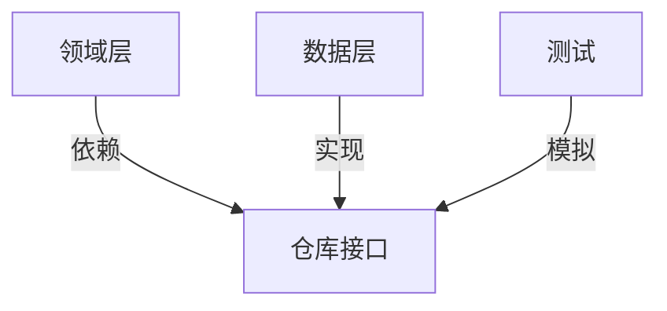

**Diagram sources**
- [auth_repository.dart](file://flutter_app/lib/domain/repositories/auth_repository.dart#L8-L45)

**Section sources**
- [auth_repository_impl.dart](file://flutter_app/lib/data/repositories/auth_repository_impl.dart#L1-L114)
- [auth_bloc.dart](file://flutter_app/lib/presentation/auth/bloc/auth_bloc.dart#L1-L82)

## 领域驱动设计实践

nian应用在实践中遵循领域驱动设计（DDD）的核心原则，将复杂的业务逻辑集中在领域层，确保了代码的可维护性和可扩展性。

### 聚合根与实体
在领域模型中，`User`、`Method`、`PracticeRecord`和`UserMethod`都是聚合根（Aggregate Root），每个聚合根管理自己的生命周期和业务规则。

### 值对象
领域实体中的属性如`DateTime`、`String`等被视为值对象（Value Object），具有不可变性和相等性语义。

### 领域服务
虽然nian应用主要使用仓库模式，但复杂的业务逻辑可以通过领域服务（Domain Service）实现。例如，练习统计的计算可以封装在领域服务中。

### 分层架构
应用采用清晰的分层架构：
- **表现层**：负责UI展示和用户交互
- **领域层**：包含业务逻辑和领域模型
- **数据层**：处理数据持久化和网络通信

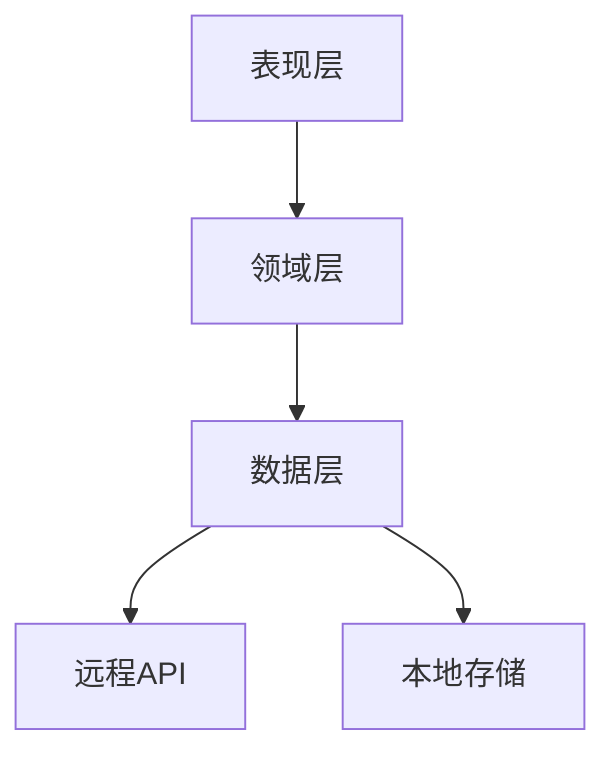

**Diagram sources**
- [auth_repository.dart](file://flutter_app/lib/domain/repositories/auth_repository.dart#L8-L45)
- [method_repository.dart](file://flutter_app/lib/domain/repositories/method_repository.dart#L8-L40)

## 最佳实践与指导原则

### 实体设计原则
- **不可变性**：所有实体属性均为`final`，确保状态不可变
- **值相等性**：继承`Equatable`类，通过`props`方法实现值相等性比较
- **单一职责**：每个实体只表示一个业务概念

### 仓库接口设计原则
- **接口抽象**：使用抽象类定义接口，确保契约性
- **错误处理**：使用`Either<Failure, T>`模式显式处理错误
- **关注点分离**：每个仓库接口只负责一个业务领域的数据访问

### 依赖管理
- **构造函数注入**：通过构造函数注入依赖，提高可测试性
- **依赖倒置**：高层模块依赖于抽象，而不是具体实现
- **单一职责**：每个类只负责一个职责，避免职责混杂

### 测试策略
- **单元测试**：对领域实体和BLoC进行单元测试
- **集成测试**：测试仓库实现与真实数据源的集成
- **UI测试**：测试UI组件与BLoC的交互

这些设计原则和实践确保了nian移动端应用的领域层具有高内聚、低耦合的特点，为应用的长期维护和扩展奠定了坚实的基础。