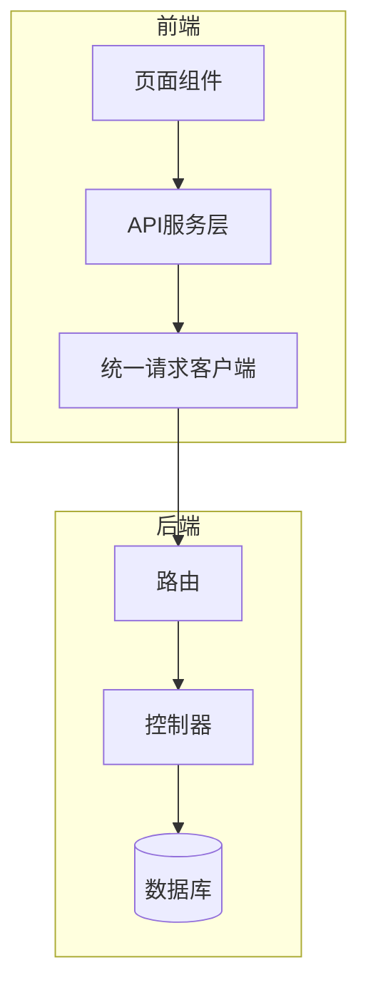
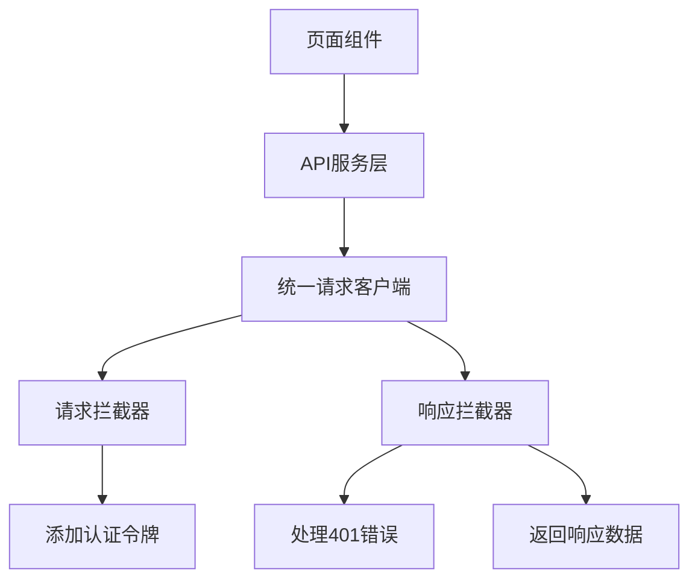
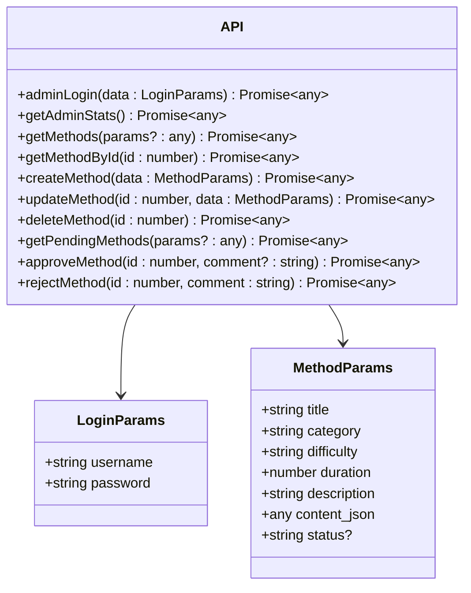
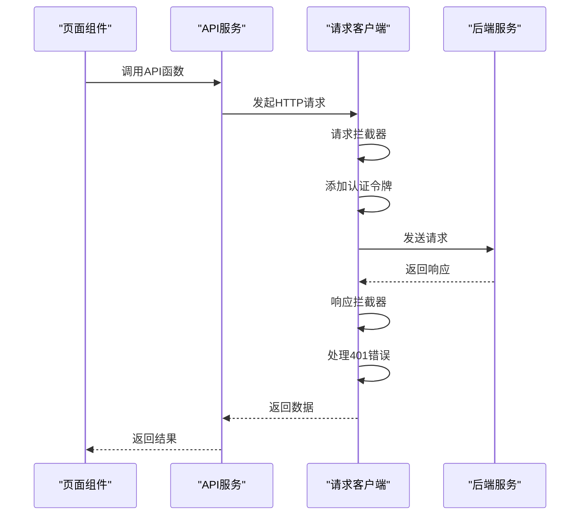
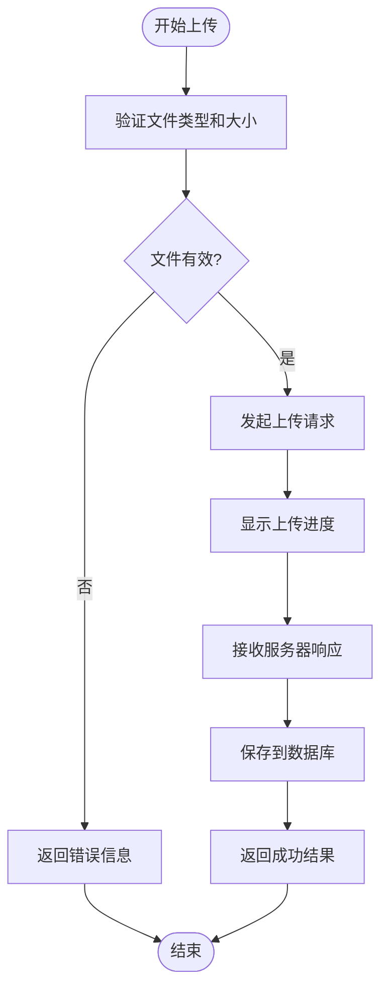
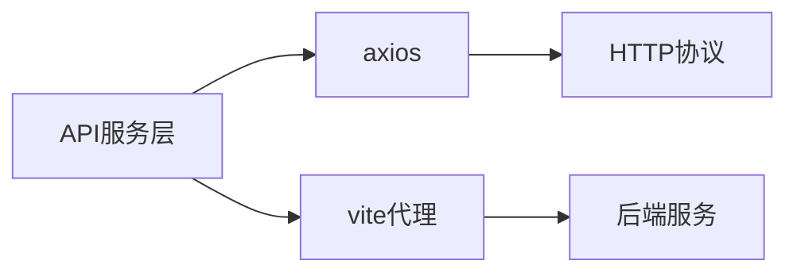

# API服务与网络层

<cite>
**本文档引用的文件**
- [api.ts](file://home/user/nian/admin-web/src/services/api.ts)
- [request.ts](file://home/user/nian/admin-web/src/utils/request.ts)
- [admin.controller.ts](file://backend/src/controllers/admin.controller.ts)
- [admin.routes.ts](file://backend/src/routes/admin.routes.ts)
- [upload.ts](file://backend/src/utils/upload.ts)
- [MediaLibrary.tsx](file://home/user/nian/admin-web/src/pages/MediaLibrary.tsx)
- [MethodList.tsx](file://home/user/nian/admin-web/src/pages/MethodList.tsx)
- [MethodEdit.tsx](file://home/user/nian/admin-web/src/pages/MethodEdit.tsx)
- [Dashboard.tsx](file://home/user/nian/admin-web/src/pages/Dashboard.tsx)
- [Login.tsx](file://home/user/nian/admin-web/src/pages/Login.tsx)
- [vite.config.ts](file://home/user/nian/admin-web/vite.config.ts)
- [package.json](file://home/user/nian/admin-web/package.json)
</cite>

## 目录
1. [简介](#简介)
2. [项目结构](#项目结构)
3. [核心组件](#核心组件)
4. [架构概述](#架构概述)
5. [详细组件分析](#详细组件分析)
6. [依赖分析](#依赖分析)
7. [性能考虑](#性能考虑)
8. [故障排除指南](#故障排除指南)
9. [结论](#结论)

## 简介
本文档深入阐述了管理后台的API服务层设计，重点分析`services/api.ts`中对RESTful接口的模块化封装策略，以及`utils/request.ts`基于axios的统一请求客户端实现。文档详细说明了服务层如何与页面组件解耦，支持类型安全的接口调用，并确保前后端契约一致性。通过具体示例展示了服务调用的最佳实践，包括分页查询、文件上传进度监听等场景。

## 项目结构
管理后台的API服务层采用清晰的分层架构，将网络请求逻辑与业务逻辑分离。`services/api.ts`文件负责定义所有API接口的模块化封装，而`utils/request.ts`则提供统一的请求客户端实现。这种设计确保了代码的可维护性和可扩展性。

**图源**
- [api.ts](file://home/user/nian/admin-web/src/services/api.ts)
- [request.ts](file://home/user/nian/admin-web/src/utils/request.ts)
- [admin.routes.ts](file://backend/src/routes/admin.routes.ts)

**本节来源**
- [api.ts](file://home/user/nian/admin-web/src/services/api.ts)
- [request.ts](file://home/user/nian/admin-web/src/utils/request.ts)

## 核心组件
API服务层的核心组件包括`services/api.ts`中的接口定义和`utils/request.ts`中的请求客户端。`api.ts`文件通过TypeScript接口定义了请求参数和响应数据的类型，实现了类型安全的接口调用。`request.ts`文件则基于axios创建了统一的请求实例，封装了请求/响应拦截器、错误处理、超时控制和认证令牌自动注入等通用功能。

**本节来源**
- [api.ts](file://home/user/nian/admin-web/src/services/api.ts#L1-L61)
- [request.ts](file://home/user/nian/admin-web/src/utils/request.ts#L1-L81)

## 架构概述
API服务层采用了模块化的设计模式，将不同业务领域的API接口分组封装。这种设计不仅提高了代码的可读性和可维护性，还便于团队协作开发。统一的请求客户端实现了跨域配置、请求拦截、响应处理等通用功能，确保了所有API调用的一致性和可靠性。

**图源**
- [api.ts](file://home/user/nian/admin-web/src/services/api.ts)
- [request.ts](file://home/user/nian/admin-web/src/utils/request.ts)

## 详细组件分析

### API服务层分析
API服务层通过模块化的方式组织RESTful接口，每个业务领域都有对应的API函数。这些函数使用TypeScript接口定义了严格的参数类型，确保了类型安全的接口调用。

#### 接口定义

**图源**
- [api.ts](file://home/user/nian/admin-web/src/services/api.ts#L3-L61)

**本节来源**
- [api.ts](file://home/user/nian/admin-web/src/services/api.ts#L1-L61)

### 统一请求客户端分析
统一请求客户端基于axios实现了网络请求的标准化处理，包括请求拦截、响应拦截、错误处理等核心功能。

#### 请求流程

**图源**
- [request.ts](file://home/user/nian/admin-web/src/utils/request.ts#L1-L81)

**本节来源**
- [request.ts](file://home/user/nian/admin-web/src/utils/request.ts#L1-L81)

### 文件上传功能分析
文件上传功能展示了API服务层处理复杂场景的能力，包括上传进度监听、文件类型验证和大小限制。

#### 文件上传流程

**图源**
- [MediaLibrary.tsx](file://home/user/nian/admin-web/src/pages/MediaLibrary.tsx)
- [upload.ts](file://backend/src/utils/upload.ts)

**本节来源**
- [MediaLibrary.tsx](file://home/user/nian/admin-web/src/pages/MediaLibrary.tsx)
- [upload.ts](file://backend/src/utils/upload.ts)

## 依赖分析
API服务层依赖于axios作为HTTP客户端库，通过vite的代理配置实现开发环境下的跨域请求。生产环境中，通过统一的API前缀`/api`进行请求路由。

**图源**
- [request.ts](file://home/user/nian/admin-web/src/utils/request.ts)
- [vite.config.ts](file://home/user/nian/admin-web/vite.config.ts)

**本节来源**
- [request.ts](file://home/user/nian/admin-web/src/utils/request.ts)
- [vite.config.ts](file://home/user/nian/admin-web/vite.config.ts)
- [package.json](file://home/user/nian/admin-web/package.json)

## 性能考虑
API服务层在性能方面进行了多项优化，包括设置合理的请求超时时间（10秒）、使用分页查询减少数据传输量、以及通过请求拦截器避免重复的认证信息处理。这些优化措施有效提升了系统的响应速度和用户体验。

## 故障排除指南
当遇到API调用问题时，可以按照以下步骤进行排查：
1. 检查网络连接是否正常
2. 确认认证令牌是否有效
3. 查看浏览器控制台的错误信息
4. 验证请求参数是否符合接口定义
5. 检查后端服务是否正常运行

**本节来源**
- [request.ts](file://home/user/nian/admin-web/src/utils/request.ts#L25-L38)
- [admin.controller.ts](file://backend/src/controllers/admin.controller.ts)

## 结论
管理后台的API服务层设计体现了良好的软件工程实践。通过模块化的接口封装和统一的请求客户端，实现了代码的高内聚低耦合。TypeScript的类型系统确保了接口调用的安全性，而完善的错误处理机制提高了系统的健壮性。这种设计模式不仅便于维护和扩展，也为团队协作开发提供了良好的基础。