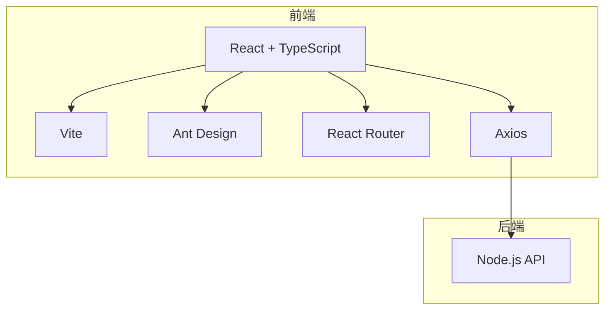
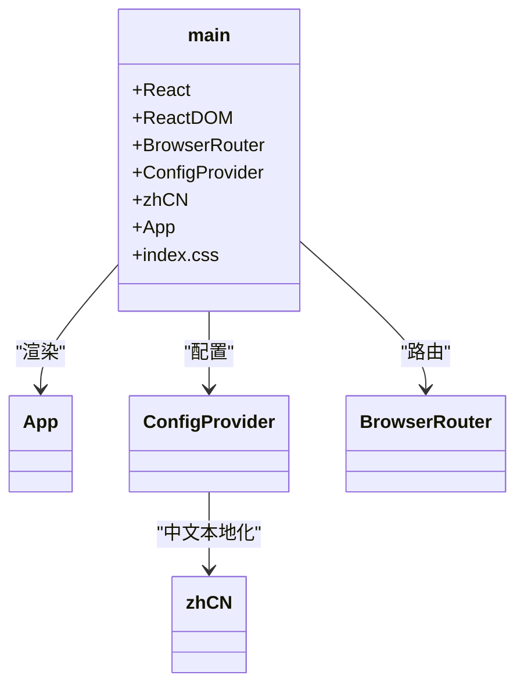
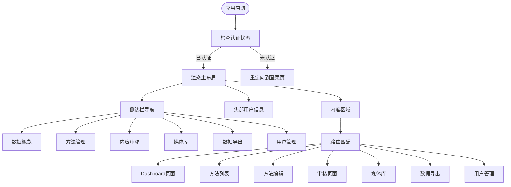
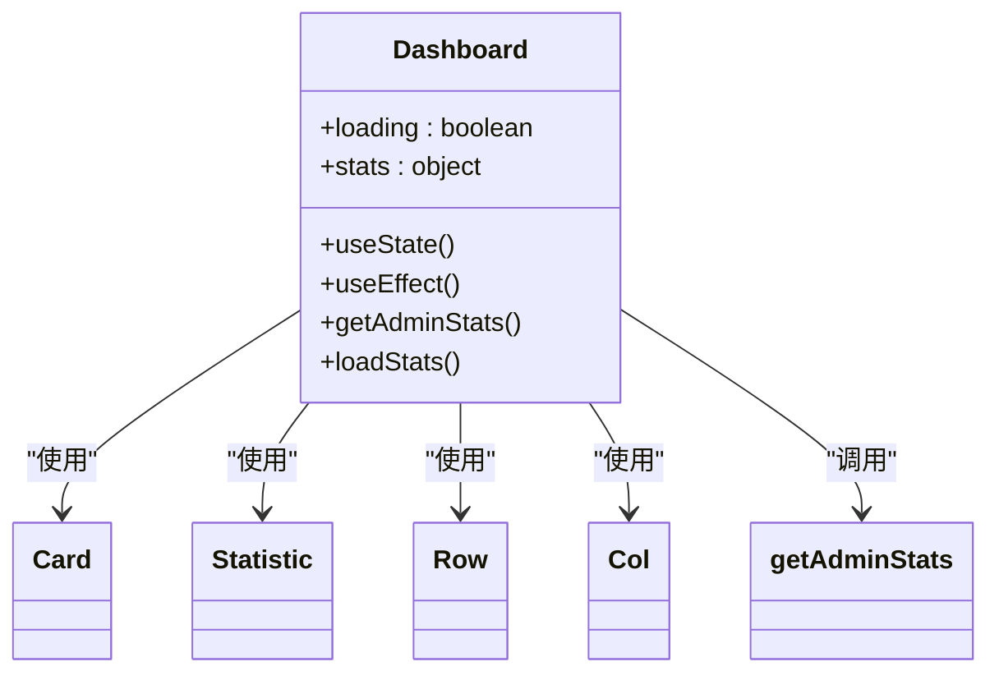
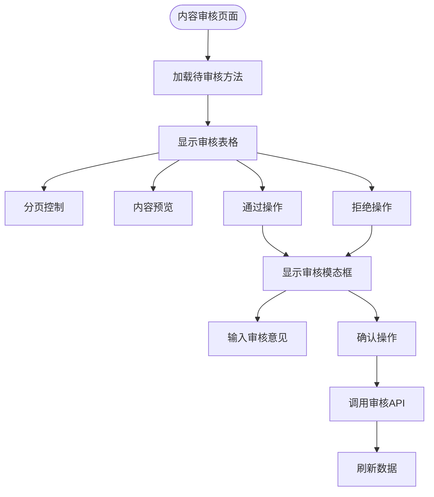
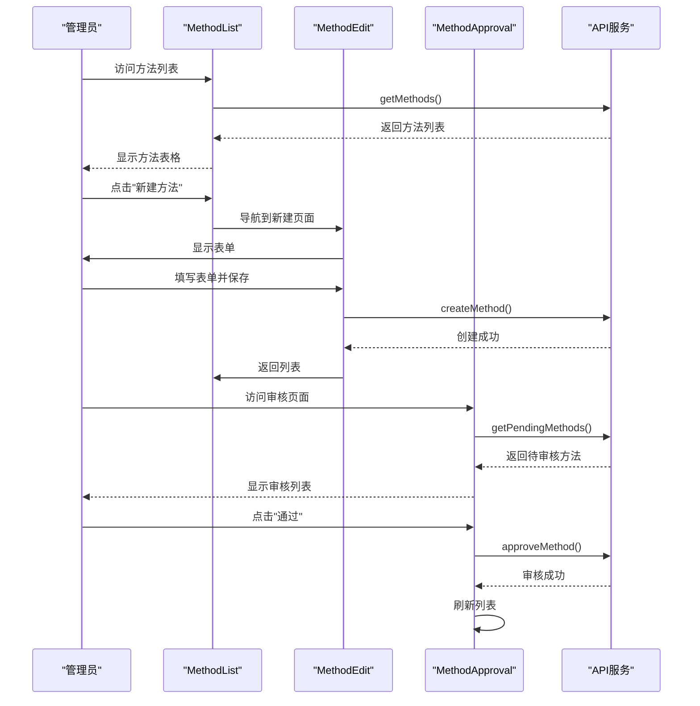
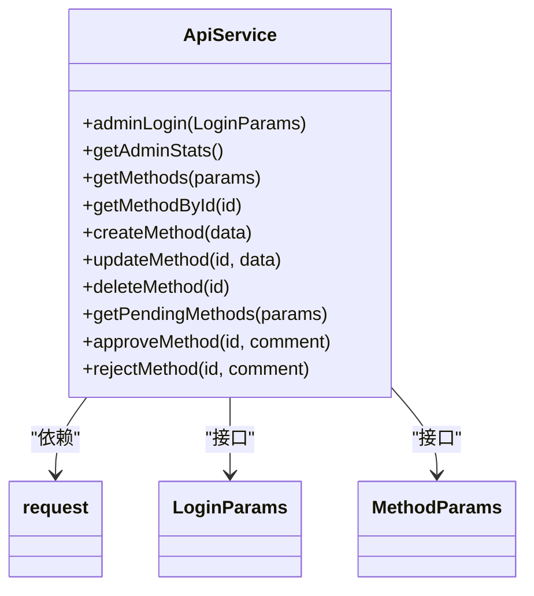
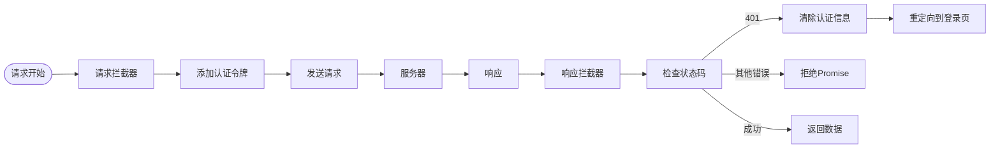
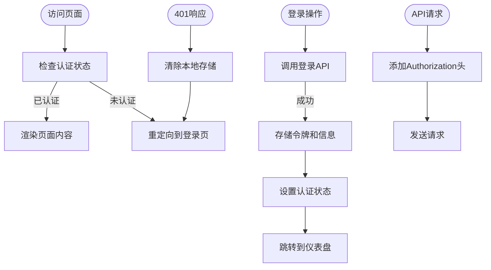

# 管理后台架构

<cite>
**本文档引用的文件**   
- [main.tsx](file://home/user/nian/admin-web/src/main.tsx)
- [App.tsx](file://home/user/nian/admin-web/src/App.tsx)
- [vite.config.ts](file://home/user/nian/admin-web/vite.config.ts)
- [api.ts](file://home/user/nian/admin-web/src/services/api.ts)
- [request.ts](file://home/user/nian/admin-web/src/utils/request.ts)
- [Dashboard.tsx](file://home/user/nian/admin-web/src/pages/Dashboard.tsx)
- [MethodApproval.tsx](file://home/user/nian/admin-web/src/pages/MethodApproval.tsx)
- [MethodList.tsx](file://home/user/nian/admin-web/src/pages/MethodList.tsx)
- [MethodEdit.tsx](file://home/user/nian/admin-web/src/pages/MethodEdit.tsx)
- [UserManagement.tsx](file://home/user/nian/admin-web/src/pages/UserManagement.tsx)
- [DataExport.tsx](file://home/user/nian/admin-web/src/pages/DataExport.tsx)
- [MediaLibrary.tsx](file://home/user/nian/admin-web/src/pages/MediaLibrary.tsx)
- [package.json](file://home/user/nian/admin-web/package.json)
- [tsconfig.json](file://home/user/nian/admin-web/tsconfig.json)
</cite>

## 目录
1. [项目结构](#项目结构)
2. [核心架构](#核心架构)
3. [应用根组件与路由框架](#应用根组件与路由框架)
4. [功能页面组件结构](#功能页面组件结构)
5. [API服务封装设计](#api服务封装设计)
6. [Vite配置要点](#vite配置要点)
7. [权限控制机制](#权限控制机制)
8. [总结](#总结)

## 项目结构

管理后台位于 `home/user/nian/admin-web` 目录下，采用标准的React + TypeScript项目结构。主要目录包括：
- `src/pages`：存放所有功能页面组件
- `src/services`：API服务封装
- `src/utils`：工具函数
- 根目录包含Vite和TypeScript配置文件

**文档来源**
- [package.json](file://home/user/nian/admin-web/package.json)
- [tsconfig.json](file://home/user/nian/admin-web/tsconfig.json)

## 核心架构

管理后台采用React + Vite + Ant Design的技术栈，构建了一个现代化的单页应用(SPA)。系统通过Vite实现快速开发构建，使用React 18的并发特性提升用户体验，Ant Design提供丰富的UI组件库并支持中文本地化。

系统依赖的主要技术栈包括：
- React 18：用于构建用户界面的JavaScript库
- Vite 5：现代化的前端构建工具
- Ant Design 5：企业级UI设计语言和React组件库
- TypeScript：为JavaScript添加静态类型
- Axios：HTTP客户端用于API通信
- React Router：路由管理



**图示来源**
- [package.json](file://home/user/nian/admin-web/package.json)
- [main.tsx](file://home/user/nian/admin-web/src/main.tsx)

## 应用根组件与路由框架

### 根组件初始化

`main.tsx` 文件是应用的入口点，负责初始化React应用并配置全局依赖：



**图示来源**
- [main.tsx](file://home/user/nian/admin-web/src/main.tsx#L1-L18)

### 路由与布局框架

`App.tsx` 文件构建了应用的主框架，包含侧边栏导航、头部用户信息和内容区域，实现了基于角色的路由控制：



**图示来源**
- [App.tsx](file://home/user/nian/admin-web/src/App.tsx#L26-L154)

## 功能页面组件结构

### 仪表盘页面

`Dashboard.tsx` 组件展示系统关键指标，采用Ant Design的Card、Statistic和Row/Col布局组件：



**图示来源**
- [Dashboard.tsx](file://home/user/nian/admin-web/src/pages/Dashboard.tsx#L11-L107)

### 内容审核页面

`MethodApproval.tsx` 组件实现待审核方法的列表展示和审核操作，包含分页、模态框和表格展开功能：



**图示来源**
- [MethodApproval.tsx](file://home/user/nian/admin-web/src/pages/MethodApproval.tsx#L8-L184)

### 方法管理页面

方法管理功能由三个组件协同工作：`MethodList.tsx`、`MethodEdit.tsx`和`MethodApproval.tsx`，形成完整的方法生命周期管理：



**图示来源**
- [MethodList.tsx](file://home/user/nian/admin-web/src/pages/MethodList.tsx#L9-L169)
- [MethodEdit.tsx](file://home/user/nian/admin-web/src/pages/MethodEdit.tsx#L9-L196)
- [MethodApproval.tsx](file://home/user/nian/admin-web/src/pages/MethodApproval.tsx#L8-L184)

## API服务封装设计

### 统一API服务

`services/api.ts` 文件封装了所有API调用，采用函数式接口设计，为每个业务操作提供类型安全的API方法：



**图示来源**
- [api.ts](file://home/user/nian/admin-web/src/services/api.ts#L1-L61)

### 请求拦截与错误处理

`utils/request.ts` 实现了Axios实例的全局配置，包含请求拦截器（添加认证令牌）和响应拦截器（错误处理和未授权重定向）：



**图示来源**
- [request.ts](file://home/user/nian/admin-web/src/utils/request.ts#L1-L81)

## Vite配置要点

`vite.config.ts` 文件配置了开发服务器、代理和构建选项，支持高效的开发体验和生产构建：

```mermaid
classDiagram
class ViteConfig {
+defineConfig()
+plugins : [react()]
+server : { port : 3001, host : true, proxy : { '/api' : { target : 'http : //localhost : 3000', changeOrigin : true } } }
+build : { outDir : 'dist', sourcemap : false }
}
ViteConfig --> react : "插件"
```

**图示来源**
- [vite.config.ts](file://home/user/nian/admin-web/vite.config.ts#L1-L43)

## 权限控制机制

系统实现了基于本地存储的简单权限控制机制，确保管理员操作的安全性：



**图示来源**
- [App.tsx](file://home/user/nian/admin-web/src/App.tsx#L27-L46)
- [request.ts](file://home/user/nian/admin-web/src/utils/request.ts#L12-L38)

## 总结

管理后台采用现代化的React技术栈，通过Vite实现快速开发构建，Ant Design提供一致的UI体验。系统架构清晰，组件职责分明，API封装规范，权限控制有效。整体工程化架构合理，易于维护和扩展。

**文档来源**
- [main.tsx](file://home/user/nian/admin-web/src/main.tsx)
- [App.tsx](file://home/user/nian/admin-web/src/App.tsx)
- [vite.config.ts](file://home/user/nian/admin-web/vite.config.ts)
- [api.ts](file://home/user/nian/admin-web/src/services/api.ts)
- [request.ts](file://home/user/nian/admin-web/src/utils/request.ts)