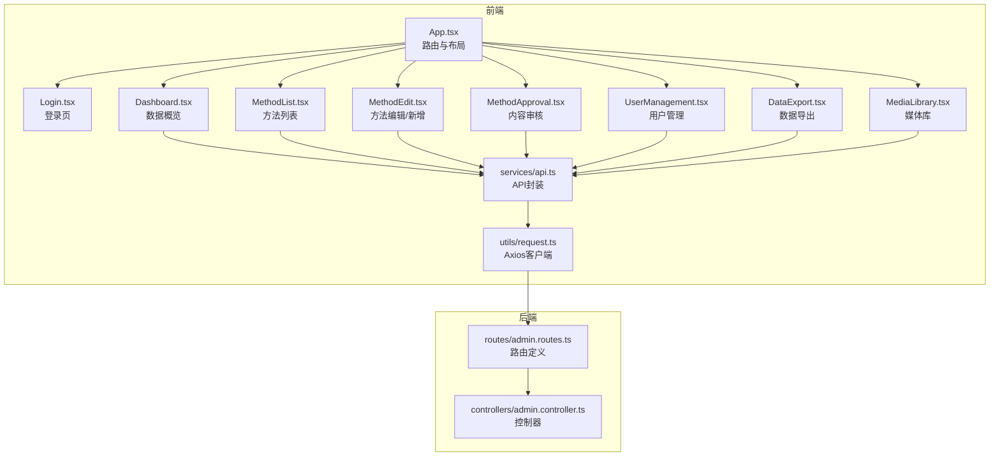
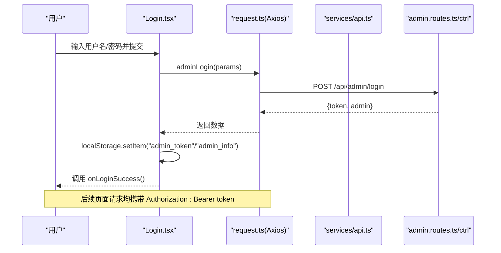
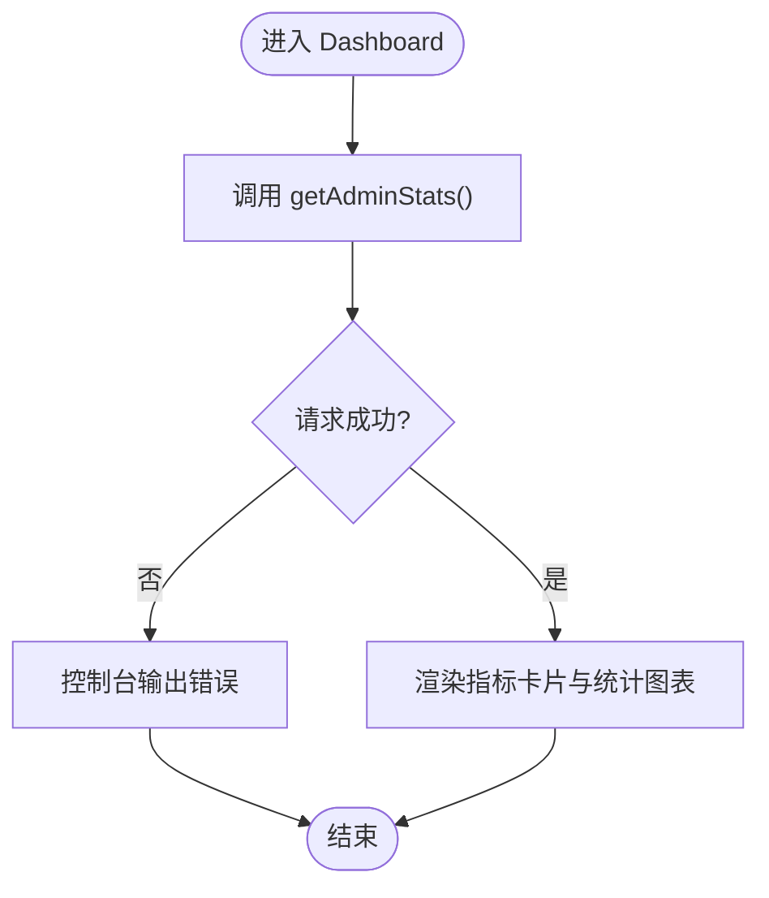
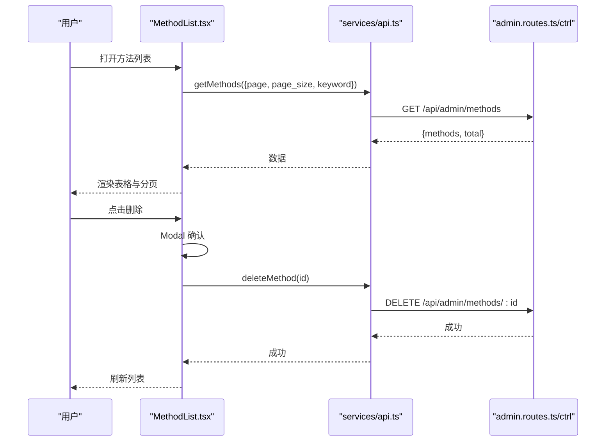
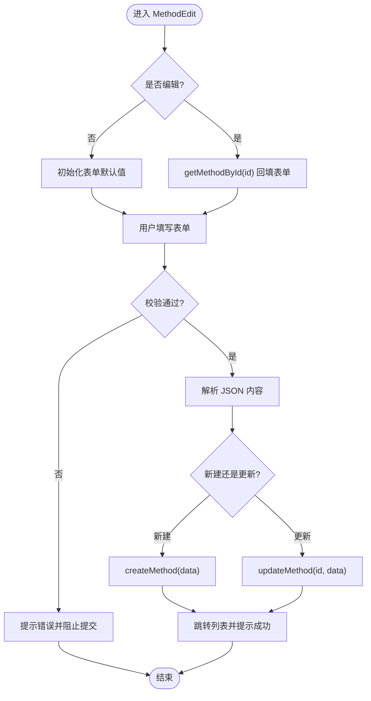
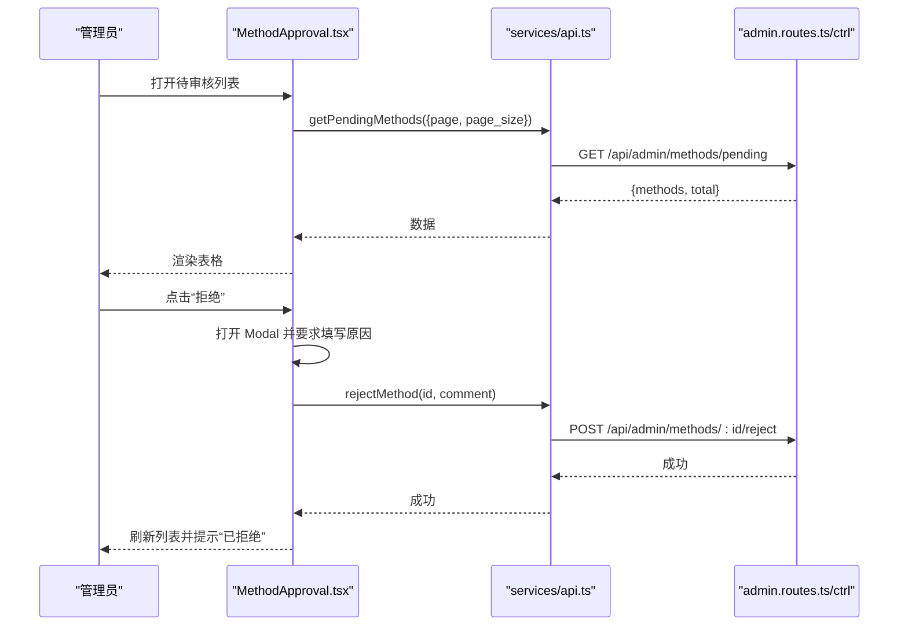
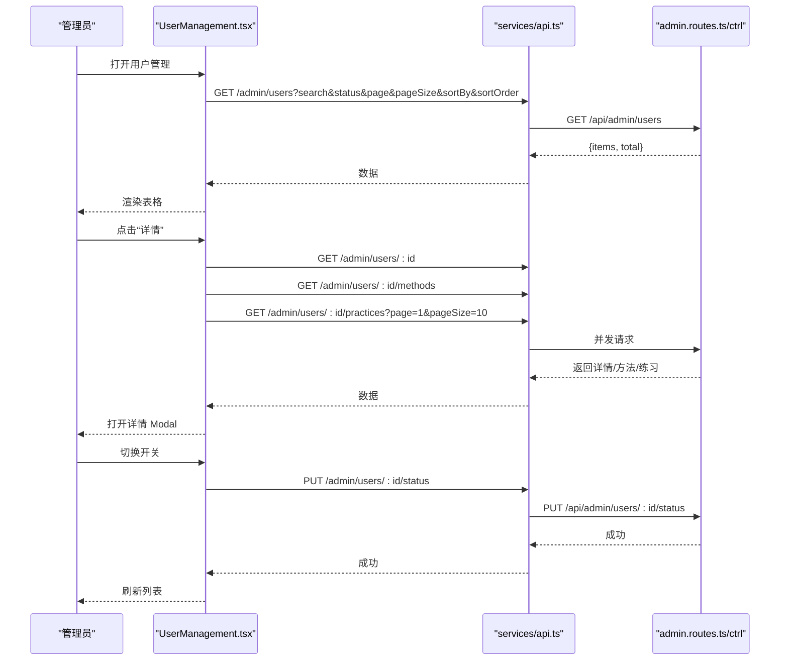
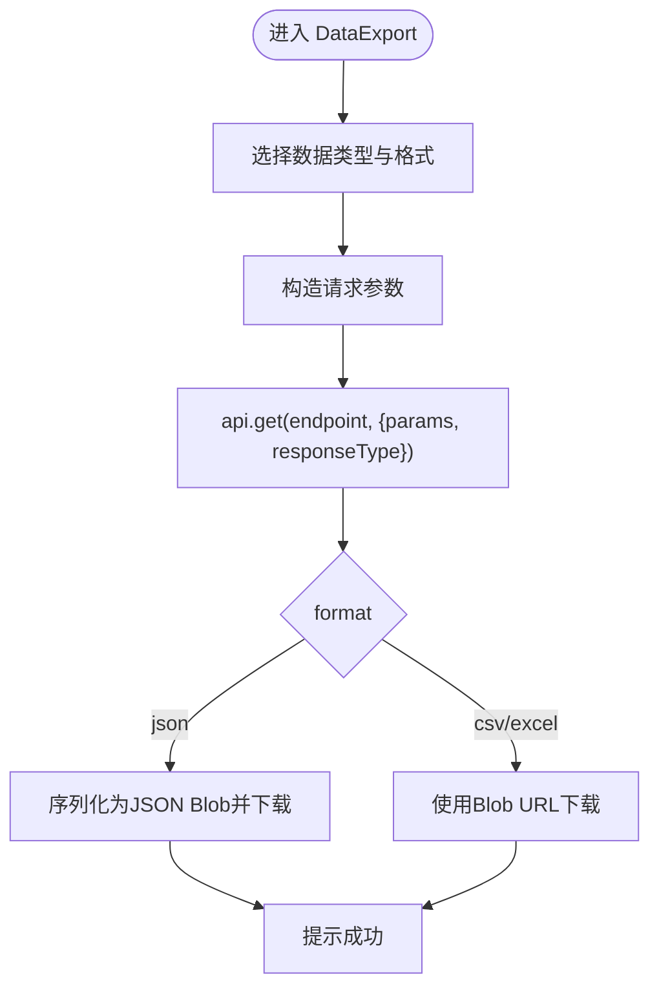
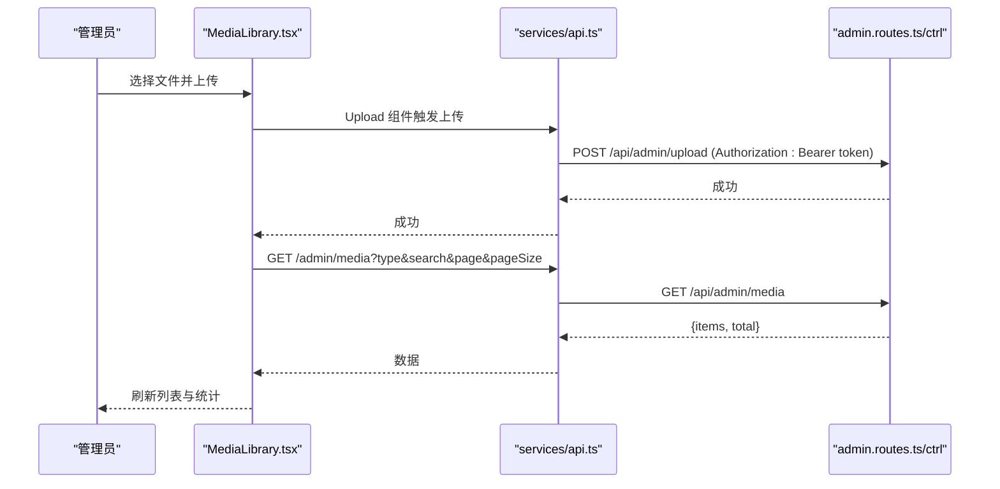
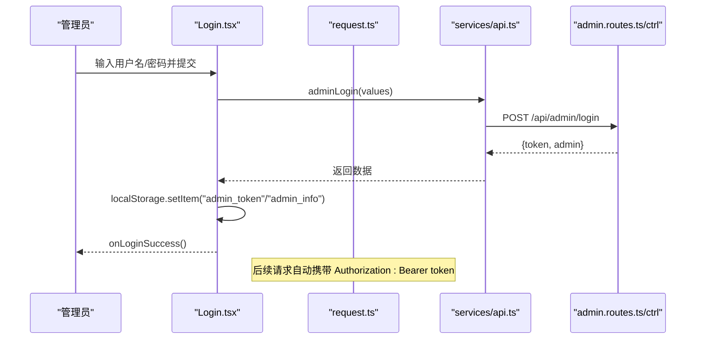

# 管理后台页面组件

<cite>
**本文引用的文件**
- [App.tsx](file://home/user/nian/admin-web/src/App.tsx)
- [Login.tsx](file://home/user/nian/admin-web/src/pages/Login.tsx)
- [Dashboard.tsx](file://home/user/nian/admin-web/src/pages/Dashboard.tsx)
- [MethodList.tsx](file://home/user/nian/admin-web/src/pages/MethodList.tsx)
- [MethodEdit.tsx](file://home/user/nian/admin-web/src/pages/MethodEdit.tsx)
- [MethodApproval.tsx](file://home/user/nian/admin-web/src/pages/MethodApproval.tsx)
- [UserManagement.tsx](file://home/user/nian/admin-web/src/pages/UserManagement.tsx)
- [DataExport.tsx](file://home/user/nian/admin-web/src/pages/DataExport.tsx)
- [MediaLibrary.tsx](file://home/user/nian/admin-web/src/pages/MediaLibrary.tsx)
- [api.ts](file://home/user/nian/admin-web/src/services/api.ts)
- [request.ts](file://home/user/nian/admin-web/src/utils/request.ts)
- [admin.routes.ts](file://backend/src/routes/admin.routes.ts)
- [admin.controller.ts](file://backend/src/controllers/admin.controller.ts)
</cite>

## 目录
1. [简介](#简介)
2. [项目结构](#项目结构)
3. [核心组件](#核心组件)
4. [架构总览](#架构总览)
5. [详细组件分析](#详细组件分析)
6. [依赖关系分析](#依赖关系分析)
7. [性能考量](#性能考量)
8. [故障排查指南](#故障排查指南)
9. [结论](#结论)

## 简介
本文件面向管理后台页面组件，系统性梳理各页面的实现结构、功能职责与交互流程，并结合 Ant Design 组件库的使用模式，说明布局设计、响应式适配与可访问性实践。重点覆盖：
- Dashboard.tsx：关键指标可视化与系统状态概览
- MethodList.tsx 与 MethodEdit.tsx：方法内容管理的增删改查与表单验证
- MethodApproval.tsx：审核流程的状态驱动设计与操作日志记录
- UserManagement.tsx：用户列表渲染、权限分配与状态同步机制
- DataExport.tsx：数据批量导出功能与文件生成策略
- MediaLibrary.tsx：静态资源管理与上传集成
- Login.tsx：身份认证流程与 JWT 令牌持久化处理

## 项目结构
管理后台采用前端 Vite + React + Ant Design 架构，页面组件位于 home/user/nian/admin-web/src/pages，API 封装于 services/api.ts，HTTP 客户端封装于 utils/request.ts。路由与侧边栏由 App.tsx 统一管理，后端 Express 路由集中定义于 backend/src/routes/admin.routes.ts，控制器实现于 backend/src/controllers/admin.controller.ts。

图表来源
- [App.tsx](file://home/user/nian/admin-web/src/App.tsx#L1-L154)
- [api.ts](file://home/user/nian/admin-web/src/services/api.ts#L1-L61)
- [request.ts](file://home/user/nian/admin-web/src/utils/request.ts#L1-L81)
- [admin.routes.ts](file://backend/src/routes/admin.routes.ts#L1-L54)
- [admin.controller.ts](file://backend/src/controllers/admin.controller.ts#L1-L482)

章节来源
- [App.tsx](file://home/user/nian/admin-web/src/App.tsx#L1-L154)

## 核心组件
- 登录与鉴权：Login.tsx 负责管理员登录，成功后将 token 与管理员信息写入 localStorage；App.tsx 在启动时读取并维护登录态；utils/request.ts 注入请求头并统一处理 401 重定向。
- 页面导航：App.tsx 提供侧边栏菜单与头部下拉菜单，统一跳转至各页面。
- API 交互：services/api.ts 对后端接口进行薄封装，便于页面调用；utils/request.ts 统一封装 Axios 实例与拦截器。

章节来源
- [Login.tsx](file://home/user/nian/admin-web/src/pages/Login.tsx#L1-L127)
- [App.tsx](file://home/user/nian/admin-web/src/App.tsx#L1-L154)
- [api.ts](file://home/user/nian/admin-web/src/services/api.ts#L1-L61)
- [request.ts](file://home/user/nian/admin-web/src/utils/request.ts#L1-L81)

## 架构总览
前端通过 Ant Design 的 Layout、Menu、Dropdown、Table、Form 等组件构建管理界面；页面组件通过 services/api.ts 发起请求，经 utils/request.ts 的 Axios 实例与拦截器完成鉴权与错误处理；后端通过 Express 路由与控制器提供 REST 接口。

图表来源
- [Login.tsx](file://home/user/nian/admin-web/src/pages/Login.tsx#L1-L127)
- [request.ts](file://home/user/nian/admin-web/src/utils/request.ts#L1-L81)
- [api.ts](file://home/user/nian/admin-web/src/services/api.ts#L1-L61)
- [admin.routes.ts](file://backend/src/routes/admin.routes.ts#L1-L54)
- [admin.controller.ts](file://backend/src/controllers/admin.controller.ts#L1-L482)

## 详细组件分析

### Dashboard.tsx：关键指标可视化与系统状态概览
- 功能职责
  - 加载并展示系统关键指标卡片（总用户数、总方法数、待审核方法数、总练习记录等）。
  - 展示方法分类与难度分布统计。
  - 使用 Spin 在首次加载时提供加载反馈。
- 数据流
  - 组件挂载后调用 getAdminStats，将返回的统计数据渲染为多个 Statistic 卡片与分组统计。
- 设计要点
  - 使用 Row/Col 实现卡片网格布局，支持响应式间距。
  - 使用 Ant Design 图标与颜色区分不同指标。
- 性能与可用性
  - 首次加载使用 Spin 提示，避免空白闪烁。
  - 统计数据来自后端聚合查询，前端仅负责展示。

图表来源
- [Dashboard.tsx](file://home/user/nian/admin-web/src/pages/Dashboard.tsx#L1-L107)
- [api.ts](file://home/user/nian/admin-web/src/services/api.ts#L23-L26)

章节来源
- [Dashboard.tsx](file://home/user/nian/admin-web/src/pages/Dashboard.tsx#L1-L107)

### MethodList.tsx：方法列表与增删改查
- 功能职责
  - 分页加载方法列表，支持关键词搜索、状态筛选与排序。
  - 提供“新建方法”按钮跳转至新增页；对每条记录提供“编辑/删除”操作。
  - 删除采用 Modal 确认，防止误操作。
- 表单验证与交互
  - 列表列定义包含状态 Tag 渲染，便于直观识别草稿/待审核/已发布/已拒绝。
  - 分页参数 page/page_size/keyword 变化触发重新加载。
- 设计要点
  - Ant Design Table 提供排序、分页与列宽控制。
  - Ant Design Space 用于按钮组对齐与间距控制。
- 错误处理
  - 加载失败统一提示“加载失败”。

图表来源
- [MethodList.tsx](file://home/user/nian/admin-web/src/pages/MethodList.tsx#L1-L169)
- [api.ts](file://home/user/nian/admin-web/src/services/api.ts#L29-L47)
- [admin.routes.ts](file://backend/src/routes/admin.routes.ts#L36-L40)
- [admin.controller.ts](file://backend/src/controllers/admin.controller.ts#L1-L482)

章节来源
- [MethodList.tsx](file://home/user/nian/admin-web/src/pages/MethodList.tsx#L1-L169)

### MethodEdit.tsx：方法新增/编辑与表单校验
- 功能职责
  - 支持“新建方法”与“编辑方法”两种模式，根据 URL 参数判断是否为编辑。
  - 编辑模式下加载已有方法数据并回填表单。
  - 保存时解析 JSON 内容，校验必填项与长度限制。
- 表单验证
  - 标题、分类、难度、时长、描述、内容 JSON、状态均为必填。
  - 描述最大长度限制；时长最小/最大值限制；内容 JSON 格式校验。
- 数据提交
  - 新建与更新分别调用 createMethod 与 updateMethod，成功后跳转列表页。
- 设计要点
  - 使用 Card 作为表单容器，垂直布局提升可读性。
  - 初始值包含默认 JSON 结构，便于快速填写。

图表来源
- [MethodEdit.tsx](file://home/user/nian/admin-web/src/pages/MethodEdit.tsx#L1-L196)
- [api.ts](file://home/user/nian/admin-web/src/services/api.ts#L33-L47)

章节来源
- [MethodEdit.tsx](file://home/user/nian/admin-web/src/pages/MethodEdit.tsx#L1-L196)

### MethodApproval.tsx：审核流程与日志记录
- 功能职责
  - 展示“待审核方法”列表，支持分页与展开预览。
  - 提供“通过/拒绝”操作，拒绝时要求填写原因。
  - 审核结果通过消息提示反馈，并刷新列表。
- 状态驱动设计
  - 通过 modalType 控制弹窗标题与占位文案；comment 字段用于拒绝原因。
  - 审核通过与拒绝分别调用 approveMethod 与 rejectMethod。
- 设计要点
  - 使用 expandable 展示 content_json 预览，便于审阅。
  - Ant Design Tag 与图标增强可读性。

图表来源
- [MethodApproval.tsx](file://home/user/nian/admin-web/src/pages/MethodApproval.tsx#L1-L182)
- [api.ts](file://home/user/nian/admin-web/src/services/api.ts#L50-L60)
- [admin.routes.ts](file://backend/src/routes/admin.routes.ts#L42-L45)
- [admin.controller.ts](file://backend/src/controllers/admin.controller.ts#L1-L482)

章节来源
- [MethodApproval.tsx](file://home/user/nian/admin-web/src/pages/MethodApproval.tsx#L1-L182)

### UserManagement.tsx：用户列表、权限分配与状态同步
- 功能职责
  - 用户列表：支持搜索、状态筛选、多字段排序与分页。
  - 用户详情：通过 Modal 展示基本信息、统计卡片、方法库与练习记录。
  - 状态同步：通过 Switch 切换 is_active，调用 PUT 更新并刷新列表。
- 数据流
  - 列表：GET /admin/users
  - 详情：并发获取用户详情、方法库、练习记录
  - 状态：PUT /admin/users/:id/status
- 设计要点
  - 使用 Tabs 切换详情页签，提高信息密度。
  - 使用 Statistic 展示用户练习统计。
  - 使用 Popconfirm 包裹 Switch，减少误操作风险。

图表来源
- [UserManagement.tsx](file://home/user/nian/admin-web/src/pages/UserManagement.tsx#L1-L456)
- [api.ts](file://home/user/nian/admin-web/src/services/api.ts#L1-L61)
- [admin.routes.ts](file://backend/src/routes/admin.routes.ts#L1-L54)
- [admin.controller.ts](file://backend/src/controllers/admin.controller.ts#L1-L482)

章节来源
- [UserManagement.tsx](file://home/user/nian/admin-web/src/pages/UserManagement.tsx#L1-L456)

### DataExport.tsx：数据批量导出与文件生成
- 功能职责
  - 支持三类数据导出：用户、方法、练习记录。
  - 支持多种格式：CSV、Excel、JSON。
  - 练习记录导出强制要求日期范围。
- 文件生成策略
  - JSON：直接将后端返回的 data 序列化为 Blob 下载。
  - CSV/Excel：后端返回 Blob，前端创建临时 URL 并触发下载。
- 设计要点
  - 使用 Form.Item 的 initialValue 设置默认格式。
  - 使用 Alert 提示导出注意事项与文件说明。

图表来源
- [DataExport.tsx](file://home/user/nian/admin-web/src/pages/DataExport.tsx#L1-L294)
- [api.ts](file://home/user/nian/admin-web/src/services/api.ts#L1-L61)

章节来源
- [DataExport.tsx](file://home/user/nian/admin-web/src/pages/DataExport.tsx#L1-L294)

### MediaLibrary.tsx：静态资源管理与上传集成
- 功能职责
  - 列表：按类型与关键词过滤，支持分页与排序。
  - 上传：基于 Ant Design Upload 组件，支持图片/音频/视频类型与大小限制。
  - 预览：支持图片/音频/视频在线预览。
  - 操作：复制直链、删除文件。
- 上传集成
  - 通过请求头 Authorization: Bearer ${token} 携带令牌。
  - 上传成功后刷新列表与统计。
- 设计要点
  - 使用 Statistic 卡片展示各类文件数量。
  - 使用 Modal 展示预览与元信息。

图表来源
- [MediaLibrary.tsx](file://home/user/nian/admin-web/src/pages/MediaLibrary.tsx#L1-L426)
- [api.ts](file://home/user/nian/admin-web/src/services/api.ts#L1-L61)
- [admin.routes.ts](file://backend/src/routes/admin.routes.ts#L51-L54)
- [admin.controller.ts](file://backend/src/controllers/admin.controller.ts#L470-L482)

章节来源
- [MediaLibrary.tsx](file://home/user/nian/admin-web/src/pages/MediaLibrary.tsx#L1-L426)

### Login.tsx：身份认证流程与 JWT 令牌持久化
- 功能职责
  - 表单收集用户名与密码，调用 adminLogin。
  - 成功后将 token 与管理员信息写入 localStorage，并回调 onLoginSuccess。
- 鉴权与拦截
  - utils/request.ts 在请求前注入 Authorization: Bearer token。
  - 响应拦截器处理 401 自动清除 token 并跳转登录页。
- 设计要点
  - 使用 Ant Design Input 与 Button 构建简洁登录表单。
  - 表单项使用 required 规则与提示。

图表来源
- [Login.tsx](file://home/user/nian/admin-web/src/pages/Login.tsx#L1-L127)
- [request.ts](file://home/user/nian/admin-web/src/utils/request.ts#L1-L81)
- [api.ts](file://home/user/nian/admin-web/src/services/api.ts#L19-L21)
- [admin.routes.ts](file://backend/src/routes/admin.routes.ts#L30-L32)
- [admin.controller.ts](file://backend/src/controllers/admin.controller.ts#L1-L482)

章节来源
- [Login.tsx](file://home/user/nian/admin-web/src/pages/Login.tsx#L1-L127)
- [request.ts](file://home/user/nian/admin-web/src/utils/request.ts#L1-L81)

## 依赖关系分析
- 组件耦合
  - 各页面组件均依赖 services/api.ts 进行网络请求，降低与后端细节耦合。
  - App.tsx 作为路由与布局中心，统一管理登录态与菜单导航。
- 外部依赖
  - Ant Design 提供 UI 组件与样式；Dayjs 用于日期格式化。
  - Axios 用于 HTTP 请求；React Router 用于页面路由。
- 潜在循环依赖
  - 当前结构清晰，无明显循环依赖迹象。

图表来源
- [App.tsx](file://home/user/nian/admin-web/src/App.tsx#L1-L154)
- [api.ts](file://home/user/nian/admin-web/src/services/api.ts#L1-L61)
- [request.ts](file://home/user/nian/admin-web/src/utils/request.ts#L1-L81)
- [admin.routes.ts](file://backend/src/routes/admin.routes.ts#L1-L54)
- [admin.controller.ts](file://backend/src/controllers/admin.controller.ts#L1-L482)

章节来源
- [App.tsx](file://home/user/nian/admin-web/src/App.tsx#L1-L154)
- [api.ts](file://home/user/nian/admin-web/src/services/api.ts#L1-L61)
- [request.ts](file://home/user/nian/admin-web/src/utils/request.ts#L1-L81)

## 性能考量
- 列表分页与懒加载
  - MethodList、MethodApproval、UserManagement、MediaLibrary 均采用分页与条件筛选，避免一次性加载大量数据。
- 并发请求
  - UserManagement 在详情页并发获取用户详情、方法库与练习记录，缩短首屏等待时间。
- 上传优化
  - MediaLibrary 上传前进行类型与大小校验，减少无效请求与后端压力。
- 响应拦截
  - request.ts 统一处理 401，避免重复登录态判断逻辑。

[本节为通用指导，无需列出具体文件来源]

## 故障排查指南
- 登录失败
  - 检查用户名/密码是否为空；确认后端 /admin/login 是否可达；查看浏览器 Network 面板与控制台错误。
- 401 未授权
  - 确认 localStorage 中是否存在 admin_token；检查 request.ts 请求拦截器是否正确注入 Authorization；确认后端路由是否启用鉴权中间件。
- 列表加载失败
  - 查看 message 错误提示；确认分页参数与筛选条件是否合理；检查后端 /admin/* 接口返回结构。
- 导出失败
  - 确认所选格式与必要参数（如练习记录导出的日期范围）；检查后端导出接口返回类型与响应体结构。
- 上传失败
  - 检查文件类型与大小限制；确认 Authorization 头是否正确；查看后端 /admin/upload 路由与中间件配置。

章节来源
- [Login.tsx](file://home/user/nian/admin-web/src/pages/Login.tsx#L1-L127)
- [request.ts](file://home/user/nian/admin-web/src/utils/request.ts#L1-L81)
- [api.ts](file://home/user/nian/admin-web/src/services/api.ts#L1-L61)
- [admin.routes.ts](file://backend/src/routes/admin.routes.ts#L1-L54)
- [admin.controller.ts](file://backend/src/controllers/admin.controller.ts#L1-L482)

## 结论
管理后台页面组件围绕 Ant Design 组件库构建，遵循“页面组件 + API 封装 + Axios 客户端”的分层架构，实现了登录鉴权、数据概览、方法管理、内容审核、用户管理、数据导出与媒体库上传等核心功能。通过统一的请求拦截与错误处理，提升了系统的健壮性与一致性。建议后续持续完善可访问性与国际化支持，并在大列表场景引入虚拟滚动与缓存策略以进一步优化性能。