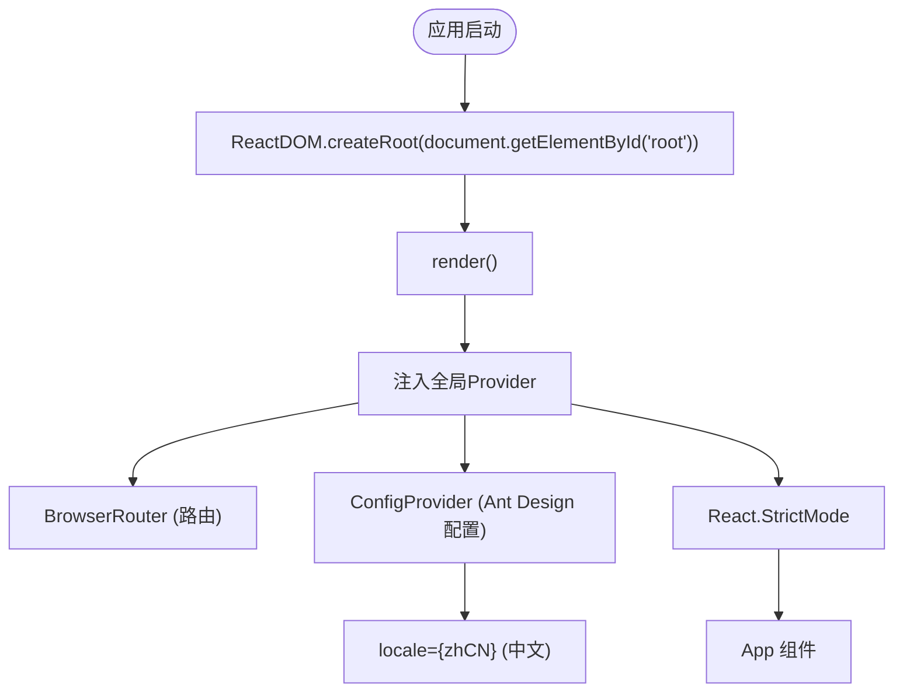
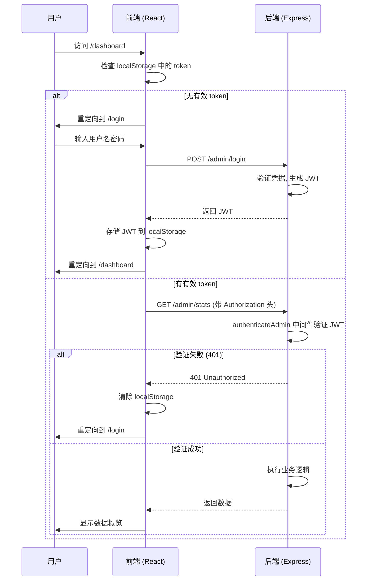
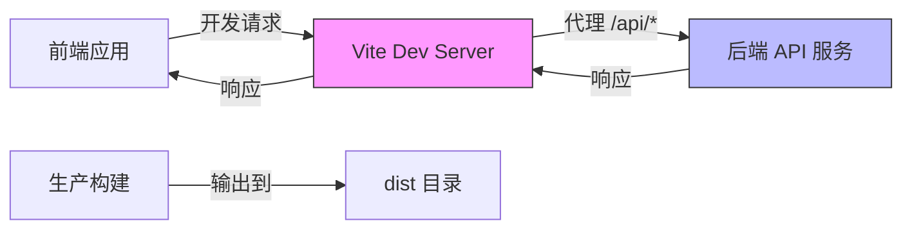

# 路由配置与权限控制

<cite>
**本文档引用文件**  
- [main.tsx](file://home/user/nian/admin-web/src/main.tsx)
- [App.tsx](file://home/user/nian/admin-web/src/App.tsx)
- [vite.config.ts](file://home/user/nian/admin-web/vite.config.ts)
- [Login.tsx](file://home/user/nian/admin-web/src/pages/Login.tsx)
- [api.ts](file://home/user/nian/admin-web/src/services/api.ts)
- [request.ts](file://home/user/nian/admin-web/src/utils/request.ts)
- [auth.ts](file://backend/src/middleware/auth.ts)
</cite>

## 目录
1. [应用入口初始化](#应用入口初始化)  
2. [路由配置结构](#路由配置结构)  
3. [权限控制机制](#权限控制机制)  
4. [Vite 构建配置](#vite-构建配置)

## 应用入口初始化

管理后台前端应用的入口文件 `main.tsx` 采用 React 18 的 `createRoot` API 进行渲染，确保应用在现代 React 渲染模式下运行。该文件负责初始化全局上下文和依赖注入，包括使用 `BrowserRouter` 提供路由能力，以及通过 `ConfigProvider` 注入 Ant Design 的中文本地化配置（`zhCN`），实现界面语言的统一。

应用根组件被包裹在 `React.StrictMode` 中，以帮助开发者发现潜在的副作用和不安全的生命周期调用。整个渲染流程简洁高效，直接将 `App` 组件挂载到 DOM 的 `root` 节点上。



**图示来源**  
- [main.tsx](file://home/user/nian/admin-web/src/main.tsx#L1-L18)

**本节来源**  
- [main.tsx](file://home/user/nian/admin-web/src/main.tsx#L1-L18)

## 路由配置结构

`App.tsx` 文件是整个应用的路由配置中心，基于 React Router v6 实现。路由逻辑根据用户的登录状态 (`isAuthenticated`) 进行动态切换：未登录时，只渲染登录路由 (`/login`)，并默认重定向到登录页；登录后，则渲染包含侧边栏菜单和主内容区的完整布局。

### 嵌套路由与菜单联动
应用采用扁平化的路由设计，但通过 `Layout` 组件实现了视觉上的嵌套结构。`Sider` 组件内的 `Menu` 项与 `Content` 区域的 `Routes` 配置保持严格对应。菜单项的 `key` 值与路由的 `path` 一致，点击菜单项会触发 `navigate` 函数，从而实现页面跳转。

### 路由列表
核心路由配置如下：
- `/dashboard`: 数据概览页面
- `/methods`: 方法列表页面
- `/methods/new`: 新建方法页面
- `/methods/edit/:id`: 编辑方法页面（含动态参数 `:id`）
- `/approval`: 内容审核页面
- `/media`: 媒体库页面
- `/export`: 数据导出页面
- `/users`: 用户管理页面
- `/login`: 登录页面
- `/` (根路径): 重定向到 `/dashboard`

该设计未使用 `lazy` + `Suspense` 进行代码分割，所有页面组件在应用启动时即被加载。

```mermaid
graph TD
A[App] --> B{已认证?}
B --> |否| C[/login]
B --> |是| D[完整布局]
D --> E[Sider]
D --> F[Content]
E --> G[菜单项]
G --> H["/dashboard"]
G --> I["/methods"]
G --> J["/approval"]
G --> K["/media"]
G --> L["/export"]
G --> M["/users"]
F --> N[Routes]
N --> O["/dashboard -> <Dashboard />"]
N --> P["/methods -> <MethodList />"]
N --> Q["/methods/new -> <MethodEdit />"]
N --> R["/methods/edit/:id -> <MethodEdit />"]
N --> S["/approval -> <MethodApproval />"]
N --> T["/media -> <MediaLibrary />"]
N --> U["/export -> <DataExport />"]
N --> V["/users -> <UserManagement />"]
N --> W["/ -> <Navigate to='/dashboard' />"]
```

**图示来源**  
- [App.tsx](file://home/user/nian/admin-web/src/App.tsx#L26-L153)

**本节来源**  
- [App.tsx](file://home/user/nian/admin-web/src/App.tsx#L26-L153)

## 权限控制机制

系统实现了一套基于 JWT 的客户端-服务端协同权限验证机制，确保只有经过认证的管理员才能访问后台功能。

### 客户端权限控制
1.  **登录状态管理**: `App.tsx` 在 `useEffect` 中检查 `localStorage` 是否存在 `admin_token` 和 `admin_info`。若存在，则设置 `isAuthenticated` 状态为 `true`，从而渲染主应用界面。
2.  **路由级访问控制 (RBAC)**: 通过条件渲染实现。未认证时，应用仅提供登录路由；认证后，才开放所有管理页面路由。
3.  **登出处理**: `handleLogout` 函数清除本地存储的 token 和用户信息，并将用户重定向至登录页。

### JWT 认证流程
1.  **登录**: 用户在 `Login.tsx` 中输入凭据，调用 `adminLogin` API。后端验证成功后返回包含 JWT 的响应。
2.  **Token 存储**: 前端将 JWT 存储在 `localStorage` 的 `admin_token` 键下。
3.  **请求携带 Token**: `request.ts` 中的 `apiClient` 配置了请求拦截器。每次发起 API 请求时，拦截器会自动从 `localStorage` 读取 `admin_token`，并将其添加到 `Authorization` 请求头中，格式为 `Bearer <token>`。
4.  **服务端验证**: 后端 `auth.ts` 中的 `authenticateAdmin` 中间件负责验证 JWT。它检查 token 是否存在、是否有效、是否过期，并验证用户角色（`isAdmin` 必须为 `true`）。
5.  **未授权处理**: `request.ts` 中的响应拦截器监听 HTTP 401 状态码。一旦收到 401 响应（表示 token 无效或过期），拦截器会立即清除本地存储的 token 和用户信息，并将页面重定向到 `/login`。

### 操作审计
虽然前端代码中未直接体现审计日志的记录逻辑，但权限控制机制为审计提供了基础。后端在处理每个受保护的 API 请求前都会进行身份验证和授权，这些操作（如登录、方法审核）的记录和日志输出应在后端服务中实现。



**图示来源**  
- [App.tsx](file://home/user/nian/admin-web/src/App.tsx#L27-L46)
- [Login.tsx](file://home/user/nian/admin-web/src/pages/Login.tsx#L13-L25)
- [request.ts](file://home/user/nian/admin-web/src/utils/request.ts#L11-L38)
- [auth.ts](file://backend/src/middleware/auth.ts#L35-L77)

**本节来源**  
- [App.tsx](file://home/user/nian/admin-web/src/App.tsx#L27-L46)
- [Login.tsx](file://home/user/nian/admin-web/src/pages/Login.tsx#L13-L25)
- [api.ts](file://home/user/nian/admin-web/src/services/api.ts#L19-L21)
- [request.ts](file://home/user/nian/admin-web/src/utils/request.ts#L11-L38)
- [auth.ts](file://backend/src/middleware/auth.ts#L35-L77)

## Vite 构建配置

`vite.config.ts` 文件定义了 Vite 构建工具的关键参数，优化了开发和生产环境的体验。

### 开发服务器配置
-   **端口 (port)**: 开发服务器运行在 `3001` 端口。
-   **主机 (host)**: 设置为 `true`，允许通过本机 IP 地址从网络中的其他设备访问开发服务器。
-   **代理 (proxy)**: 配置了 `/api` 路径的代理。所有前端发起的以 `/api` 开头的请求，都会被转发到 `http://localhost:3000`。这解决了前端（3001端口）与后端（3000端口）开发时的跨域问题 (CORS)。

### 构建配置
-   **输出目录 (outDir)**: 生产构建的输出目录为 `dist`。
-   **Source Map (sourcemap)**: 设置为 `false`，在生产环境中不生成 source map 文件，以减小打包体积并提高安全性。



**图示来源**  
- [vite.config.ts](file://home/user/nian/admin-web/vite.config.ts#L7-L15)

**本节来源**  
- [vite.config.ts](file://home/user/nian/admin-web/vite.config.ts#L5-L21)