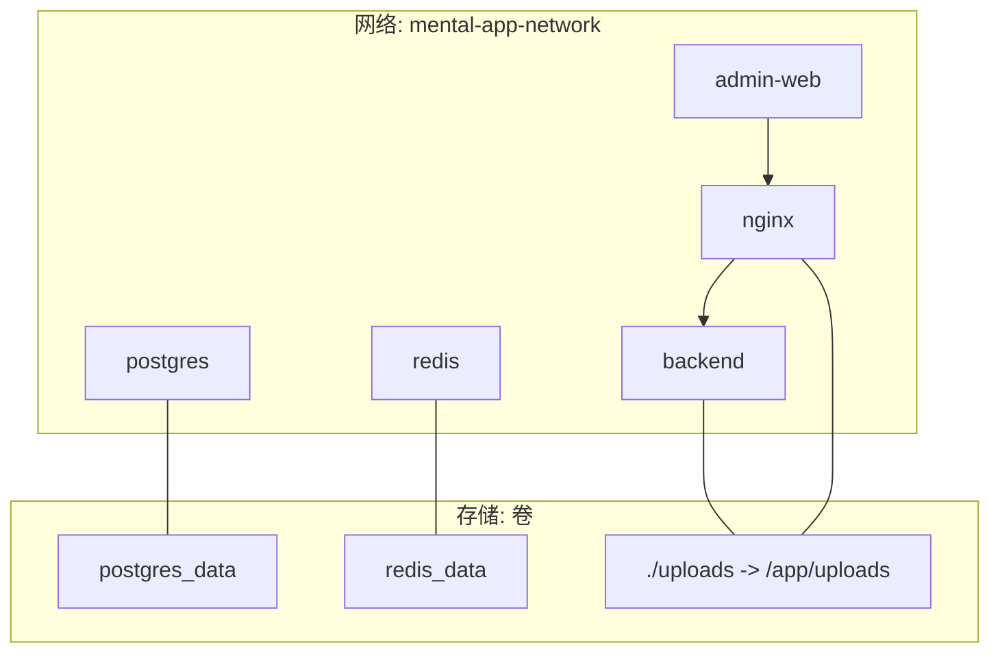
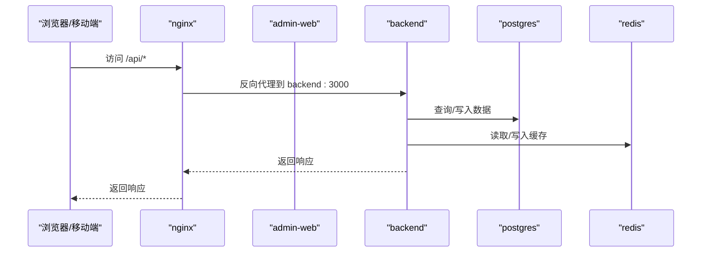
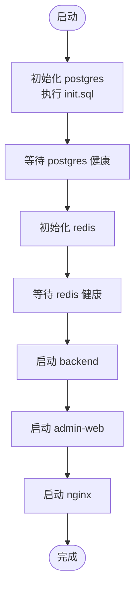

# Docker Compose 配置详解

<cite>
**本文引用的文件**
- [docker-compose.yml](file://docker-compose.yml)
- [backend/Dockerfile](file://backend/Dockerfile)
- [home/user/nian/admin-web/Dockerfile](file://home/user/nian/admin-web/Dockerfile)
- [database/init.sql](file://database/init.sql)
- [.env.example](file://.env.example)
- [backend/src/config/database.ts](file://backend/src/config/database.ts)
- [home/user/nian/admin-web/nginx.conf](file://home/user/nian/admin-web/nginx.conf)
- [backend/src/routes/admin.routes.ts](file://backend/src/routes/admin.routes.ts)
- [backend/src/routes/auth.routes.ts](file://backend/src/routes/auth.routes.ts)
</cite>

## 目录
1. [简介](#简介)
2. [项目结构](#项目结构)
3. [核心组件](#核心组件)
4. [架构总览](#架构总览)
5. [详细组件分析](#详细组件分析)
6. [依赖关系分析](#依赖关系分析)
7. [性能考量](#性能考量)
8. [故障排查指南](#故障排查指南)
9. [结论](#结论)
10. [附录](#附录)

## 简介
本文件对仓库中的 docker-compose.yml 进行全面解析，重点说明以下服务的配置参数与网络互通机制：
- 后端 API 服务（backend）
- 管理后台前端（admin-web）
- 数据库（postgres）
- 缓存（redis）
- 反向代理（nginx）

内容涵盖镜像选择、容器名称、环境变量注入、端口映射、数据卷挂载（含数据库初始化脚本与上传文件共享目录）、服务依赖关系与健康检查条件；同时解释 mental-app-network 自定义桥接网络如何实现服务间通信，以及 postgres_data 和 redis_data 持久化卷的管理策略，并给出多环境（开发、测试、生产）变量覆盖建议。

## 项目结构
该 compose 文件采用分层组织方式：服务层（postgres、redis、backend、admin-web、nginx）、网络层（mental-app-network）与存储层（postgres_data、redis_data）。服务之间通过自定义桥接网络进行隔离且互通，数据库与缓存使用命名卷确保数据持久化，后端与管理端通过 Nginx 或直接访问后端 API。

图表来源
- [docker-compose.yml](file://docker-compose.yml#L1-L121)
- [docker-compose.yml](file://docker-compose.yml#L123-L241)

章节来源
- [docker-compose.yml](file://docker-compose.yml#L1-L121)
- [docker-compose.yml](file://docker-compose.yml#L123-L241)

## 核心组件
- postgres（数据库）
  - 镜像与容器名：使用官方 postgres:15-alpine，容器名为 mental-app-postgres
  - 环境变量：通过环境变量注入数据库名、用户名、密码
  - 端口映射：将宿主机 5432 映射至容器 5432
  - 数据卷：挂载本地目录为容器内数据目录，并挂载数据库初始化脚本
  - 健康检查：使用 pg_isready 检查数据库可用性
  - 网络：加入 mental-app-network
- redis（缓存）
  - 镜像与容器名：使用官方 redis:7-alpine，容器名为 mental-app-redis
  - 端口映射：将宿主机 6379 映射至容器 6379
  - 数据卷：挂载本地目录为容器内持久化路径
  - 健康检查：使用 redis-cli ping
  - 网络：加入 mental-app-network
- backend（后端 API）
  - 构建：基于 backend/Dockerfile 的多阶段构建
  - 环境变量：注入 NODE_ENV、PORT、数据库与 Redis 连接信息、JWT 密钥与过期时间、上传路径等
  - 端口映射：将宿主机 3000 映射至容器 3000
  - 数据卷：挂载本地 uploads 目录到容器 /app/uploads
  - 依赖与健康检查：等待 postgres 与 redis 健康后再启动，健康检查访问 /health
  - 网络：加入 mental-app-network
- admin-web（管理后台前端）
  - 构建：基于 home/user/nian/admin-web/Dockerfile 的多阶段构建（Nginx 承载静态资源）
  - 端口映射：将宿主机 8080 映射至容器 80
  - 依赖：依赖 backend
  - 网络：加入 mental-app-network
- nginx（反向代理）
  - 镜像：使用官方 nginx:alpine
  - 端口映射：将宿主机 80/443 映射至容器 80/443
  - 数据卷：挂载 Nginx 配置与上传文件共享目录
  - 依赖：依赖 backend 与 admin-web
  - 网络：加入 mental-app-network

章节来源
- [docker-compose.yml](file://docker-compose.yml#L1-L121)
- [docker-compose.yml](file://docker-compose.yml#L123-L241)
- [backend/Dockerfile](file://backend/Dockerfile#L1-L45)
- [home/user/nian/admin-web/Dockerfile](file://home/user/nian/admin-web/Dockerfile#L1-L30)
- [home/user/nian/admin-web/nginx.conf](file://home/user/nian/admin-web/nginx.conf#L1-L69)

## 架构总览
compose 将多个服务置于同一自定义桥接网络中，形成如下交互关系：
- admin-web 通过 Nginx 将 /api 请求转发至 backend
- Nginx 同时挂载 uploads 目录，使静态资源与上传文件在容器间共享
- backend 通过环境变量连接 postgres 与 redis，使用连接池与 Redis 客户端
- postgres 使用初始化脚本创建表结构、索引、视图与示例数据
- redis 作为缓存与会话存储支撑后端业务

图表来源
- [docker-compose.yml](file://docker-compose.yml#L1-L121)
- [docker-compose.yml](file://docker-compose.yml#L123-L241)
- [home/user/nian/admin-web/nginx.conf](file://home/user/nian/admin-web/nginx.conf#L1-L69)
- [backend/src/config/database.ts](file://backend/src/config/database.ts#L1-L47)

## 详细组件分析

### 数据库服务（postgres）
- 镜像与容器名：postgres:15-alpine，容器名 mental-app-postgres
- 环境变量注入：POSTGRES_DB、POSTGRES_USER、POSTGRES_PASSWORD
- 端口映射：5432:5432
- 数据卷：
  - postgres_data:/var/lib/postgresql/data（持久化）
  - ./database/init.sql:/docker-entrypoint-initdb.d/init.sql:ro（初始化脚本）
- 健康检查：pg_isready -U postgres
- 网络：mental-app-network
- 依赖关系：backend 通过 depends_on 并指定 condition: service_healthy 等待其健康

数据库初始化脚本要点：
- 创建用户、方法、用户方法、练习记录、提醒设置、管理员、审核日志、媒体文件等表
- 建立常用索引（如 email、created_at、method 状态/分类/难度等）
- 插入默认管理员与示例心理自助方法数据
- 定义更新时间自动触发器与若干视图（用户练习统计、方法热度统计）

章节来源
- [docker-compose.yml](file://docker-compose.yml#L1-L121)
- [docker-compose.yml](file://docker-compose.yml#L123-L241)
- [database/init.sql](file://database/init.sql#L1-L349)

### 缓存服务（redis）
- 镜像与容器名：redis:7-alpine，容器名 mental-app-redis
- 端口映射：6379:6379
- 数据卷：redis_data:/data（持久化）
- 健康检查：redis-cli ping
- 网络：mental-app-network
- 依赖关系：backend 通过 depends_on 并指定 condition: service_healthy 等待其健康

章节来源
- [docker-compose.yml](file://docker-compose.yml#L1-L121)
- [docker-compose.yml](file://docker-compose.yml#L123-L241)

### 后端 API 服务（backend）
- 构建：多阶段 Dockerfile，最终运行 dist/index.js，暴露 3000 端口，内置健康检查
- 环境变量注入：
  - NODE_ENV、PORT
  - DB_HOST、DB_PORT、DB_NAME、DB_USER、DB_PASSWORD
  - REDIS_HOST、REDIS_PORT
  - JWT_SECRET、JWT_EXPIRES_IN
  - UPLOAD_PATH（用于上传目录）
- 端口映射：3000:3000
- 数据卷：./uploads -> /app/uploads（共享上传文件）
- 依赖关系：depends_on postgres 与 redis，condition: service_healthy
- 健康检查：curl -f http://localhost:3000/health
- 网络：mental-app-network

后端连接数据库与 Redis 的代码要点：
- 使用 pg 连接池与 redis 客户端，分别从环境变量读取连接参数
- 初始化时测试连接并输出日志，异常时抛出错误
- 提供优雅关闭连接的方法

章节来源
- [docker-compose.yml](file://docker-compose.yml#L1-L121)
- [docker-compose.yml](file://docker-compose.yml#L123-L241)
- [backend/Dockerfile](file://backend/Dockerfile#L1-L45)
- [backend/src/config/database.ts](file://backend/src/config/database.ts#L1-L47)

### 管理后台前端（admin-web）
- 构建：多阶段构建，前端产物复制到 Nginx 静态目录，使用自定义 nginx.conf
- 端口映射：8080:80
- 依赖：depends_on backend
- 网络：mental-app-network

Nginx 配置要点：
- 监听 80，SPA 回退到 /index.html
- /api 路由代理到 backend:3000
- 设置请求头（Host、X-Real-IP、X-Forwarded-* 等）
- 对静态资源启用缓存与压缩

章节来源
- [docker-compose.yml](file://docker-compose.yml#L1-L121)
- [docker-compose.yml](file://docker-compose.yml#L123-L241)
- [home/user/nian/admin-web/Dockerfile](file://home/user/nian/admin-web/Dockerfile#L1-L30)
- [home/user/nian/admin-web/nginx.conf](file://home/user/nian/admin-web/nginx.conf#L1-L69)

### 反向代理（nginx）
- 镜像：nginx:alpine
- 端口映射：80:80、443:443
- 数据卷：
  - ./nginx/nginx.conf -> /etc/nginx/nginx.conf:ro
  - ./nginx/conf.d -> /etc/nginx/conf.d:ro
  - ./uploads -> /var/www/uploads:ro（共享上传文件）
- 依赖：depends_on backend 与 admin-web
- 网络：mental-app-network

章节来源
- [docker-compose.yml](file://docker-compose.yml#L1-L121)
- [docker-compose.yml](file://docker-compose.yml#L123-L241)

## 依赖关系分析
- 服务启动顺序：
  - postgres 与 redis 先于 backend 启动，backend 通过 healthcheck 等待两者健康
  - admin-web 依赖 backend
  - nginx 依赖 backend 与 admin-web
- 健康检查：
  - postgres：pg_isready -U postgres
  - redis：redis-cli ping
  - backend：curl -f http://localhost:3000/health
- 网络互通：
  - 所有服务加入 mental-app-network，彼此可通过服务名互访
  - backend 通过 DB_HOST=postgres、REDIS_HOST=redis 连接数据库与缓存
  - admin-web 通过 Nginx 的 /api 代理访问 backend

图表来源
- [docker-compose.yml](file://docker-compose.yml#L1-L121)
- [docker-compose.yml](file://docker-compose.yml#L123-L241)

章节来源
- [docker-compose.yml](file://docker-compose.yml#L1-L121)
- [docker-compose.yml](file://docker-compose.yml#L123-L241)

## 性能考量
- 数据库连接池：后端使用 pg 连接池，合理设置最大连接数与超时，避免并发阻塞
- 缓存命中：Redis 作为热点数据缓存，减少数据库压力
- 静态资源优化：Nginx 启用 gzip 与静态资源缓存，降低带宽与延迟
- 健康检查间隔：适当增大健康检查间隔，减少探针开销
- 存储卷：使用命名卷持久化数据库与缓存数据，避免容器重建导致数据丢失

## 故障排查指南
- 数据库未就绪
  - 症状：backend 启动失败或反复重启
  - 排查：确认 postgres 健康检查通过；检查 POSTGRES_* 环境变量是否正确；确认 init.sql 是否成功执行
- 缓存不可用
  - 症状：后端连接 Redis 失败
  - 排查：确认 redis 健康检查通过；检查 REDIS_HOST/REDIS_PORT；确认网络连通
- 上传文件无法访问
  - 症状：管理端上传后无法预览或下载
  - 排查：确认 uploads 数据卷挂载路径一致；若使用 nginx，确认共享卷已挂载到 /var/www/uploads
- API 代理失败
  - 症状：admin-web 访问 /api 报错
  - 排查：确认 Nginx 配置中 proxy_pass 指向 backend:3000；检查 backend 健康检查与端口映射
- CORS 问题
  - 症状：跨域请求被拒绝
  - 排查：根据 .env.example 中 CORS_ORIGIN 配置，确保前端域名与端口匹配

章节来源
- [docker-compose.yml](file://docker-compose.yml#L1-L121)
- [docker-compose.yml](file://docker-compose.yml#L123-L241)
- [.env.example](file://.env.example#L1-L61)
- [home/user/nian/admin-web/nginx.conf](file://home/user/nian/admin-web/nginx.conf#L1-L69)
- [backend/src/config/database.ts](file://backend/src/config/database.ts#L1-L47)

## 结论
该 compose 配置通过自定义桥接网络实现了服务间的稳定互通，利用命名卷保障了数据库与缓存的数据持久化，借助 Nginx 实现了静态资源与 API 的统一入口。后端通过环境变量集中管理数据库与缓存连接参数，并提供健康检查保障启动顺序与可用性。建议在不同环境中按“附录”中的多环境变量覆盖策略进行配置，确保安全与可维护性。

## 附录
- 多环境变量覆盖建议
  - 开发环境（local）
    - NODE_ENV=development
    - PORT=3000
    - DB_HOST=postgres
    - DB_PORT=5432
    - DB_NAME=mental_app
    - DB_USER=postgres
    - DB_PASSWORD=your_dev_db_password
    - REDIS_HOST=redis
    - REDIS_PORT=6379
    - JWT_SECRET=your_dev_jwt_secret_at_least_32_chars
    - JWT_EXPIRES_IN=7d
    - UPLOAD_PATH=/app/uploads
    - CORS_ORIGIN=http://localhost:8080,http://localhost:3000
  - 测试环境（test）
    - NODE_ENV=staging
    - PORT=3000
    - DB_HOST=postgres
    - DB_PORT=5432
    - DB_NAME=mental_app_test
    - DB_USER=postgres
    - DB_PASSWORD=your_test_db_password
    - REDIS_HOST=redis
    - REDIS_PORT=6379
    - JWT_SECRET=your_test_jwt_secret_at_least_32_chars
    - JWT_EXPIRES_IN=7d
    - UPLOAD_PATH=/app/uploads
    - CORS_ORIGIN=http://localhost:8080,http://localhost:3000
  - 生产环境（prod）
    - NODE_ENV=production
    - PORT=3000
    - DB_HOST=postgres
    - DB_PORT=5432
    - DB_NAME=mental_app
    - DB_USER=postgres
    - DB_PASSWORD=your_prod_db_password
    - REDIS_HOST=redis
    - REDIS_PORT=6379
    - JWT_SECRET=your_prod_jwt_secret_at_least_32_chars
    - JWT_EXPIRES_IN=7d
    - UPLOAD_PATH=/app/uploads
    - CORS_ORIGIN=https://yourdomain.com
  - 通用建议
    - 不要在代码中硬编码敏感信息，使用环境变量注入
    - 在生产环境开启 HTTPS 并配置证书
    - 限制 CORS_ORIGIN 仅允许受信域名
    - 定期备份 postgres_data 与 redis_data

章节来源
- [.env.example](file://.env.example#L1-L61)