# Nginx 反向代理配置

<cite>
**本文档引用文件**   
- [nginx.conf](file://home/user/nian/admin-web/nginx.conf)
- [docker-compose.yml](file://docker-compose.yml)
- [Dockerfile](file://home/user/nian/admin-web/Dockerfile)
- [vite.config.ts](file://home/user/nian/admin-web/vite.config.ts)
- [.env.example](file://.env.example)
</cite>

## 目录
1. [项目结构](#项目结构)
2. [核心配置分析](#核心配置分析)
3. [反向代理规则](#反向代理规则)
4. [性能优化配置](#性能优化配置)
5. [安全增强配置](#安全增强配置)
6. [HTTPS与SSL配置](#https与ssl配置)
7. [部署与集成](#部署与集成)

## 项目结构

本项目采用微服务架构，通过Docker Compose管理多个容器化服务。Nginx作为反向代理服务器，统一暴露后端API和管理后台静态资源。

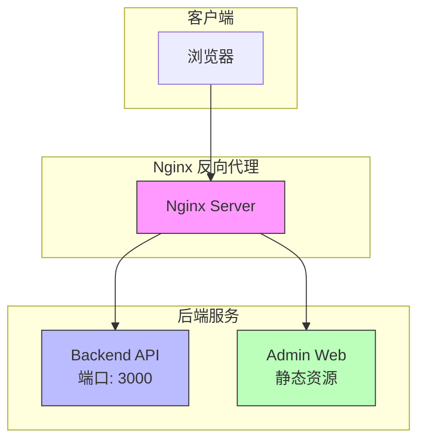

**Diagram sources**
- [docker-compose.yml](file://docker-compose.yml#L94-L110)
- [nginx.conf](file://home/user/nian/admin-web/nginx.conf#L1-L69)

**Section sources**
- [docker-compose.yml](file://docker-compose.yml#L1-L241)
- [project_structure](file://project_structure)

## 核心配置分析

Nginx配置文件定义了两个server块，分别处理HTTP请求。配置文件位于`admin-web`目录下，通过Docker容器化部署。

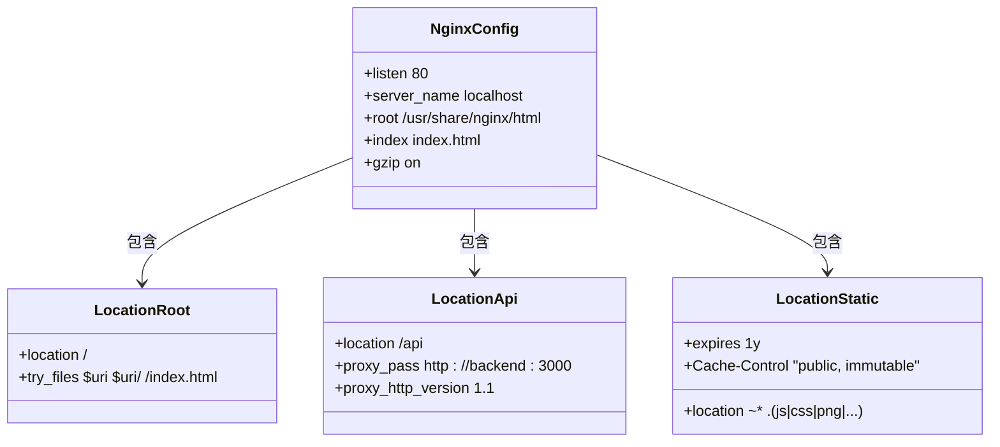

**Diagram sources**
- [nginx.conf](file://home/user/nian/admin-web/nginx.conf#L1-L69)

**Section sources**
- [nginx.conf](file://home/user/nian/admin-web/nginx.conf#L1-L69)
- [Dockerfile](file://home/user/nian/admin-web/Dockerfile#L1-L30)

## 反向代理规则

Nginx配置实现了API请求与静态资源的分离处理，通过location指令精确匹配请求路径。

### API代理配置
配置将所有以`/api`开头的请求代理到后端服务，实现API统一暴露。

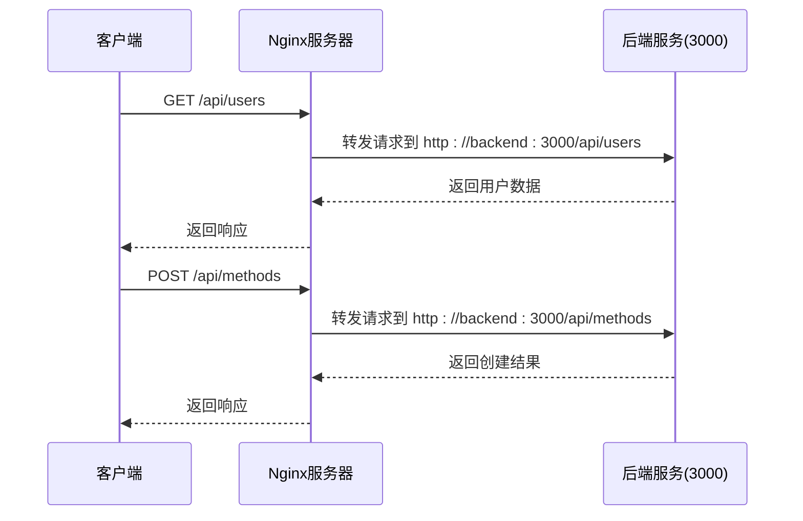

**Diagram sources**
- [nginx.conf](file://home/user/nian/admin-web/nginx.conf#L17-L27)
- [docker-compose.yml](file://docker-compose.yml#L43-L79)

**Section sources**
- [nginx.conf](file://home/user/nian/admin-web/nginx.conf#L17-L27)
- [docker-compose.yml](file://docker-compose.yml#L43-L79)

### 静态资源处理
根路径`/`的请求由管理后台的HTML文件处理，支持SPA应用的路由fallback机制。

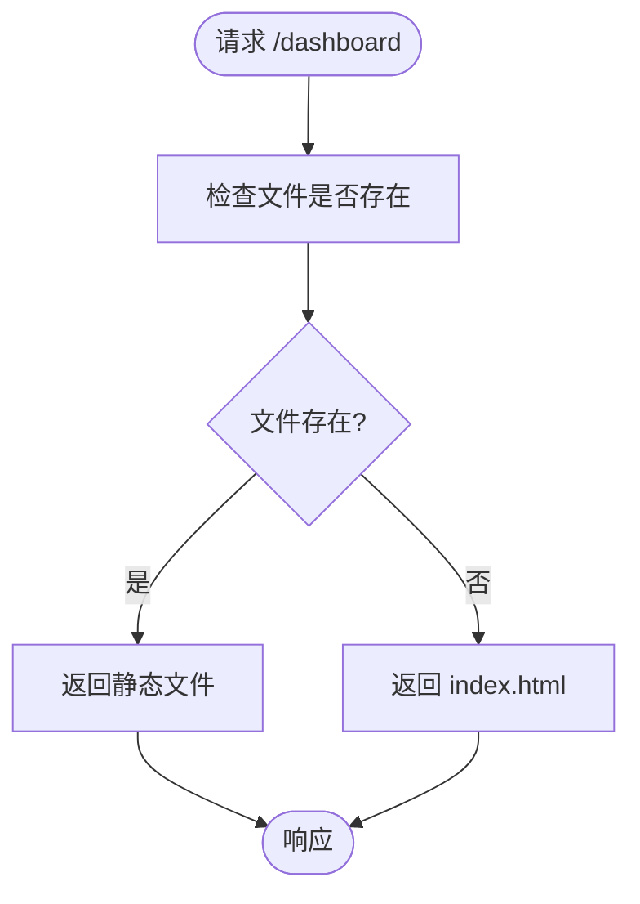

**Diagram sources**
- [nginx.conf](file://home/user/nian/admin-web/nginx.conf#L12-L14)
- [vite.config.ts](file://home/user/nian/admin-web/vite.config.ts#L1-L42)

**Section sources**
- [nginx.conf](file://home/user/nian/admin-web/nginx.conf#L12-L14)
- [vite.config.ts](file://home/user/nian/admin-web/vite.config.ts#L1-L42)

## 性能优化配置

Nginx配置包含多项性能优化措施，提升系统响应速度和用户体验。

### Gzip压缩配置
启用Gzip压缩，减少网络传输数据量，提高页面加载速度。

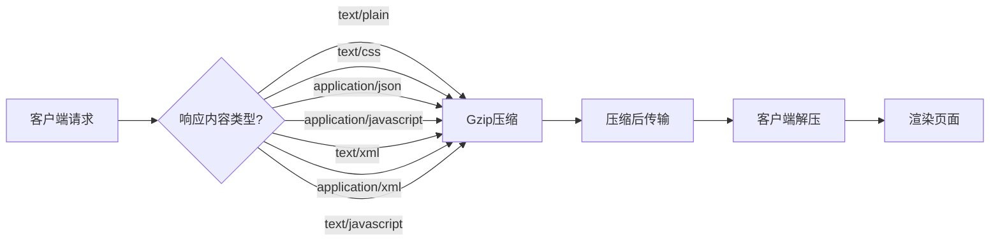

**Diagram sources**
- [nginx.conf](file://home/user/nian/admin-web/nginx.conf#L8-L9)

**Section sources**
- [nginx.conf](file://home/user/nian/admin-web/nginx.conf#L8-L9)

### 静态资源缓存
对静态资源设置长期缓存策略，减少重复请求，提高访问效率。

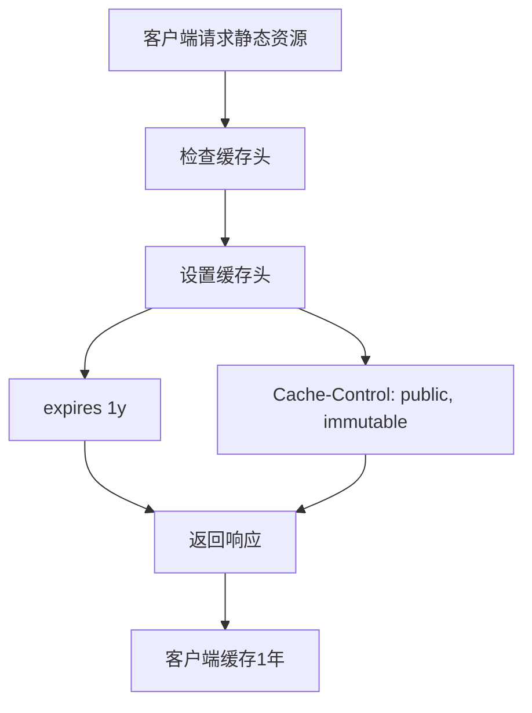

**Diagram sources**
- [nginx.conf](file://home/user/nian/admin-web/nginx.conf#L30-L33)

**Section sources**
- [nginx.conf](file://home/user/nian/admin-web/nginx.conf#L30-L33)

## 安全增强配置

配置包含多项安全措施，保护系统免受常见Web攻击。

### 请求头转发
通过proxy_set_header指令正确传递客户端信息，确保后端服务能获取真实请求上下文。

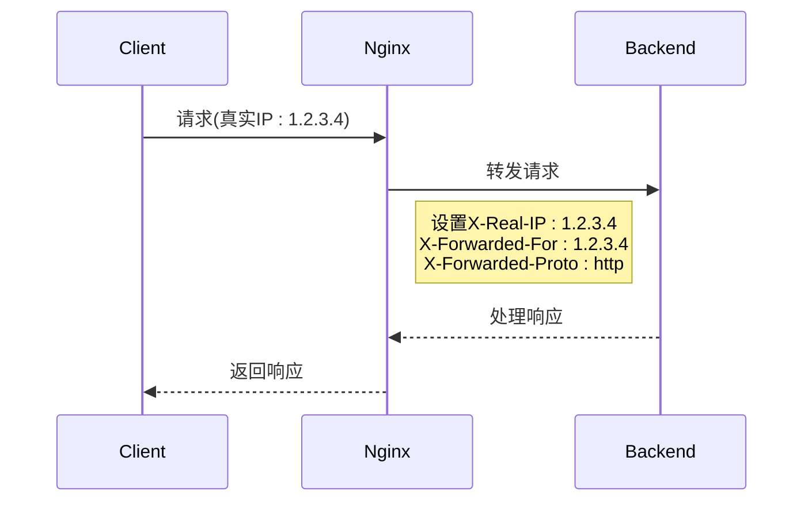

**Diagram sources**
- [nginx.conf](file://home/user/nian/admin-web/nginx.conf#L24-L26)

**Section sources**
- [nginx.conf](file://home/user/nian/admin-web/nginx.conf#L24-L26)

### 跨域配置
虽然Nginx本身不直接配置CORS，但通过环境变量在后端服务中设置。

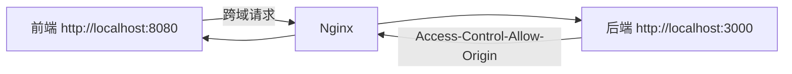

**Diagram sources**
- [.env.example](file://.env.example#L29-L30)

**Section sources**
- [.env.example](file://.env.example#L29-L30)

## HTTPS与SSL配置

虽然当前配置主要为HTTP，但系统支持HTTPS部署，需进行相应配置升级。

### HTTPS重定向
建议配置HTTP到HTTPS的自动重定向，强制使用安全连接。

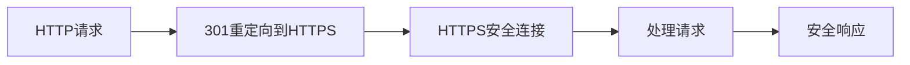

**Section sources**
- [docker-compose.yml](file://docker-compose.yml#L100-L101)

### SSL证书集成
配置SSL证书以启用HTTPS加密通信。

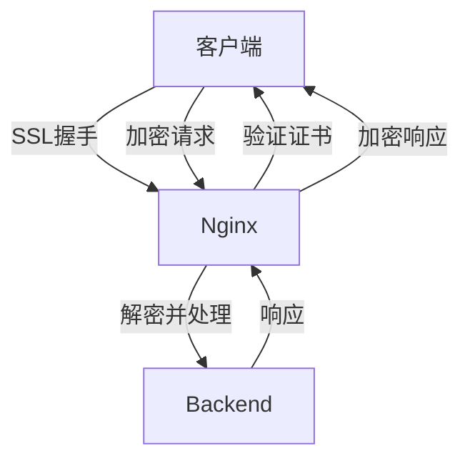

**Section sources**
- [docker-compose.yml](file://docker-compose.yml#L100-L101)

## 部署与集成

Nginx配置与Docker Compose集成，实现容器化部署和管理。

### Docker集成
Nginx作为独立服务在Docker Compose中定义，与其他服务协同工作。

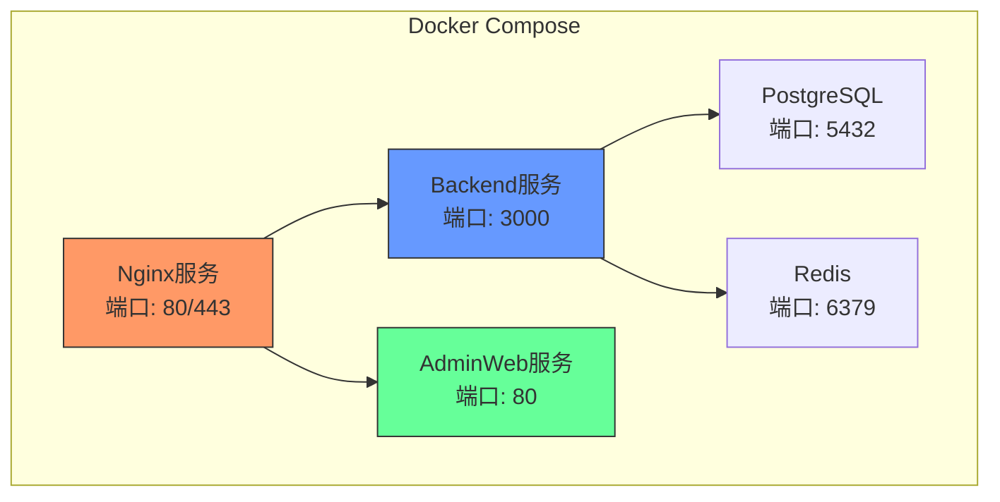

**Diagram sources**
- [docker-compose.yml](file://docker-compose.yml#L94-L110)

**Section sources**
- [docker-compose.yml](file://docker-compose.yml#L94-L110)
- [Dockerfile](file://home/user/nian/admin-web/Dockerfile#L1-L30)