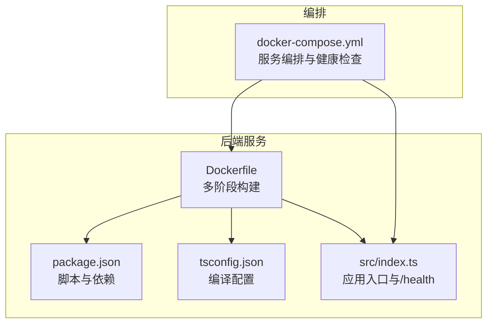
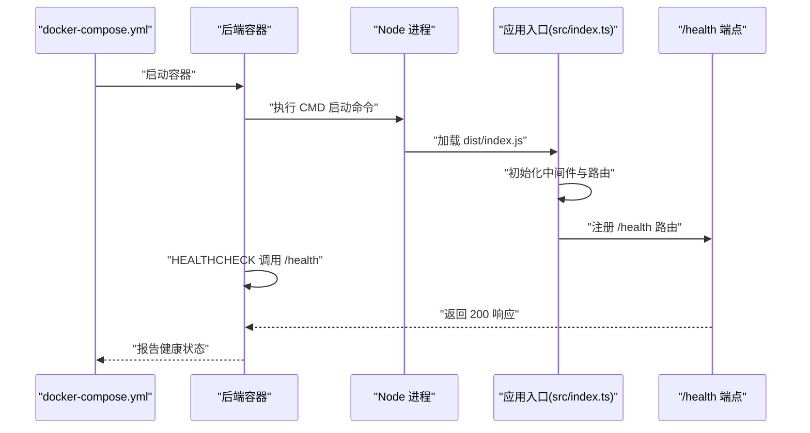
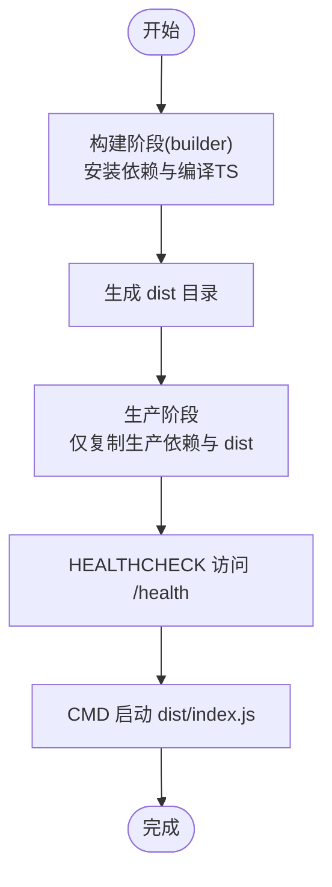
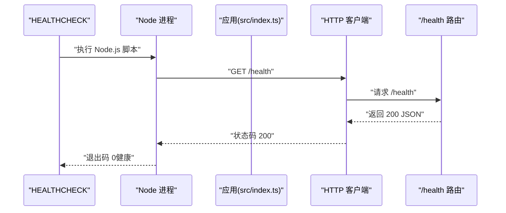
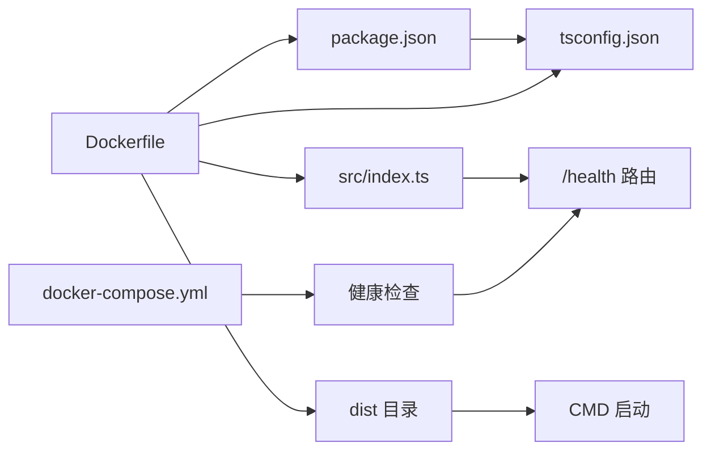

# 后端服务容器化

<cite>
**本文引用的文件**
- [backend/Dockerfile](file://backend/Dockerfile)
- [backend/package.json](file://backend/package.json)
- [backend/tsconfig.json](file://backend/tsconfig.json)
- [backend/src/index.ts](file://backend/src/index.ts)
- [docker-compose.yml](file://docker-compose.yml)
</cite>

## 目录
1. [简介](#简介)
2. [项目结构](#项目结构)
3. [核心组件](#核心组件)
4. [架构总览](#架构总览)
5. [详细组件分析](#详细组件分析)
6. [依赖关系分析](#依赖关系分析)
7. [性能与构建优化](#性能与构建优化)
8. [故障排查指南](#故障排查指南)
9. [结论](#结论)
10. [附录](#附录)

## 简介
本文件围绕后端服务的容器化构建进行深入解析，重点覆盖：
- 多阶段构建流程：第一阶段（builder）使用 node:18-alpine 安装依赖并编译 TypeScript；第二阶段仅复制生产依赖与编译产物，显著缩小镜像体积。
- 关键指令说明：WORKDIR、COPY、RUN、EXPOSE 的作用与最佳实践。
- 健康检查：HEALTHCHECK 通过 Node.js 脚本调用 /health 端点验证服务状态。
- 启动命令：CMD 执行 dist/index.js。
- 构建缓存优化、安全加固（非 root 用户运行建议）、调试技巧。

## 项目结构
后端容器化相关的关键文件与位置如下：
- Dockerfile：定义多阶段构建与运行时行为。
- package.json：定义构建脚本与依赖范围。
- tsconfig.json：定义 TypeScript 编译输出目录与编译选项。
- src/index.ts：应用入口，包含 /health 健康检查端点与路由挂载。
- docker-compose.yml：编排后端服务，设置环境变量、端口映射、卷挂载与健康检查策略。

图表来源
- [backend/Dockerfile](file://backend/Dockerfile#L1-L45)
- [backend/package.json](file://backend/package.json#L1-L55)
- [backend/tsconfig.json](file://backend/tsconfig.json#L1-L28)
- [backend/src/index.ts](file://backend/src/index.ts#L1-L85)
- [docker-compose.yml](file://docker-compose.yml#L1-L241)

章节来源
- [backend/Dockerfile](file://backend/Dockerfile#L1-L45)
- [backend/package.json](file://backend/package.json#L1-L55)
- [backend/tsconfig.json](file://backend/tsconfig.json#L1-L28)
- [backend/src/index.ts](file://backend/src/index.ts#L1-L85)
- [docker-compose.yml](file://docker-compose.yml#L1-L241)

## 核心组件
- 多阶段构建（builder 阶段）
  - 使用 node:18-alpine 作为基础镜像，WORKDIR 设置工作目录。
  - COPY 包含 package.json/tsconfig.json，RUN 执行 npm ci 安装完整依赖。
  - COPY 源码目录 src，RUN 执行构建脚本生成 dist。
- 生产阶段
  - 从同一基础镜像重新开始，WORKDIR 设置工作目录。
  - COPY package.json，RUN 使用 npm ci --only=production 安装生产依赖。
  - 从 builder 阶段复制 dist 目录到当前镜像。
  - 创建 uploads 目录，EXPOSE 3000 端口。
  - HEALTHCHECK 通过 Node.js 脚本访问 /health 并根据响应码判断健康状态。
  - CMD 启动命令执行 dist/index.js。

章节来源
- [backend/Dockerfile](file://backend/Dockerfile#L1-L45)
- [backend/package.json](file://backend/package.json#L1-L55)
- [backend/tsconfig.json](file://backend/tsconfig.json#L1-L28)
- [backend/src/index.ts](file://backend/src/index.ts#L1-L85)

## 架构总览
下图展示了后端服务在容器中的启动与健康检查流程，以及与编排文件的关系。

图表来源
- [backend/Dockerfile](file://backend/Dockerfile#L36-L45)
- [backend/src/index.ts](file://backend/src/index.ts#L1-L85)
- [docker-compose.yml](file://docker-compose.yml#L163-L199)

章节来源
- [backend/Dockerfile](file://backend/Dockerfile#L36-L45)
- [backend/src/index.ts](file://backend/src/index.ts#L1-L85)
- [docker-compose.yml](file://docker-compose.yml#L163-L199)

## 详细组件分析

### 多阶段构建流程
- 第一阶段（builder）
  - 使用 node:18-alpine，WORKDIR 设为 /app。
  - 先 COPY package.json 与 tsconfig.json，再 RUN npm ci 安装依赖，确保后续 COPY 源码时能命中缓存。
  - COPY src 源码，RUN npm run build（对应 package.json 中的 build 脚本）生成 dist。
- 第二阶段（生产）
  - 重新基于 node:18-alpine，WORKDIR 设为 /app。
  - COPY package.json，RUN npm ci --only=production 只安装生产依赖，避免开发依赖进入最终镜像。
  - COPY --from=builder /app/dist 到当前镜像的 dist，减少镜像体积。
  - 创建 uploads 目录，EXPOSE 3000 端口。
  - HEALTHCHECK 通过 Node.js 脚本访问 http://localhost:3000/health，若状态码为 200 则健康，否则不健康。
  - CMD 执行 node dist/index.js 启动应用。

图表来源
- [backend/Dockerfile](file://backend/Dockerfile#L1-L45)
- [backend/package.json](file://backend/package.json#L1-L55)
- [backend/tsconfig.json](file://backend/tsconfig.json#L1-L28)

章节来源
- [backend/Dockerfile](file://backend/Dockerfile#L1-L45)
- [backend/package.json](file://backend/package.json#L1-L55)
- [backend/tsconfig.json](file://backend/tsconfig.json#L1-L28)

### 关键指令详解
- WORKDIR
  - 在两个阶段均设置工作目录为 /app，保证后续 COPY/RUN 行为的一致性与可预期性。
- COPY
  - builder 阶段：先复制 package.json 与 tsconfig.json，再复制 src 源码，配合 RUN npm ci，最大化利用缓存。
  - 生产阶段：仅复制 package.json 与 dist 目录，避免将源码与开发工具带入最终镜像。
- RUN
  - builder 阶段：npm ci 安装依赖；npm run build 生成 dist。
  - 生产阶段：npm ci --only=production 安装生产依赖。
- EXPOSE
  - 暴露 3000 端口，便于 docker-compose 映射与外部访问。
- HEALTHCHECK
  - 使用 Node.js 内置 http 模块发起 GET 请求到 /health，依据响应码判定健康状态。
  - 与 docker-compose.yml 中的 healthcheck 配置形成互补，共同保障服务可用性。
- CMD
  - 启动命令执行 dist/index.js，即应用入口文件。

章节来源
- [backend/Dockerfile](file://backend/Dockerfile#L1-L45)
- [backend/src/index.ts](file://backend/src/index.ts#L1-L85)
- [docker-compose.yml](file://docker-compose.yml#L163-L199)

### 健康检查机制
- 应用层 /health
  - 在 src/index.ts 中注册 /health 路由，返回包含状态与时间戳的 JSON 对象，用于快速检测服务是否正常运行。
- 容器层 HEALTHCHECK
  - Dockerfile 中的 HEALTHCHECK 使用 Node.js 脚本访问 /health，成功则返回 0（健康），失败则返回非 0（不健康）。
  - docker-compose.yml 中也对 backend 服务设置了 healthcheck，测试 curl -f http://localhost:3000/health，与应用层 /health 保持一致。

图表来源
- [backend/Dockerfile](file://backend/Dockerfile#L39-L42)
- [backend/src/index.ts](file://backend/src/index.ts#L33-L36)
- [docker-compose.yml](file://docker-compose.yml#L194-L198)

章节来源
- [backend/Dockerfile](file://backend/Dockerfile#L39-L42)
- [backend/src/index.ts](file://backend/src/index.ts#L33-L36)
- [docker-compose.yml](file://docker-compose.yml#L194-L198)

### 启动命令与入口
- CMD ["node", "dist/index.js"]
  - 通过 package.json 的 scripts.start 与 main 字段可知，dist/index.js 是应用入口。
  - 启动时会初始化数据库连接、注册中间件与路由，并监听端口。

章节来源
- [backend/Dockerfile](file://backend/Dockerfile#L44-L45)
- [backend/package.json](file://backend/package.json#L1-L55)
- [backend/src/index.ts](file://backend/src/index.ts#L1-L85)

## 依赖关系分析
- 构建链路
  - Dockerfile 依赖 package.json 的 build 脚本与 tsconfig.json 的 outDir 配置。
  - 生产阶段依赖 builder 阶段生成的 dist 目录。
- 运行链路
  - src/index.ts 注册 /health 路由，供 HEALTHCHECK 与 docker-compose.yml 的健康检查使用。
  - docker-compose.yml 将宿主机 uploads 目录挂载到容器 /app/uploads，确保静态资源与上传文件持久化。

图表来源
- [backend/Dockerfile](file://backend/Dockerfile#L1-L45)
- [backend/package.json](file://backend/package.json#L1-L55)
- [backend/tsconfig.json](file://backend/tsconfig.json#L1-L28)
- [backend/src/index.ts](file://backend/src/index.ts#L1-L85)
- [docker-compose.yml](file://docker-compose.yml#L163-L199)

章节来源
- [backend/Dockerfile](file://backend/Dockerfile#L1-L45)
- [backend/package.json](file://backend/package.json#L1-L55)
- [backend/tsconfig.json](file://backend/tsconfig.json#L1-L28)
- [backend/src/index.ts](file://backend/src/index.ts#L1-L85)
- [docker-compose.yml](file://docker-compose.yml#L163-L199)

## 性能与构建优化
- 构建缓存优化
  - builder 阶段先 COPY package.json 与 tsconfig.json，再 COPY src，使依赖安装与源码变更分离，提升缓存命中率。
  - 使用 npm ci 而非 npm install，确保依赖锁定与确定性安装。
  - 生产阶段仅复制 package.json 与 dist，避免将源码与开发工具带入最终镜像，减小体积。
- 运行时性能
  - 使用 node:18-alpine 作为基础镜像，镜像更轻量。
  - 仅安装生产依赖，减少运行时开销与攻击面。
- 端口与网络
  - EXPOSE 3000，docker-compose.yml 将 3000:3000 映射，便于本地调试与外部访问。

章节来源
- [backend/Dockerfile](file://backend/Dockerfile#L1-L45)
- [backend/package.json](file://backend/package.json#L1-L55)
- [docker-compose.yml](file://docker-compose.yml#L163-L199)

## 故障排查指南
- 健康检查失败
  - 检查 /health 路由是否正确注册（src/index.ts 中存在该路由）。
  - 确认 HEALTHCHECK 命令与 /health 端点一致（Dockerfile 与 docker-compose.yml 均指向 /health）。
  - 查看容器日志，确认应用启动是否成功。
- 端口冲突或不可达
  - 确认 docker-compose.yml 中端口映射为 3000:3000。
  - 检查防火墙与 SELinux 等系统策略。
- 上传文件无法访问
  - 确认 docker-compose.yml 中将宿主机 uploads 目录挂载到 /app/uploads。
  - 确认容器内已创建 uploads 目录（Dockerfile 已创建）。
- 数据库连接问题
  - 确认 docker-compose.yml 中依赖的 postgres 与 redis 均处于健康状态。
  - 检查环境变量（DB_HOST、DB_PORT、DB_NAME、DB_USER、DB_PASSWORD、REDIS_HOST、REDIS_PORT）是否正确传递至后端容器。

章节来源
- [backend/src/index.ts](file://backend/src/index.ts#L1-L85)
- [backend/Dockerfile](file://backend/Dockerfile#L36-L45)
- [docker-compose.yml](file://docker-compose.yml#L163-L199)

## 结论
该 Dockerfile 采用多阶段构建，结合 npm ci 与生产依赖隔离，有效控制镜像体积与运行时风险。WORKDIR、COPY、RUN、EXPOSE、HEALTHCHECK、CMD 等指令协同工作，确保了构建稳定性与运行可观测性。配合 docker-compose.yml 的环境变量与健康检查策略，后端服务在开发与生产环境中均可稳定运行。

## 附录
- 安全加固建议（非 root 用户运行）
  - 当前镜像以默认用户运行。如需进一步加固，可在 Dockerfile 中添加用户与权限控制，例如：
    - 使用非 root 用户运行 Node 进程。
    - 限制写权限，仅授予必要的目录（如 /app/uploads）写权限。
    - 使用只读根文件系统（受限于应用需求）。
  - 注意：以上为通用加固建议，具体实现需结合实际部署环境与安全策略评估。