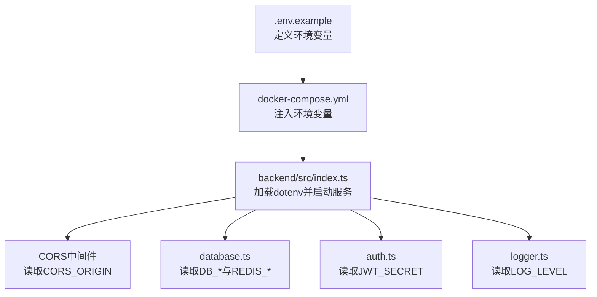
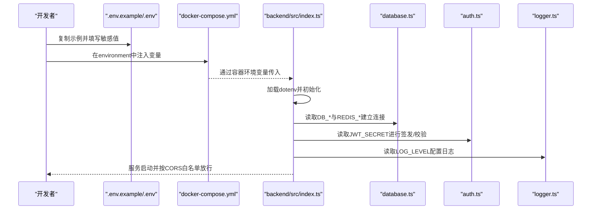
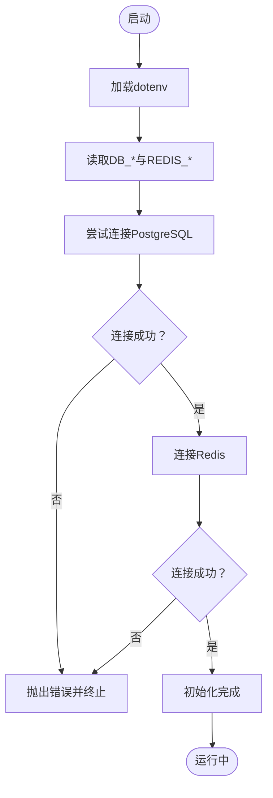
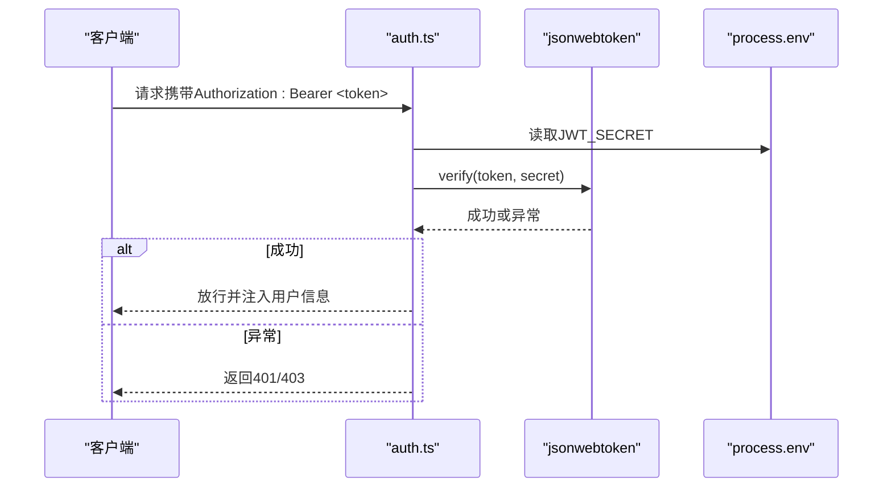
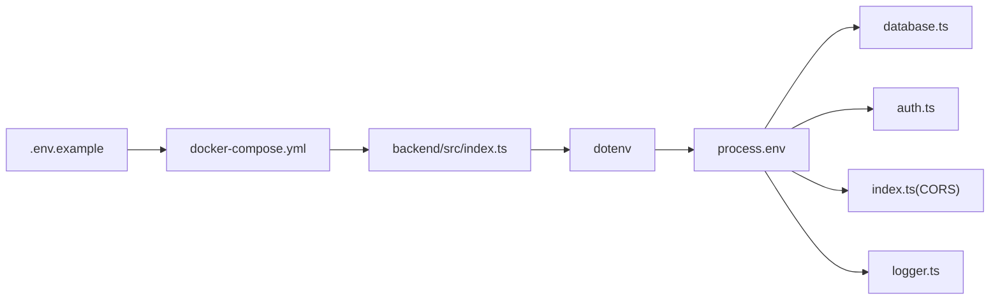

# 环境变量与安全管理

<cite>
**本文引用的文件**
- [.env.example](file://.env.example)
- [docker-compose.yml](file://docker-compose.yml)
- [backend/src/index.ts](file://backend/src/index.ts)
- [backend/src/config/database.ts](file://backend/src/config/database.ts)
- [backend/src/middleware/auth.ts](file://backend/src/middleware/auth.ts)
- [backend/src/utils/logger.ts](file://backend/src/utils/logger.ts)
- [backend/package.json](file://backend/package.json)
- [docs/DEPLOYMENT.md](file://docs/DEPLOYMENT.md)
</cite>

## 目录
1. [简介](#简介)
2. [项目结构](#项目结构)
3. [核心组件](#核心组件)
4. [架构总览](#架构总览)
5. [详细组件分析](#详细组件分析)
6. [依赖关系分析](#依赖关系分析)
7. [性能考虑](#性能考虑)
8. [故障排查指南](#故障排查指南)
9. [结论](#结论)
10. [附录](#附录)

## 简介
本文件系统性梳理并规范本项目的环境变量配置，覆盖数据库连接（POSTGRES_DB、DB_PASSWORD）、Redis配置、JWT密钥（要求至少32字符）、CORS跨域白名单等关键参数，并强调敏感信息（如密码、密钥）不得硬编码，应通过.docker-compose.yml的environment或外部secret管理工具注入。同时提供开发、测试、生产三类部署环境的.env文件管理策略与dotenv安全加载的最佳实践，确保在不同环境下均能正确、安全地运行系统。

## 项目结构
围绕环境变量与安全的关键位置如下：
- .env.example：定义了所有可用的环境变量及其用途与示例值
- docker-compose.yml：在容器编排中注入环境变量，作为敏感信息的主要来源
- backend/src/index.ts：应用入口，显式加载dotenv并配置CORS、Helmet等安全中间件
- backend/src/config/database.ts：数据库与Redis连接配置，从环境变量读取
- backend/src/middleware/auth.ts：JWT密钥读取与令牌签发/校验
- backend/src/utils/logger.ts：日志级别由环境变量控制
- backend/package.json：声明dotenv依赖
- docs/DEPLOYMENT.md：部署与安全配置指引

图表来源
- [.env.example](file://.env.example#L1-L61)
- [docker-compose.yml](file://docker-compose.yml#L43-L83)
- [backend/src/index.ts](file://backend/src/index.ts#L1-L30)
- [backend/src/config/database.ts](file://backend/src/config/database.ts#L1-L24)
- [backend/src/middleware/auth.ts](file://backend/src/middleware/auth.ts#L1-L10)
- [backend/src/utils/logger.ts](file://backend/src/utils/logger.ts#L1-L20)

章节来源
- [.env.example](file://.env.example#L1-L61)
- [docker-compose.yml](file://docker-compose.yml#L43-L83)
- [backend/src/index.ts](file://backend/src/index.ts#L1-L30)
- [backend/src/config/database.ts](file://backend/src/config/database.ts#L1-L24)
- [backend/src/middleware/auth.ts](file://backend/src/middleware/auth.ts#L1-L10)
- [backend/src/utils/logger.ts](file://backend/src/utils/logger.ts#L1-L20)
- [backend/package.json](file://backend/package.json#L1-L34)
- [docs/DEPLOYMENT.md](file://docs/DEPLOYMENT.md#L1-L60)

## 核心组件
本节聚焦环境变量的用途、读取位置与安全要求。

- 数据库连接（PostgreSQL）
  - 关键变量：POSTGRES_DB、POSTGRES_USER、POSTGRES_PASSWORD、DB_HOST、DB_PORT、DB_NAME、DB_USER、DB_PASSWORD
  - 读取位置：数据库连接池与Redis客户端均从process.env读取
  - 安全要点：生产环境必须通过.docker-compose.yml的environment或外部secret注入，禁止硬编码于代码或提交至版本库
- Redis配置
  - 关键变量：REDIS_HOST、REDIS_PORT
  - 读取位置：Redis客户端socket.host/port
  - 安全要点：建议与后端同网段部署，避免暴露公网；生产环境同样通过环境注入
- JWT密钥
  - 关键变量：JWT_SECRET（至少32字符）、JWT_EXPIRES_IN
  - 读取位置：认证中间件与令牌生成函数
  - 安全要点：必须足够强度且长度≥32字符；仅通过环境注入，严禁硬编码
- CORS跨域白名单
  - 关键变量：CORS_ORIGIN（逗号分隔多域名）
  - 读取位置：CORS中间件origin数组
  - 安全要点：仅允许受信域名；开发环境可宽松，生产环境务必严格
- 日志级别
  - 关键变量：LOG_LEVEL
  - 读取位置：日志记录器
  - 安全要点：生产环境建议不低于info，避免泄露敏感信息
- 上传与文件大小
  - 关键变量：UPLOAD_PATH、MAX_FILE_SIZE
  - 读取位置：静态文件服务与上传限制
  - 安全要点：生产环境建议限制更严格的文件类型与大小

章节来源
- [.env.example](file://.env.example#L1-L61)
- [backend/src/config/database.ts](file://backend/src/config/database.ts#L1-L24)
- [backend/src/middleware/auth.ts](file://backend/src/middleware/auth.ts#L1-L10)
- [backend/src/index.ts](file://backend/src/index.ts#L20-L26)
- [backend/src/utils/logger.ts](file://backend/src/utils/logger.ts#L1-L20)

## 架构总览
下图展示环境变量在系统中的流向与作用范围。

图表来源
- [.env.example](file://.env.example#L1-L61)
- [docker-compose.yml](file://docker-compose.yml#L43-L83)
- [backend/src/index.ts](file://backend/src/index.ts#L1-L30)
- [backend/src/config/database.ts](file://backend/src/config/database.ts#L1-L24)
- [backend/src/middleware/auth.ts](file://backend/src/middleware/auth.ts#L1-L10)
- [backend/src/utils/logger.ts](file://backend/src/utils/logger.ts#L1-L20)

## 详细组件分析

### 数据库与Redis连接配置
- 设计要点
  - 数据库连接池与Redis客户端均从process.env读取关键参数
  - 提供默认回退值，便于本地开发快速启动
- 安全与合规
  - 生产环境必须通过.docker-compose.yml的environment注入数据库与Redis凭据
  - 不得在代码或提交的配置中包含真实密码
- 性能与稳定性
  - 连接池最大连接数、空闲超时、连接超时等参数已设定，建议根据负载调整

图表来源
- [backend/src/config/database.ts](file://backend/src/config/database.ts#L1-L47)
- [backend/src/index.ts](file://backend/src/index.ts#L54-L68)

章节来源
- [backend/src/config/database.ts](file://backend/src/config/database.ts#L1-L47)

### JWT认证与密钥管理
- 设计要点
  - 认证中间件与令牌生成函数均从process.env读取JWT_SECRET
  - 支持自定义过期时间（JWT_EXPIRES_IN），默认7天
- 安全与合规
  - JWT_SECRET必须≥32字符，建议使用强随机字符串
  - 生产环境必须通过环境注入，严禁硬编码
- 错误处理
  - 无令牌、令牌无效或过期均返回相应错误码

图表来源
- [backend/src/middleware/auth.ts](file://backend/src/middleware/auth.ts#L1-L86)

章节来源
- [backend/src/middleware/auth.ts](file://backend/src/middleware/auth.ts#L1-L86)

### CORS跨域白名单
- 设计要点
  - CORS中间件从CORS_ORIGIN读取，按逗号拆分为origin数组
  - 启用credentials以支持Cookie跨域
- 安全与合规
  - 开发环境可包含本地前端地址；生产环境仅允许受信域名
  - 建议明确列出域名，避免通配符导致的安全风险

章节来源
- [backend/src/index.ts](file://backend/src/index.ts#L20-L26)
- [.env.example](file://.env.example#L29-L31)

### 日志与敏感信息控制
- 设计要点
  - 日志级别由LOG_LEVEL控制，默认info
  - 应用入口打印运行环境与端口，便于运维监控
- 安全与合规
  - 生产环境建议提高日志级别，避免输出敏感细节
  - 避免在日志中记录JWT、密码等敏感字段

章节来源
- [backend/src/utils/logger.ts](file://backend/src/utils/logger.ts#L1-L36)
- [backend/src/index.ts](file://backend/src/index.ts#L60-L66)

## 依赖关系分析
- dotenv依赖
  - backend/src/index.ts显式加载dotenv，使process.env可读取.env文件
  - backend/package.json声明dotenv依赖
- 环境变量注入链路
  - .env.example定义变量
  - docker-compose.yml在backend服务environment中注入变量
  - 容器启动时dotenv生效，process.env被读取

图表来源
- [.env.example](file://.env.example#L1-L61)
- [docker-compose.yml](file://docker-compose.yml#L43-L83)
- [backend/src/index.ts](file://backend/src/index.ts#L1-L10)
- [backend/package.json](file://backend/package.json#L1-L34)

章节来源
- [backend/src/index.ts](file://backend/src/index.ts#L1-L10)
- [backend/package.json](file://backend/package.json#L1-L34)
- [docker-compose.yml](file://docker-compose.yml#L43-L83)

## 性能考虑
- 连接池与超时
  - 数据库连接池已设置最大连接数、空闲超时与连接超时，建议结合实际并发与延迟调优
- CORS与静态资源
  - 静态文件服务与CORS中间件对每个请求都会执行，建议在生产环境配合反向代理统一处理静态资源与跨域
- 日志开销
  - 生产环境降低日志级别，避免过多I/O影响性能

[本节为通用指导，不直接分析具体文件]

## 故障排查指南
- 常见问题与解决
  - 数据库连接失败：检查POSTGRES_PASSWORD是否正确注入，确认容器健康状态
  - JWT鉴权失败：确认JWT_SECRET已注入且长度≥32字符
  - CORS跨域失败：核对CORS_ORIGIN是否包含当前前端域名
  - 健康检查失败：等待服务初始化完成（约30秒）
- 排查步骤
  - 查看容器日志：docker-compose logs -f backend
  - 验证健康接口：curl http://localhost:3000/health
  - 确认环境变量：docker-compose exec backend env | grep -E "(DB_|REDIS_|JWT_|CORS_)"

章节来源
- [docs/DEPLOYMENT.md](file://docs/DEPLOYMENT.md#L1-L140)
- [docker-compose.yml](file://docker-compose.yml#L43-L83)
- [backend/src/index.ts](file://backend/src/index.ts#L33-L48)

## 结论
- 环境变量是系统安全与可维护性的关键。请严格遵循“敏感信息不硬编码、通过环境注入”的原则
- 开发、测试、生产三套环境应分别维护独立的.env文件，并通过.docker-compose.yml或外部secret工具注入
- JWT密钥必须≥32字符，数据库与Redis凭据务必保密，CORS白名单仅允许受信域名
- 生产环境建议配合反向代理、HTTPS与定期备份，持续完善安全基线

[本节为总结性内容，不直接分析具体文件]

## 附录

### A. 环境变量清单与配置规范
- 数据库（PostgreSQL）
  - POSTGRES_DB、POSTGRES_USER、POSTGRES_PASSWORD：容器内初始化数据库与用户
  - DB_HOST、DB_PORT、DB_NAME、DB_USER、DB_PASSWORD：后端连接数据库所需
  - 规范：生产环境通过.docker-compose.yml的environment注入，严禁硬编码
- Redis
  - REDIS_HOST、REDIS_PORT：后端连接Redis所需
  - 规范：与后端同网段部署，生产环境通过环境注入
- 后端运行
  - NODE_ENV、PORT：运行环境与端口
  - 规范：开发环境可设为development，生产环境设为production
- JWT
  - JWT_SECRET（≥32字符）、JWT_EXPIRES_IN（默认7d）
  - 规范：强随机字符串，仅通过环境注入
- CORS
  - CORS_ORIGIN（逗号分隔多域名）
  - 规范：仅允许受信域名；开发环境可包含本地前端地址
- 日志
  - LOG_LEVEL：日志级别
  - 规范：生产环境建议不低于info
- 文件上传
  - UPLOAD_PATH、MAX_FILE_SIZE：上传目录与大小限制
  - 规范：生产环境建议限制更严格的文件类型与大小

章节来源
- [.env.example](file://.env.example#L1-L61)
- [docker-compose.yml](file://docker-compose.yml#L43-L83)
- [backend/src/index.ts](file://backend/src/index.ts#L20-L26)
- [backend/src/config/database.ts](file://backend/src/config/database.ts#L1-L24)
- [backend/src/middleware/auth.ts](file://backend/src/middleware/auth.ts#L1-L10)
- [backend/src/utils/logger.ts](file://backend/src/utils/logger.ts#L1-L20)

### B. 不同部署环境的.env文件管理策略
- 开发环境
  - 使用本地数据库与Redis，CORS白名单包含本地前端地址
  - 可在本地直接创建.env并注入变量，便于调试
- 测试环境
  - 使用独立数据库与Redis，CORS白名单仅包含测试域名
  - 通过.docker-compose.yml的environment注入，避免泄漏到仓库
- 生产环境
  - 使用外部数据库与Redis，CORS白名单严格限定
  - 通过外部secret管理工具（如Kubernetes Secret、Docker Swarm Secret、CI/CD密文）注入，不落盘
  - 建议禁用开发相关日志级别，开启HTTPS与防火墙

章节来源
- [docs/DEPLOYMENT.md](file://docs/DEPLOYMENT.md#L1-L140)
- [docker-compose.yml](file://docker-compose.yml#L43-L83)

### C. dotenv安全加载最佳实践
- 显式加载
  - 在应用入口显式加载dotenv，确保process.env在其他模块之前可用
- 优先级与回退
  - 对关键参数提供合理的默认值，但生产环境务必通过环境注入覆盖
- 最小权限
  - .env文件仅包含必要变量，避免暴露无关信息
- 版本控制
  - .env不提交到仓库，使用.gitignore忽略；仅提交.env.example作为模板
- 审计与轮换
  - 定期轮换JWT_SECRET与数据库密码，记录变更历史
- 审计日志
  - 生产环境避免在日志中输出敏感字段，使用脱敏策略

章节来源
- [backend/src/index.ts](file://backend/src/index.ts#L1-L10)
- [backend/package.json](file://backend/package.json#L1-L34)
- [docs/DEPLOYMENT.md](file://docs/DEPLOYMENT.md#L1-L60)