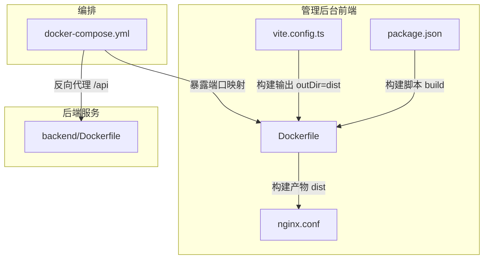
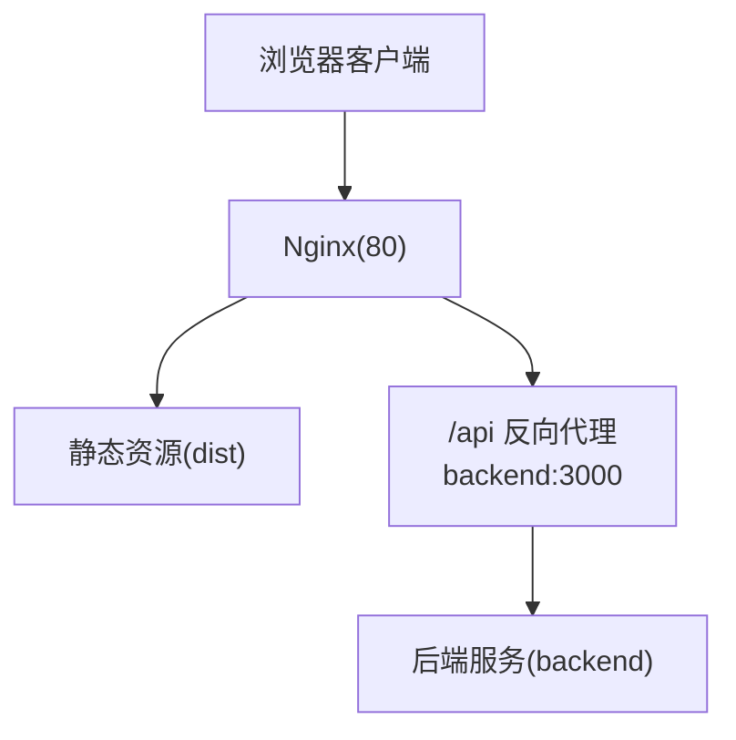
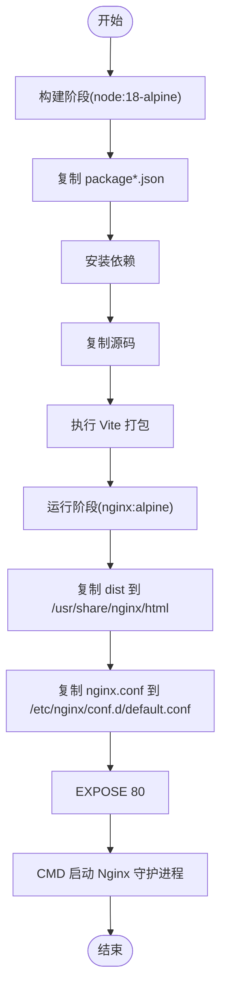
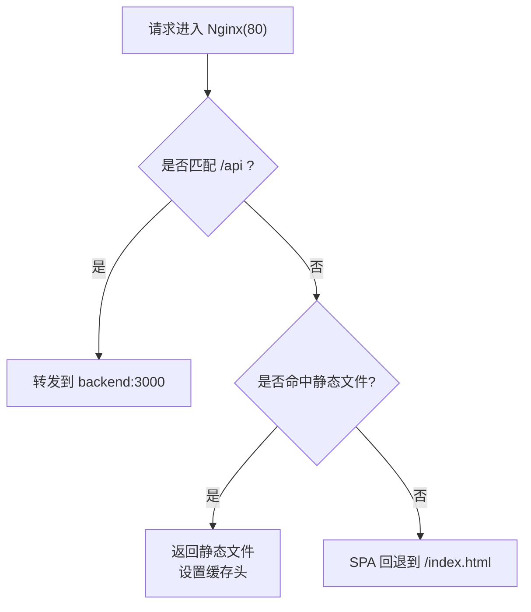
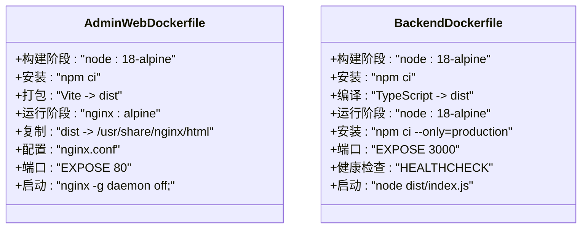
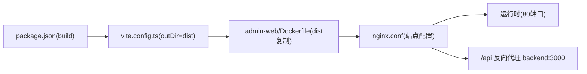

# 管理后台容器化

<cite>
**本文引用的文件**
- [admin-web/Dockerfile](file://home/user/nian/admin-web/Dockerfile)
- [admin-web/nginx.conf](file://home/user/nian/admin-web/nginx.conf)
- [admin-web/package.json](file://home/user/nian/admin-web/package.json)
- [admin-web/vite.config.ts](file://home/user/nian/admin-web/vite.config.ts)
- [backend/Dockerfile](file://backend/Dockerfile)
- [docker-compose.yml](file://docker-compose.yml)
</cite>

## 目录
1. [简介](#简介)
2. [项目结构](#项目结构)
3. [核心组件](#核心组件)
4. [架构总览](#架构总览)
5. [详细组件分析](#详细组件分析)
6. [依赖关系分析](#依赖关系分析)
7. [性能考量](#性能考量)
8. [故障排查指南](#故障排查指南)
9. [结论](#结论)
10. [附录](#附录)

## 简介
本文件聚焦于管理后台前端项目的容器化构建与运行方式，系统性解析 admin-web/Dockerfile 的多阶段构建流程：在 node:18-alpine 构建阶段完成依赖安装与 Vite 打包，随后将生成的 dist 静态资源复制至轻量级 nginx:alpine 镜像中提供静态资源服务；说明 nginx.conf 如何覆盖默认站点配置、EXPOSE 80 的意义以及 CMD 启动 Nginx 守护进程的方式；并结合 docker-compose.yml 对比前后端 Dockerfile 设计差异，总结前端静态资源服务的最佳实践。

## 项目结构
管理后台前端位于 home/user/nian/admin-web 目录，关键文件包括：
- Dockerfile：定义多阶段构建与运行时镜像
- nginx.conf：Nginx 站点配置（含 gzip、SPA 回退、静态资源缓存、/api 反向代理）
- package.json：包含构建脚本（build）与依赖
- vite.config.ts：Vite 开发服务器与构建输出目录配置
- docker-compose.yml：编排后端、管理后台前端与可选 Nginx 反向代理

图表来源
- [admin-web/Dockerfile](file://home/user/nian/admin-web/Dockerfile#L1-L30)
- [admin-web/nginx.conf](file://home/user/nian/admin-web/nginx.conf#L1-L69)
- [admin-web/package.json](file://home/user/nian/admin-web/package.json#L1-L65)
- [admin-web/vite.config.ts](file://home/user/nian/admin-web/vite.config.ts#L1-L43)
- [backend/Dockerfile](file://backend/Dockerfile#L1-L45)
- [docker-compose.yml](file://docker-compose.yml#L1-L241)

章节来源
- [admin-web/Dockerfile](file://home/user/nian/admin-web/Dockerfile#L1-L30)
- [admin-web/nginx.conf](file://home/user/nian/admin-web/nginx.conf#L1-L69)
- [admin-web/package.json](file://home/user/nian/admin-web/package.json#L1-L65)
- [admin-web/vite.config.ts](file://home/user/nian/admin-web/vite.config.ts#L1-L43)
- [backend/Dockerfile](file://backend/Dockerfile#L1-L45)
- [docker-compose.yml](file://docker-compose.yml#L1-L241)

## 核心组件
- 多阶段构建（构建阶段与运行阶段分离）
  - 构建阶段：基于 node:18-alpine，安装依赖并执行 Vite 打包，生成 dist 静态资源
  - 运行阶段：基于 nginx:alpine，复制 dist 至 /usr/share/nginx/html，并应用自定义站点配置
- Nginx 配置要点
  - 监听 80 端口，根目录指向 dist
  - SPA 回退：通过 try_files 将路由回退到 index.html
  - /api 反向代理：将 /api 前缀转发至后端服务
  - 静态资源缓存：对常见静态资源设置一年过期与 immutable 缓存头
  - Gzip 压缩：启用 gzip 并指定压缩类型
- 端口与启动
  - EXPOSE 80 指示容器监听 80 端口
  - CMD 使用 nginx -g "daemon off;" 以前台守护模式启动 Nginx

章节来源
- [admin-web/Dockerfile](file://home/user/nian/admin-web/Dockerfile#L1-L30)
- [admin-web/nginx.conf](file://home/user/nian/admin-web/nginx.conf#L1-L69)

## 架构总览
下图展示管理后台前端在容器内的运行架构：Nginx 提供静态资源服务，SPA 路由回退，/api 请求经由 Nginx 反向代理到后端服务。

图表来源
- [admin-web/nginx.conf](file://home/user/nian/admin-web/nginx.conf#L1-L69)
- [docker-compose.yml](file://docker-compose.yml#L1-L241)

章节来源
- [admin-web/nginx.conf](file://home/user/nian/admin-web/nginx.conf#L1-L69)
- [docker-compose.yml](file://docker-compose.yml#L1-L241)

## 详细组件分析

### Dockerfile 构建流程分析
- 构建阶段（node:18-alpine）
  - 工作目录设置与依赖安装
  - 源码复制与 Vite 打包
- 运行阶段（nginx:alpine）
  - 复制 dist 到 Nginx 默认站点目录
  - 复制自定义 nginx.conf 覆盖默认站点配置
  - 暴露 80 端口
  - 以前台守护模式启动 Nginx

图表来源
- [admin-web/Dockerfile](file://home/user/nian/admin-web/Dockerfile#L1-L30)

章节来源
- [admin-web/Dockerfile](file://home/user/nian/admin-web/Dockerfile#L1-L30)

### Nginx 配置解析
- 监听与根目录
  - 监听 80 端口，root 指向 /usr/share/nginx/html（即 dist）
  - index 指定为 index.html
- SPA 回退
  - location / 中使用 try_files 将未命中路径回退到 /index.html，支持前端路由
- /api 反向代理
  - location /api 将请求转发至 backend:3000，保留升级头、真实 IP、协议等头部信息
- 静态资源缓存
  - 对 js/css/png/jpg/gif/ico/svg/woff/woff2/ttf/eot 等设置一年过期与 immutable 缓存控制
- Gzip 压缩
  - 启用 gzip 并指定多种文本与 JSON 类型进行压缩

图表来源
- [admin-web/nginx.conf](file://home/user/nian/admin-web/nginx.conf#L1-L69)

章节来源
- [admin-web/nginx.conf](file://home/user/nian/admin-web/nginx.conf#L1-L69)

### Vite 构建与输出
- 构建脚本
  - package.json 中定义 build 脚本，调用 tsc 与 vite build
- 输出目录
  - vite.config.ts 指定 outDir 为 dist，与 Dockerfile 中复制目标一致

章节来源
- [admin-web/package.json](file://home/user/nian/admin-web/package.json#L1-L65)
- [admin-web/vite.config.ts](file://home/user/nian/admin-web/vite.config.ts#L1-L43)

### 前后端 Dockerfile 设计对比
- 构建阶段
  - 管理后台：node:18-alpine + npm ci + Vite 打包，产物 dist
  - 后端：node:18-alpine + npm ci（仅生产依赖）+ TypeScript 编译，产物 dist/index.js
- 运行阶段
  - 管理后台：nginx:alpine，复制 dist 并应用自定义站点配置
  - 后端：node:18-alpine，安装生产依赖并运行 node dist/index.js
- 端口暴露与健康检查
  - 管理后台：EXPOSE 80，CMD 启动 Nginx
  - 后端：EXPOSE 3000，HEALTHCHECK 与 CMD 启动 Node 应用
- 依赖安装策略
  - 管理后台：构建阶段安装完整依赖，运行阶段不安装
  - 后端：构建阶段安装完整依赖，运行阶段仅安装生产依赖

图表来源
- [admin-web/Dockerfile](file://home/user/nian/admin-web/Dockerfile#L1-L30)
- [backend/Dockerfile](file://backend/Dockerfile#L1-L45)

章节来源
- [admin-web/Dockerfile](file://home/user/nian/admin-web/Dockerfile#L1-L30)
- [backend/Dockerfile](file://backend/Dockerfile#L1-L45)

### 端口映射与容器编排
- docker-compose.yml 中管理后台服务将容器 80 端口映射到宿主机 8080 端口，便于本地访问
- Nginx 反向代理服务（可选）将宿主机 80/443 映射到容器内，并挂载自定义 nginx.conf 与 conf.d 目录
- 管理后台前端通过 /api 前缀的反向代理访问后端服务

章节来源
- [docker-compose.yml](file://docker-compose.yml#L1-L241)

## 依赖关系分析
- 构建链路
  - package.json 的 build 脚本驱动 Vite 打包
  - vite.config.ts 指定输出目录为 dist
  - admin-web/Dockerfile 在运行阶段将 dist 复制到 Nginx 站点目录
- 运行链路
  - nginx.conf 将 /api 转发到 backend:3000
  - docker-compose.yml 使 admin-web 与 backend 服务在同一网络，实现服务发现

图表来源
- [admin-web/package.json](file://home/user/nian/admin-web/package.json#L1-L65)
- [admin-web/vite.config.ts](file://home/user/nian/admin-web/vite.config.ts#L1-L43)
- [admin-web/Dockerfile](file://home/user/nian/admin-web/Dockerfile#L1-L30)
- [admin-web/nginx.conf](file://home/user/nian/admin-web/nginx.conf#L1-L69)

章节来源
- [admin-web/package.json](file://home/user/nian/admin-web/package.json#L1-L65)
- [admin-web/vite.config.ts](file://home/user/nian/admin-web/vite.config.ts#L1-L43)
- [admin-web/Dockerfile](file://home/user/nian/admin-web/Dockerfile#L1-L30)
- [admin-web/nginx.conf](file://home/user/nian/admin-web/nginx.conf#L1-L69)

## 性能考量
- 静态资源缓存
  - 对 JS/CSS/图片/字体等静态资源设置一年过期与 immutable 缓存头，显著降低带宽与延迟
- Gzip 压缩
  - 启用 gzip 并针对常见文本与 JSON 类型进行压缩，减少传输体积
- SPA 路由回退
  - 通过 try_files 将未命中路径回退到 index.html，避免 404 导致的额外请求
- 构建优化
  - 使用 npm ci 安装依赖，确保可重复构建
  - 生产环境关闭 sourcemap（vite.config.ts 中已禁用），减小产物体积

章节来源
- [admin-web/nginx.conf](file://home/user/nian/admin-web/nginx.conf#L1-L69)
- [admin-web/vite.config.ts](file://home/user/nian/admin-web/vite.config.ts#L1-L43)

## 故障排查指南
- 访问 404 或路由异常
  - 检查 nginx.conf 中的 try_files 是否正确回退到 /index.html
  - 确认 dist 目录已正确复制到 /usr/share/nginx/html
- /api 请求失败
  - 检查 /api location 的 proxy_pass 是否指向 backend:3000
  - 确认 docker-compose 网络中 admin-web 与 backend 服务可达
- 端口占用或无法访问
  - 确认 EXPOSE 80 且 docker-compose 将容器 80 映射到宿主机可用端口
  - 若使用可选 Nginx 反向代理，确认其端口映射与 conf.d 配置正确
- 构建失败
  - 检查 package.json 的 build 脚本与 vite.config.ts 的 outDir 设置
  - 确保构建阶段 npm ci 成功且无权限问题

章节来源
- [admin-web/nginx.conf](file://home/user/nian/admin-web/nginx.conf#L1-L69)
- [admin-web/Dockerfile](file://home/user/nian/admin-web/Dockerfile#L1-L30)
- [docker-compose.yml](file://docker-compose.yml#L1-L241)

## 结论
admin-web/Dockerfile 采用“构建阶段 + 运行阶段”的多阶段构建策略，利用 node:18-alpine 完成依赖安装与 Vite 打包，再将 dist 复制到 nginx:alpine 提供静态资源服务。通过自定义 nginx.conf 实现 SPA 回退、/api 反向代理与静态资源缓存，配合 EXPOSE 80 与 CMD 启动 Nginx 守护进程，形成轻量高效的前端静态资源服务方案。对比后端 Dockerfile，两者均采用多阶段构建，但运行阶段分别使用 Nginx 与 Node，端口暴露与健康检查策略不同，体现了前后端职责分离与最佳实践。

## 附录
- 最佳实践建议
  - 构建阶段最小化依赖安装，运行阶段仅包含必要运行时组件
  - 使用明确的静态资源缓存策略与 Gzip 压缩
  - SPA 应用务必配置正确的路由回退
  - 通过 docker-compose 统一网络与端口映射，简化服务间通信
  - 在生产环境关闭 sourcemap，避免泄露源码信息