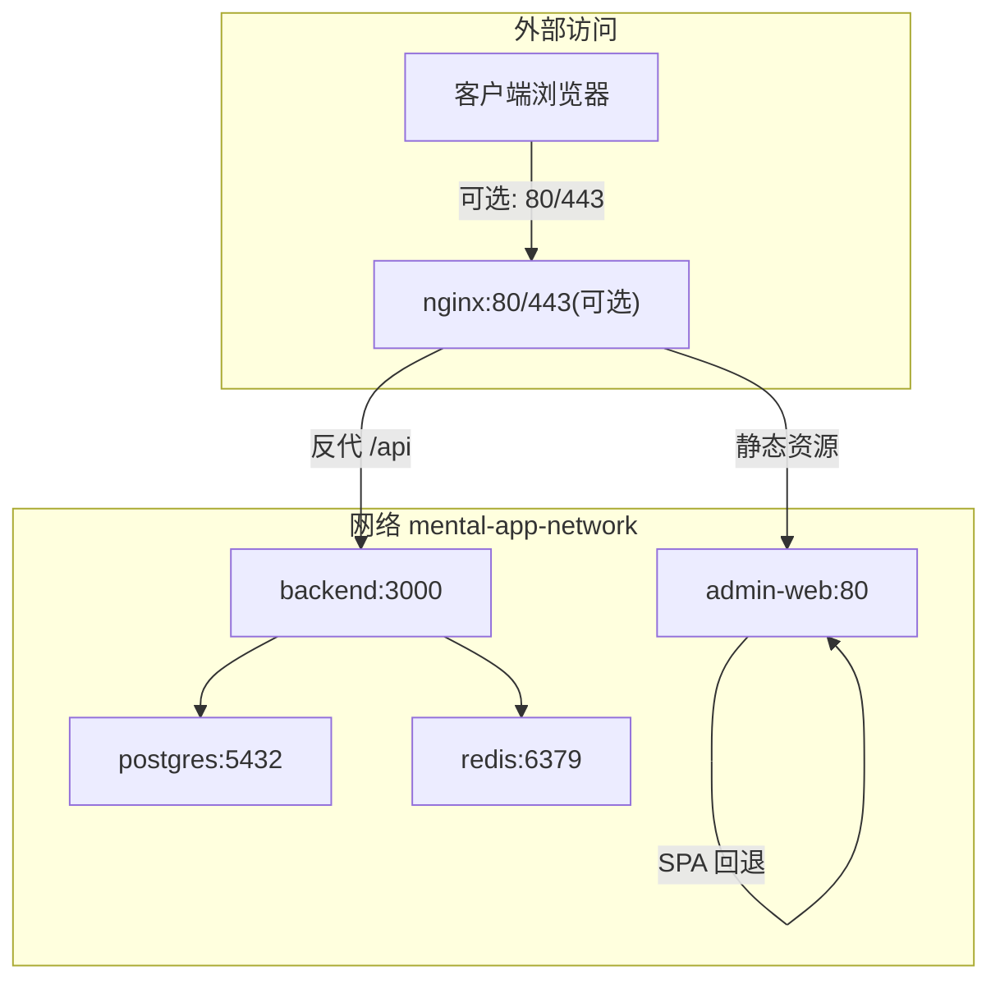
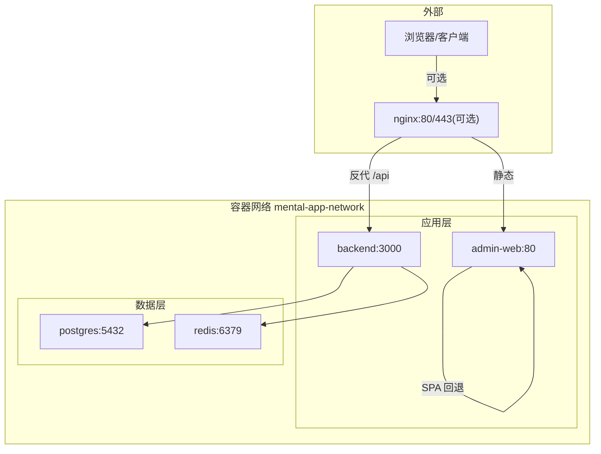
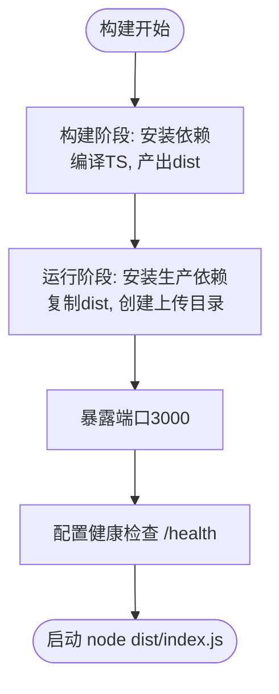
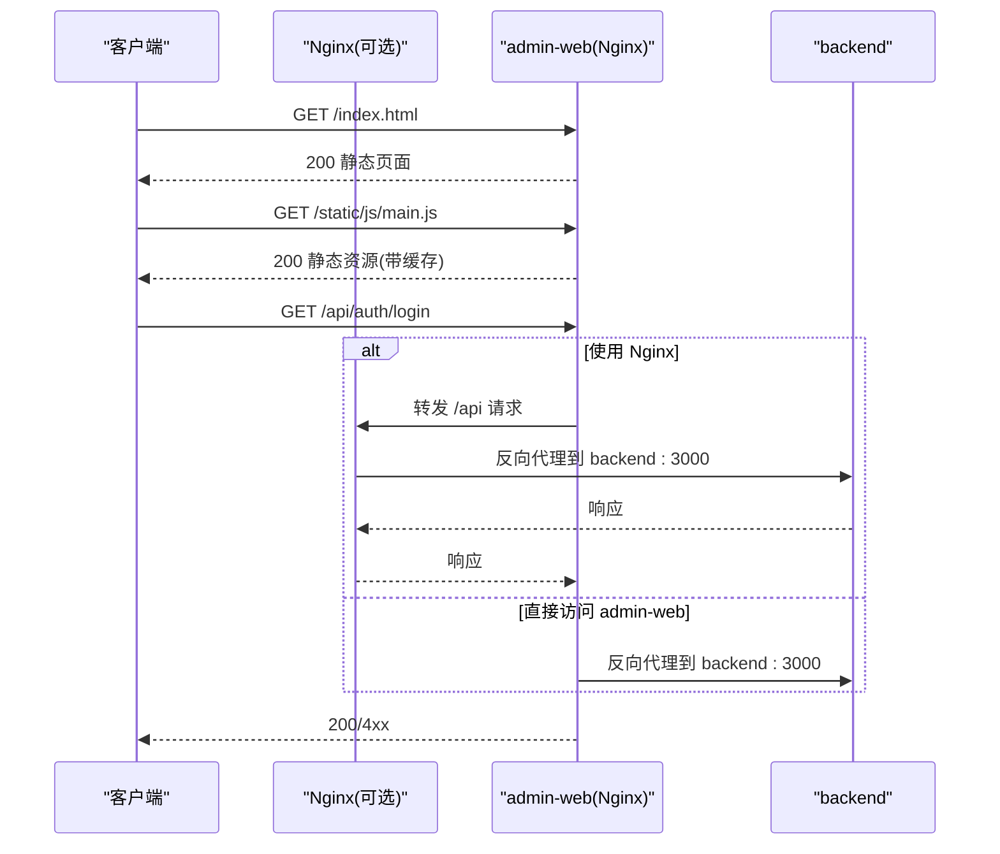
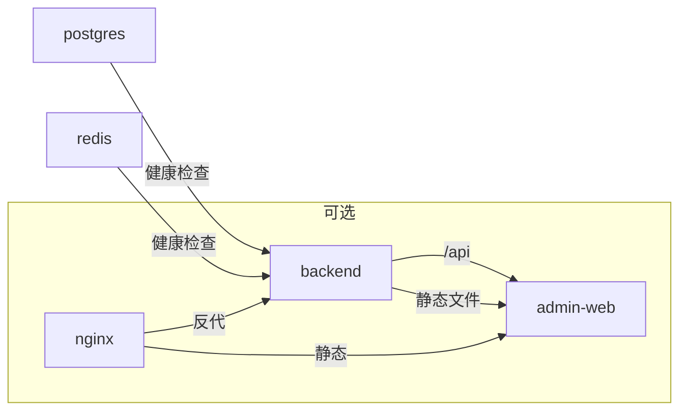

# 部署指南

<cite>
**本文引用的文件**
- [docker-compose.yml](file://docker-compose.yml)
- [backend/Dockerfile](file://backend/Dockerfile)
- [home/user/nian/admin-web/Dockerfile](file://home/user/nian/admin-web/Dockerfile)
- [home/user/nian/admin-web/nginx.conf](file://home/user/nian/admin-web/nginx.conf)
- [.env.example](file://.env.example)
- [docs/DEPLOYMENT.md](file://docs/DEPLOYMENT.md)
- [backend/src/index.ts](file://backend/src/index.ts)
- [database/init.sql](file://database/init.sql)
- [backend/package.json](file://backend/package.json)
- [home/user/nian/admin-web/package.json](file://home/user/nian/admin-web/package.json)
</cite>

## 目录
1. [简介](#简介)
2. [项目结构](#项目结构)
3. [核心组件](#核心组件)
4. [架构总览](#架构总览)
5. [详细组件分析](#详细组件分析)
6. [依赖关系分析](#依赖关系分析)
7. [性能与可扩展性](#性能与可扩展性)
8. [故障排查指南](#故障排查指南)
9. [结论](#结论)
10. [附录](#附录)

## 简介
本指南面向运维工程师，提供 nian 全栈应用在生产环境的 Docker 容器化部署方案。内容涵盖 docker-compose.yml 中各服务（backend、admin-web、postgres、redis）的配置与网络互通、Dockerfile 的构建与多阶段优化、nginx.conf 反向代理配置、环境变量的安全管理实践、容器日志与健康检查、水平扩展建议以及 HTTPS 与域名绑定最佳实践。

## 项目结构
- 后端 API：基于 Node.js + Express，提供 REST API 与 /health 健康检查端点。
- 管理后台前端：React 应用，打包为静态资源，由 Nginx 提供服务并与后端通过 /api 代理通信。
- 数据库：PostgreSQL，初始化脚本自动创建表结构与示例数据。
- 缓存：Redis，用于会话、限流等场景。
- 反向代理：Nginx（可选），统一暴露 API 与静态资源，支持 HTTPS。

图表来源
- [docker-compose.yml](file://docker-compose.yml#L1-L121)
- [home/user/nian/admin-web/nginx.conf](file://home/user/nian/admin-web/nginx.conf#L1-L69)

章节来源
- [docker-compose.yml](file://docker-compose.yml#L1-L121)

## 核心组件
- 后端服务（backend）
  - 构建：多阶段 Dockerfile，先安装生产依赖，再复制构建产物，最终仅运行 dist。
  - 运行：监听 3000 端口，提供 /health 健康检查；静态文件挂载 uploads。
  - 环境变量：数据库、Redis、JWT、端口、上传路径等。
- 管理后台前端（admin-web）
  - 构建：多阶段 Dockerfile，前端构建产物复制至 Nginx 静态目录，内置 Nginx 配置。
  - 运行：Nginx 监听 80，提供静态资源与 /api 代理。
- 数据库（postgres）
  - 镜像：postgres:15-alpine；初始化脚本自动建表与导入示例数据。
  - 健康检查：pg_isready。
- 缓存（redis）
  - 镜像：redis:7-alpine；健康检查：redis-cli ping。
- 反向代理（nginx，可选）
  - 镜像：nginx:alpine；监听 80/443；代理 /api 到 backend:3000；缓存静态资源。

章节来源
- [backend/Dockerfile](file://backend/Dockerfile#L1-L45)
- [home/user/nian/admin-web/Dockerfile](file://home/user/nian/admin-web/Dockerfile#L1-L30)
- [home/user/nian/admin-web/nginx.conf](file://home/user/nian/admin-web/nginx.conf#L1-L69)
- [docker-compose.yml](file://docker-compose.yml#L1-L121)
- [database/init.sql](file://database/init.sql#L1-L349)

## 架构总览
下图展示容器间的依赖与网络互通关系，以及可选的 Nginx 反向代理层。

图表来源
- [docker-compose.yml](file://docker-compose.yml#L1-L121)
- [home/user/nian/admin-web/nginx.conf](file://home/user/nian/admin-web/nginx.conf#L1-L69)

## 详细组件分析

### 后端服务（backend）配置与多阶段构建
- 多阶段构建策略
  - 第一阶段（builder）：安装依赖、编译 TypeScript、产出 dist。
  - 第二阶段（runtime）：仅安装生产依赖，复制 dist，创建上传目录，暴露 3000，配置健康检查，启动命令运行 dist/index.js。
- 关键环境变量
  - NODE_ENV、PORT、DB_HOST/PORT/NAME/USER/PASSWORD、REDIS_HOST/PORT、JWT_SECRET、JWT_EXPIRES_IN、UPLOAD_PATH。
- 健康检查
  - 容器内通过 curl 访问 /health；Dockerfile 中也定义了 HEALTHCHECK。
- 上传目录
  - 通过卷映射将宿主机 uploads 映射到容器 /app/uploads，便于持久化与静态资源访问。

图表来源
- [backend/Dockerfile](file://backend/Dockerfile#L1-L45)

章节来源
- [backend/Dockerfile](file://backend/Dockerfile#L1-L45)
- [backend/src/index.ts](file://backend/src/index.ts#L33-L36)

### 管理后台前端（admin-web）构建与 Nginx 配置
- 多阶段构建
  - builder：安装依赖、构建前端产物。
  - runtime：基于 nginx:alpine，复制 dist 至 /usr/share/nginx/html，拷贝 nginx.conf 至 /etc/nginx/conf.d/default.conf，暴露 80，前台运行 nginx。
- Nginx 配置要点
  - 监听 80，root 指向静态目录，index 为 index.html。
  - SPA 回退：location / 使用 try_files $uri $uri/ /index.html。
  - API 代理：location /api 代理到 backend:3000，传递 Host、X-Real-IP、X-Forwarded-For、X-Forwarded-Proto 等头部。
  - 静态资源缓存：对 js/css/png/jpg/gif/svg/woff/woff2/ttf/eot 等设置长缓存与 immutable。
  - Gzip 压缩：开启 gzip 并指定类型。
- 端口映射
  - docker-compose 将 admin-web 的 80 映射到宿主机 8080，便于本地调试；生产环境可通过 Nginx 暴露 80/443。

图表来源
- [home/user/nian/admin-web/nginx.conf](file://home/user/nian/admin-web/nginx.conf#L1-L69)
- [home/user/nian/admin-web/Dockerfile](file://home/user/nian/admin-web/Dockerfile#L1-L30)
- [docker-compose.yml](file://docker-compose.yml#L80-L111)

章节来源
- [home/user/nian/admin-web/Dockerfile](file://home/user/nian/admin-web/Dockerfile#L1-L30)
- [home/user/nian/admin-web/nginx.conf](file://home/user/nian/admin-web/nginx.conf#L1-L69)

### 数据库（postgres）与初始化脚本
- 镜像与版本：postgres:15-alpine。
- 健康检查：pg_isready -U postgres。
- 初始化：通过卷挂载 ./database/init.sql 到 /docker-entrypoint-initdb.d/init.sql，容器首次启动自动执行。
- 表与索引：users、methods、user_methods、practice_records、reminder_settings、admins、audit_logs、media_files 等。
- 视图：user_practice_stats、method_popularity。
- 示例数据：默认管理员账号与多条示例方法数据。

章节来源
- [docker-compose.yml](file://docker-compose.yml#L1-L41)
- [database/init.sql](file://database/init.sql#L1-L349)

### 缓存（redis）
- 镜像与版本：redis:7-alpine。
- 健康检查：redis-cli ping。
- 卷：/data 持久化。

章节来源
- [docker-compose.yml](file://docker-compose.yml#L43-L81)

### 反向代理（nginx，可选）
- 镜像：nginx:alpine。
- 端口：80/443。
- 卷：挂载自定义 nginx.conf 与 conf.d，以及 uploads 作为静态资源。
- 依赖：depends_on backend 与 admin-web。
- 作用：统一入口、静态资源分发、API 反代、缓存与压缩。

章节来源
- [docker-compose.yml](file://docker-compose.yml#L94-L111)

### 环境变量与安全实践
- .env.example 中的关键变量
  - 数据库：POSTGRES_DB、POSTGRES_USER、POSTGRES_PASSWORD。
  - Redis：REDIS_HOST、REDIS_PORT。
  - 后端：NODE_ENV、PORT、JWT_SECRET、JWT_EXPIRES_IN、DB_HOST/PORT/NAME/USER/PASSWORD、UPLOAD_PATH、CORS_ORIGIN。
- 开发/测试/生产差异
  - 开发：CORS_ORIGIN 可设为 http://localhost:8080,http://localhost:3000；JWT_SECRET 可短；端口可变。
  - 测试：与生产一致的变量命名，但使用独立数据库与密钥。
  - 生产：强制设置强 JWT_SECRET（≥32 字符）、严格的 CORS_ORIGIN、禁用开发工具、启用 HTTPS。
- 安全建议
  - 不将 .env 提交到仓库；使用机密管理工具（如 Docker secrets 或平台机密）注入。
  - 限制 CORS 源，避免通配符。
  - 仅在必要时暴露 5432/6379 端口；生产环境通过防火墙与网络隔离。
  - 定期轮换 JWT_SECRET 与数据库密码。

章节来源
- [.env.example](file://.env.example#L1-L61)
- [docs/DEPLOYMENT.md](file://docs/DEPLOYMENT.md#L90-L139)

### 健康检查与日志
- 健康检查
  - backend：容器内 /health；compose healthcheck 每 30s 检查一次。
  - postgres：pg_isready -U postgres。
  - redis：redis-cli ping。
- 日志
  - 使用 docker-compose logs -f backend 查看后端日志。
  - 使用 docker-compose logs -f admin-web 查看前端 Nginx 日志。
  - 建议接入集中式日志（如 ELK/Fluent Bit）以采集容器日志。

章节来源
- [docker-compose.yml](file://docker-compose.yml#L19-L41)
- [docker-compose.yml](file://docker-compose.yml#L194-L199)
- [docs/DEPLOYMENT.md](file://docs/DEPLOYMENT.md#L43-L59)

### HTTPS 与域名绑定最佳实践
- 证书与域名
  - 推荐使用 Let’s Encrypt 自动签发证书；在生产环境中为域名申请证书。
- Nginx 配置
  - 在 conf.d 中新增 HTTPS server 块，监听 443，配置 ssl_certificate、ssl_certificate_key、ssl_protocols、ssl_ciphers 等。
  - 将 HTTP 301 重定向至 https://$host$request_uri。
- 反向代理
  - 若使用 Nginx 作为统一入口，建议将 /api 的 X-Forwarded-Proto 设置为 https，确保后端生成的链接正确。
- 证书续期
  - 配置自动续期任务（如 certbot renew）并监控到期时间。

章节来源
- [docs/DEPLOYMENT.md](file://docs/DEPLOYMENT.md#L102-L109)
- [home/user/nian/admin-web/nginx.conf](file://home/user/nian/admin-web/nginx.conf#L1-L69)

## 依赖关系分析
- 服务依赖
  - backend 依赖 postgres 与 redis，且要求两者健康后再启动。
  - admin-web 依赖 backend。
  - nginx（可选）依赖 backend 与 admin-web。
- 网络
  - 所有服务加入同一 bridge 网络 mental-app-network，容器间通过服务名互访。
- 存储
  - postgres_data、redis_data 使用本地卷持久化。

图表来源
- [docker-compose.yml](file://docker-compose.yml#L1-L121)

章节来源
- [docker-compose.yml](file://docker-compose.yml#L1-L121)

## 性能与可扩展性
- 性能优化
  - 前端静态资源缓存与 gzip 压缩已在 Nginx 中配置。
  - 后端可引入 Redis 缓存热点数据与接口结果。
  - 数据库层面：合理索引、连接池、只读副本（需额外架构设计）。
- 可扩展性
  - 后端：横向扩展多个 backend 实例，配合负载均衡（如 Nginx 或云 LB）。
  - 前端：多实例 admin-web，结合 CDN 分发静态资源。
  - 数据库：主从复制、读写分离（需额外配置与架构演进）。
  - 缓存：Redis 集群（需额外部署与配置）。

章节来源
- [home/user/nian/admin-web/nginx.conf](file://home/user/nian/admin-web/nginx.conf#L1-L69)
- [docs/QUALITY_REPORT.md](file://docs/QUALITY_REPORT.md#L416-L452)

## 故障排查指南
- 常见问题与解决
  - 端口冲突：检查宿主机端口占用，修改映射或释放端口。
  - 数据库连接失败：确认 .env 中 POSTGRES_PASSWORD、DB_HOST/PORT/NAME/USER 是否正确。
  - API 500 错误：查看 docker-compose logs backend 获取堆栈信息。
  - 健康检查失败：等待服务完全启动（约 30 秒），或检查依赖服务是否健康。
- 常用命令
  - 查看状态：docker-compose ps
  - 查看日志：docker-compose logs -f backend
  - 重启服务：docker-compose restart backend
  - 停止服务：docker-compose down
  - 重建并启动：docker-compose up -d --build

章节来源
- [docs/DEPLOYMENT.md](file://docs/DEPLOYMENT.md#L43-L59)
- [docs/DEPLOYMENT.md](file://docs/DEPLOYMENT.md#L120-L139)

## 结论
通过 docker-compose 一键部署，nian 应用实现了后端 API、管理后台前端、数据库与缓存的快速上线。生产环境建议启用 HTTPS、严格管理环境变量、接入集中式日志与监控、按需扩展后端与前端实例，并规划数据库与缓存的高可用方案。本文档提供了从配置到运维的全流程参考。

## 附录
- 快速部署步骤（来自官方文档）
  - 复制并编辑 .env，设置数据库与 JWT 密钥。
  - docker-compose up -d 启动。
  - 等待初始化完成后，访问 /health 验证。
- 数据库备份与恢复
  - 备份：docker exec mental-app-postgres pg_dump -U postgres mental_app > backup.sql
  - 恢复：docker exec -i mental-app-postgres psql -U postgres mental_app < backup.sql

章节来源
- [docs/DEPLOYMENT.md](file://docs/DEPLOYMENT.md#L15-L31)
- [docs/DEPLOYMENT.md](file://docs/DEPLOYMENT.md#L110-L119)