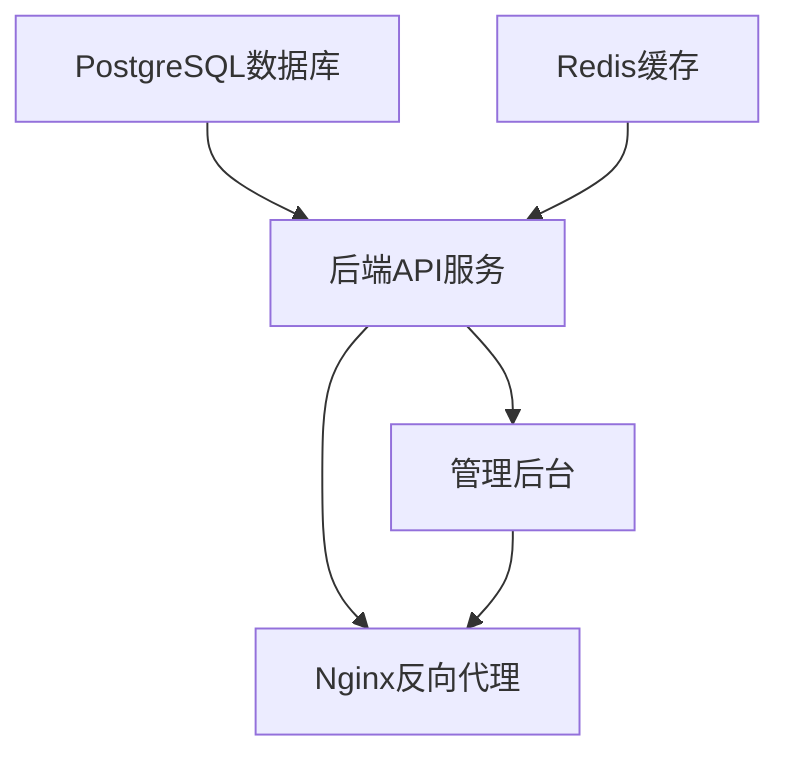
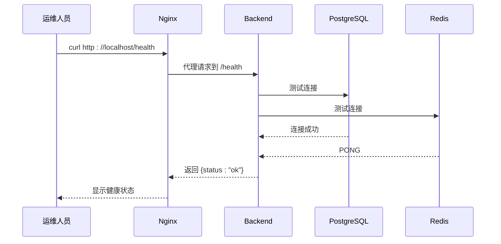

# 部署最佳实践

<cite>
**本文档引用文件**  
- [docker-compose.yml](file://docker-compose.yml)
- [DEPLOYMENT.md](file://docs/DEPLOYMENT.md)
- [.env.example](file://.env.example)
- [Dockerfile](file://backend/Dockerfile)
- [database.ts](file://backend/src/config/database.ts)
- [index.ts](file://backend/src/index.ts)
- [init.sql](file://database/init.sql)
- [nginx.conf](file://home/user/nian/admin-web/nginx.conf)
- [logger.ts](file://backend/src/utils/logger.ts)
</cite>

## 目录
1. [环境准备](#环境准备)
2. [部署流程](#部署流程)
3. [服务验证](#服务验证)
4. [HTTPS与负载均衡配置](#https与负载均衡配置)
5. [水平扩展策略](#水平扩展策略)
6. [数据备份与恢复](#数据备份与恢复)
7. [监控与日志收集](#监控与日志收集)
8. [故障排查清单](#故障排查清单)
9. [生产环境检查清单](#生产环境检查清单)

## 环境准备

在开始部署之前，需要确保系统满足以下前置条件：

- Docker 20.10 或更高版本
- Docker Compose 2.0 或更高版本
- 至少 4GB 内存
- 至少 20GB 磁盘空间

首先，复制示例环境文件并进行配置：

```bash
cp .env.example .env
```

编辑 `.env` 文件，设置关键安全参数：

- `POSTGRES_PASSWORD`：设置强密码（至少12位，包含大小写字母、数字和特殊字符）
- `JWT_SECRET`：设置JWT密钥（至少32字符的随机字符串）
- `NODE_ENV`：生产环境设置为 `production`

**Section sources**
- [.env.example](file://.env.example)

## 部署流程

使用 Docker Compose 一键部署所有服务：

```bash
# 启动所有服务（后台运行）
docker-compose up -d

# 查看服务启动状态
docker-compose ps
```

部署流程包含以下服务：

- **PostgreSQL**：作为主数据库，容器名为 `mental-app-postgres`
- **Redis**：作为缓存服务，容器名为 `mental-app-redis`
- **Backend**：后端API服务，容器名为 `mental-app-backend`
- **Admin-web**：管理后台前端，容器名为 `mental-app-admin`
- **Nginx**：可选的反向代理服务

服务启动顺序由 `depends_on` 和健康检查机制保证，确保数据库和缓存服务正常后才启动应用服务。



**Diagram sources**
- [docker-compose.yml](file://docker-compose.yml#L5-L240)

**Section sources**
- [docker-compose.yml](file://docker-compose.yml#L1-L240)
- [DEPLOYMENT.md](file://docs/DEPLOYMENT.md#L1-L140)

## 服务验证

部署完成后，需要验证各服务的运行状态：

### 容器状态检查

```bash
# 查看所有容器状态
docker ps

# 查看特定容器状态
docker ps -f name=mental-app-backend
```

正常状态下，所有容器的 STATUS 应为 "Up"，且没有频繁重启。

### 日志查看

```bash
# 查看后端服务实时日志
docker logs -f mental-app-backend

# 查看数据库日志
docker logs mental-app-postgres

# 查看指定时间范围的日志
docker logs --since 30m mental-app-backend
```

### 健康检查

系统配置了多层次的健康检查机制：

```bash
# 检查API健康端点
curl http://localhost:3000/health

# 检查数据库连接
docker exec mental-app-postgres pg_isready -U postgres

# 检查Redis状态
docker exec mental-app-redis redis-cli ping
```

后端服务的健康检查通过 `/health` 端点实现，返回 JSON 格式的状态信息。



**Diagram sources**
- [docker-compose.yml](file://docker-compose.yml#L74-L78)
- [index.ts](file://backend/src/index.ts#L34-L36)

**Section sources**
- [docker-compose.yml](file://docker-compose.yml#L20-L24)
- [docker-compose.yml](file://docker-compose.yml#L37-L41)
- [docker-compose.yml](file://docker-compose.yml#L74-L78)

## HTTPS与负载均衡配置

### HTTPS配置

通过 Nginx 配置 HTTPS 支持：

```bash
# 使用 Let's Encrypt 获取免费证书
sudo certbot --nginx -d your-domain.com

# 或者使用自签名证书
openssl req -x509 -nodes -days 365 -newkey rsa:2048 \
    -keyout nginx/ssl/nginx.key -out nginx/ssl/nginx.crt
```

更新 `docker-compose.yml` 中的 Nginx 配置，挂载证书文件：

```yaml
volumes:
  - ./nginx/ssl/nginx.crt:/etc/nginx/ssl/nginx.crt:ro
  - ./nginx/ssl/nginx.key:/etc/nginx/ssl/nginx.key:ro
```

### 负载均衡

Nginx 配置文件 `nginx.conf` 实现了反向代理和负载均衡功能：

```nginx
server {
    listen 80;
    server_name localhost;
    
    # API请求代理到后端服务
    location /api {
        proxy_pass http://backend:3000;
        proxy_set_header Host $host;
        proxy_set_header X-Real-IP $remote_addr;
    }
    
    # SPA应用路由
    location / {
        try_files $uri $uri/ /index.html;
    }
}
```

此配置实现了：
- 静态资源缓存（JS、CSS、图片等）
- API 请求反向代理
- 单页应用（SPA）路由支持
- Gzip 压缩

**Diagram sources**
- [nginx.conf](file://home/user/nian/admin-web/nginx.conf#L1-L69)

**Section sources**
- [docker-compose.yml](file://docker-compose.yml#L94-L110)
- [nginx.conf](file://home/user/nian/admin-web/nginx.conf#L1-L69)

## 水平扩展策略

通过 Docker Compose 的 scale 功能实现水平扩展：

```bash
# 将后端服务扩展到2个实例
docker-compose up -d --scale backend=2

# 扩展到4个实例
docker-compose up -d --scale backend=4

# 查看扩展后的服务
docker-compose ps
```

扩展建议：
- 初始部署建议 `backend=2`，提高可用性
- 高负载场景可扩展到 `backend=4` 或更多
- 监控资源使用情况，根据 CPU 和内存使用率调整实例数量

注意：水平扩展时需要确保：
- 数据库连接池配置合理
- Redis 作为共享缓存
- 使用外部会话存储而非内存会话

**Section sources**
- [docker-compose.yml](file://docker-compose.yml#L43-L79)

## 数据备份与恢复

### 备份策略

实施定期自动备份策略：

```bash
# 创建数据库备份
docker exec mental-app-postgres pg_dump -U postgres mental_app > backup_$(date +%Y%m%d_%H%M%S).sql

# 压缩备份文件
gzip backup_*.sql

# 自动备份脚本
#!/bin/bash
docker exec mental-app-postgres pg_dump -U postgres mental_app > /backups/mental_app_$(date +\%Y\%m\%d_\%H\%M\%S).sql
find /backups -name "mental_app_*.sql" -mtime +7 -delete
```

### 恢复流程

```bash
# 停止相关服务
docker-compose stop backend

# 恢复数据库
docker exec -i mental-app-postgres psql -U postgres mental_app < backup.sql

# 启动服务
docker-compose start backend
```

建议的备份策略：
- 每日完整备份
- 每周备份文件到异地存储
- 定期测试恢复流程
- 保留最近7天的备份

**Section sources**
- [DEPLOYMENT.md](file://docs/DEPLOYMENT.md#L110-L118)
- [init.sql](file://database/init.sql#L1-L349)

## 监控与日志收集

### 日志系统

后端服务使用 Winston 日志库，配置了结构化日志输出：

```typescript
export const logger = winston.createLogger({
  level: process.env.LOG_LEVEL || 'info',
  format: winston.format.combine(
    winston.format.timestamp(),
    winston.format.errors({ stack: true }),
    winston.format.json()
  ),
  transports: [
    new winston.transports.Console({
      format: winston.format.combine(
        winston.format.colorize(),
        winston.format.simple()
      ),
    }),
  ],
});
```

日志级别包括：error、warn、info、http、verbose、debug、silly。

### 监控建议

建议实施以下监控措施：

- **容器监控**：使用 `docker stats` 监控资源使用
- **日志聚合**：考虑集成 ELK（Elasticsearch, Logstash, Kibana）或 Loki
- **性能监控**：监控 API 响应时间、数据库查询性能
- **告警系统**：设置磁盘空间、内存使用率告警

```bash
# 实时监控容器资源使用
docker stats

# 查看服务性能指标
docker exec mental-app-backend curl http://localhost:3000/health
```

**Section sources**
- [logger.ts](file://backend/src/utils/logger.ts#L1-L37)
- [index.ts](file://backend/src/index.ts#L8-L9)

## 故障排查清单

### 常见问题及解决方案

| 问题 | 解决方案 |
|------|---------|
| 端口冲突 | 使用 `netstat -ano \| findstr :端口号` 查找占用进程并关闭 |
| 数据库迁移失败 | 检查 `.env` 文件中的 `POSTGRES_PASSWORD` 是否正确，查看数据库日志 |
| JWT验证错误 | 检查 `JWT_SECRET` 是否一致，确认令牌未过期 |
| 容器无法启动 | 查看 `docker-compose logs` 输出，检查配置文件语法 |
| 健康检查失败 | 等待30秒让服务完全启动，检查依赖服务状态 |
| 磁盘空间不足 | 清理旧的Docker镜像和容器，`docker system prune` |

### 诊断命令

```bash
# 查看所有服务日志
docker-compose logs

# 查看特定服务错误日志
docker-compose logs backend \| grep -i error

# 进入容器内部排查
docker exec -it mental-app-backend sh

# 检查网络连接
docker network inspect mental-app-network
```

**Section sources**
- [DEPLOYMENT.md](file://docs/DEPLOYMENT.md#L121-L128)
- [docker-compose.yml](file://docker-compose.yml#L112-L114)

## 生产环境检查清单

部署到生产环境前，请完成以下检查：

- [ ] 修改默认管理员密码（admin/admin123456）
- [ ] 设置强 `JWT_SECRET`（至少32字符的随机字符串）
- [ ] 配置 HTTPS 加密
- [ ] 设置防火墙规则，仅开放必要端口
- [ ] 配置自动备份策略
- [ ] 测试备份恢复流程
- [ ] 配置监控和告警系统
- [ ] 完成安全审计

部署完成后，访问健康检查端点验证系统状态：http://localhost:3000/health

**Section sources**
- [DEPLOYMENT.md](file://docs/DEPLOYMENT.md#L129-L137)