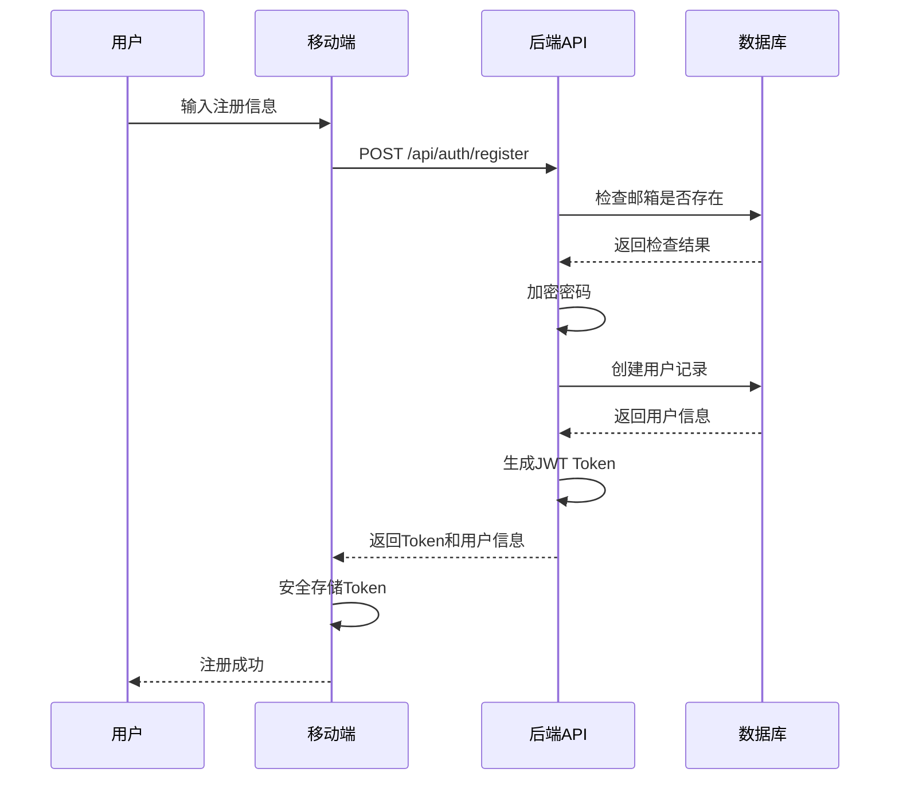
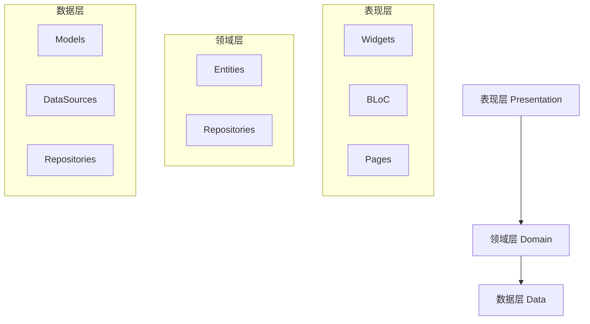
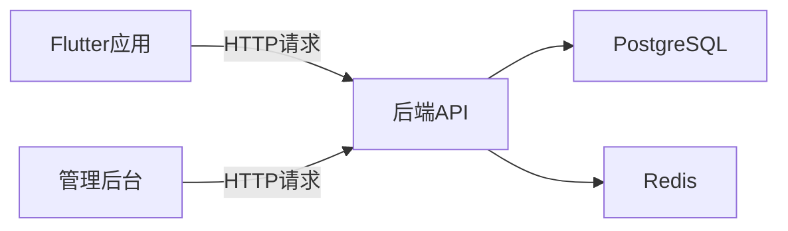
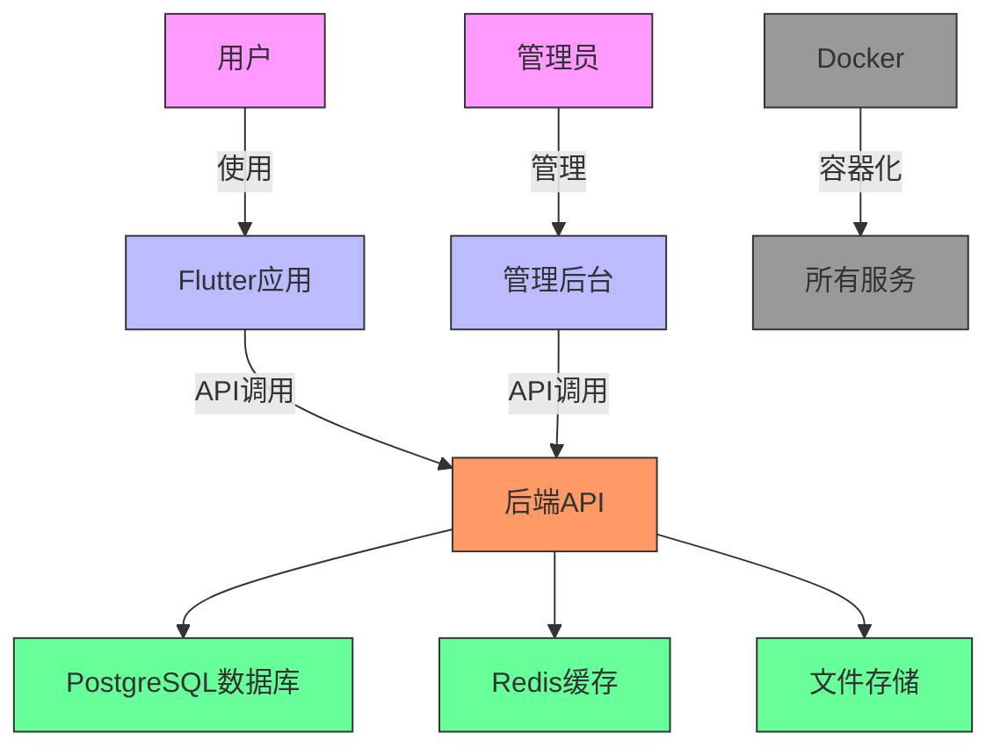

# 项目概述

<cite>
**本文档引用文件**  
- [README.md](file://README.md)
- [backend/src/index.ts](file://backend/src/index.ts)
- [backend/src/controllers/auth.controller.ts](file://backend/src/controllers/auth.controller.ts)
- [backend/src/routes/auth.routes.ts](file://backend/src/routes/auth.routes.ts)
- [backend/src/types/index.ts](file://backend/src/types/index.ts)
- [backend/src/middleware/auth.ts](file://backend/src/middleware/auth.ts)
- [backend/package.json](file://backend/package.json)
- [flutter_app/lib/main.dart](file://flutter_app/lib/main.dart)
- [flutter_app/pubspec.yaml](file://flutter_app/pubspec.yaml)
- [flutter_app/lib/data/models/user_model.dart](file://flutter_app/lib/data/models/user_model.dart)
- [home/user/nian/admin-web/src/App.tsx](file://home/user/nian/admin-web/src/App.tsx)
- [home/user/nian/admin-web/package.json](file://home/user/nian/admin-web/package.json)
- [home/user/nian/admin-web/src/services/api.ts](file://home/user/nian/admin-web/src/services/api.ts)
- [docker-compose.yml](file://docker-compose.yml)
- [FLUTTER_ARCHITECTURE.md](file://FLUTTER_ARCHITECTURE.md)
</cite>

## 目录
1. [项目简介](#项目简介)
2. [项目结构](#项目结构)
3. [核心功能与业务流程](#核心功能与业务流程)
4. [技术架构分析](#技术架构分析)
5. [子系统协同工作机制](#子系统协同工作机制)
6. [系统上下文图示](#系统上下文图示)
7. [学习路径指引](#学习路径指引)

## 项目简介

nian项目是一个全平台心理自助服务平台，旨在为用户提供个性化的心理调节方法和练习进度追踪功能。该项目采用单体仓库（monorepo）架构，整合了后端API服务、移动端应用和管理后台三大核心组件，支持跨平台部署与统一维护。

项目核心目标是构建一个完整的心理健康生态系统，包含用户端的心理方法学习与练习记录、管理员端的内容审核与数据统计分析功能。系统采用现代化技术栈，通过Docker实现一键部署，确保开发、测试和生产环境的一致性。

根据项目状态文档，后端API、管理后台已实现100%功能覆盖，Flutter应用完成度达95%，整体项目具备完整的生产就绪能力。

**Section sources**
- [README.md](file://README.md#L1-L130)

## 项目结构

nian项目采用清晰的单体仓库结构，将不同技术栈的子系统组织在统一的代码库中。这种架构设计有利于统一版本控制、简化依赖管理和促进跨团队协作。

项目主要包含以下目录结构：
- `backend/`：基于Node.js + TypeScript + Express的后端API服务
- `home/user/nian/admin-web/`：基于React + Vite的管理后台
- `flutter_app/`：基于Flutter的跨平台移动应用
- `database/`：PostgreSQL数据库初始化脚本
- `docs/`：项目相关文档
- 根目录包含Docker编排文件和环境配置

这种结构化布局使得各子系统职责分明，同时通过共享的配置和文档实现紧密集成。单体仓库模式降低了多仓库管理的复杂性，特别适合全栈团队协作开发。

**Section sources**
- [README.md](file://README.md#L58-L68)
- [docker-compose.yml](file://docker-compose.yml#L1-L241)

## 核心功能与业务流程

nian项目围绕心理健康服务构建了完整的业务流程体系，涵盖用户认证、心理方法管理、个性化练习记录、数据统计分析及管理员内容审核等关键功能。

### 用户认证流程

系统采用JWT Token机制实现安全的用户认证。用户注册时，系统验证邮箱格式和密码强度，对密码进行bcrypt加密后存储。登录成功后生成包含用户信息的JWT Token，后续请求通过`Authorization: Bearer <token>`头进行身份验证。

**Diagram sources**
- [backend/src/controllers/auth.controller.ts](file://backend/src/controllers/auth.controller.ts#L8-L68)
- [backend/src/routes/auth.routes.ts](file://backend/src/routes/auth.routes.ts#L1-L17)

### 心理调节方法管理

系统提供完整的心理方法生命周期管理，包括创建、编辑、审核和发布流程。方法状态包括草稿、待审核、已发布和已归档四种，确保内容质量控制。

管理员通过管理后台创建心理调节方法，填写标题、描述、分类、难度等级等元数据，并上传相关媒体资源。新创建的方法进入"待审核"状态，由高级管理员审核通过后方可对用户可见。

### 个性化练习记录

用户可将感兴趣的心理方法添加到个人方法库，并记录每次练习的详细信息，包括练习时长、练习前后情绪评分、备注等。系统自动计算连续练习天数、总练习时长等指标，帮助用户追踪进步。

### 数据统计分析

系统收集用户练习数据，生成多维度的统计报表，包括：
- 个人练习趋势分析
- 方法使用频率统计
- 情绪变化相关性分析
- 用户活跃度指标

这些数据既可用于个人反馈，也可在匿名化处理后用于整体服务优化。

### 管理员内容审核

管理后台提供专门的内容审核模块，展示所有处于"待审核"状态的心理方法。审核人员可以查看方法详情，进行批准或拒绝操作，并添加审核意见。这一流程确保了平台内容的专业性和安全性。

**Section sources**
- [README.md](file://README.md#L14-L22)
- [backend/src/types/index.ts](file://backend/src/types/index.ts#L19-L35)

## 技术架构分析

nian项目采用分层架构设计，结合Clean Architecture理念和MVC模式，实现了关注点分离和高内聚低耦合的代码结构。

### 后端架构

后端服务基于Node.js + Express框架构建，采用TypeScript提供类型安全。架构遵循MVC模式：

- **Models**：通过PostgreSQL数据库和TypeORM实现数据持久化
- **Controllers**：处理业务逻辑，如`auth.controller.ts`中的用户认证逻辑
- **Routes**：定义API端点，如`auth.routes.ts`中的路由配置
- **Middleware**：提供通用功能，如身份验证、错误处理

系统使用JWT进行身份验证，bcrypt进行密码加密，确保安全性。通过Winston实现日志记录，Express Rate Limit防止暴力破解攻击。

### Flutter应用架构

Flutter应用采用Clean Architecture + BLoC模式，分为三层：

**Diagram sources**
- [FLUTTER_ARCHITECTURE.md](file://FLUTTER_ARCHITECTURE.md#L19-L27)
- [flutter_app/lib/main.dart](file://flutter_app/lib/main.dart#L1-L105)

这种架构实现了UI与业务逻辑的解耦，提高了代码可测试性和可维护性。BLoC模式通过事件-状态机制管理应用状态，避免了复杂的setState调用。

### 管理后台架构

管理后台基于React + Ant Design构建，采用函数式组件和Hooks实现现代React开发模式。通过React Router实现客户端路由，Axios进行API调用。

系统使用localStorage存储管理员Token和基本信息，实现持久化登录状态。Ant Design提供丰富的UI组件，确保管理界面的专业性和易用性。

**Section sources**
- [backend/package.json](file://backend/package.json#L1-L55)
- [flutter_app/pubspec.yaml](file://flutter_app/pubspec.yaml#L1-L111)
- [home/user/nian/admin-web/package.json](file://home/user/nian/admin-web/package.json#L1-L65)

## 子系统协同工作机制

nian项目的三大子系统通过RESTful API进行通信，形成紧密协作的整体。

### 通信机制

所有子系统通过后端API服务进行交互，API遵循RESTful设计原则，使用JSON格式交换数据。HTTP状态码和统一的响应格式确保了错误处理的一致性。

**Diagram sources**
- [backend/src/index.ts](file://backend/src/index.ts#L1-L85)
- [home/user/nian/admin-web/src/App.tsx](file://home/user/nian/admin-web/src/App.tsx#L1-L154)

### 依赖关系

系统依赖关系清晰，后端API作为中心枢纽，连接前端应用和数据存储。Docker Compose文件明确定义了服务间的依赖：

- 后端服务依赖于PostgreSQL和Redis
- 管理后台依赖于后端API
- Nginx反向代理依赖于所有前端服务

这种依赖管理确保了服务按正确顺序启动，避免了因服务未就绪导致的错误。

### 环境配置

通过`.env`文件集中管理环境变量，包括数据库连接信息、JWT密钥等敏感配置。Docker Compose将这些配置注入到各个容器中，实现了环境配置的统一管理。

**Section sources**
- [docker-compose.yml](file://docker-compose.yml#L1-L241)
- [.env.example](file://.env.example)

## 系统上下文图示

以下是nian项目的系统上下文图，展示了主要参与者与系统之间的交互关系：

**Diagram sources**
- [README.md](file://README.md#L41-L47)
- [docker-compose.yml](file://docker-compose.yml#L1-L241)

该图示清晰地展示了系统的边界和外部交互，帮助理解整体架构。用户通过Flutter应用与系统交互，管理员通过管理后台进行内容管理，所有请求最终由后端API处理，并与数据库、缓存和文件存储等基础设施交互。

## 学习路径指引

### 初学者学习路径

1. **环境搭建**：阅读`README.md`和`.env.example`，配置开发环境
2. **运行项目**：执行`docker-compose up -d`启动所有服务
3. **探索API**：访问`http://localhost:3000/health`验证后端服务
4. **使用应用**：通过默认账号登录管理后台和移动端
5. **阅读文档**：查阅`FLUTTER_ARCHITECTURE.md`等架构文档

### 高级开发者技术决策背景

项目选择Clean Architecture与MVC分层模式的主要原因包括：

- **可维护性**：分层架构使代码组织清晰，便于长期维护
- **可测试性**：业务逻辑与UI分离，易于编写单元测试和集成测试
- **可扩展性**：模块化设计支持功能的灵活扩展
- **团队协作**：明确的职责划分有利于多人协作开发
- **技术演进**：架构解耦使得技术栈升级更加容易

单体仓库（monorepo）的选择基于项目规模和团队结构，对于中小型全栈项目，monorepo降低了多仓库管理的复杂性，促进了代码共享和版本同步。

**Section sources**
- [README.md](file://README.md#L23-L35)
- [FLUTTER_ARCHITECTURE.md](file://FLUTTER_ARCHITECTURE.md#L1-L143)